# Optional

- 다음과 같이 자동차와 자동차 보험을 갖고 있는 사람 객체 관계가 있다고 해보자.

```java
public class Person {

    private Car car;

    public Car getCar() {
        return car;
    }
}

public class Car {

    private Insurance insurance;

    public Insurance getInsurance() {
        return insurance;
    }
}

public class Insurance {

    private String name;

    public String getName() {
        return name;
    }
}
```

- 사람이 차가 반드시 있어야 하는 것은 아니므로 차를 소유하지 않으면 `null` 참조를 반환하는 방식을 사용할 것이다.
- 그러면 다음과 같이 `NullPointException` 예외를 줄이기 위해 신경써야 할 것이다.

```java

//null 확인 코드 때문에 들여쓰기 수준이 증가
public String getCarInsuranceNameNullSafeV1(Person person) {
    
    if(person != null) {
        Car car = person.getCar();
    
        if(car != null) {
            Insurance insurance = car.getInsurance();
    
            if(insurance != null) {
                return insurance.getName();
            }
        }
    }
    
    return"Unknown";
}

//또는

public String getCarInsuranceNameNullSafeV2(PersonV1 person){
    
    if(person == null) return"Unknown";
    
    Car car = person.getCar();
    if(car == null) return "Unknown";
    
    Insurance insurance = car.getInsurance();
    if(insurance == null) return "Unknown";
    
    return insurance.getName();
}
```

- 밑의 코드가 위의 코드를 개선했다고 할 수 있지만 사실상 전혀 나아진 것은 없다.

---

## Optional 클래스

- 자바 8은 `java.util.Optional<T>`라는 새로운 클래스를 제공한다. `Optional`은 선택형값을 캡슐화하는 클래스다.
- 예를 들어 사람이 차를 소유하고 있지 않다면 `Person` 클래스의 `car` 변수는 `null`을 가져야 할 것이다.
- 하지만 `Optional`을 이용하면 `null` 대신 변수형을 `Optional<Car>`로 설정할 수 있다.
- 값이 있으면 `Optional` 클래스는 값을 감싸고, 값이 없으면 `Optional.empty`로 `Optional`을 반환한다.

```java
public class Person {

    private Optional<Car> car;
    private int age;

    public Optional<Car> getCar() {
        return car;
    }
}

public class Car {

    private Optional<Insurance> insurance;

    public Optional<Insurance> getInsurance() {
        return insurance;
    }
}

public class Insurance {

    private String name;

    public String getName() {
        return name;
    }
}
```

- `Optional`을 사용하면서 모델의 의미가 더 명확해졌다.
- 사람은 자동차를 소유했을 수도 아닐 수도 있으며, 자동차는 보험에 가입되어 있을 수도
  아닐 수도 있다. 그리고 보험회사는 반드시 이름을 가져야 함을 보여준다.

---

## Optional 적용 패턴

### Optional 객체 만들기

정적 팩토리 메서드 `Optional.empty`로 빈 `Optional` 객체를 얻을 수 있다.

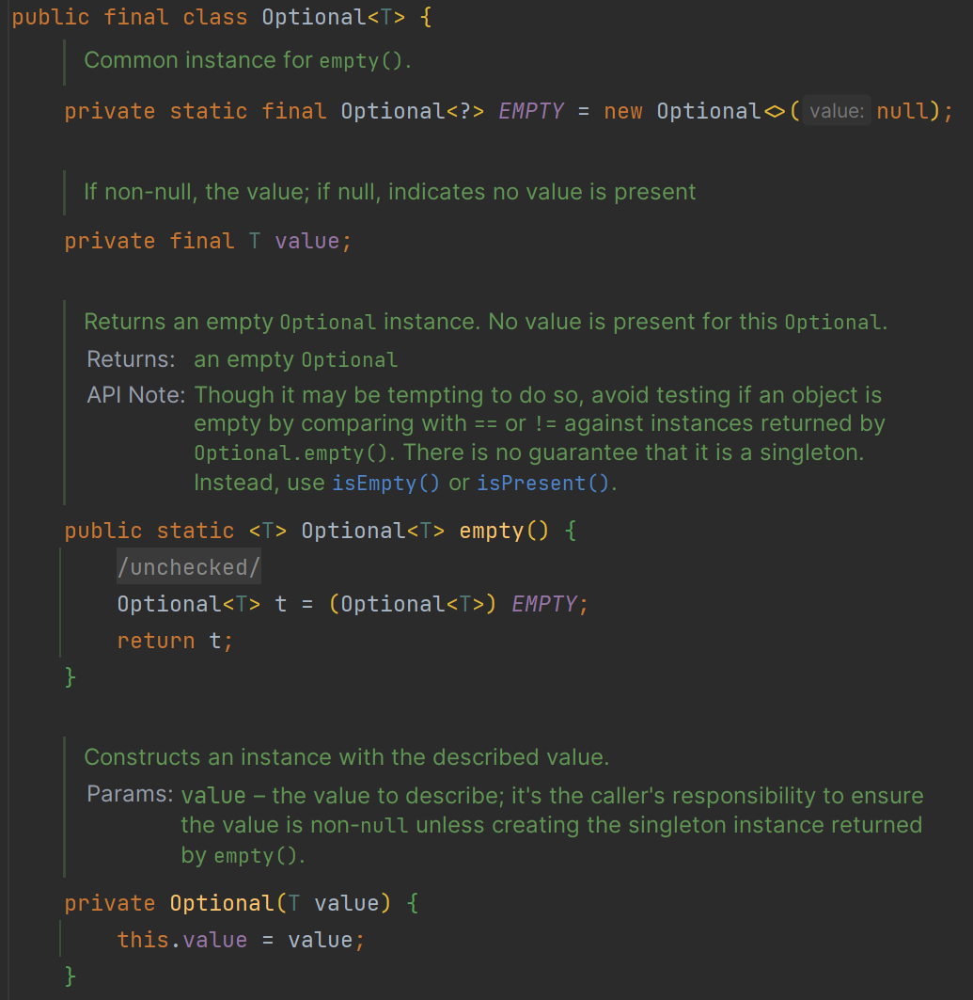

또는 정적 팩토리 메서드 `Optional.of`로 `null`이 아닌 값을 포함하는 `Optional`을 만들 수 있다.

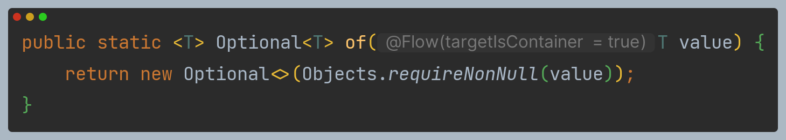

마지막으로 정적 팩토리 메서드 `Optional.ofNullable`로 `null`값을 저장할 수 있는
`Optional`을 만들 수 있다.

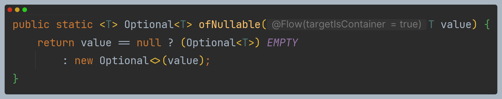

### 맵으로 Optional 값 추출하고 변환하기

보통 객체의 정보를 추출할 때는 `Optional`을 사용할 때가 많다. 예를 들어 보험회사의 이름을
추출한다고 한다면, 다음과 같이 `null`을 확인할 것이다.

```java
String name = null;
if(insurance != null) {
    name = insurance.getName();
} 
```

이런 유형의 패턴에 사용할 수 있도록 `Optional`은 `map` 메서드를 지원한다.

```java
Optional<Insurance> optInsurance = Optional.ofNullable(insurance);
Optional<String> name = optInsurance.map(Insurance::getName);
```

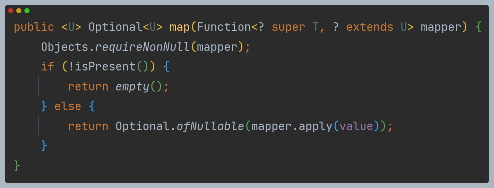

- `Optional`의 `map` 메서드는 스트림의 `map` 메서드와 비슷하다.
- 스트림의 `map`은 스트림의 각 요소에 제공된 함수를 적용하는 연산이다.
- 여기서 `Optional` 객체를 최대 요소의 개수가 한 개 이하인 데이터 컬렉션으로 생각할 수 있다.
- `Optional`이 값을 포함하면 `map`의 인수로 제공된 함수가 값을 바꾼다. `Optional`이 비어있으면
아무일도 일어나지 않는다.

### flatMap으로 Optional 객체 연결

`Optional`에는 `map` 메서드가 있으니 다음과 같이 코드를 만들 수 있을까?

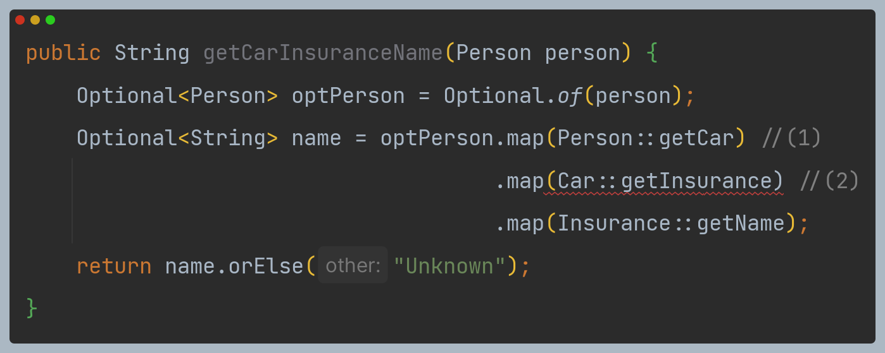

컴파일 에러가 발생한다.

- 변수 `optPerson`의 형식은 `Optional<Person>`이므로 `map` 메서드를 호출할 수 있다.
- 하지만 `getCar`는 `Optional<Car>` 형식의 객체를 반환한다.(`(1)`) 즉, `map` 연산의 결과는
`Optional<Optional<Car>>` 형식의 객체다.
- `getInsurance`는 또 다른 `Optional` 객체를 반환하므로 `getInsurance` 메서드를 지원하지 않는다.(`(2)`)

**스트림의 `flatMap`처럼 `Optional`에도 `flatMap`을 지원한다.**

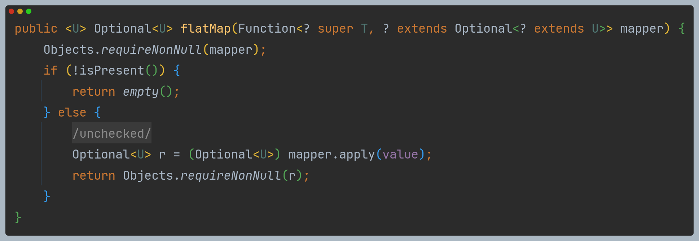

- 스트림의 `flatMap`은 함수를 인수로 받아서 다른 스트림을 반환하는 메서드다.
- 보통 인수로 받은 함수를 스트림의 각 요소에 적용하면 스트림의 스트림이 만들어진다. 하지만 `flatMap`은
인수로 받은 함수를 적용해서 생성된 각각의 스트림에서 콘텐츠만 남긴다.
- 즉, 함수를 적용해서 생성된 모든 스트림이 하나의 스트림으로 병합되어 평준화된다. 이차원 `Optional`을
일차원 `Optional`로 평준화해야 한다.

```java
public String getCarInsuranceName(Optional<Person> person) {
    return person.flatMap(Person::getCar)       //Optional<Person> -> Optional<Car>
                 .flatMap(Car::getInsurance)    //Optional<Car> -> Optional<Insurance>
                 .map(Insurance::getName)       //Optional<Insurance> -> Optional<String>
                 .orElse("Unknown");
}
```

> - `Optional` 클래스는 `Serializable` 인터페이스를 구현하지 않는다.
> - 직렬화 모델이 필요하다면 다음과 같이 `Optional`로 값을 반환받을 수 있는 메서드를
> 추가하는 방식을 권장한다.
> 
> ```java
> class Person {
>   private Car car;
>   public Optional<Car> getCarAsOptional() {
>       return Optional.ofNullable(car);
>   }
> }
> ```

### Optional 스트림 조작(자바 9)

- 자바 9에서는 `Optional`을 포함하는 스트림을 쉽게 처리할 수 있도록 `Optional`에
`stream` 메서드를 추가했다.
- `Optional` 스트림을 값을 가진 스트림으로 변환할 때 이 기능을 유용하게 활용할 수 있다.

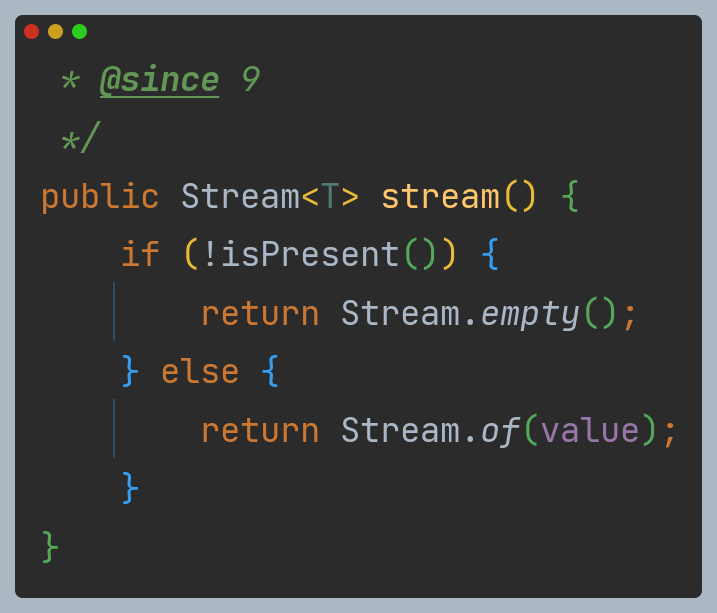

다음은 `List<Person>`에서 자동차를 소유한 사람들이 가입한 보험 회사의 이름을 추출하는 코드다.

```java
public Set<String> getCarInsuranceNames(List<Person> persons) {
    return persons.stream()
                  .map(Person::getCar) //Stream<Optional<Car>>
                  .map(optCar -> optCar.flatMap(Car::getInsurance)) //Optional<Car> -> Optional<Insurance>
                  .map(optInsurance -> optInsurance.map(Insurance::getName)) //Optional<Insurance> -> Optional<String>
                  .flatMap(Optional::stream) //Stream<Optional<String>> -> Stream<String>
                  .collect(Collectors.toSet());
}
```

### Optional 언랩

`Optional` 클래스는 `Optional` 인스턴스에 포함된 값을 읽는 다양한 방법을 제공한다.

**1. `get`**

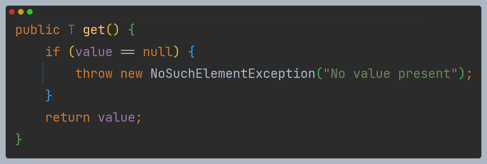

- 값을 읽는 가장 간단하면서 동시에 가장 안전하지 않은 메서드이다.
- 래핑된 값이 있으면 해당 값을 반환하고 값이 없으면 `NoSuchElementException`을 발생시킨다.
- `Optional`에 값이 반드시 있다고 가정할 수 있는 상황이 아니면 사용하지 않는 것이 바람직하다.
- 결국 중첩된 `null` 확인 코드를 넣는 상황과 크게 다르지 않다.

**2. `orElse`**

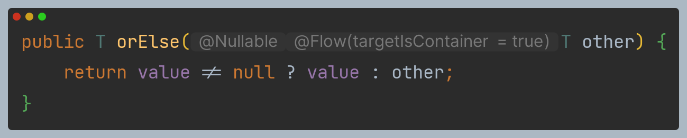

- `Optional`이 값을 포함하지 않을 때 기본값을 제공할 수 있다.

**3. `orElseGet`**

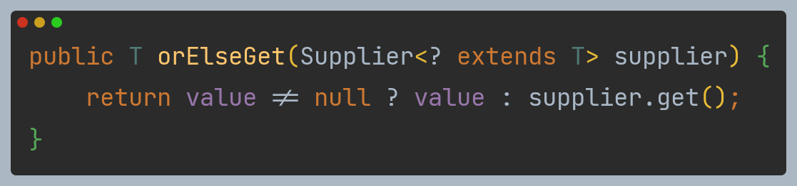

- `orElse` 메서드에 대응하는 게으른 버전의 메서드이다.
- `Optional`에 값이 없을 때만 `Supplier`가 실행된다.

**4. `orElseThrow`**

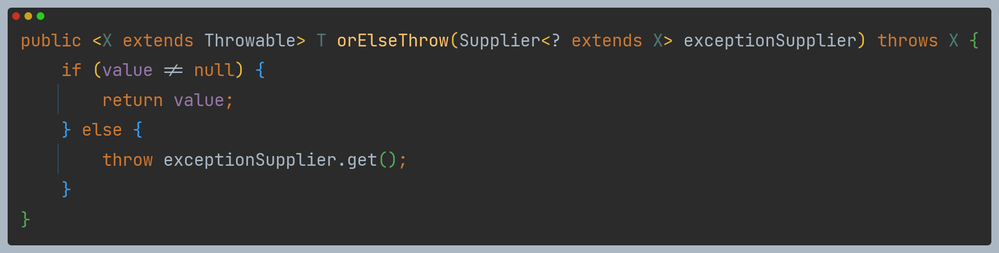

- 인수가 없는 오버로드된 `orElseThrow` 메서드도 있는데, 이 메서드는 `get`과 같은 동작을 한다.
- 인수가 있는 `orElseThrow`는 발생시킬 예외의 종류를 선택할 수 있다.

**5. `ifPresent`**

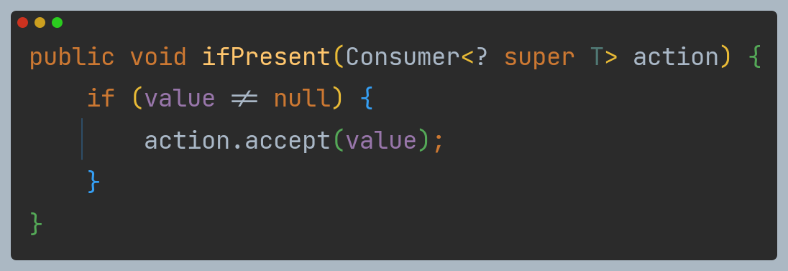

- 값이 존재할 때만 인수로 넘겨준 동작을 실행한다.

**6. `ifPresentOrElse`** (자바 9)

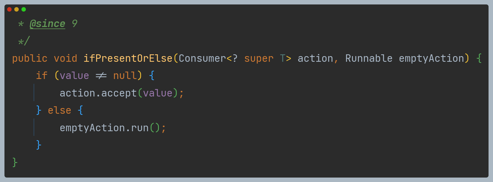

- 자바 9에서 추가된 인스턴스 메서드이다.
- `Optional`이 비었을 때 실행할 수 있는 `Runnable`을 인수로 받는다는 점만
`ifPresent`와 다르다.

### 두 Optional 합치기

`Person`과 `Car` 정보를 이용해서 가장 저렴한 보험료를 제공하는 보험회사를 찾는
복잡한 비즈니스 로직이 있다고 가정해보자.

```java
public Insurance findCheapestInsurance(Person person, Car car) {
      // 다른 보험사에서 제공한 질의 서비스
      // 모든 데이터 비교
      return cheapestCompany;
  }
```

- 이제 두 `Optional`을 인수로 받아서 `Optional<Insurance>`를 반환하는 `null` 안전 버전의
메서드를 구현해야 한다고 해보자.
- 인수로 전달한 값 중 하나라도 비어있으면 빈 `Optional<Insurance>`를 반환한다.
- `Optional` 클래스의 `isPresent` 메서드를 이용해서 다음과 같이 구현할 수 있다.


```java
public Optional<Insurance> nullSafeFindCheapestInsurance(Optional<Person> person, Optional<Car> car) {
    if (person.isPresent() && car.isPresent()) {
        return Optional.of(findCheapestInsurance(person.get(), car.get()));
    } else {
        return Optional.empty();
    }
}
```

- 이 코드는 `person`과 `car`의 시그니처만으로도 둘 다 아무 값도 반환하지 않을 수 있다는
정보를 명시적으로 보여준다.
- 하지만 `null` 확인 코드와 크게 다른 점이 없다.
- `Optional` 클래스에서 제공하는 기능을 이용해서 코드를 더 자연스럽게 개선할 수 있다.

```java
public Optional<Insurance> nullSafeFindCheapestInsuranceV2(Optional<Person> person, Optional<Car> car) {
    return person.flatMap(p -> car.map(c -> findCheapestInsurance(p, c)));
}
```

- 첫 번째 `Optional`에 `flatMap`을 호출했으므로 첫 번째 `Optiona`이 비어있다면 인수로 전달한
람다 표현식이 실행되지 않고 그대로 빈 `Optional`을 반환한다.
- `person` 값이 있다면 `flatMap` 메서드에 필요한 `Optional<Insurance>`를 반환하는
`Function`의 입력으로 `person`을 사용한다.
- 이 메서드의 바디에서는 두 번째 `Optional`에 `map`을 호출하므로 `Optional`이 `car`값을
포함하지 않으면 `Function`은 빈 `Optional`을 반환하므로 결국 이 메서드는 빈 `Optional`을 반환한다.
- 마지막으로 `person`과 `car`가 모두 존재하면 `map` 메서드로 전달한 람다 표현식이 `findCheapestInsurance` 
메서드를 안전하게 호출할 수 있다.

### 필터로 특정값 거르기

- 객체의 메서드를 호출해서 어떤 프로퍼티를 확인해야 할 때가 있다.
- 예를 들어 보험회사 이름이 특정값인지 확인해야 한다고 가정하자. 이 작업을 안전하게 수헹하려면
다음과 같이 `null` 여부를 확인해야 할 것이다.

```java
Insurance insurance = getInsurance(...);
if(insurance != null && "CambridgeInsurance".equals(insurance.getName())) {
    ...
}
```

`Optional` 클래스의 `filter` 메서드를 이용해서 다음과 같이 재구현할 수 있다.

```java
Optional<Insurance> optInsurance = getOptInsurance(...);
optInsurance.filter(insurance -> "CambridgeInsurance".equals(insurance.getName()))
            .ifPresent(x -> ...);
```

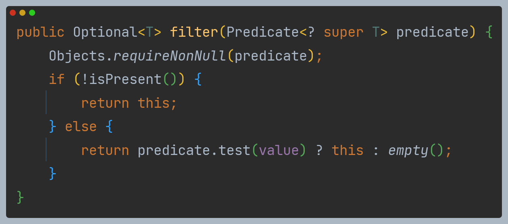

- `filter` 메서드는 `Predicate`를 인수로 받는다.
- `Optional` 객체가 값을 가지며 `Predicate`와 일치하면 그 값을 반환하고 그렇지 않으면
빈 `Optional` 객체를 반환한다.
- `Optional`이 비어있다면 `filter`는 아무 동작도 하지 않는다.
- `Optional`에 값이 있으면 그 값에 `Predicate`를 적용한다. 결과가 `true`면
`Optional`에는 아무 변화도 일어나지 않지만, 결과가 `false`면 값은 사라져버리고
`Optional`은 빈 상태가 된다.

다음 코드는 `person`이 `minAge` 이상의 나이일 때만 보험회사 이름을 반환하는 코드다.

```java
public String getCarInsuranceName(Optional<Person> person, int minAge) {
    return person.filter(p -> p.getAge() >= minAge)
                 .flatMap(Person::getCar)
                 .flatMap(Car::getInsurance)
                 .map(Insurance::getName)
                 .orElse("Unknown");
}
```

---

## Optional 실용 예제

### 잠재적으로 null이 될 수 있는 대상 Optional로 감싸기

- 기존의 자바 API에서는 `null`을 반환하면서 요청한 값이 없거나 어떤 문제로 계산에 실패했음을 알린다.
- 예를 들어 `Map`의 `get` 메서드는 요청한 키에 대응하는 값을 찾지 못했을 때 `null`을 반환한다.
- 위에서 본 것처럼 `null`을 반환하는 것보다는 `Optional`을 반환하는 것이 더 바람직하다.
- `get` 메서드의 시그니처는 우리가 변경할 수 없지만 `get` 메서드의 반환값은 `Optional`로 감쌀 수 있다.

```java
Map<String, Object> map = new HashMap<>();
Object value = map.get("key");
```

- 문자열 "key"에 해당하는 값이 없으면 `null`이 반환될 것이다.
- `map`에서 반환하는 값을 `Optional`로 감싸서 이를 개선할 수 있다.
- 코드가 복잡하기는 하지만 `if-else`를 추가하거나, 깔끔하게 `Optional.ofNullable`을 이용하는 두 가지
방법이 있다.

```java
Optional<Object> value = Optional.ofNullable(map.get("key"));
```

- 이와 같은 코드로 `null`일 수 있는 값을 `Optional`로 안전하게 변환할 수 있다.

### 예외와 Optional 클래스

- 자바 API는 어떤 이유에서 값을 제공할 수 없을 때 `null`을 반환하는 대신 예외를 발생시킬 때도 있다.
- 전형적인 예로 `Integer.parseInt(String s)`의 `NumberFormatException` 예외다.
- 기존에 값이 `null`일 수 있을때는 `if`문으로 `null` 여부를 확인했지만, 예외를 발생시키는
메서드는 `try/catch` 블록을 사용해야 한다는 점이 다르다.
- 기존 자바 메서드 `parseInt`를 직접 고칠 수는 없지만 다음처럼 `Optional`을 반환하는
작은 유틸리티 메서드를 반환할 수 있다.

```java
public static Optional<Integer> stringToInt(String s) {
    try {
        return Optional.of(Integer.parseInt(s));
    } catch (NumberFormatException e) {
        return Optional.empty();
    }
}
```

### 기본형 Optional

- 스트림처럼 `Optional`도 기본형으로 특화된 `OptionalInt`, `OptionalDouble`, `OptionalLong` 클래스를 제공한다.
- 예를 들어 바로 위 코드에서 `Optional<Integer>` 대신 `OptionalInt`를 반환할 수 있다.
- 많은 요소를 가진 스트림은 기본형 특화 스트림을 이용해서 성능을 향상시킬 수 있다.
- 하지만 `Optional`의 최대 요소 수는 한 개이므로 `Optional`에서는 기본형 특화 클래스로
성능을 개선할 수 없다.
- 더욱이 기본형 특화 `Optional`은 유용한 메서드 `map`, `flatMap`, `filter` 등을 지원하지 않는다.
**따라서 기본형 특화 `Optional`을 사용하는 것은 권장하지 않는다.**
- 게다가 (스트림과 마찬가지로) 기본형 특화 `Optional`로 생성한 결과는 다른 일반
`Optional`과 혼용할 수 없다. 예를 들어 `OptionalInt`를 반환하는 메서드는 다른
`Optional`의 `flatMap`에 메서드 참조로 전달할 수 없다.

### 응용

- 다음과 같이 `Properties`를 읽어서 초 단위의 지속 시간으로 해석하는 테스트를 한다고 가정해보자.
- 지속 시간은 양수여야 하므로 문자열이 양의 정수를 제외하고는 모두 0을 반환해야 한다.

```java
@Test
public void testMap() {
    
    Properties props = new Properties();
    props.setProperty("a", "5");
    props.setProperty("b", "true");
    props.setProperty("c", "-3");
    
    //명령형 코드
    Assert.assertEquals(5, readDurationImperative(props, "a"));
    Assert.assertEquals(0, readDurationImperative(props, "b"));
    Assert.assertEquals(0, readDurationImperative(props, "c"));
    Assert.assertEquals(0, readDurationImperative(props, "d"));
    
    //Optional 사용
    Assert.assertEquals(5, readDurationWithOptional(props, "a"));
    Assert.assertEquals(0, readDurationWithOptional(props, "b"));
    Assert.assertEquals(0, readDurationWithOptional(props, "c"));
    Assert.assertEquals(0, readDurationWithOptional(props, "d"));
```

먼저 다음과 같이 명령형 코드를 만들 수 있을 것이다.

```java
public int readDurationImperative(Properties props, String name) {
    String value = props.getProperty(name);
    if (value != null) {
        try {
            int i = Integer.parseInt(value);
            if (i > 0) return i;
            
        } catch (NumberFormatException nfe) { }
    }
    return 0;
}
```

`if`문과 `try/catch` 블록이 중첩되면서 코드가 복잡해졌고 가독성도 나빠졌다.

다음과 같이 `Optional`을 이용해서 메서드 체인 형식으로 개선할 수 있다.

```java
public int readDurationWithOptional(Properties props, String name) {
    return Optional.ofNullable(props.getProperty(name))
                   .flatMap(OptionalUtility::stringToInt) //Optional<String> -> Optional<Integer>
                   .filter(i -> i > 0)
                   .orElse(0);
}
```