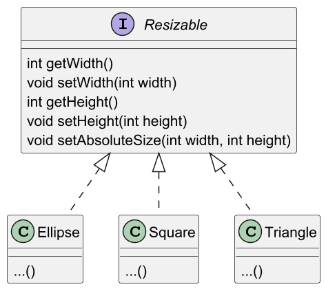
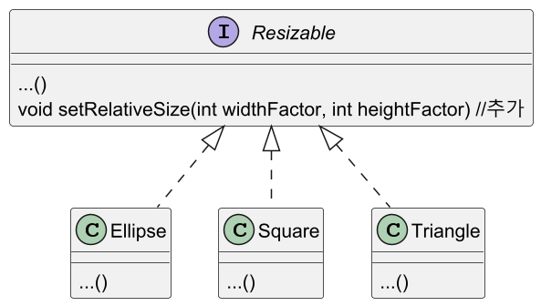
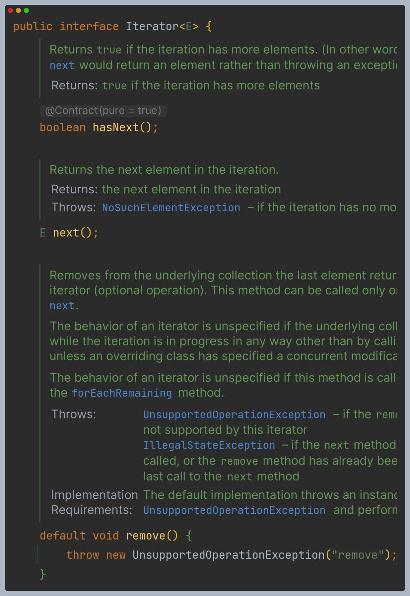
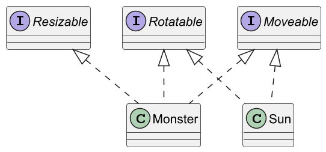
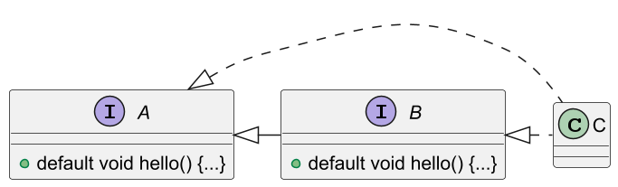
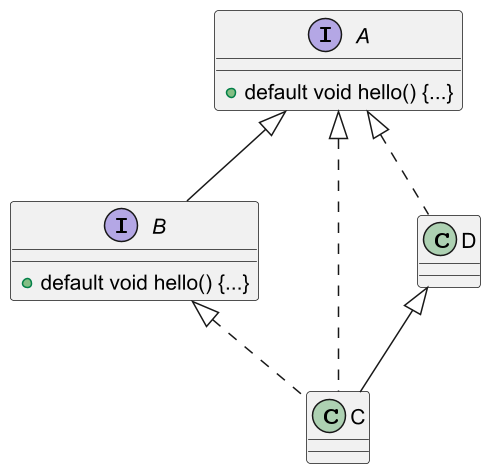
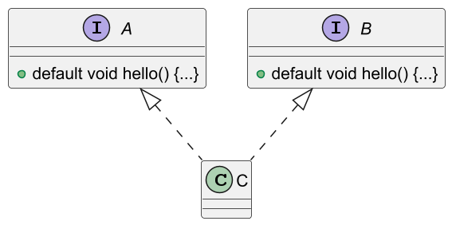
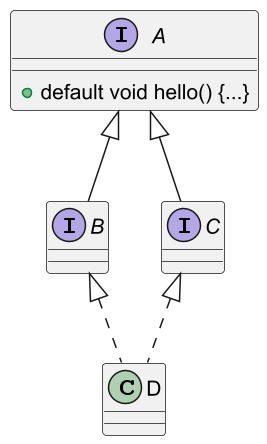

# 디폴트 메서드

다음과 같이 `Resizable` 인터페이스와 이를 구현하는 여러 클래스가 있다고 해보자.

```java
public interface Resizable {
    int getWidth();
    void setWidth(int width);
    int getHeight();
    void setHeight(int height);
    void setAbsoluteSize(int width, int height);
}
```



그리고 새로운 기능을 위해 `Resizable` 인터페이스에 새로운 메서드를 추가했다고 해보자.

```java
public interface Resizable {
  ...
  void setRelativeSize(int widthFactor, int heightFactor); //추가
}
```



`Resizable`을 고치면 몇 가지 문제가 발생한다.

첫 번째로 `Resizable`을 구현하는 모든 클래스에 새로운 메서드를 구현해야 한다.
- 인터페이스에 새로운 메서드를 추가하면 **바이너리 호환성**은 유지된다. 
  - 바이너리 호환성이란 새로 추가된 메서드를 호출하지만 않으면 메서드 구현이 없어도 기존 클래스 파일 구현이
  잘 동작한다는 의미다.
- 하지만 언젠가 누군가는 새로운 메서드를 사용하도록 코드를 바꿀 수 있다. 이때 에러가 발생할 것이다.

두 번째로 전체 애플리케이션을 재빌드할 때 컴파일 에러가 발생한다.

디폴트 메서드로 이 모든 문제를 해결할 수 있다. 디폴트 메서드를 이용해서 API를 바꾸면
새롭게 바뀐 인터페이스에서 자동으로 기본 구현을 제공하므로 기존 코드를 고치지 않아도 된다.

---

## 디폴트 메서드란?

- 자바 8에서는 호환성을 유지하면서 API를 바꿀 수 있도록 새로운 기능은 **디폴트 메서드**를 제공한다.
- 이제 인터페이스는 자신을 구현하는 클래스에서 메서드를 구현하지 않을 수 있는 새로운 메서드
시그니처를 제공한다.

다음과 같이 `default` 키워드를 이용해 디폴트 구현을 제공할 수 있다.

```java
public interface Resizable {
    int getWidth();
    void setWidth(int width);
    int getHeight();
    void setHeight(int height);
    void setAbsoluteSize(int width, int height);

    //디폴트 메서드
    default void setRelativeSize(int widthFactor, int heightFactor) {
        setAbsoluteSize(getWidth() / widthFactor, getHeight() / heightFactor);
    }
}
```

> **추상 클래스와 자바 8의 인터페이스**
> 
> 추상 클래스와 인터페이스는 추상 메서드와 바디를 포함하는 메서드를 정의할 수 있다는 
> 공통점이 있다. 차이점은 다음과 같다.
> 
> 1. 클래스는 하나의 추상 클래스만 상속받을 수 있지만, 인터페이스는 여러 개 구현할 수 있다.
> 2. 추상 클래스는 인스턴스 변수(필드)로 공통 상태를 가질 수 있다. 하지만 인터페이스는
>   인스턴스 변수를 가질 수 없다.

---

## 디폴트 메서드 활용 패턴

### 선택형 메서드

- 예를 들어 `Iterator` 인터페이스는 `hasNext`와 `next` 외에 `remove` 메서드도 정의한다.
- 사용자들이 `remove` 기능은 잘 사용하지 않으므로 자바 8 이전에는 `remove` 기능을 무시했다.
결과적으로 `Iterator`를 구현하는 많은 클래스에서는 `remove`에 빈 구현을 제공했다.
- 디폴트 메서드를 이용하면 `remove` 같은 메서드에 기본 구현을 제공할 수 있으므로 인터페이스를
구현하는 클래스에서 빈 구현을 제공할 필요가 없다.
- 예를 들어 자바 8의 `Iterator` 인터페이스는 다음처럼 `remove` 메서드를 정의한다.



기본 구현이 제공되므로 `Iterator` 인터페이스를 구현하는 클래스는 빈 `remove` 메서드를
구현할 필요가 없어졌고, 불필요한 코드를 줄일 수 있다.

### 동작 다중 상속

- 디폴트 메서드를 이용하면 기존에는 불가능했던 동작 다중 상속 기능도 구현할 수 있다.
- 자바에서 클래스는 한 개의 다른 클래스만 상속할 수 있지만 인터페이스는 여러 개 구현할 수 있다.
- 예를 들어 `ArrayList`의 구조는 다음과 같다.


#### 다중 상속 형식

결과적으로 `ArrayList`는 `AbstractList`, `List`, `RandomAccess`, `Cloneable`, `Serializable`, `Iterable`,
`Collection`의 **서브형식**이 된다. 따라서 디폴트 메서드를 사용하지 않아도 
다중 상속을 활용할 수 있다.

자바 8에서는 인터페이스가 구현을 포함할 수 있으므로 클래스는 여러 인터페이스에서 동작(구현 코드)을
상속받을 수 있다. 중복되지 않는 최소한의 인터페이스를 유지한다면 코드에서 동작을 쉽게 재사용하고
조합할 수 있다.

#### 기능이 중복되지 않는 최소의 인터페이스

다양한 특성을 갖는 여러 모양을 정의해야 한다고 가정할 때, 어떤 모양은 회전할 수 없지만
크기는 조절할 수 있다. 또 어떤 모양은 회전할 수 있으며 움직일 수 있지만 크기는 조절할 수 없다.
최대한 기존 코드를 재사용해서 이 기능을 구현하려면 어떻게 해야 할까?

먼저 다음과 같이 `Rotatable`, `Moveable`, `Resizable` 인터페이스를 정의한다.

```java
public interface Rotatable {
    
    int getRotationAngle();
    void setRotationAngle(int angleInDegrees);
    
    default void rotateBy(int angleInDegrees) {
        setRotationAngle((getRotationAngle() + angleInDegrees) % 360);
    }
}

public interface Moveable {

  int getX();
  int getY();
  void setX(int x);
  void setY(int y);

  default void moveHorizontally(int distance) {
    setX(getX() + distance);
  }

  default void moveVertically(int distance) {
    setY(getY() + distance);
  }
}

public interface Resizable {

  int getWidth();
  void setWidth(int width);

  int getHeight();
  void setHeight(int height);

  void setAbsoluteSize(int width, int height);

  default void setRelativeSize(int widthFactor, int heightFactor) {
    setAbsoluteSize(getWidth() / widthFactor, getHeight() / heightFactor);
  }
}
```

#### 인터페이스 조합

- 이제 이들 인터페이스를 조합해서 다양한 클래스를 구현할 수 있다.
- 예를 들어 다음 클래스는 움직일 수 있고, 회전할 수 있으며, 크기를 조절할 수 있는 클래스가 된다.

```java
public class Monster implements Rotatable, Moveable, Resizable {
  ...
}
```

`Monster` 클래스는 `Rotatable`, `Moveable`, `Resizable` 인터페이스의 디폴트 메서드를
자동으로 상속받는다. 따라서 상속받은 다양한 메서드를 직접 호출할 수 있다.

이번에는 움직일 수 있으며 회전할 수 있지만, 크기는 조절할 수 없는 클래스를 정의한다.
이때 코드를 복사&붙여넣기 할 필요가 전혀 없다. `Moveable`과 `Rotatable`을 구현할 때 자동으로
디폴트 메서드를 재사용할 수 있기 때문이다.

```java
public class Sun implements Rotatable, Moveable {
  ...
}
```

위 두 클래스와 인터페이스의 다이어그램은 다음과 같다.



- 인터페이스에 디폴트 구현을 포함시키면 또 다른 장점이 있다.
- 예를 들어 디폴트 구현을 효율적으로 고치기 위해 변경을 했다고 가정하자.
- 디폴트 메서드 덕분에 인터페이스를 직접 고칠 수 있고, 따라서 해당 인터페이스를 구현하는
모든 클래스도 자동으로 변경한 코드를 상속받는다.(구현 클래스에서 메서드를 재정의하지 않은 상황에 한해서)

---

## 해석 규칙

- 자바의 클래스는 하나의 부모 클래스만 상속받을 수 있지만 여러 인터페이스를 동시에 구현할 수 있다.
- 자바 8에는 디폴트 메서드가 추가되었으므로 같은 시그니처를 갖는 디폴트 메서드를 상속받는
상황이 생길 수 있다.
- 이런 상황에서는 어떤 인터페이스의 디폴트 메서드를 사용하는지, 즉 자바 컴파일러가
이러한 충돌을 어떻게 해결하는지 알아보자.

```java
public interface A {
    default void hello() {
        System.out.println("Hello from A");
    }
}

public interface B extends A {
    default void hello() {
        System.out.println("Hello from B");
    }
}

public class C implements A, B {
    public static void main(String[] args) {
        new C().hello(); //무엇이 출력될까?
    }
}
```

### 알아야 할 세 가지 해결 규칙

다른 클래스나 인터페이스로부터 같은 시그니처를 갖는 메서드를 상속받을 때는 세 가지 
규칙을 따라야 한다.

1. 클래스가 항상 이긴다. 클래스나 슈퍼클래스에서 정의한 메서드가 디폴트 메서드보다 우선권을 갖는다.
2. 1번 규칙 이외의 상황에서는 서브인터페이스가 이긴다. 상속관계를 갖는 인터페이스에서
같은 시그니처를 갖는 메서드를 정의할 때는 서브인터페이스가 이긴다. 즉, `B`가 `A`를 상속받는다면
`B`가 `A`를 이긴다.
3. 여전히 디폴트 메서드의 우선순위가 결정되지 않았다면 여러 인터페이스를 상속받는 클래스가
명시적으로 디폴트 메서드를 오버라이드하고 호출해야 한다.

### 디폴트 메서드를 제공하는 서브인터페이스가 이긴다.

위 예제 코드의 다이어그램은 다음과 같다.



2번 규칙에서는 서브인터페이스가 이긴다고 설명한다. 즉, `B` 인터페이스가 `A` 인터페이스를
상속받았으므로 컴파일러는 `B` 인터페이스의 `hello` 메서드를 선택한다.

이번에는 `C`가 `D`를 상속받는 상황을 보자.

```java
public interface A {
    default void hello() {
        System.out.println("Hello from A");
    }
}

public interface B extends A {
    default void hello() {
        System.out.println("Hello from B");
    }
}

public class D implements A { }

public class C extends D implements A, B {
    public static void main(String[] args) {
        new C().hello(); //무엇이 출력될까?
    }
}
```



- 1번 규칙은 클래스의 메서드 구현이 이긴다고 설명한다. `D`는 인터페이스 `A`의 디폴트 메서드 구현을
재정의하지 않았기 때문에 디폴트 메서드 구현을 상속받는다.
- 2번 규칙에서는 클래스나 슈퍼클래스에 메서드 정의가 없을 때는 디폴트 메서드를 정의하는
서브인터페이스가 선택된다.
- 따라서 컴파일러는 인터페이스 `A`와 인터페이스 `B`의 `hello` 메서드 중 하나를 선택해야 한다.
- 여기서 `B`가 `A`를 상속받는 관계이므로 이번에도 인터페이스 `B`의 디폴트 메서드가 실행된다.

### 충돌 그리고 명시적인 문제 해결

이번에는 1번과 2번 규칙으로는 해결할 수 없는 상황을 알아보자.

```java
public interface A {
    default void hello() {
        System.out.println("Hello from A");
    }
}

public interface B {
    default void hello() {
        System.out.println("Hello from B");
    }
}

public class C implements A, B { }
```



- 이번에는 인터페이스 간에 상속관계가 없으므로 2번 규칙을 적용할 수 없다.
- 그러므로 `A`와 `B`의 `hello` 메서드를 구별할 기준이 없다. 따라서 컴파일러는 어떤 메서드를 호출해야 할지 
알 수 없으므로 에러가 발생한다.

클래스와 메서드 관계로 디폴트 메서드를 선택할 수 없는 상황에서는 선택할 수 있는 방법이 없다.
개발자가 직접 클래스 `C`에서 사용하려는 메서드를 명시적으로 선택해야 한다.
즉, 클래스 `C`에서 `hello` 메서드를 오버라이드한 다음에 호출하려는 메서드를 명시적으로 선택해야 한다.

자바 8에서는 `X.super.m(..)` 형태의 새로운 문법을 제공한다. 여기서 `X`는 호출하려는 
메서드 `m`의 슈퍼인터페이스다. 예를 들어 다음처럼 클래스 `C`에서 인터페이스 `B` 호출할 수 있다.

```java
public class C implements A, B { 
    void hello() {
        B.super.hello(); //명시적으로 인터페이스 B의 메서드를 선택
    }
}
```

### 다이아몬드 문제

```java
public interface A {
    default void hello() {
        System.out.println("Hello from A");
    }
}

public interface B extends A { }
public interface C extends A { }

public class D implements B, C {
    public static void main(String[] args) {
          new D().hello(); //무엇이 출력될까?
    }
}
```

- 위 예제의 다이어그램은 아래와 같다. 다이어그램의 모양이 다이아몬드가 된다.
- 클래스 `D`는 인터페이스 `B`와 `C` 중 누구의 디폴트 메서드 정의를 상속받을까?
- 실제로 선택할 수 있는 메서드 선언은 하나뿐이다. `A`만 디폴트 메서드를 정의하고 있다.
따라서 인터페이스 `A`의 디폴트 메서드가 실행된다.



그렇다면 인터페이스 `B`에도 같은 시그니처의 디폴트 메서드 `hello`가 있다면 어떻게 될까?

2번 규칙은 디폴트 메서드를 제공하는 가장 하위의 인터페이스가 선택된다고 했다. `B`는 `A`를 상속받으므로
`B`가 선택된다. 

또 만약 `B`와 `C`에서 모두 디폴트 메서드 `hello` 메서드를 정의한다면
충돌이 발생하므로 둘 중 하나의 메서드를 명시적으로 호출해야 한다.

다음처럼 인터페이스 `C`의 **추상 메서드** `hello`를 추가하면 어떻게 될까?

```java
public interface C extends A { 
    void hello(); //디폴트 메서드 아님
}
```

`C`는 `A`를 상속받으므로 `C`의 추상 메서드 `hello`가 `A`의 디폴트 메서드 `hello`보다 우선권을 갖는다.
따라서 컴파일 에러가 발생하며, 클래스 `D`가 어떤 `hello`를 사용할지 명시적으로 선택해야 한다.
