# 컬렉션 API 개선

## 컬렉션 팩토리

### 리스트 팩토리

- `List.of` 팩토리 메서드로 간단한 불변 리스트를 만들 수 있다.

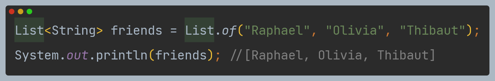

- 이렇게 `of`로 만든 리스트는 `set`, `add`와 같이 변경 메서드를 실행하면 `UnsupportedOperationException` 예외가 발생한다.
- 비슷한 메서드로 `Arrays.asList`가 있는데, 이 메서드로 만든 리스트는 `set`은 가능하지만 `add`는 예외가 발생한다.

### 집합 팩토리

- `Set.of` 팩토리 메서드로 간단한 불변 집합을 만들 수 있다.

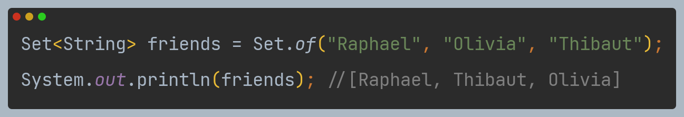

- 이때 중복된 요소로 집합을 만들려고 하면 `IllegalArgumentException` 예외가 발생한다.

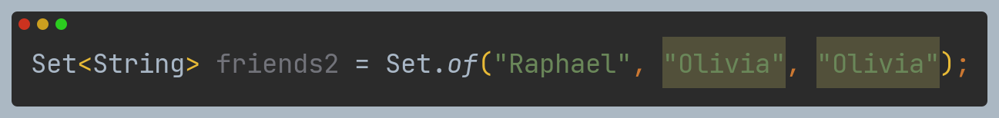

### 맵 팩토리

- `Map.of` 팩토리 메서드에 키와 값을 번갈아 제공하여 불변 맵을 만들 수 있다.

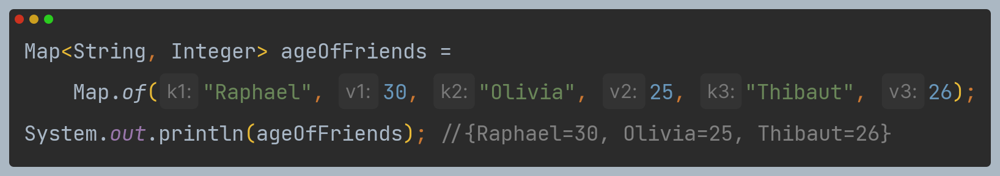

- 열 개 정도 이하의 작은 맵을 만들 때는 `of` 메서드가 유용하다.
- 그 이상의 맵에서는 `Map.ofEntries` 팩토리 메서드를 이용하는 것이 좋다.

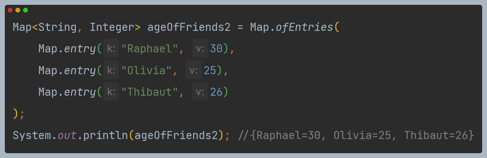

---

## 리스트와 집합 처리

### removeIf 메서드

- 다음은 숫자로 시작하는 참조 코드를 가진 트랜잭션을 삭제하는 코드다.

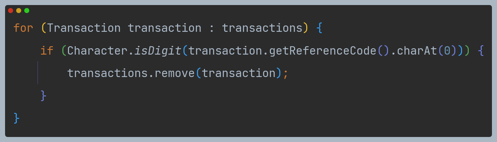

- 하지만 위 코드는 `ConcurrentModificationException` 예외가 발생한다.
- 내부적으로 `for-each` 루프는 `Iterator`를 사용하므로 다음과 같이 해석된다.

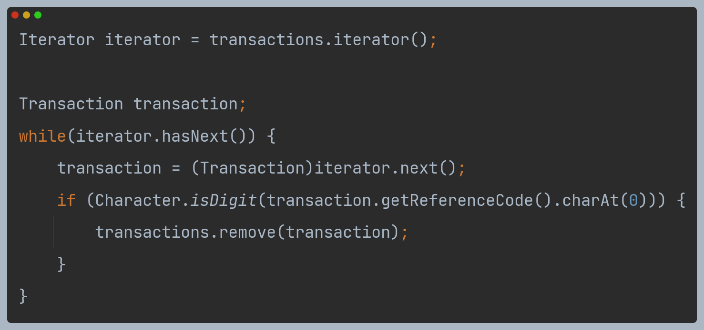

- 여기서 두 개의 개별 객체가 컬렉션을 관리하게 된다.
  - `Iterator` 객체, `next()`와 `hasNext()`를 이용해 소스를 질의한다.
  - `Collection` 객체 자체, `remove()`를 호출해 요소를 삭제한다.
- 결과적으로 반복자의 상태는 컬렉션의 상태와 서로 동기화하지 않는다.
- 다음과 같이 `Iterator` 객체를 명시적으로 사용하고 그 객체의 `remove` 메서드를 호출해 해결할 수 있다.

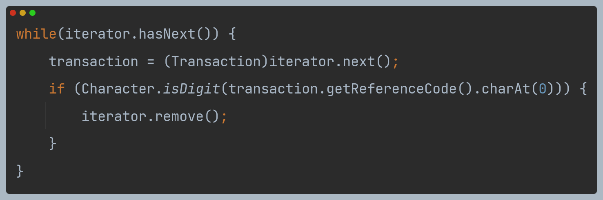

- 코드가 복잡해지고, 신경써야 할 것이 많아졌다.
- 이 코드를 자바 8의 `removeIf` 메서드로 바꿀 수 있다. 코드도 단순해지며, 버그도 예방할 수 있다.

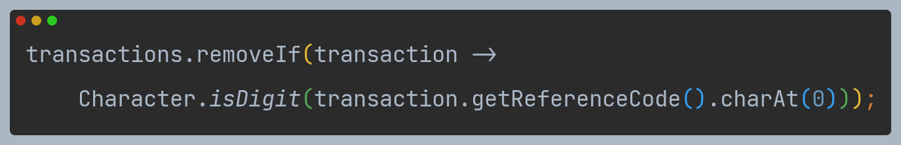

### removeAll 메서드

- 다음 코드는 스트림을 이용해 리스트의 각 요소를 새로운 요소로 바꾸는 코드다.

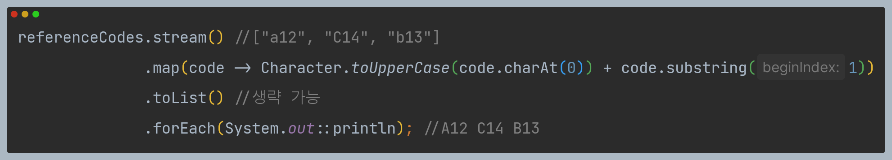

- 하지만 이 코드는 새 문자열 컬렉션을 만든다. 원하는 것은 기존 컬렉션을 바꾸는 것이다.
- 다음처럼 `set()` 메서드를 지원하는 `ListIterator`를 이용할 수 있다.

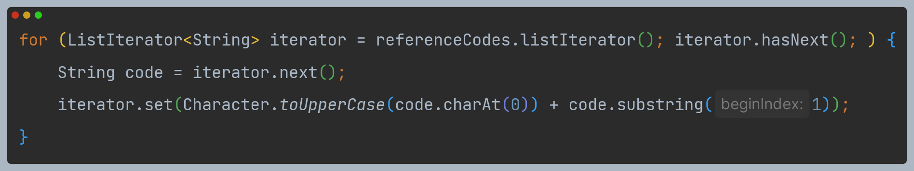

- 코드도 복잡해지고, 컬렉션 객체를 `Iterator`와 혼용하면 반복과 컬렉션 변경이 동시에
이루어지면서 버그를 유발하기 쉽다.
- 자바 8의 `replaceAll` 메서드로 간단하게 구현할 수 있다.

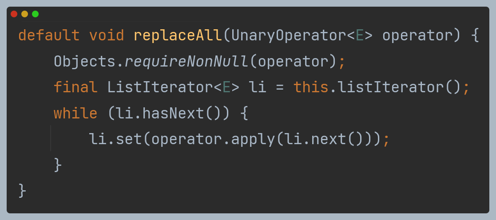

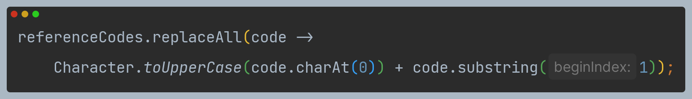

---

## 맵 처리

### forEach 메서드

- 다음은 맵의 반복자를 이용해 맵의 항목을 집합을 반복하는 코드다.

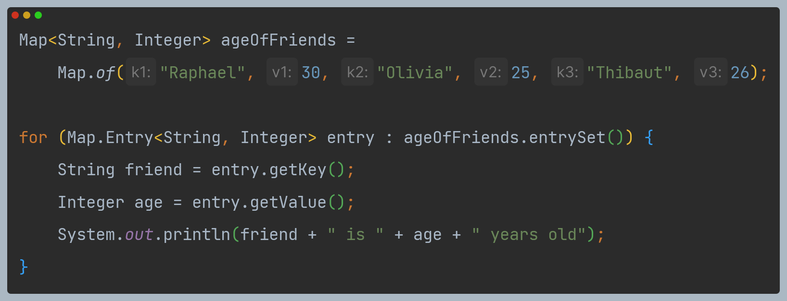

- 자바 8부터 `Map` 인터페이스는 `BiConsumer`를 인수로 받는 `forEach` 메서드를 지원해
다음과 같이 간단하게 구현할 수 있다.

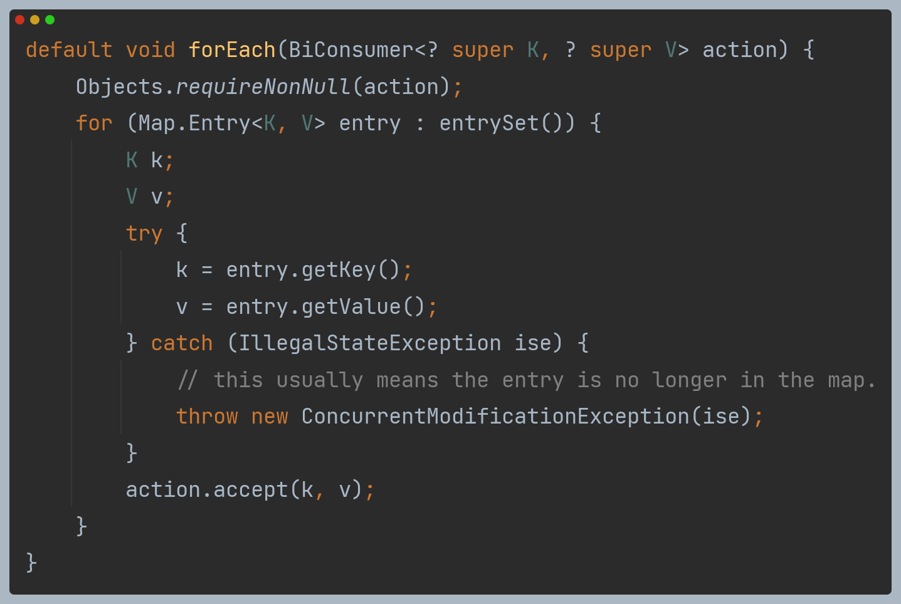

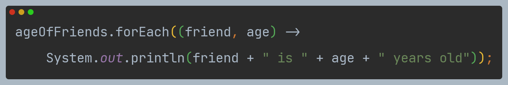

### 정렬 메서드

- 다음 두 개의 유틸리티를 이용해 맵의 항목을 값 또는 키를 기준으로 정렬할 수 있다.
  - `Entry.comparingByKey`
  - `Entry.comparingByValue`

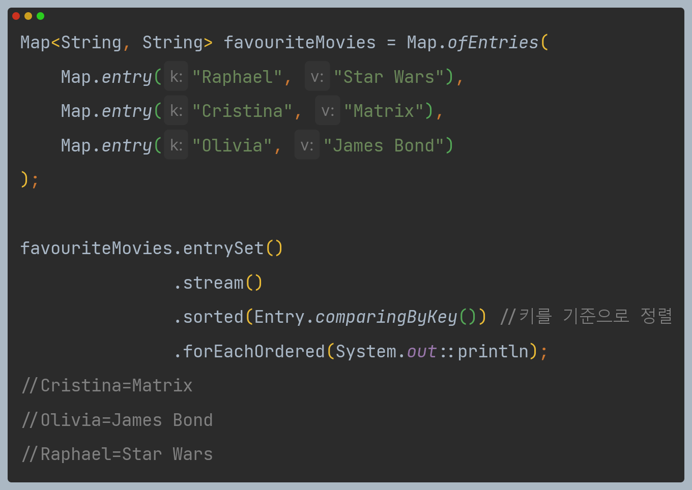

> **HashMap 성능**
> 
> - 자바 8에서는 `HashMap`의 내부 구조를 바꿔 성능을 개선했다.
> - 기존 맵의 항목은 키로 생성한 해시코드로 접근할 수 있는 버킷에 저장했다.
> - 많은 키가 같은 해시코드를 반환할 경우, `O(n)`의 시간이 걸리는 `LinkedList`로 버킷을 
> 반환해야 하므로 성능이 저하된다.
> - 최근에는 버킷이 너무 커질 경우 이를 `O(log(n))`의 시간이 소요되는 정렬된 트리를 이용해
> 동적으로 치환해 충돌이 일어나는 요소 반환 성능을 개선했다.
> - 이때 키가 `Comparable`의 형태여야만 정렬된 트리가 지원된다.

### getOrDefault 메서드

- 기존에는 찾으려는 키가 존재하지 않으면 `null`이 반환되므로 `NullPointException`을 방지하려면
요청 결과가 `null`인지 확인해야 한다.
- `getOrDefault` 메서드를 이용해 기본값을 반환하는 방식으로 이 문제를 해결할 수 있다.
- 이 메서드는 첫 번째 인수로 키를, 두 번째 인수로 기본갑을 받으며 맵에 키가 존재하지 않으면
두 번째 인수로 받은 기본값을 반환한다.

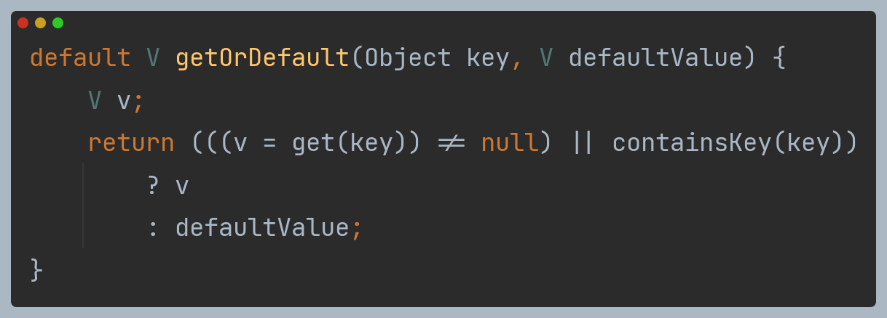

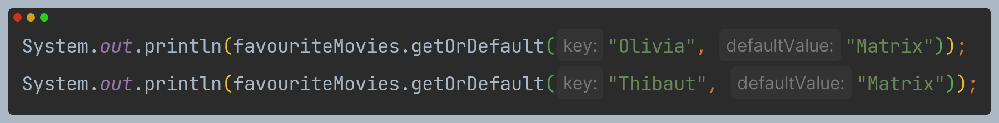

### 계산 패턴

- 맵에 키가 존재하는지 여부에 따라 어떤 동작을 실행하고 결과를 저장해야 하는 경우 다음 세 가지 연산이 도움이 된다.
- `computeIfAbsent`
  - 제공된 키에 해당하는 값이 없으면(또는 null), 키를 이용해 새 값을 계산하고 맵에 추가한다.
- `computeIfPresent`
  - 제공된 키에 해당하는 값이 있으면 새 값을 계산하고 맵에 추가한다.
- `compute`
  - 제공된 키로 새 값을 계산하고 맵에 저장한다.
- 다음은 `computeIfAbsent`를 전통적인 방식과 비교한 코드다. 이 메서드는 키가 존재하지 않으면
값을 계산해 맵에 추가하고, 키가 존재하면 기존 값을 반환한다.

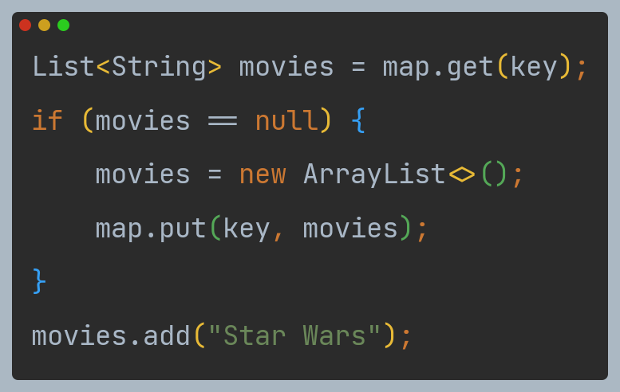

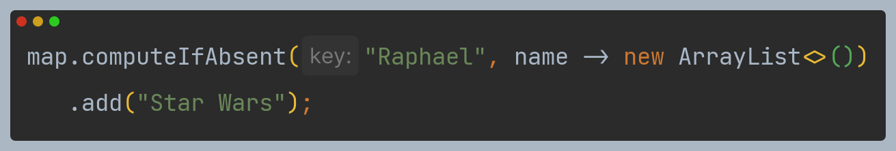

### 삭제 패턴

- 자바 8에서는 제공된 키에 해당하는 맵 항목을 제거하는 `remove` 메서드 외에 키가 특정한 값과
연관되었을 때만 항목을 제거하는 오버로드된 메서드를 제공한다.

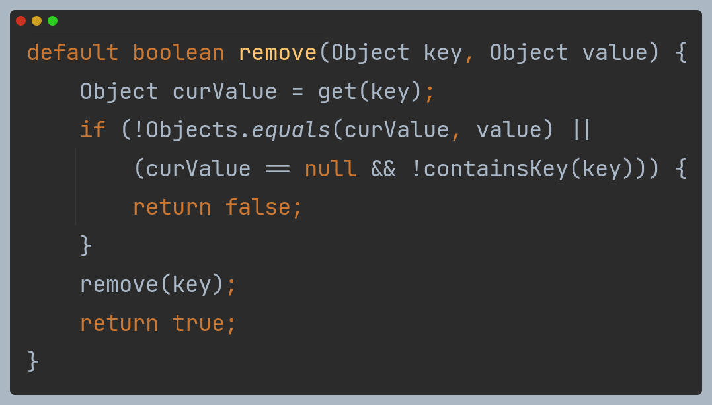

### 교체 패턴

- 맵의 항목을 바꾸는 데 사용할 수 있는 두 개의 메서드가 추가되었다.

`replaceAll` : `BiFunction`을 적용한 결과로 각 항목의 값을 교체한다.

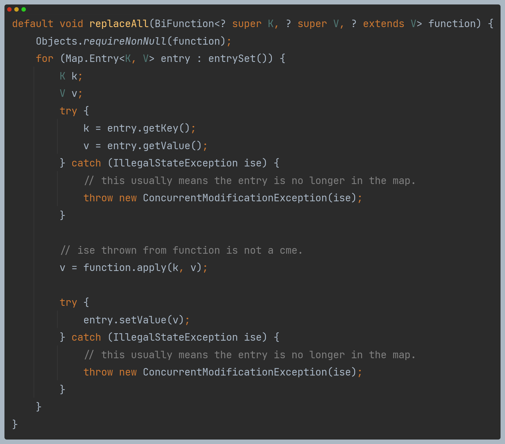

`replace` : 키가 존재하면 맵의 값을 바꾼다. `remove`와 마찬가지로 키가 특정 값으로
매핑되었을 때만 값을 교체하는 오버로드된 메서드도 있다.

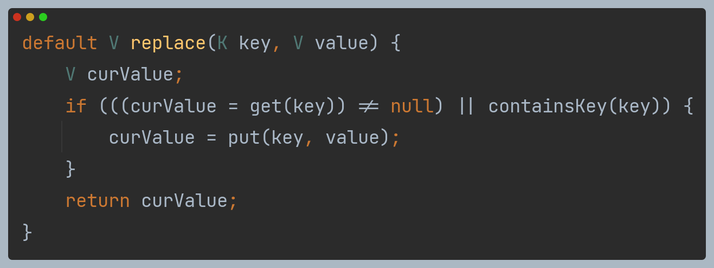

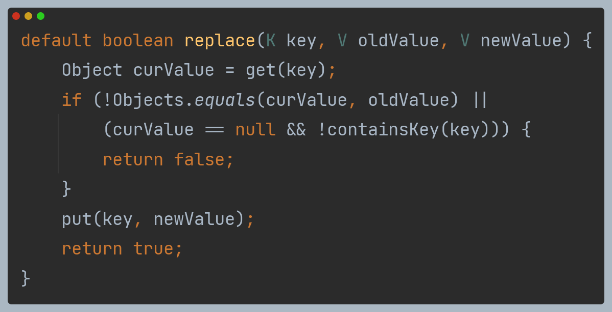

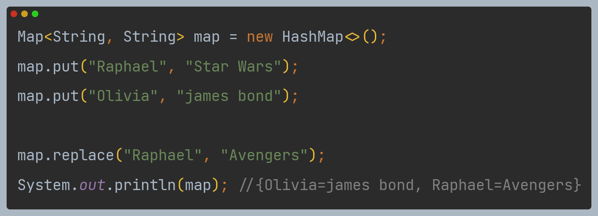

### 합침

- 다음과 같이 `putAll`을 사용해 두 개의 맵을 합칠 수 있다.

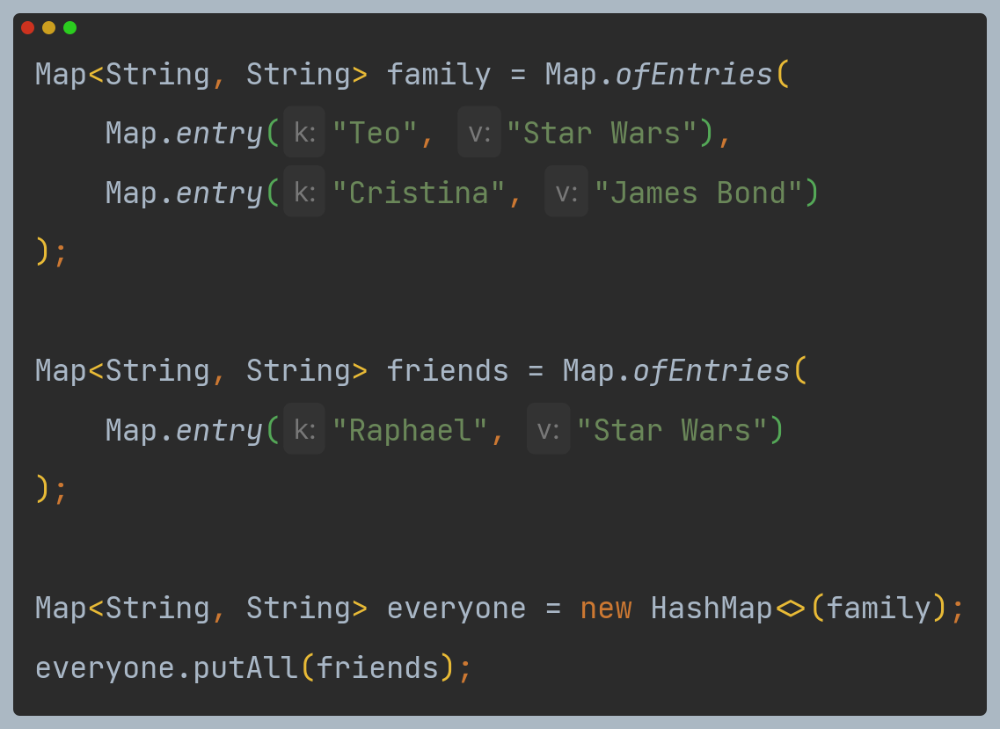

- 중복된 키가 없다면 잘 동작할 것이다.
- 값을 좀 더 유연하게 합쳐야 한다면 `merge` 메서드를 이용할 수 있다.
- `merge` 메서드는 중복된 키를 어떻게 합칠지 결정하는 `BiFunction`을 인수로 받는다.

- 다음 코드는 `forEach`와 `merge`를 이용해 중복된 키가 있을 때 두 값을 연결하는 코드다.

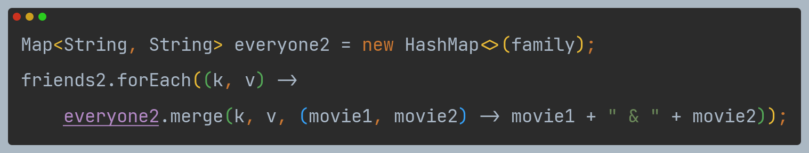