# 스트림 활용

<b>예제 클래스</b>

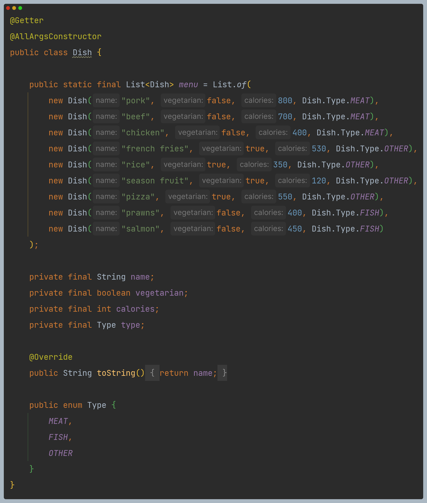

# 필터링

## Predicate 필터링

- 스트림 인터페이스는 `filter` 메서드를 지원한다. 
- `Predicate`를 인수로 받아서 `Predicate`와 일치하는 모든 요소를 포함하는 스트림을 반환한다.

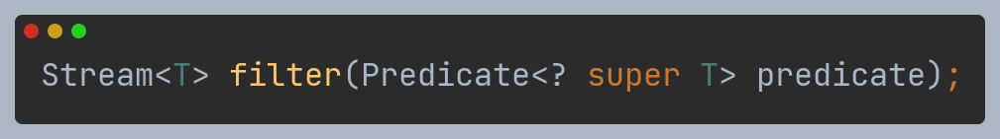

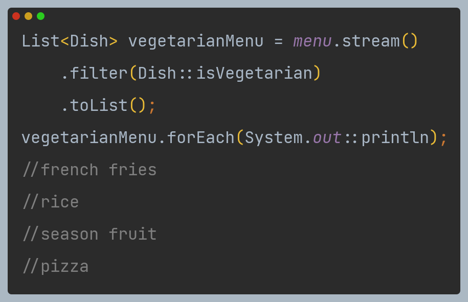

## 고유 요소 필터링

- 스트림은 고유 요소로 이루어진 스트림을 반환하는 `distinct` 메서드도 지원한다.
- 기본적으로 `equals()`를 사용하여 중복을 판단한다. 
- **직접 만든 객체에서 이 기능을 사용하려면 `equals()`와 `hashCode()`를 재정의해야 한다.**

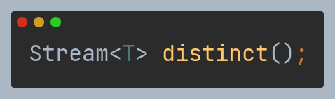

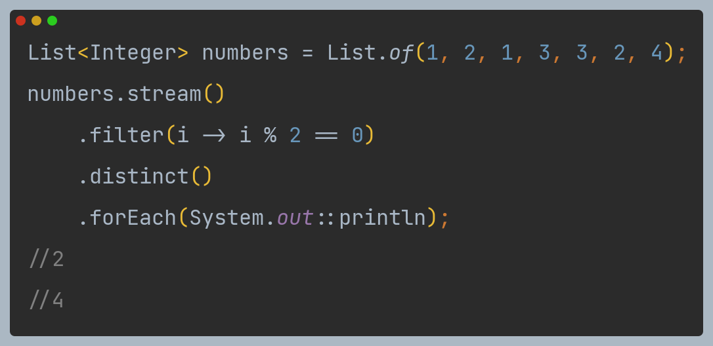

---

# 스트림 슬라이싱

## Predicate를 이용한 슬라이싱

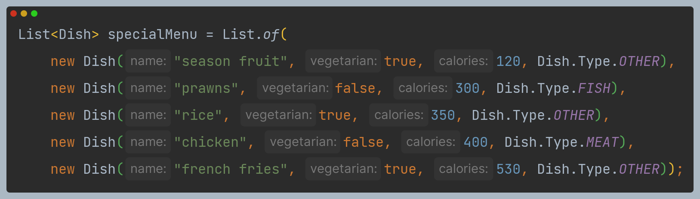

- 위와 같은 리스트에서 320칼로리 미만의 요리를 선택한다고 해보자.
- 가장 기본적으로 다음과 같이 `filter` 메서드를 이용할 수 있다.

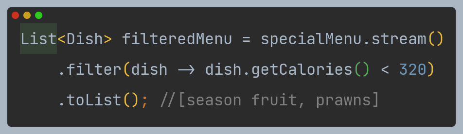

- 위 리스트는 이미 칼로리 순으로 정렬되어 있다. `filter` 연산을 이용하면 전체 스트림을 반복하면서 각 요소에 `Predicate`를 적용하게 된다.
- 하지만 리스트가 이미 정렬되어 있다는 사실을 이용해 320칼로리 이상의 요리가 나왔을 때 반복 작업을 중단할 수 있다.
- 아주 많은 요소를 포함하는 큰 스트림에서는 큰 차이가 될 수 있다.

### takeWhile 활용 (자바 9)

- `takeWhile` 연산을 이용하면 반복 작업을 중단할 수 있다.
- 무한 스트림을 포함한 모든 스트림에 `Predicate`를 적용해 스트림을 슬라이싱할 수 있다.

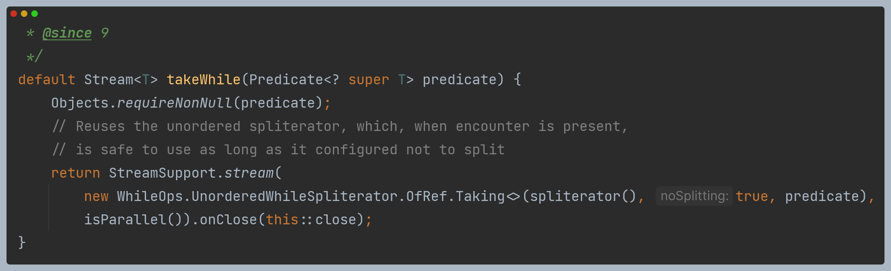

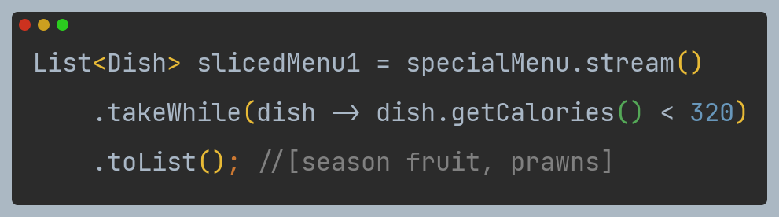

### dropWhile 활용 (자바 9)

- 비슷한 메서드로 `dropWhile`이 있다. `takeWhile`과 정반대의 작업을 수행한다.
- `Predicate`가 처음으로 거짓이 되는 지점까지 발견된 요소를 버린다. 거짓이 되면 그 지점에서 작업을 중단하고
남은 모든 요소를 반환한다.

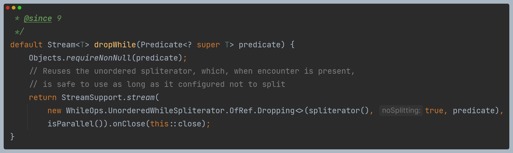

## 스트림 축소

- 스트림은 주어진 값 이하의 크기를 갖는 새로운 스트림을 반환하는 `limit` 메서드를 지원한다.

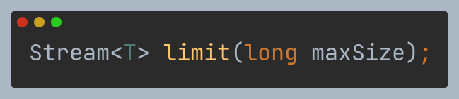

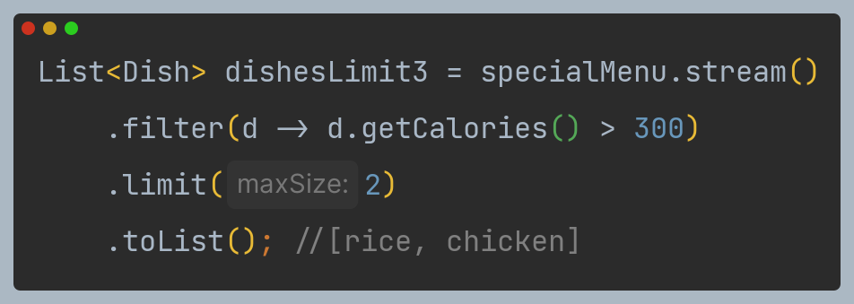

## 요소 건너뛰기

- 스트림은 처음 `n`개 요소를 제외한 스트림을 반환하는 `skip` 메서드를 지원한다.
- `n`개 이하의 요소를 포함하는 리스트에 `skip(n)`을 호출하면 빈 스트림이 반환된다.

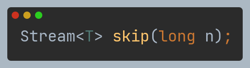

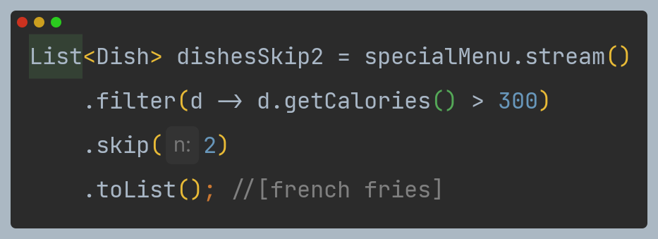

---

# 매핑

## 스트림의 각 요소에 함수 적용

- 스트림은 함수를 인수로 받는 `map` 메서드를 제공한다.
- 인수로 제공된 함수는 각 요소에 적용되며 함수를 적용한 결과가 새로운 요소로 매핑된다.

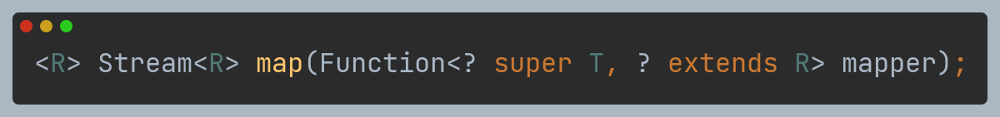

- 예를 들어 다음은 스트림의 요리명을 추출하는 코드다.
- `getName`은 문자열을 반환하므로 `map` 메서드의 출력 스트림은 `Stream<String>` 형식을 갖는다.

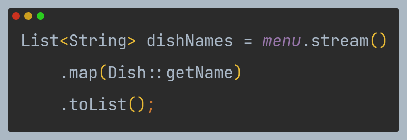

- 다음과 같이 메서드 체인으로 각 요리명을 추출하고, 요리명의 길이를 구할 수 있다.

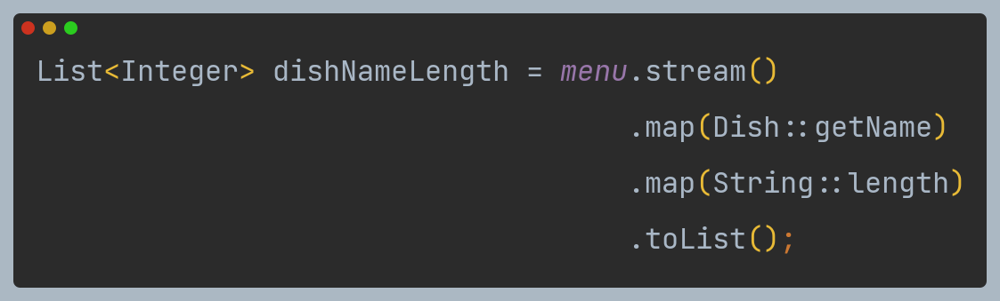

## 스트림 평면화

- 만약 `["Hello", "World"]` 리스트에서 고유 문자로 이루어진 결과 `["H", "e", "l", "o", "W", "r", "d"]`를 포함하는 리스트가
반환되도록 하려면 어떻게 해야할까?
- 다음과 같은 코드를 생각할 수 있다.

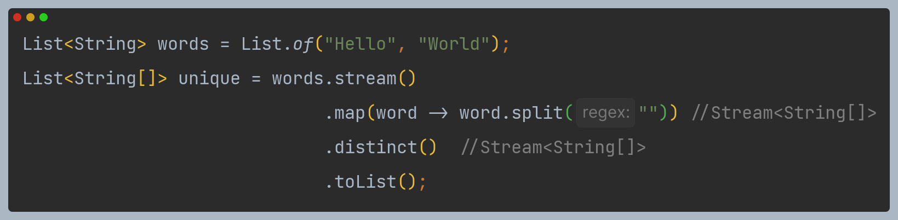

- 위 코드에서 `map`으로 전달한 람다는 각 단어의 문자열 배열을 반환한다는 점이 문제다.
- 여기서 원하는 것은 문자열의 스트림을 표현할 `Stream<String>`이다.

### map과 Arrays.stream 활용

- 우선 배열 스트림 대신 문자열 스트림이 필요하다. 따라서 다음과 같이 코드를 작성할 수 있다.

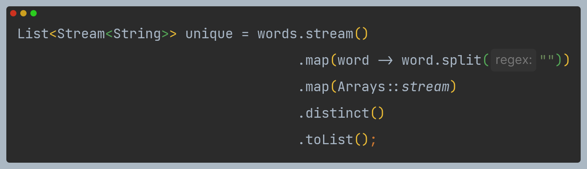

- 스트림 리스트가 만들어지면서 문제가 해결되지 않았다.
- 문제를 해결하려면 먼저 각 단어를 개별 문자열로 이루어진 배열로 만든 다음에 각 배열을 별도의
스트림으로 만들어야 한다.

### flatMap 사용

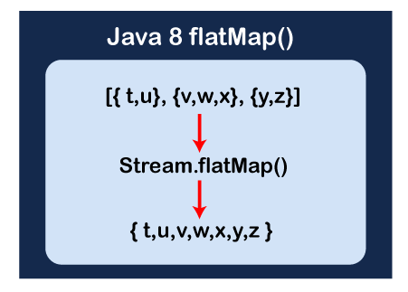

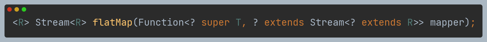

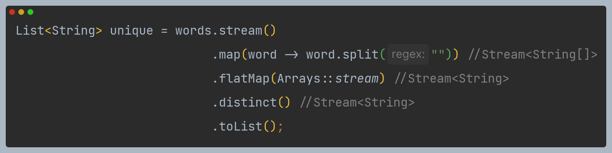

- `flatMap`은 각 배열을 스트림이 아니라 스트림의 콘텐츠로 매핑된다.
- 즉, `map(Arrays::stream)`과 달리 `flatMap`은 하나의 평면화된 스트림을 반환한다.
- 정리하면 `flatMap` 메서드는 스트림의 각 값을 다른 스트림으로 만든 다음에 모든 스트림을
하나의 스트림으로 연결하는 기능을 수행한다.
- 다음과 같은 코드도 가능하다.

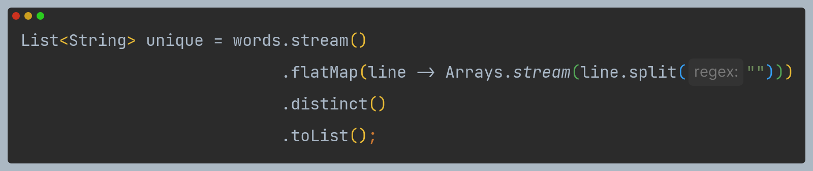

- 다음은 `flatMap`을 이용해 두 개의 숫자 리스트에서 모든 숫자 쌍의 리스트를 반환하는 코드다.

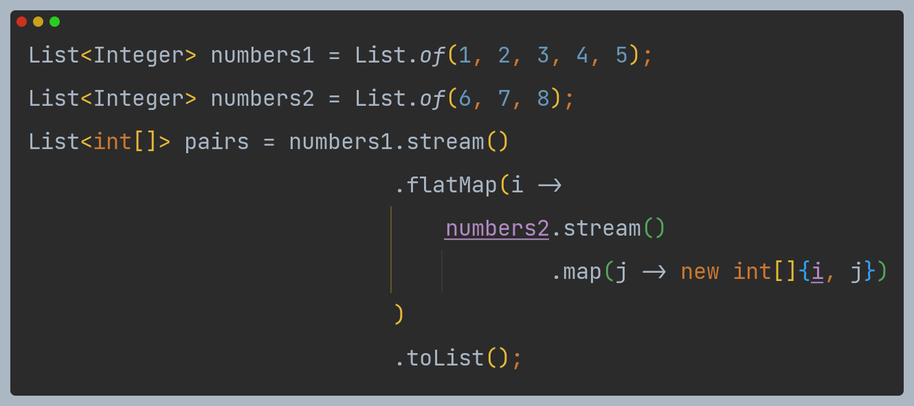

---

# 검색과 매칭

## Predicate가 적어도 한 요소와 일치하는지 확인

- `Predicate`가 주어진 스트림에서 적어도 한 요소와 일치하는지 확인할 때 `anyMatch` 메서드를 이용한다.

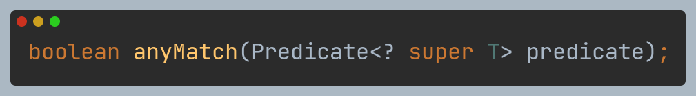

## Predicate가 모든 요소와 일치하는지 확인

- `allMatch` 메서드는 `anyMatch`와 달리 스트림의 모든 요소가 주어진 `Predicate`와 일치하는지 검사한다.

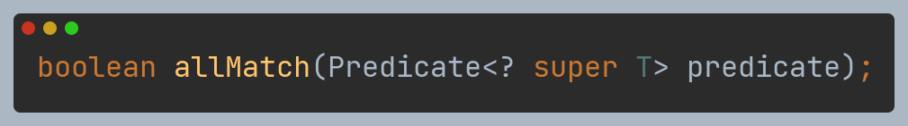

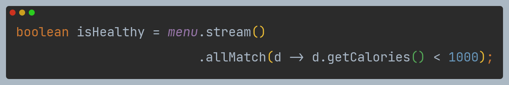

## Predicate와 일치하는 요소가 없는지 확인

- `noneMatch`는 `allMatch`와 반대 연산을 수행한다. 즉, 주어진 `Predicate`와 일치하는
  요소가 없는지 확인한다.

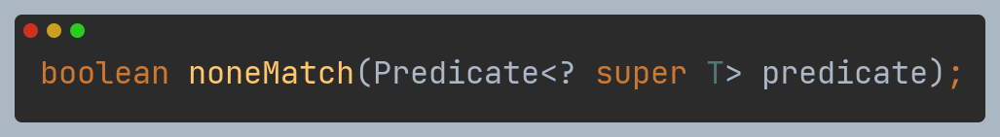

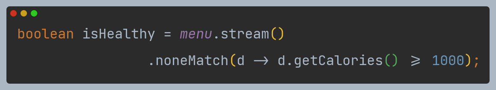

## 요소 검색

- `findAny` 메서드는 현재 스트림에서 임의의 요소를 반환한다.

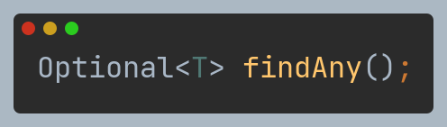

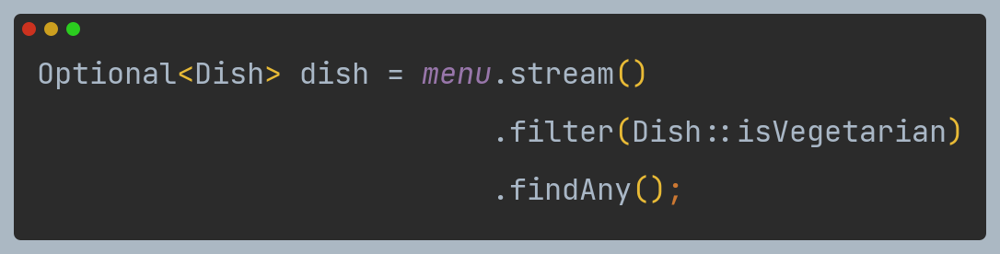

## 첫 번째 요소 찾기

- 리스트 또는 정렬된 연속 데이터로부터 생성된 스트림처럼 일부 스트림에는 논리적인 아이템 순서가 정해져 있을 수 있다.
- 예를 들어 숫자 리스트에서 3으로 나누어떨어지는 첫 번째 제곱값을 반환하는 코드다.

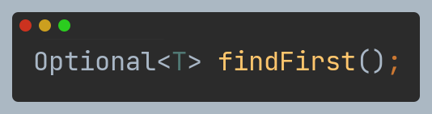

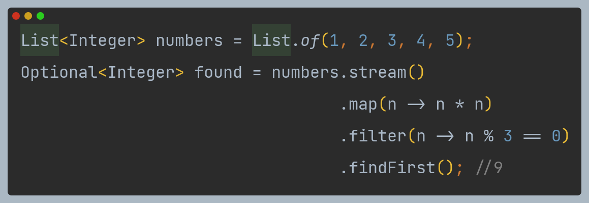

> - `findFirst`와 `findAny` 메서드가 모두 필요한 이유는 병렬성 때문이다.
> - 병렬 실행에서는 첫 번째 요소를 찾기 어렵다.
> - 요소의 반환 순서가 상관없다면 병렬 스트림에서는 제약이 적은 `findAny`를 사용한다.

> - `allMatch`, `noneMatch`, `findFirst`, `findAny` 등의 연산은 모든 스트림의 요소를
> 처리하지 않고도 결과를 반환할 수 있다.
> - 원하는 요소를 찾았으면 즉시 결과를 반환할 수 있으며, 이러한 것을 **쇼트 서킷**이라고 한다.

---

# 리듀싱

- `reduce` 메서드는 초깃값과 두 요소를 조합하는 `BinaryOperator<T>`를 인수로 받는다.

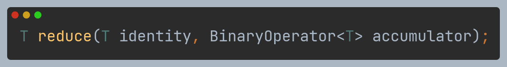

- 다음 코드는 요소의 합을 구하는 코드이다.

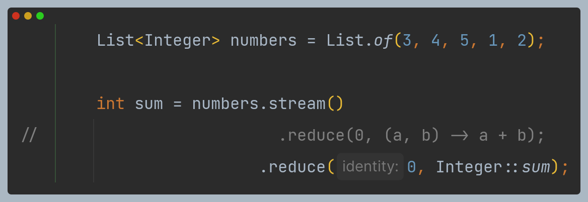

- 초깃값을 받지 않도록 오버로드된 `reduce`도 있다. 그러나 `Optional` 객체를 반환한다.
- 스트림에 아무 요소가 없다면 초깃값이 없기 때문이다.

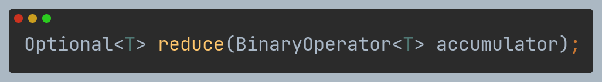

- 다음은 요소의 최댓값과 최솟값을 찾는 코드이다.

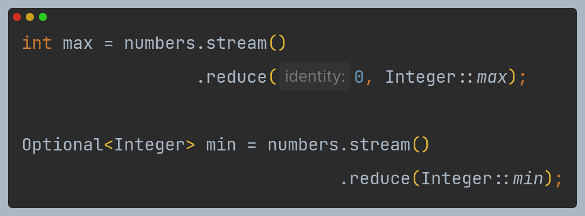

---

# 숫자형 스트림

- `reduce`를 사용해 요소의 합을 구하는 코드에는 박싱 비용이 숨어있다.
- 내부적으로 합계를 계산하기 전에 Integer를 기본형으로 언박싱해야 한다.
- 스트림 API 숫자 스트림을 효율적으로 처리할 수 있도록 **기본형 특화 스트림**을 제공한다.

## 기본형 특화 스트림

- 스트림 API는 박싱 비용을 피할 수 있는 `IntStream`, `DoubleStream`, `LongStream`을 제공한다.
- 각각의 인터페이스는 `sum`과 `max` 같이 자주 사용하는 숫자 관련 리듀싱 연산 수행 메서드를 제공한다.
- 또한 필요할 때 다시 객체 스트림으로 복원하는 기능도 제공한다.
- 특화 스트림은 오직 박싱 과정에서 일어나는 효율성과 관련 있으며 스트림에 추가 기능을 제공하지는 않는다.

### 숫자 스트림으로 매핑

- 스트림을 특화 스트림으로 변환할 때는 `mapToInt`, `mapToDouble`, `mapToLong` 세 가지 메서드를 가장 많이 사용한다.
- `map`과 같은 기능을 수행하지만, `Stream<T>` 대신 특화된 스트림을 반환한다.

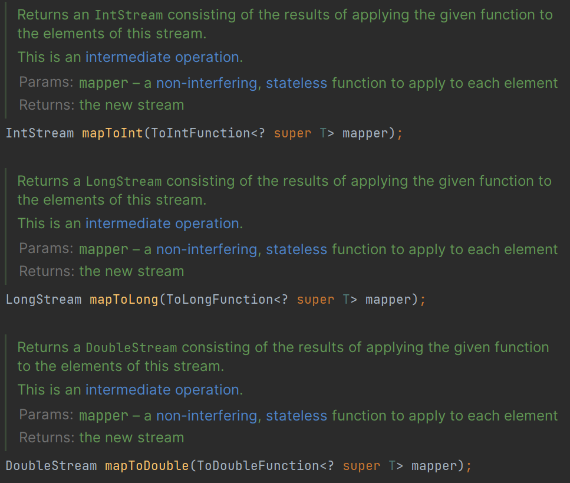

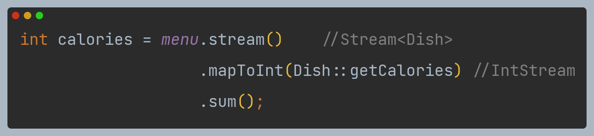

- 스트림이 비어있으면 기본값 0을 반환하며, `max`, `min`, `average` 등 다양한 메서드를 지원한다.

### 객체 스트림으로 복원하기

- `boxed` 메서드를 이용해 특화 스트림을 일반 스트림으로 변환할 수 있다.

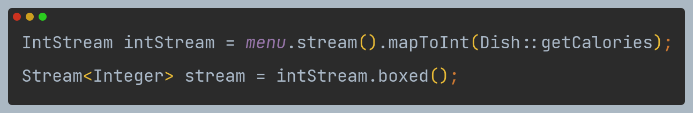

### 기본값 (OptionalXxx)

- 스트림에 요소가 없더라도 `sum`은 0이라는 기본값이 있지만, `min`이나 `max`같은 경우는
스트림에 요소가 없는 경우와 실제 최댓값 또는 최솟값이 0인 상황을 구별해야한다.
- `OptionalInt`, `OptionalDouble`, `OptionalLong` 세 가지 기본형 특화 스트림 버전도 제공한다.

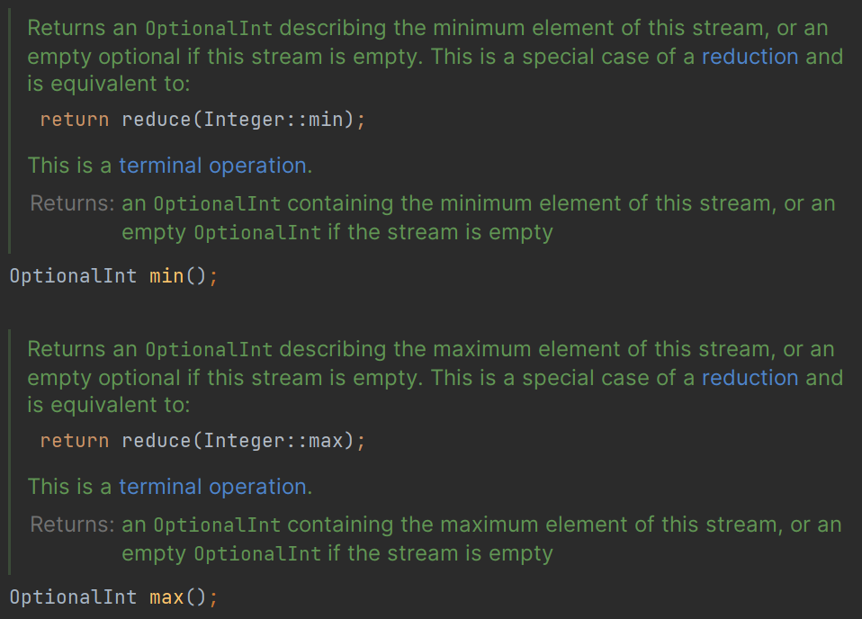

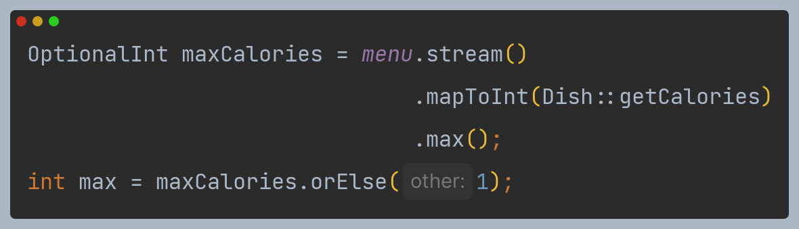

## 숫자 범위

- `IntStream`과 `LongStream`에서는 `range`와 `rangeClosed`라는 정적 메서드를 제공한다.
- 두 메서드 모두 시작값과 종료값 두 가지 인수를 받는다.
- 두 메서드의 차이점은 종료값 포함 여부에 있다.

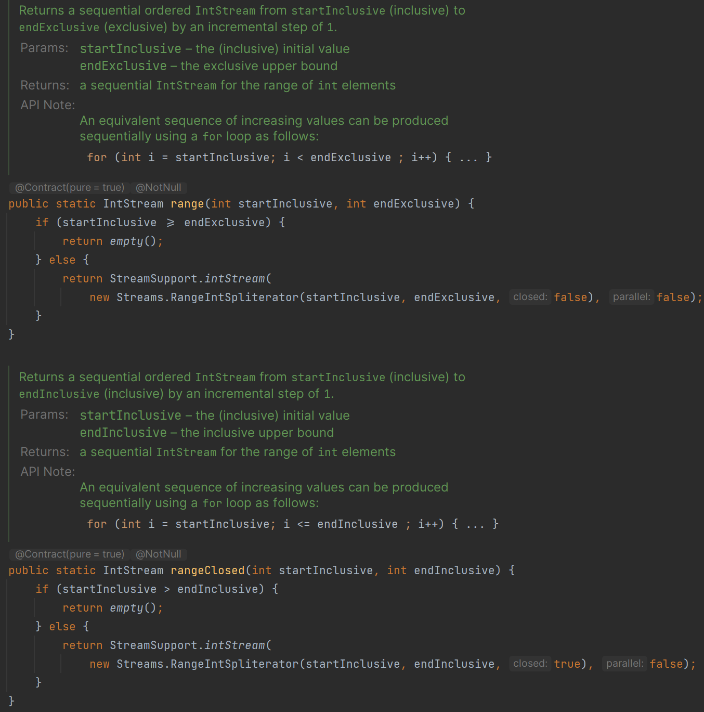

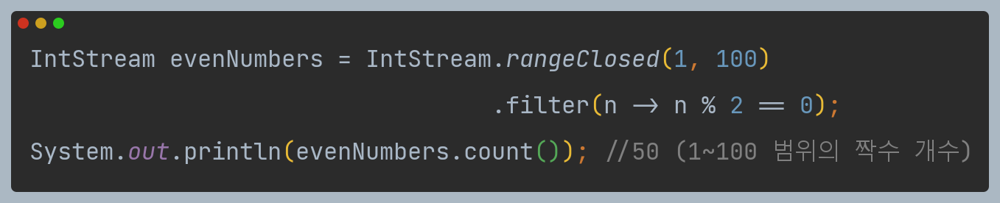

- 다음은 피타고라스 수를 만드는 코드이다.

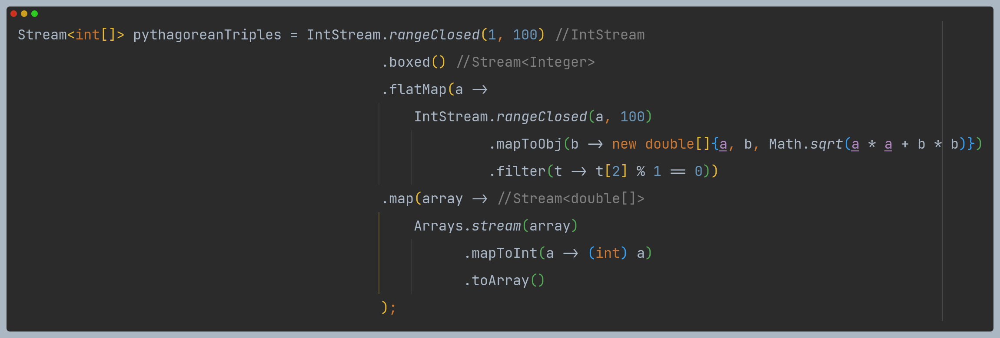

---

# 스트림 만들기

## 값으로 스트림 만들기

- 임의의 수를 인수로 받는 정적 메서드 `of`를 이용해서 스트림을 만들 수 있다.
- `empty` 메서드로 비어있는 스트림을 생성할 수도 있다.

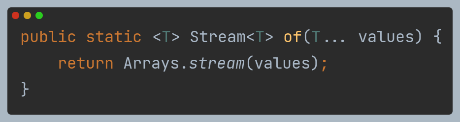

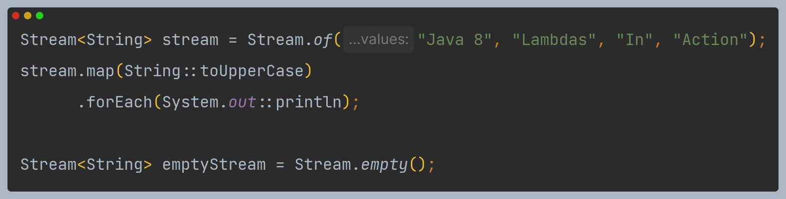

## null이 될 수 있는 객체로 스트림 만들기 (자바 9)

- 자바 9에서는 null이 될 수 있는 객체를 스트림으로 만들 수 있는 메서드가 추가되었다.
- 다음 두 코드는 같은 기능을 한다.

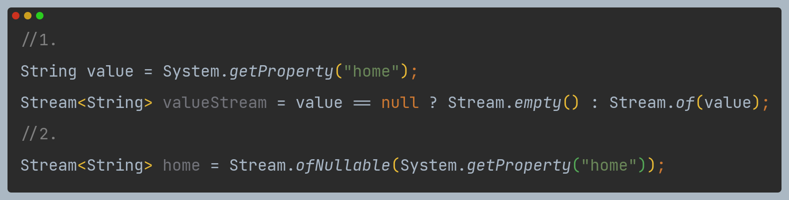

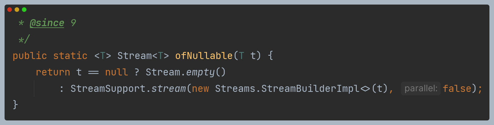

## 배열로 스트림 만들기

- 배열을 인수로 받는 정적 메서드 `Arrays.stream`을 이용해서 스트림을 만들 수 있다.
- 기본형 특화 스트림을 반환한다.

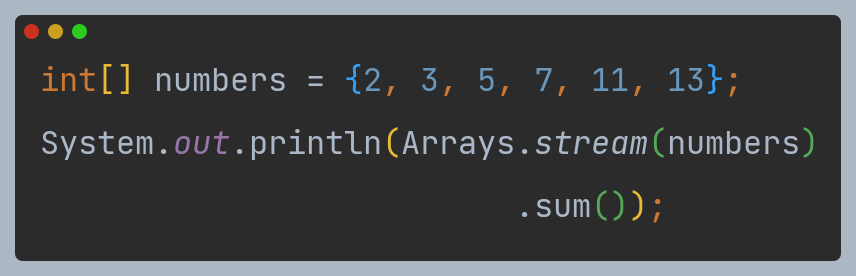

## 무한 스트림 만들기

- `iterate`와 `generate` 두 정적 메서드를 이용해서 무한 스트림, 크기가 고정되지 않은 스트림을 만들 수 있다.
- 이 메서드로 만든 스트림은 요청할 때마다 주어진 함수를 이용해서 값을 만든다.
- 보통 `limit`과 함께 사용한다.

### iterate 메서드

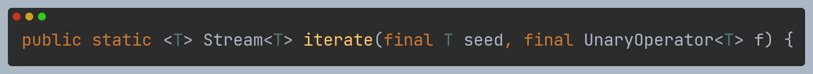

- 다음 코드에서 `limit`을 제거하면 2씩 커지는 수를 출력하는 것을 무한 반복한다.

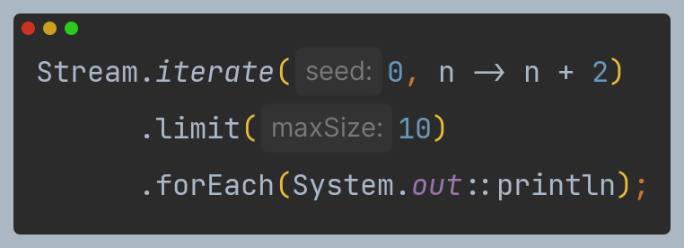

- 다음은 `iterate`로 피보나치 수열을 출력하는 코드다.

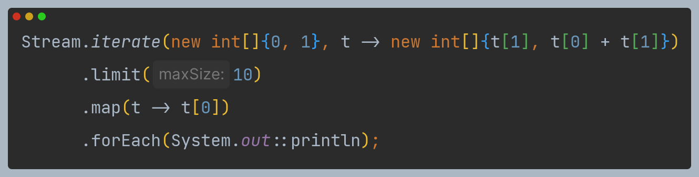

- 자바 9의 `iterate`는 `Predicate`를 인수로 받는 메서드를 지원한다.
- 다음 코드는 0에서 시작해서 4씩 커지는 수를 생성하다가 100 이상이 되면 생성을 중단한다.

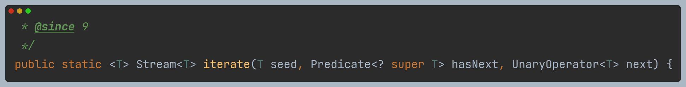

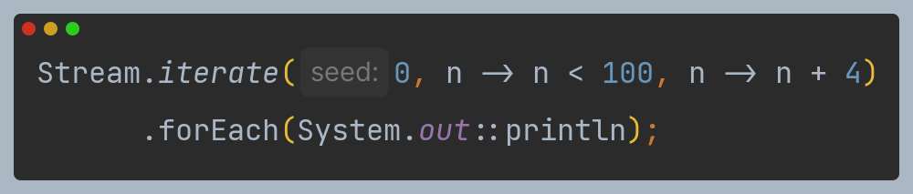

- `filter`로 같은 결과를 얻을 수 있을 것이라고 생각할 수 있지만, 그렇지 않다.
- `filter` 메서드는 언제 이 작업을 중단해야 하는지 알 수 없기 때문이다.

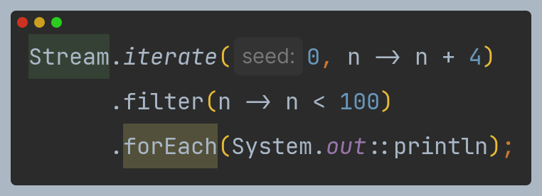

- 스트림 쇼트서킷을 지원하는 `takeWhile`을 이용하면 된다.

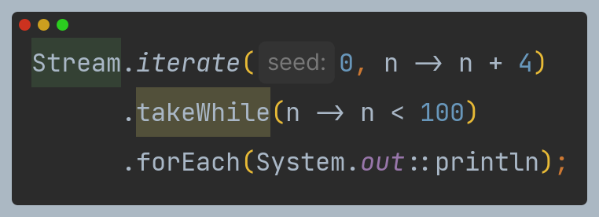

- 이때 IDE는 세 개의 인수를 받는 `iterate`를 사용하는 것을 추천한다.

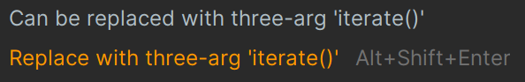

### generate 메서드

- `iterate`와 달리 생상된 각 값을 연속적으로 계산하지 않는다.
- `Supplier`를 인수로 받아서 새로운 값을 생산한다.

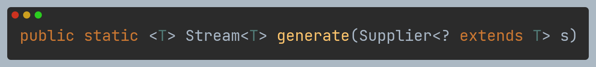

- 다음 코드는 랜덤 수 10개를 생성한다.

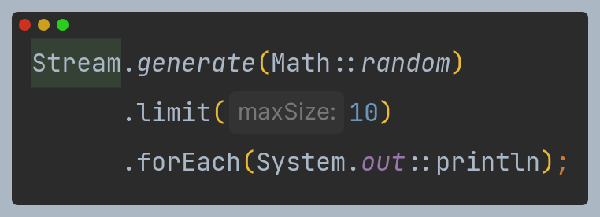

- 여기서 사용한 발행자(`supplier`)는 상태가 없는 메서드, 즉 나중에 계산에 사용할 어떤 값도 저장해두지 않는다.
- 하지만 발행자에 꼭 상태가 없어야 하는 것은 아니다. 발행자가 상태를 저장한 다음에 스트림의 다음 값을
만들 때 상태를 고칠 수도 있다.

**중요한 점은 병렬 코드에서는 발행자에 상태가 있으면 안전하지 않다는 것이다.**

- 다음은 `generate`를 이용한 피보나치 수열 구하는 코드다.

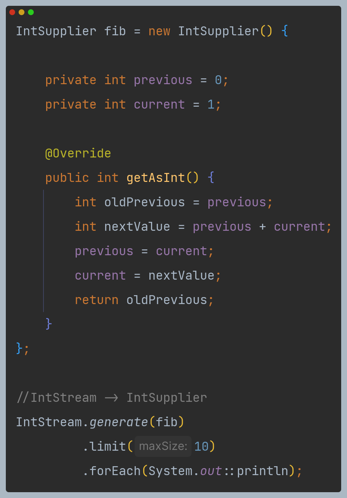

- 만든 객체(`fib`)는 **가변** 상태 객체다. `getAsInt`를 호출하면 객체 상태가 바뀌며 새로운 값을 생산한다.
- `iterate`를 사용했을 때는 각 과정에서 새로운 값을 생성하면서도 기존 상태를 바꾸지 않는 순수한 **불변** 상태를 유지했다.
- 스트림을 병렬로 처리하면서 올바른 결과를 얻으려면 **불변 상태 기법**을 고수하는 것이 중요하다.