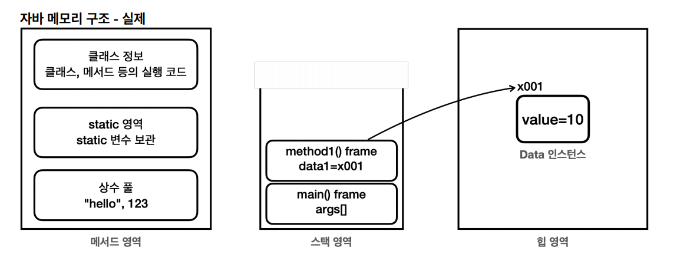
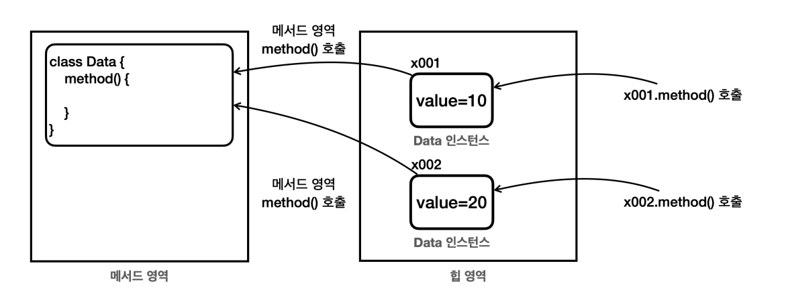
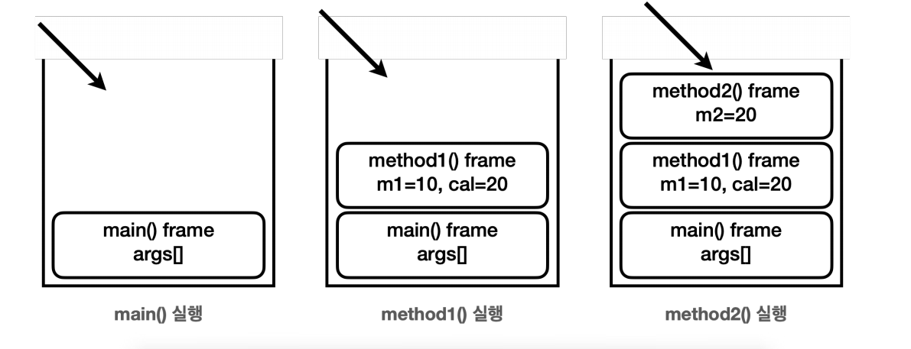
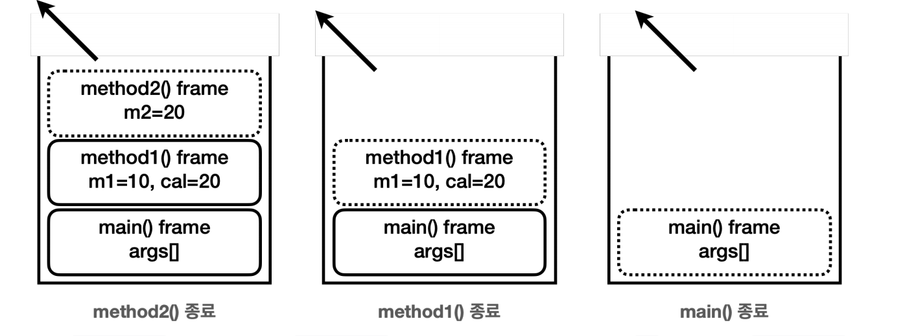
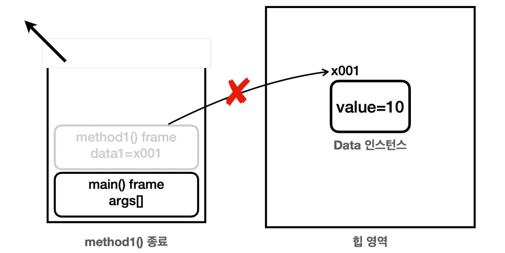

# 자바 메모리 구조와 static

## 자바 메모리 구조


- 자바의 메모리 구조는 크게 메서드 영역, 스택 영역, 힙 영역으로 나눌 수 있다.
  - **메서드 영역** : 클래스 정보를 보관한다.
  - **스택 영역** : 실제 프로그램이 실행되는 영역으로, 메서드를 실행할 때마다 하나씩 쌓인다.
  - **힙 영역** : 객체(인스턴스)가 생성되는 영역으로, `new` 명령어를 사용하면 이 영역을 사용한다.



- **메서드 영역** : 프로그램을 실행하는 데 필요한 공통 데이터를 관리한다. 이 영역은 프로그램의 모든 영역에서 공유한다.
  - `클래스 정보` : 클래스의 실행 코드(바이트 코드), 필드, 메서드와 생성자 등 모든 실행 코드가 존재한다.
  - `static` 영역 :  `static` 변수들을 보관한다.
  - `런타임 상수 풀` : 프로그램을 실행하는 데 필요한 공통 리터럴 상수를 보관한다.
- **스택 영역** : 자바 실행 시, 하나의 실행 스택이 생성되고, 각 스택 프레임은 지역 변수, 중간 연산 결과, 메서드 호출 정보 등을 포함한다.
  - `스택 프레임` : 스택 영역에 쌓이는 박스가 하나의 스택 프레임이다. 메서드를 호출할 때마다 하나의 스택 프레임이 쌓이고, 메서드가 종료되면 해당 스택 프레임이 제거된다.
  - **스택 영역은 각 쓰레드별로 하나의 실행 스택이 생성된다. 따라서 쓰레드 수 만큼 스택 영역이 생성된다.**
- **힙 영역** : 객체(인스턴스)와 배열이 생성되는 영역으로, 가비지 컬렉션(`GC`)이 이루어지는 주요 영역이다. 더 이상 참조되지 않는 객체는 `GC`에 의해 제거된다.



- 자바에서 특정 클래스로 100개의 인스턴스를 생성하면, 힙 메모리에는 100개의 인스턴스가 생긴다.
- 각각의 인스턴스는 내부에 변수와 메서드를 가진다.
- 같은 클래스로부터 생성된 객체라도 인스턴스 내부의 변수 값은 서로 다를 수 있지만, 메서드는 공통된 코드를 공유한다.
- 따라서 객체가 생성될 때 인스턴스 변수에는 메모리가 할당되지만, 메서드에 대한 새로운 메모리 할당은 없다. 메서드는 메서드 영역에서 공통으로 관리되고 실행된다.
- **인스턴스의 메서드를 호출하면 실제로는 메서드 영역에 있는 코드를 불러서 실행하는 것이다.**


## 스택 영역

```java
public class Main {
    public static void main(String[] args) {
        System.out.println("main start");
        method1(10);
        System.out.println("main end");
    }

    static void method1(int m1) {
        System.out.println("method1 start");
        int cal = m1 * 2;
        method2(cal);
        System.out.println("method1 end");
    }

    static void method2(int m2) {
        System.out.println("method2 start");
        System.out.println("method2 end");
    }
}
```
- 위 코드 실행 결과는 다음과 같다.
```text
main start
method1 start
method2 start
method2 end
method1 end
main end
```

**호출 그림**



- 처음 자바 프로그램을 실행하면 `main()`을 실행한다. 이때 `main()`을 위한 스택 프레임이 하나 생성된다.
  - `main()` 스택 프레임은 내부에 `args`라는 매개변수를 가진다.
- `main()`은 `method1()`을 호출하고, `method1()` 스택 프레임이 생성된다.
  - `method1()`은 `m1`, `cal` 지역 변수(매개변수 포함)를 가지므로 해당 변수들이 스택 프레임에 포함된다.
- `method1()`은 `method2()`를 호출하고, `method2()` 스택 프레임이 생성된다.
  - `method2()`는 `m2` 지역 변수(매개변수 포함)를 가지므로 해당 지역 변수가 스택 프레임에 포함된다.


**종료 그림**



- `method2()`가 종료되면 `method2()` 스택 프레임이 제거되고, 매개변수 `m2`도 제거된다. 프로그램은 이전 스택 프레임인 `method1()`로 돌아가 `method2()`를 호출한 
    시점 다음 코드를 실행한다.
- `method1()`이 종료되면 `method1()` 스택 프레임이 제거되고, 지역 변수(매개변수 포함) `m1` , `cal`도 제거된다. 프로그램은 이전 스택 프레임인 `main()`으로 돌아간다.
- `main()`이 종료되면 더 이상 호출할 메서드도 없고, 스택도 완전히 비워졌다. 자바는 프로그램을 정리하고 종료한다.

**정리**
- 자바는 스택 영역을 사용해서 메서드 호출과 지역 변수(매개변수 포함)를 관리한다.
- 메서드를 계속 호출하면 호출한 만큼 스택 프레임이 계속 쌓인다.
- 스택 프레임이 종료되면 지역 변수도 함께 제거된다.
- 스택 프레임이 모두 제거되면 프로그램도 종료된다.

### 스택 영역과 힙 영역
- 스택 영역과 힙 영역이 함께 사용되는 경우

```java
public class Data {
    private int value; 
    
    public Data(int value) {
         this.value = value;
    }
}
```
```java
public class Main {
    public static void main(String[] args) {
        System.out.println("main start");
        method1();
        System.out.println("main end");
    }

    static void method1() {
        System.out.println("method1 start");
        Data data = new Data(10);
        method2(data);
        System.out.println("method1 end");
    }

    static void method2(Data data2) {
        System.out.println("method2 start");
        System.out.println("data2.value = " + data2.getValue());
        System.out.println("method2 end");
    }
}
```
- 처음 `main()` 메서드를 실행하고, `main()` 스택 프레임이 생성된다.
- `main()`에서 `method1()`을 호출하고, `method1()` 스택 프레임이 생성된다.
- `method1()`은 지역 변수로 `Data data`를 가지고 있다. 이 지역 변수도 스택 프레임에 포함된다.
- `methdo1()`은 `new`를 사용해서 힙 영역에 인스턴스를 생성하고, 참조값을 `data`에 보관한다.


- `method1()`은 `method2()`를 호출하면서 매개변수에 참조값을 넘긴다.
- 이제 `method1()`에 있는 `data`와 `method2()`에 있는 `data2` 지역 변수(매개변수 포함)는 둘 다 같은 인스턴스를 참조한다.


- `method2()`가 종료되고, `method2()`의 스택 프레임이 제거되면서 매개변수 `data2`도 함께 제거된다.


- `method1()`이 종료되고, `method1()`의 스택 프레임이 제거되면서 지역 변수 `data`도 함께 제거된다.



- `method1()`이 종료된 지후의 상태를 보면 이제 힙 영역에 있는 인스턴스를 참조하는 곳은 없다.
- 참조하는 곳이 없다는 것은 사용되는 곳이 없다는 것이다. 결과적으로 프로그램에서 더는 사용하지 않는 객체가 됐고, 이런 객체는 메모리만 낭비하게 된다.
- `GC`는 이렇게 참조가 모두 사라진 인스턴스를 찾아서 메모리에서 제거한다.


- 참고로, 힙 영역 외부가 아닌 힙 영역 안에서만 인스턴스끼리 서로 참조하는 경우가 있는데 이런 경우도 `GC`의 대상이 된다.


## static 변수

- **멤버 변수(필드)의 종류**
  - **인스턴스 변수** : `static`이 붙지 않은 멤버 변수
    - `static`이 붙지 않은 멤버 변수는 인스턴스를 생성해야 사용할 수 있고, 인스턴스에 소속되어 있다. 따라서 인스턴스 변수라 한다.
    - 인스턴스 변수는 인스턴스를 만들 때마다 새로 만들어진다.
  - **클래스 변수** : `static`이 붙은 멤버 변수
    - 클래스 변수, 정적 변수, `static` 변수 등으로 부른다.
    - `static`이 붙은 멤버 변수는 인스턴스와 무관하게 클래스에 바로 접근해서 사용할 수 있고, 클래스 자체에 소속되어 있다. 따라서 클래스 변수라 한다.
    - 클래스 변수는 자바 프로그램을 시작할 때 딱 1개 만들어진다. 인스턴스와는 다르게 여러 곳에서 공유하는 목적으로 사용된다.

### 변수 생명주기
- **지역 변수(매개변수 포함)**
  - 지역 변수는 스택 영역에 있는 스택 프레임 안에 보관된다. 메서드가 종료되면 스택 프레임도 제거 되는데 이때 해당 스택 프레임에 포함된 지역 변수도 함께 제거된다.
  - 따라서 지역 변수는 생존 주기가 짧다.
- **인스턴스 변수**
  - 인스턴스에 있는 멤버 변수를 인스턴스 변수라 하는데, 인스턴스 변수는 힙 영역을 사용한다.
  - 힙 영역은 `GC`가 발생하기 전까지는 생존하기 때문에 지역 변수보다는 생존 주기가 길다.
- **클래스 변수**
  - 클래스 변수는 메서드 영역의 `static` 영역에 보관되는 변수이다.
  - 메서드 영역은 프로그램 전체에서 사용하는 공용 공간이다.
  - 클래스 변수는 해당 클래스가 JVM에 로딩 되는 순간 생성되고, JVM이 종료될 때까지 생명주기가 이어진다.
  - 따라서 가장 긴 생명주기를 가진다.

힙 영역에 생성되는 인스턴스 변수는 동적(`dynamic`)으로 생성되고, 제거된다. 반면에 `static` 정적 변수는 프로그램 실행 시점에 딱 한 번 만들어지고, 프로그램 종료 시점에 제거된다.
`static` 뜻 그대로 정적 변수인 것이다.


## static 메서드

- **멤버 메서드의 종류**
  - **인스턴스 메서드** : `static`이 붙지 않은 멤버 메서드
    - `static`이 붙지 않은 멤버 메서드는 인스턴스를 생성해야 사용할 수 있고, 인스턴스에 소속되어 있다. 따라서 인스턴스 메서드라 한다.
  - **클래스 메서드** : `static`이 붙은 멤버 메서드
    - `static`이 붙은 멤버 메서드는 인스턴스와 무관하게 클래스에 바로 접근해서 사용할 수 있고, 클래스에 자체에 소속되어 있다. 따라서 클래스 메서드라 한다.
    - 클래스 메서드, 정적 메서드, `static` 메서드 등으로 부른다.

정적 메서드는 객체 생성이 필요 없이 메서드의 호출만으로 필요한 기능을 수행할 때 주로 사용한다.<br>
예를 들어 간단한 메서드 하나로 끝나는 유틸리티성 메서드에 자주 사용한다.(대표적으로 자바의 `Math` 클래스가 있다.)


**인스턴스 생성 없이 실행가는 가장 대표적인 메서드가 `main()` 메서드이다.**<br>
`main()`메서드는 프로그램을 시작하는 시작점이 되는데, `main()` 메서드가 `static`이기 때문에 객체를 생성하지 않아도 `main()` 메서드가 작동하는 것이다.

**정적 메서드는 정적 메서드만 호출할 수 있다.(`static` -> `instance` : 불가능, `instance` -> `static` : 가능)**<br>
더 정확히는 정적 메서드는 같은 클래스 내부에서 정적 메서드만 호출할 수 있다. 따라서 정적 메서드인 `main()` 메서드가 같은 클래스에서 메서드를 호출하려면
메서드를 정적으로 만들어야 한다.

> 내용 참고 : [인프런 - 김영한의 실전 자바 - 기본편](https://www.inflearn.com/course/%EA%B9%80%EC%98%81%ED%95%9C%EC%9D%98-%EC%8B%A4%EC%A0%84-%EC%9E%90%EB%B0%94-%EA%B8%B0%EB%B3%B8%ED%8E%B8/dashboard)