# 자바 - ENUM

## 열거형으로 리팩토링

## 리팩토링 1

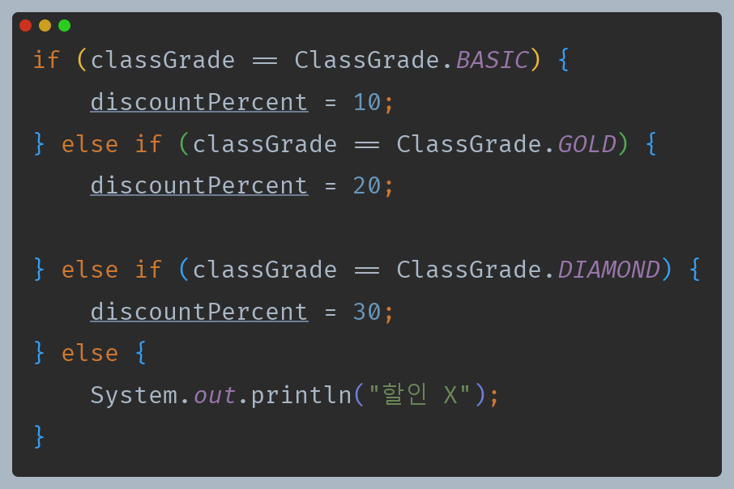

- 먼저 불필요한 `if`문을 제거해본다.
- 할인율은 결국 회원 등급별로 판단되기 때문에 회원 등급 클래스가 할인율을 가지고 관리하도록 변경해본다.

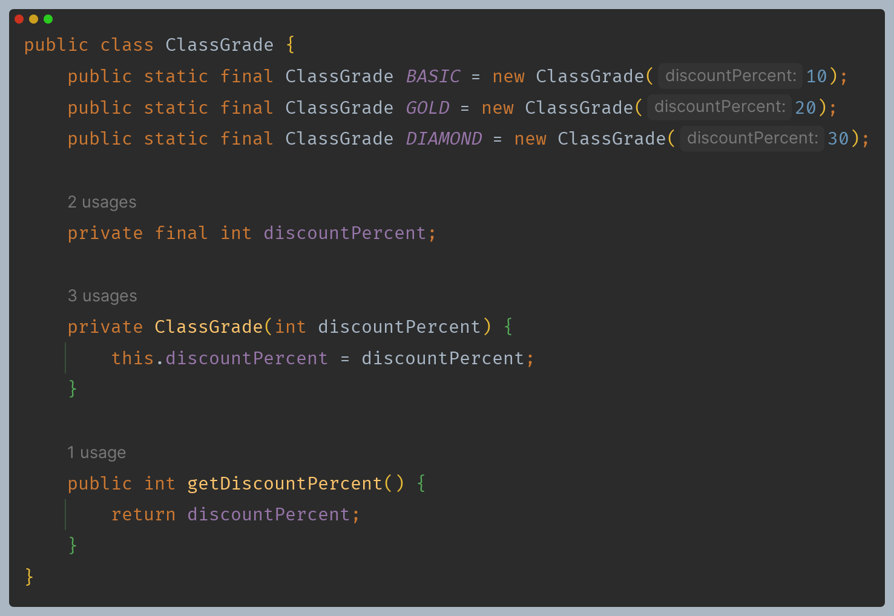

- `ClassGrade`에 할인율 필드와 조회 메서드를 추가한다.
- 생성자를 통해서만 할인율을 설정하도록 하고, 불변으로 설계했다.
- 즉, 상수를 정의할 때 등급에 따른 할인율이 정해진다.

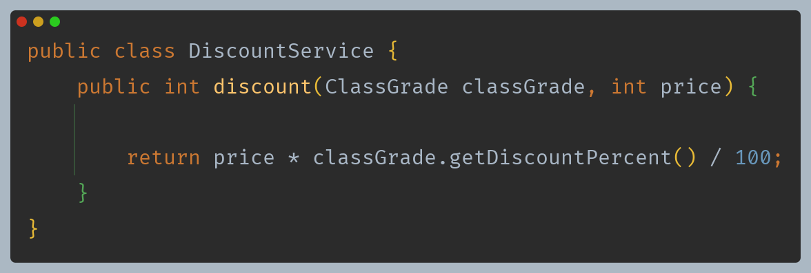

- 이제 `if` 문을 사용할 필요 없이 단순히 회원 등급 안에 있는 할인율을 바로 구할 수 있다.

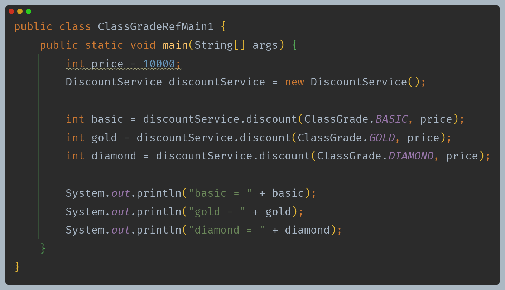

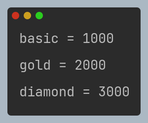

---

## 리팩토링 2

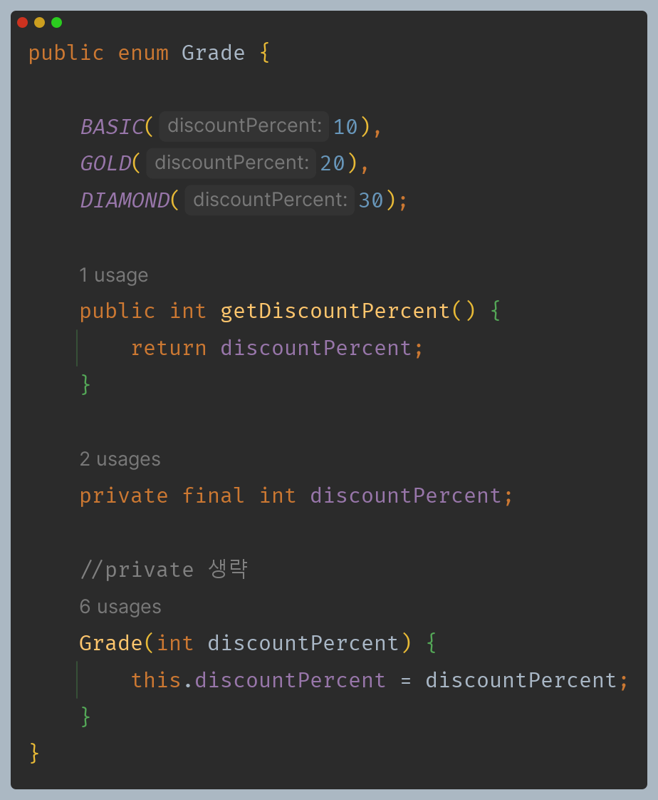

- 할인율 필드를 추가하고, 생성자를 통해서 필드에 값을 저장한다.
- 열거형은 상수로 지정하는 것 외에 일반적인 방법으로 생성이 불가능하기 때문에 생성자에 접근제어자를 선언할 수 없게 막혀있다.
- 열거형도 클래스이므로 메서드를 추가할 수 있다.

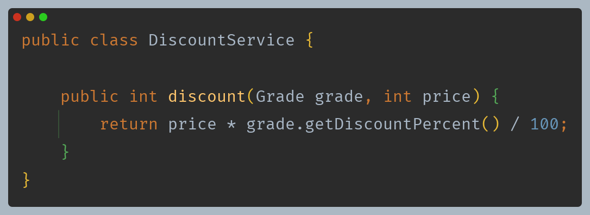

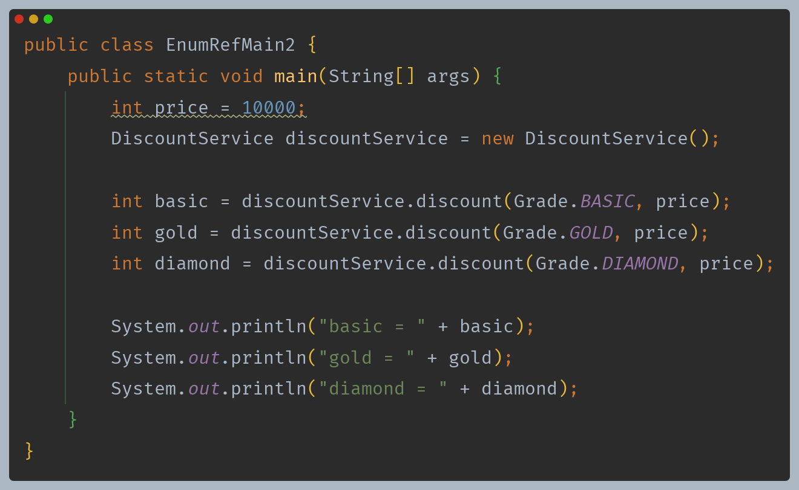

---

## 리팩토링 3

위 코드에서 이제는 단순히 할인율을 계산하는 로직만 남게 되었다.

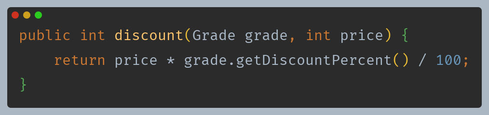

- 이 코드를 보면 할인율 계산을 위해 `Grade`의 할인율 값을 꺼내서 사용한다.
- 객체지향 관점에서 이렇게 자신의 데이터를 외부에 노출하는 것보다는, `Grade` 클래스가 자신의 할인율을 어떻게 계산하는지 스스로 관리하는 것이 캡슐화 원칙에 더 맞다.

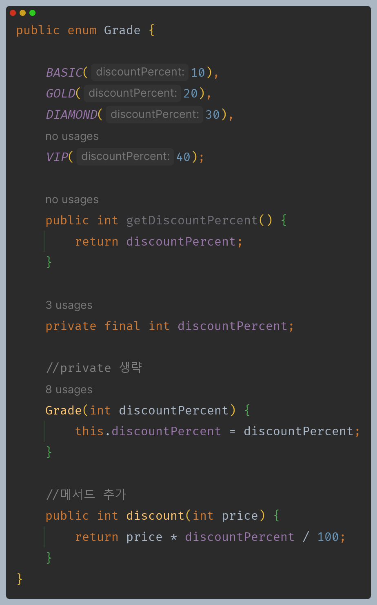

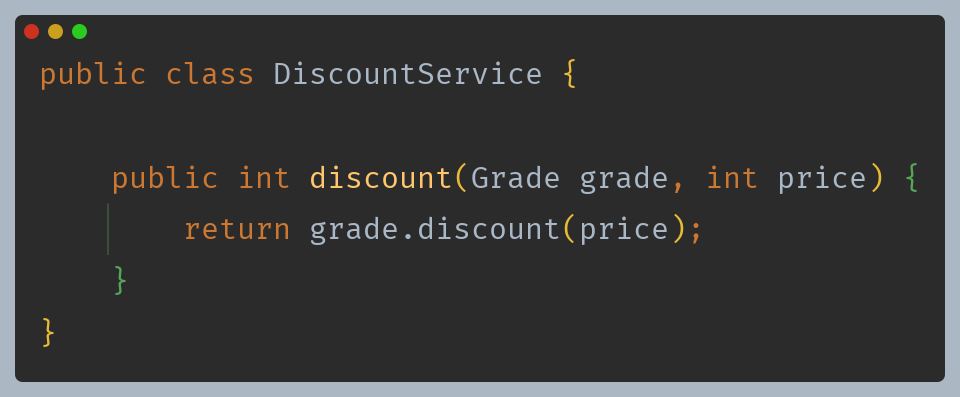

- 할인율 계산은 `Grade` 가 스스로 처리할 수 있으므로 서비스 로직 에서는 단순히 메서드를 호출하기만 하면 된다.

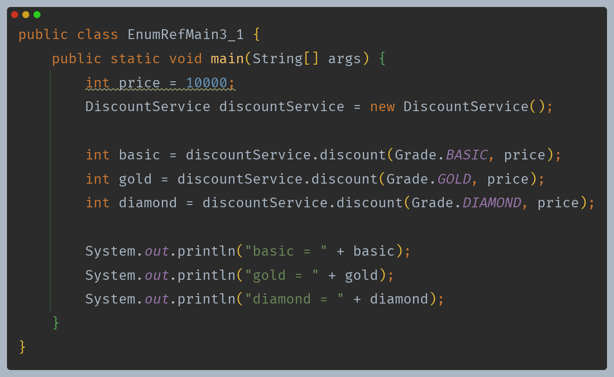

- 각각의 등급별로 자신의 `discount()`를 호출하면 할인율을 구할 수 있기 때문에 이제 굳이 필요없는 `DiscountService`를 사용하지 않아도 된다.

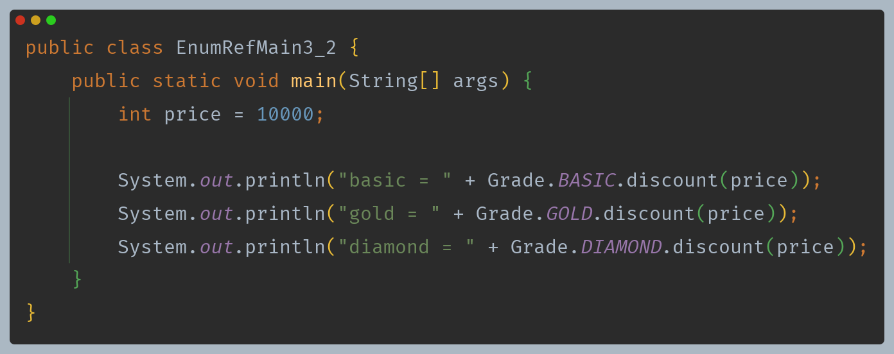

- 메서드로 추출

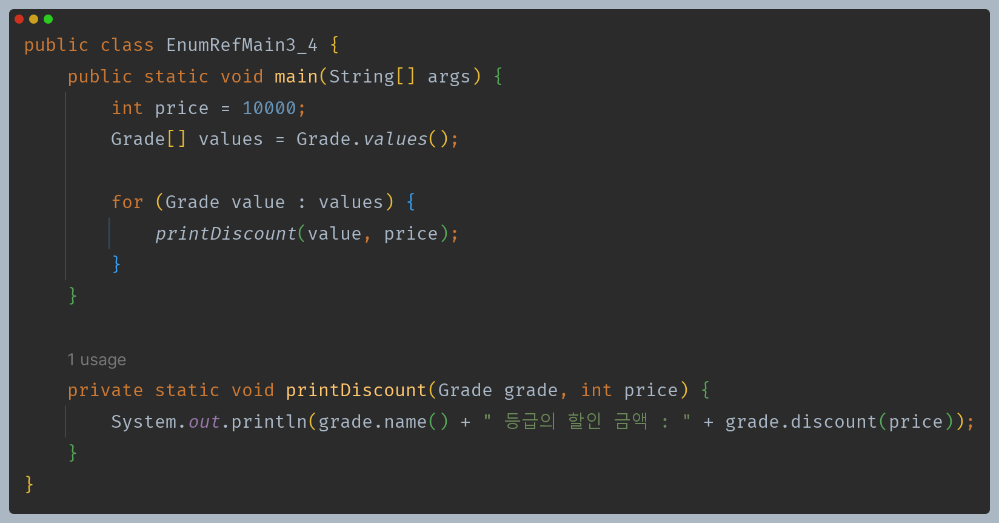

---

[이전 ↩️ - 자바(ENUM) - Enum Type](https://github.com/genesis12345678/TIL/blob/main/Java/mid_1/Enum/Enum%20Type.md)

[메인 ⏫](https://github.com/genesis12345678/TIL/blob/main/Java/mid_1/Main.md)