# 자바 - ENUM

## 문자열과 타입 안전성

- 자바가 제공하는 열거형(`Enum Type`)이 왜 생겨났는지 알아보자.

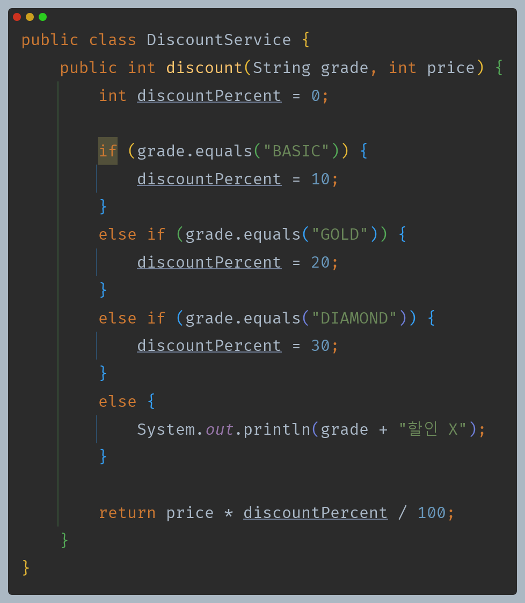

- 회원 등급에 따라 할인 금액을 달리 하는 서비스가 있다고 보자.

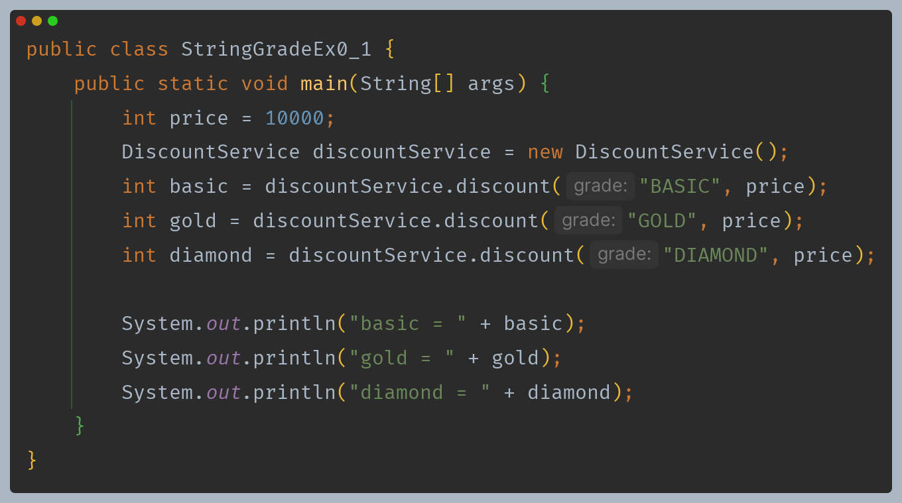

- 위와 같이 정확한 문자열을 입력했을 때는 문제가 없겠지만, 문자열 입력은 충분히 오타나 유효하지 않은 값을 입력할 여지가 있다.

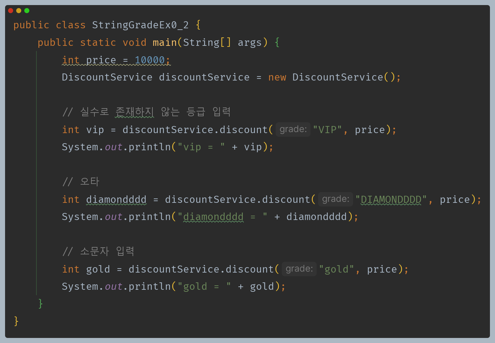

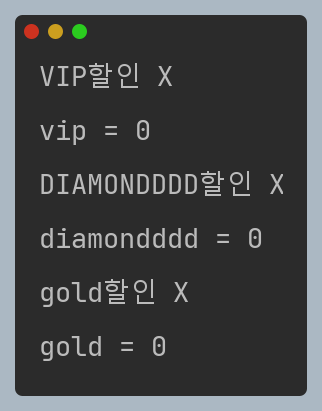

- 등급에 문자열을 사용하는 방식은 여러 문제가 있다.
  - **타입 안전성 부족** : 문자열은 오타가 발생하기 쉽고, 유효하지 않은 값이 입력될 수 있다.
  - **데이터 일관성** : `GOLD`, `Gold`, `gold` 등 다양한 형식으로 문자열이 입력될 수 있어 일관성이 떨어진다.
  - 이런 잘못된 값은 문자열이 아닌 다른 타입을 전달하지 않는 이상 컴파일 시에는 감지되지 않고, 런타임시에만 문제가 발견되게 된다.

결국 `String` 타입만으로는 문제를 해결할 수 없다.

**대안으로 문자열 상수를 사용해보자.**

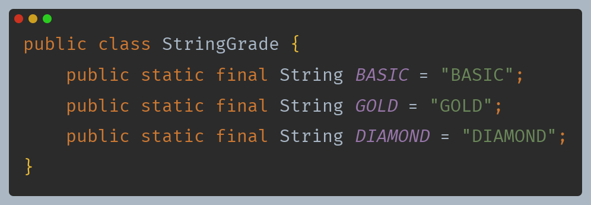

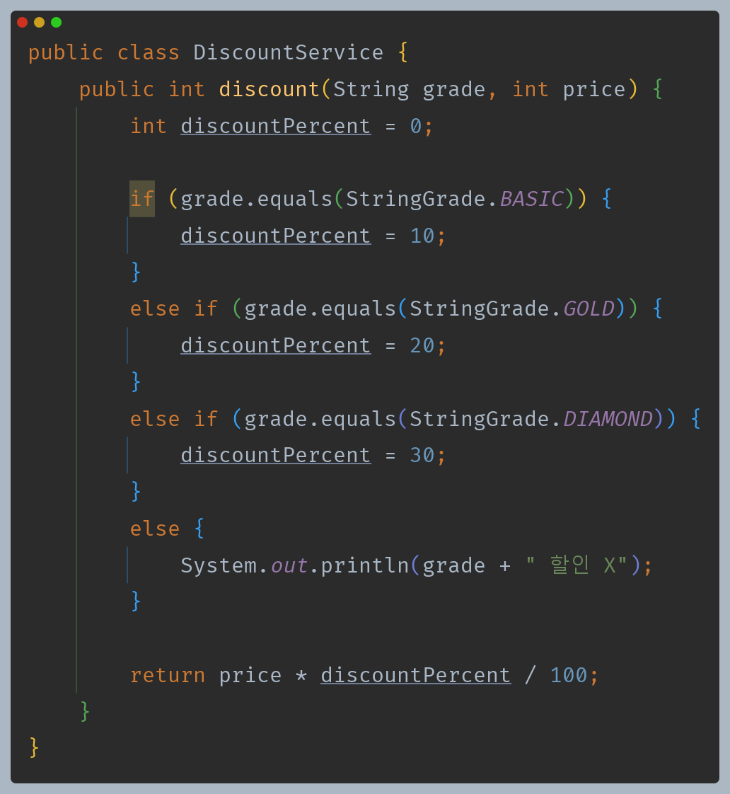

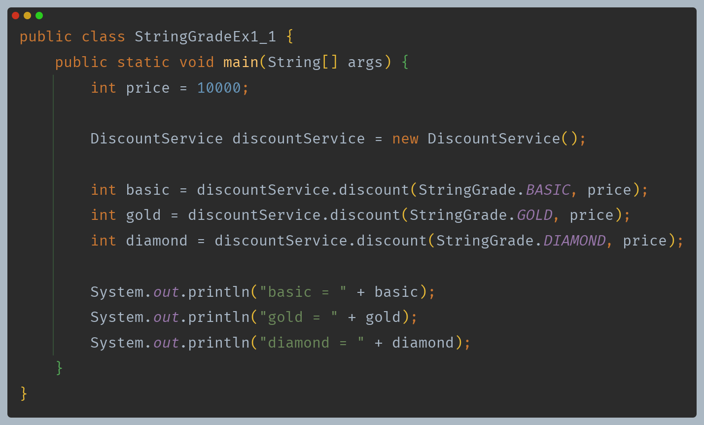

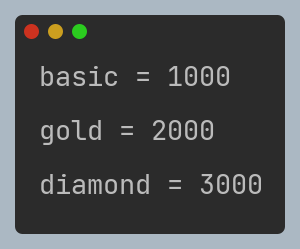

- 문자열 상수를 사용한 덕분에 코드가 명확해졌지만, 근본적으로 문제를 해결할 수는 없다.
- 왜냐하면 서비스 코드에서는 여전히 `String` 타입을 받고 있기 때문에 어떤 문자열이든 입력할 수 있기 때문이다.

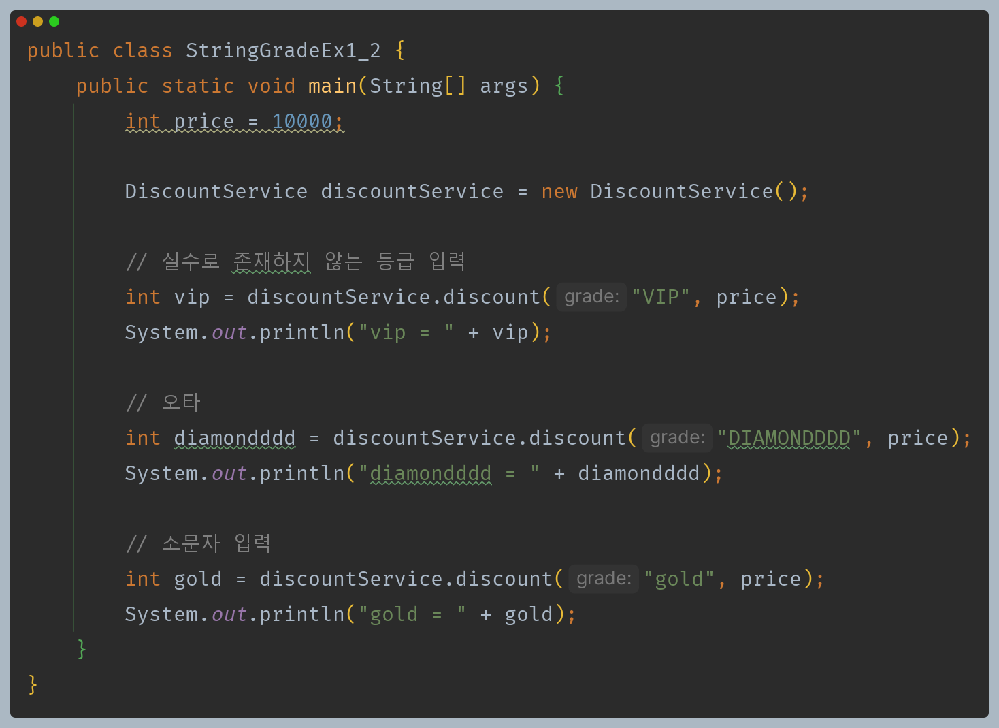

---

## 타입 안전 열거형 패턴

- 위와 같은 문제를 해결하기 위해 나온 것이 **타입 안전 열거형 패턴**이다.
- 타입 안전 열거형 패턴을 사용하면 나열(`enumeration`)한 항목만 사용할 수 있다. 

**타입 안전 열거형 패턴 직접 구현**

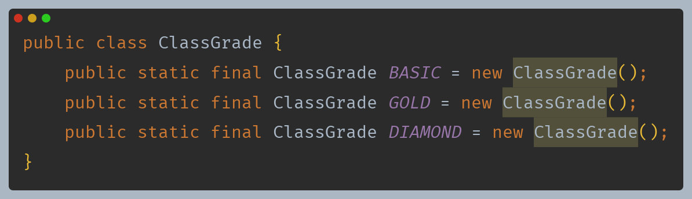

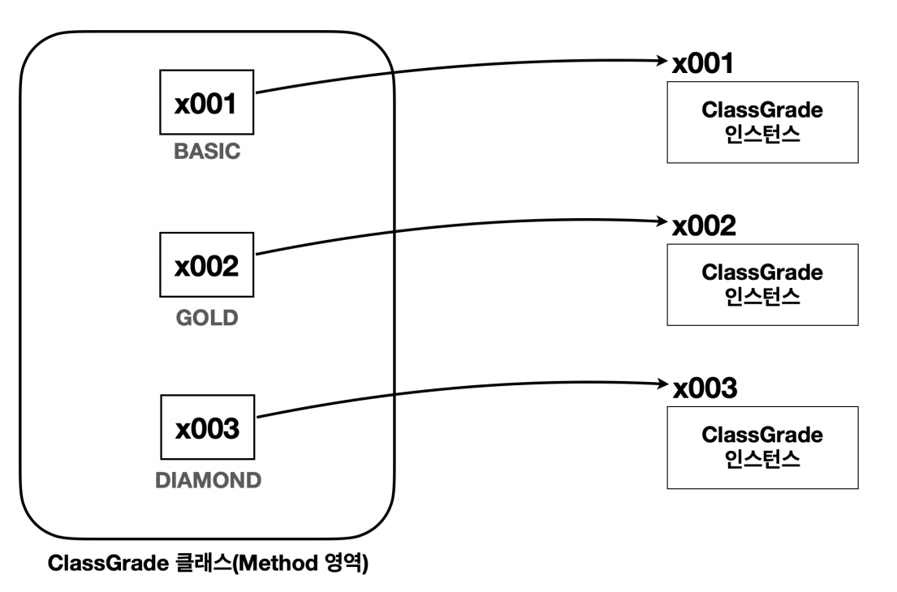

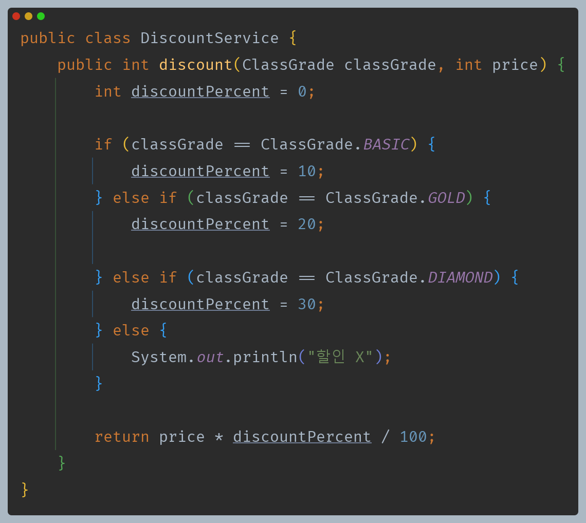

- 이제는 문자열이 아닌 `ClassGrade` 라는 클래스를 받는다.
- 매개변수로 넘어오는 인수도`ClassGrade`가 가진 상수 중에 하나를 사용하기 때문에 참조값 비교(`==`)를 사용할 수 있다.

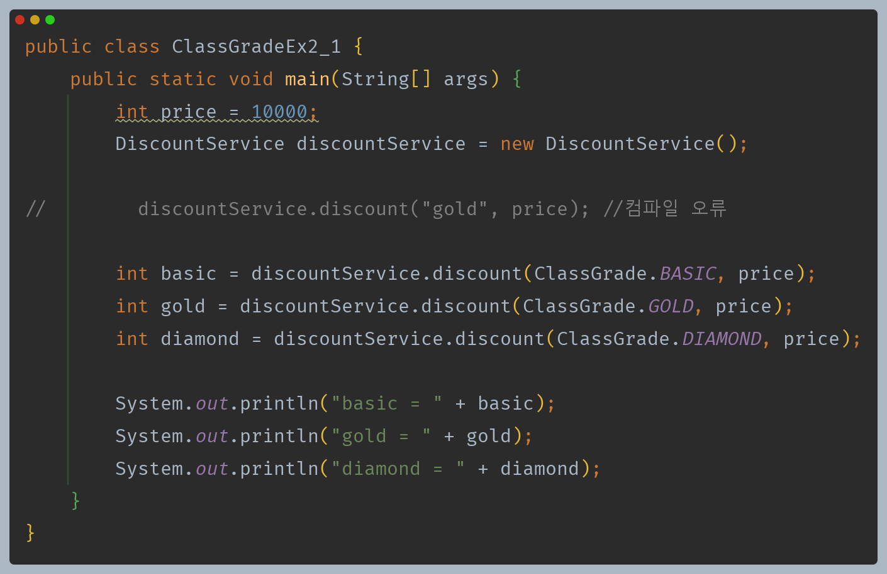

- 그런데 아래와 같이 `ClassGrade` 자체를 전달 가능하기 때문에 아무런 관계 없는 인자를 전달할 수도 있게 된다.
- 따라서 외부에서 생성할 수 없도록 기본 생성자를 `private`으로 막아야 한다.

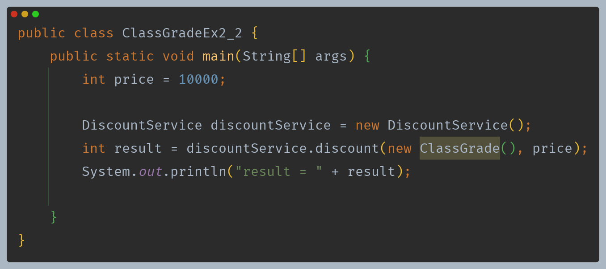

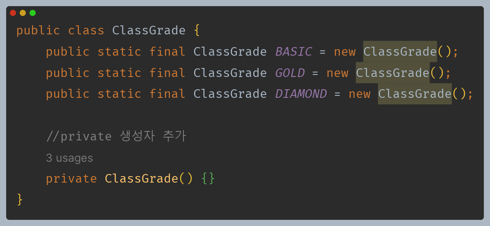

- `private` 생성자를 사용해서 외부에서 `ClassGrade`를 임의로 생성하지 못하게 막았다.
- 이제 `ClassGrade` 인스턴스를 사용할 때는 내부에 정의한 상수를 사용해야 한다.
- 즉 `ClassGrade` 타입에 값을 전달할 때는 열거한 `BASIC`, `GOLD`, `DIAMOND` 타입만 사용할 수 있다.

**타입 안전 열거형 패턴 장점**
- **타입 안전성 향상** : 정해진 객체만 사용할 수 있기 때문에 잘못된 값을 입력하는 문제를 근본적으로 방지할 수 있다.
- **데이터 일관성** : 정채진 객체만 사용하므로 데이터의 일관성이 보장된다.

하지만 이 패턴을 구현하기 위해서 `ClassGrade` 와 같이 많은 코드를 작성해야 하고, `private` 생성자를 추가해야 하는 등 유의해야 하는 부분들도 있다는 단점이 있다.

자바는 이런 타입 안전 열거형 패턴을 편리하게 사용할 수 있는 **열거형(Enum Type)** 을 제공한다.

---

[메인 ⏫](https://github.com/genesis12345678/TIL/blob/main/Java/mid_1/Main.md)

[다음 ↪️ - 자바(ENUM) - 열거형(Enum Type)]()