# 자바 - 예외 처리

## 예외 처리가 필요한 이유

- 예외 처리가 필요한 이유를 알아보기 위해 사용자의 입력을 받고, 입력 받은 문자를 외부 서버에 전송하는 간단한 예제 프로그램을 만들어보자.

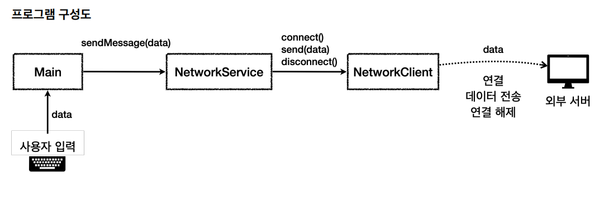

- `NetworkClient`
    - 외부 서버와 연결하고, 데이터를 전송하고, 연결을 종료하는 기능을 제공
    - 사용법
    - `connect()`를 먼저 호출해서 서버와 연결
    - `send(data)`로 연결된 서버에 메시지 전송
    - `disconnect()`로 연결 해제
  - 주의 사항
      - `connect()`가 실패한 경우 `send()`를 호출하면 안 된다.
      - 사용 후에는 반드시 `disconnect()`를 호출해서 연결을 해제해야 한다.
      - `connect()`, `send()` 호출에 오류가 있어도 `disconnect()`는 반드시 호출해야 한다.

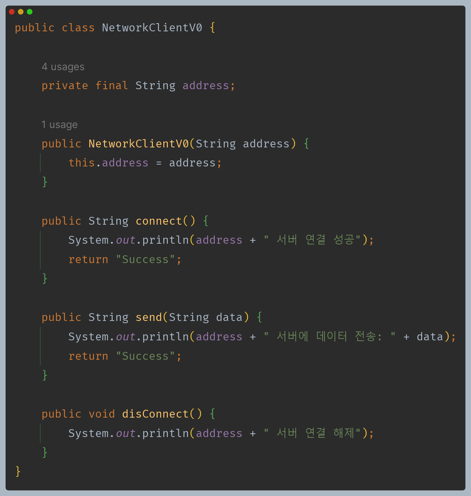

- `NetworkService`
  - `NetworkClient`를 사용해서 데이터를 전송한다. `NetworkClient`를 사용하려면 연결, 전송, 종료와 같은 복잡한 흐름 제어를
    `NetworkService`가 담당한다.

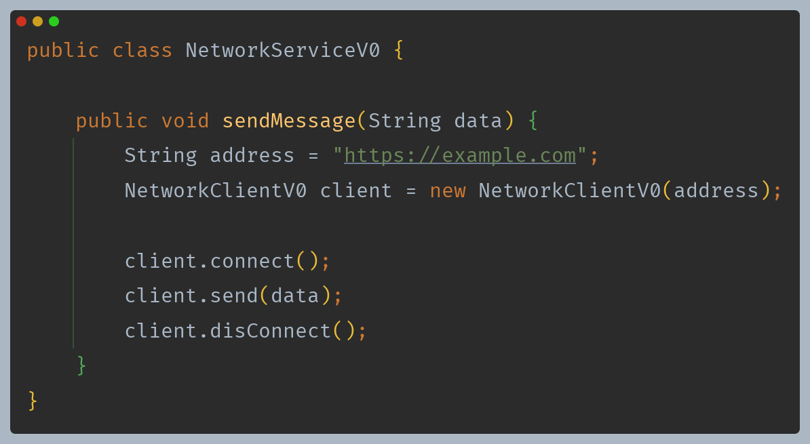

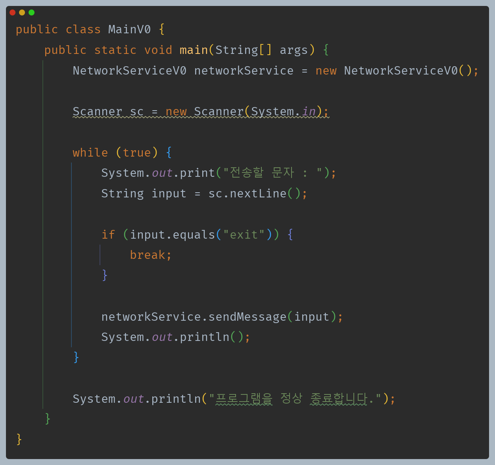

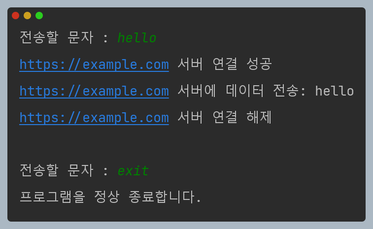

---

**이제는 오류 상황을 한번 만들어보자.**

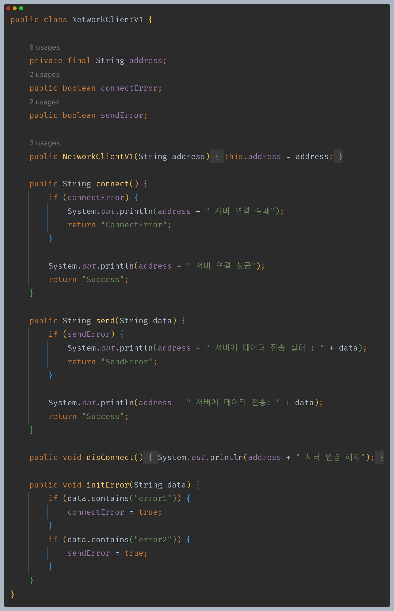

- 사용자의 입력에 따라 연결 실패 또는 데이터 전송 실패를 발생시킨다.

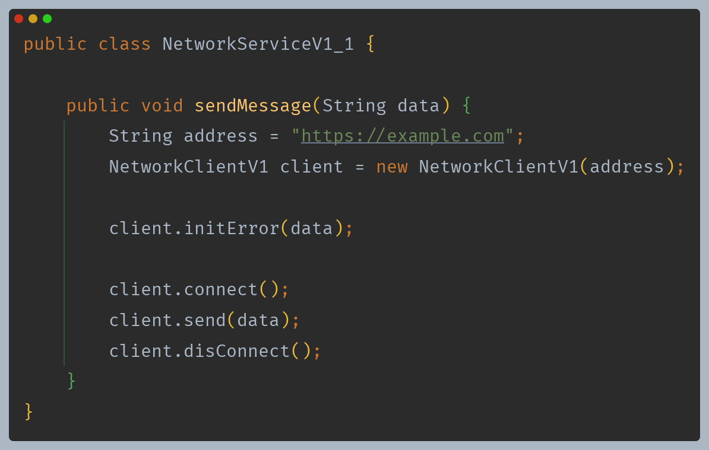

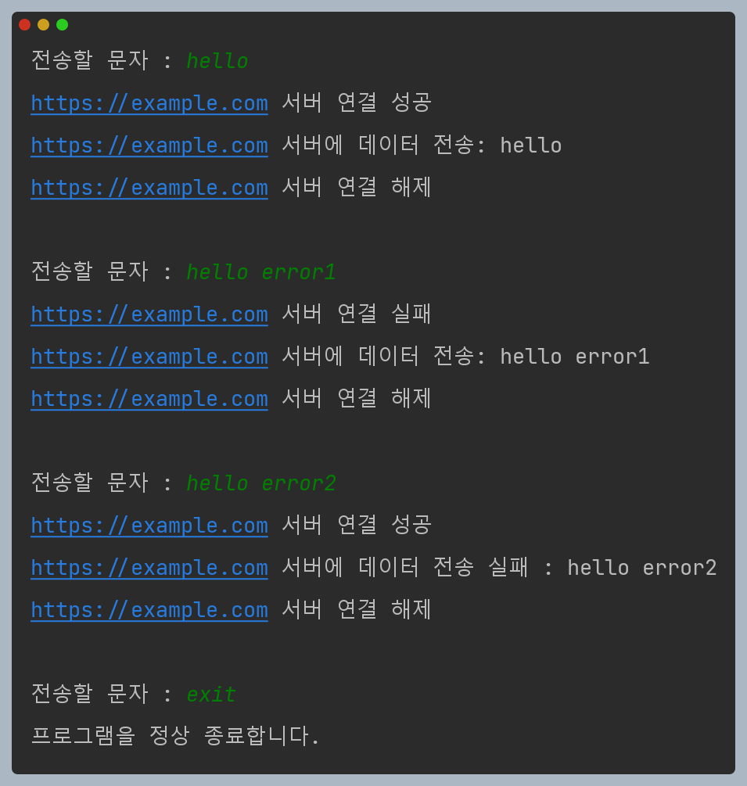

---

**연결이 실패하면 데이터를 전송하지 않아야 하고, 오류가 발생했을 때 어떤 오류가 발생했는지 오류 로그나 남도록 리팩토링 해보자.**

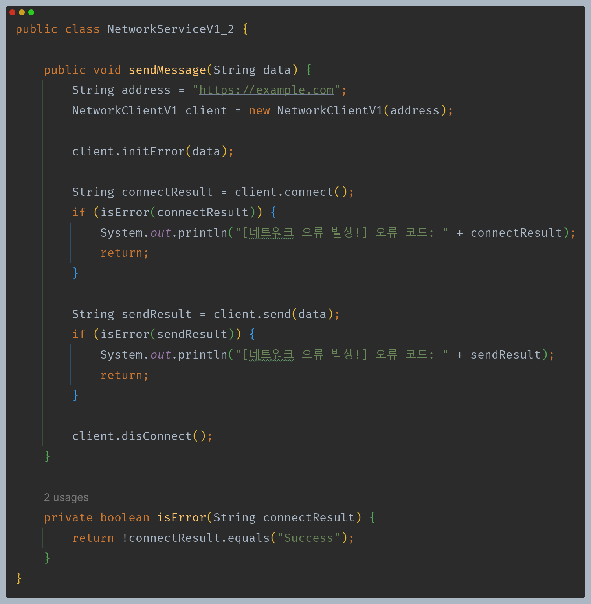

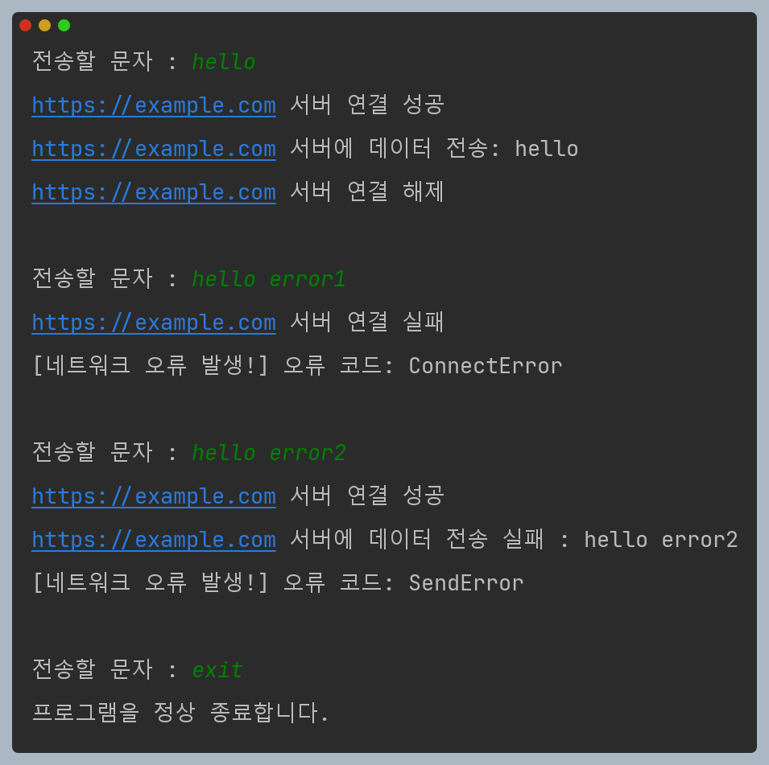

- `connect()`가 실패한 경우 `send()`를 호출하지 않는다.
- 하지만 사용 후에는 `disconnect()`를 반드시 호출해야 하는데, 그렇지 못하고 있다.
- 자바의 경우 GC가 있기 때문에 JVM 메모리에 있는 인스턴스는 자동으로 해체할 수 있다.
- 하지만 외부 연결과 같은 자바 외부의 자원은 자동으로 해제가 되지 않기 때문에 외부 자원을 사용한 후에는 연결을 해제해서
  외부 자원을 반드시 반납해야 한다.

---

**그러면 이번에는 `disconnect()`를 반드시 호출하도록 해보자.**

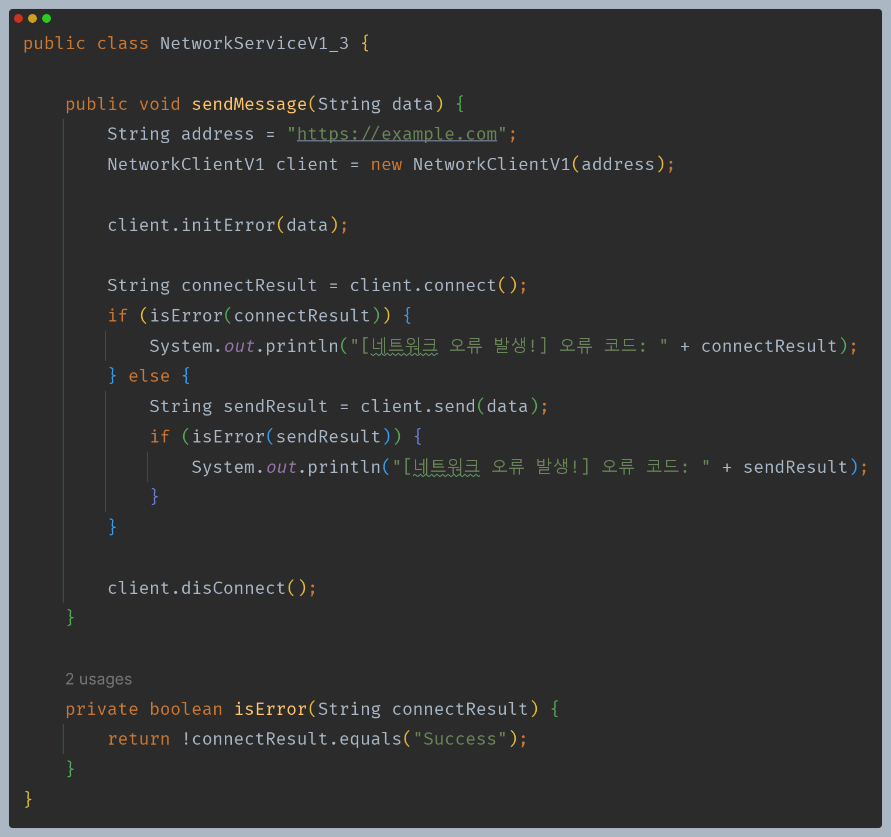

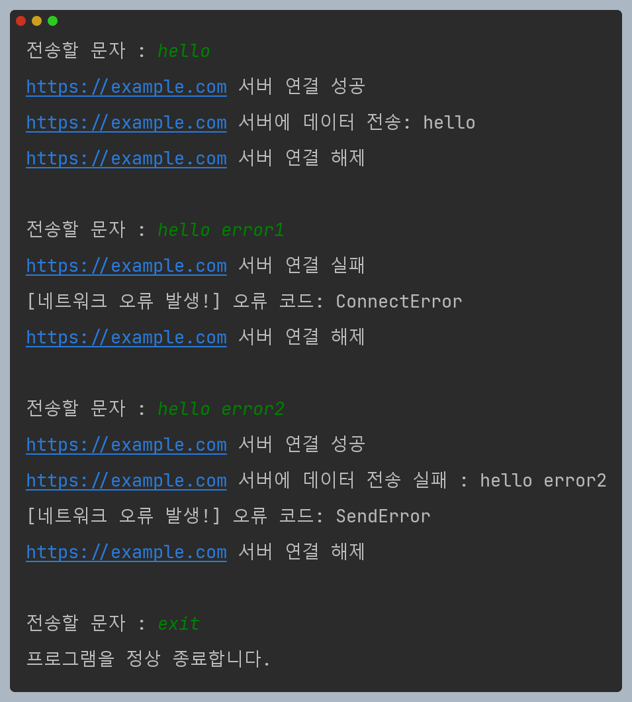

- `connect()`가 실패한 경우 `send()`를 호출하지도 않고, 사용 후에 반드시 `disconnect()`를 호출해서 연결을 해제하도록 했다.

**하지만 코드를 대충 봐도 정상 흐름과 예외 흐름이 전혀 분리되어 있지 않아 이해하기가 너무 어렵고, 심지어 예외 흐름을 처리하는 부분이 더 많다.**

지금과 같이 반환 값을 사용해서 예외 상황을 처리하는 방식은 정상 흐름과 예외 흐름을 분리하기는 어렵다.

이런 문제를 해결하기 위해 예외 처리 메커니즘이 존재한다.

---

[메인 ⏫](https://github.com/genesis12345678/TIL/blob/main/Java/mid_1/Main.md)

[다음 ↪️ - 자바(예외 처리) - 예외 계층 및 예외 기본 규칙](https://github.com/genesis12345678/TIL/blob/main/Spring/database_1/javaException/javaException.md#%EC%9E%90%EB%B0%94-%EC%98%88%EC%99%B8)