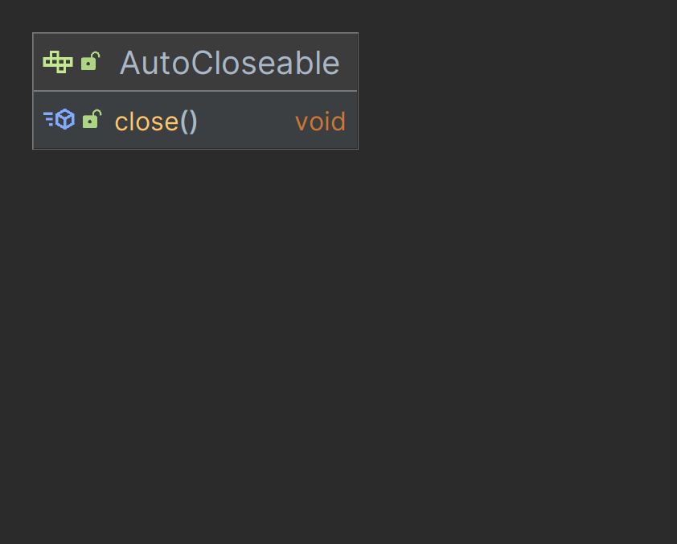
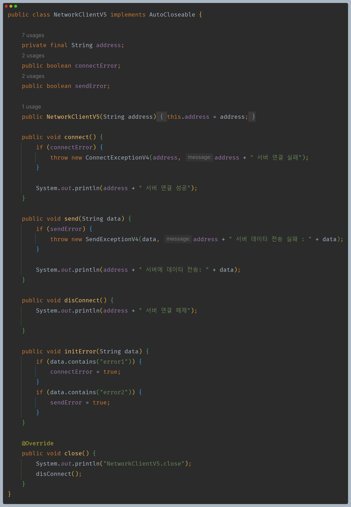
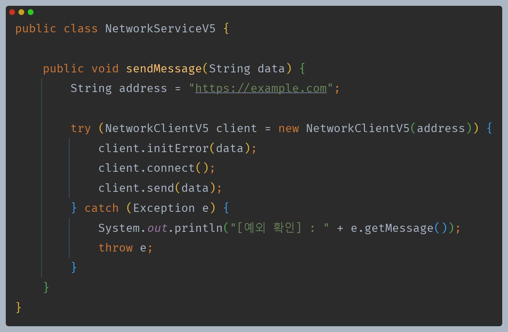
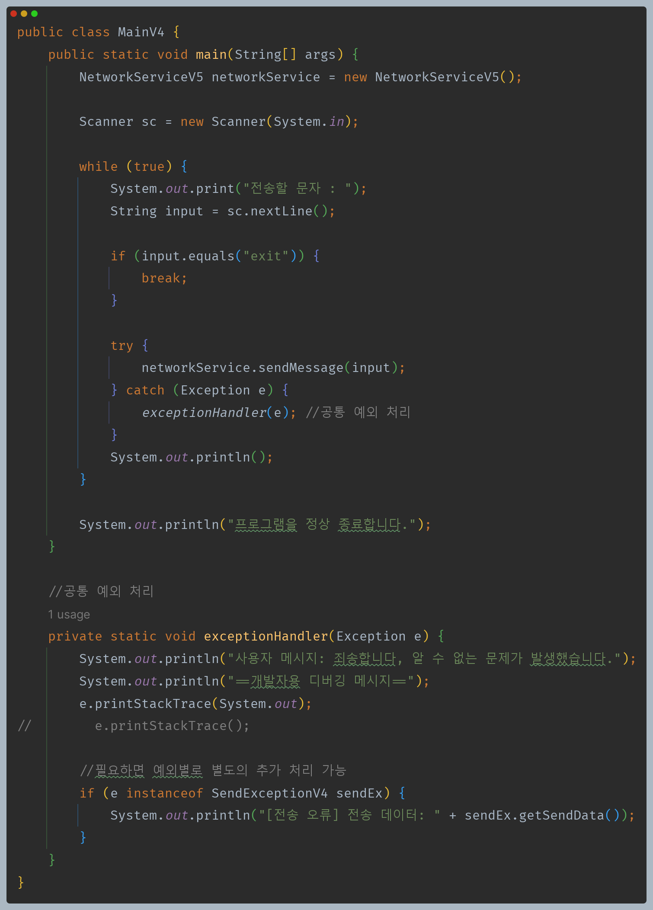
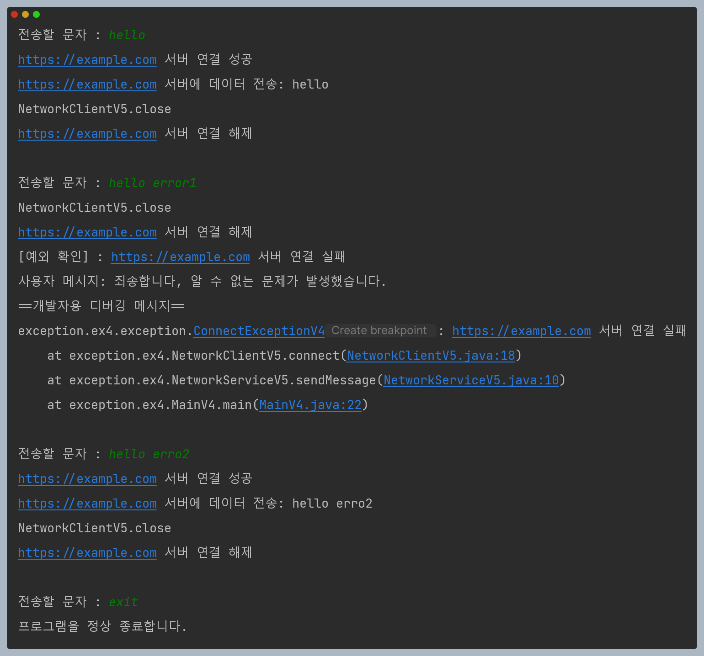

# 자바 - 예외 처리

## try-with-resources

- `try-catch-finally`를 통해 `try`가 끝나면 외부 자원을 반납하는 패턴이 반복되면서 자바 7부터 편의 기능을 도입했다.
- 이름 그대로 `try`에서 자원을 함께 사용한다는 뜻이다.
- 이 기능을 사용하려면 `AutoCloseable` 인터페이스를 구현해야 한다.
- 이 인터페이스를 구현하면 `try-with-resources`를 사용할 때 `try`가 끝나는 시점에 `close()`가 자동으로 호출된다.

- 종료 시점에 자원을 반납하는 방법을 `close()` 메서드에 재정의 하면 된다. 참고로 이 메서드에서 예외를 던지지는 않는다.

- `try-with-resources` 구문은 `try` 괄호 안에 사용할 자원을 명시한다.
- 이 자원은 `try` 블럭이 끝나면 자동으로 `close()`를 호출해서 자원을 해제한다.

- **try with resources 장점**
  - **리소스 누수 방지**
    - 모든 리소스가 제대로 닫히도록 보장한다. `finally`는 자원 해제 코드를 누락할 수도 있는 문제들을 예방할 수 있다.
  - **코드 간결성 및 가독성**
    - 명시적인 `close()` 호출이 필요 없다.
  - **스코프 범위 한정**
    - 리소스 변수의 스코프가 `try` 블럭 안으로 한정되기 때문에 유지보수가 더 쉬워진다.
  - **조금 더 빠른 자원 해제**
    - `try-catch-finally`는 `catch` 이후에 자원을 반납했지만, `try-with-resources`는 `try` 블럭이 끝나는 즉시 `close()`를 호출한다.

---

[이전 ↩️ - 자바(예외 처리) - 실무 예외 처리 방안](https://github.com/genesis12345678/TIL/blob/main/Java/mid_1/Exception/%EB%B0%A9%EC%95%88.md)

[메인 ⏫](https://github.com/genesis12345678/TIL/blob/main/Java/mid_1/Main.md)