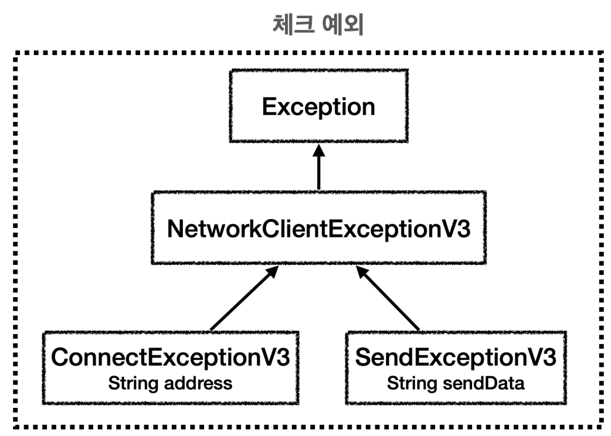
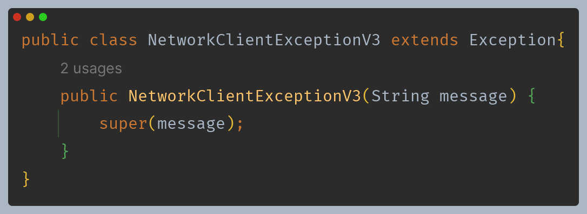
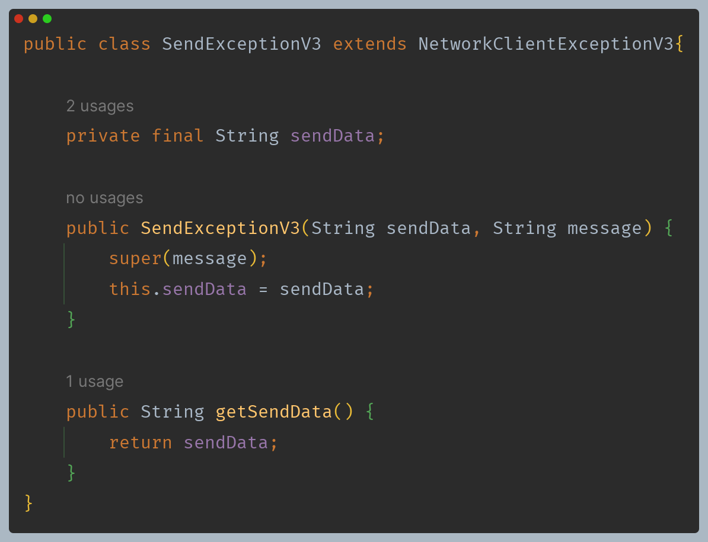
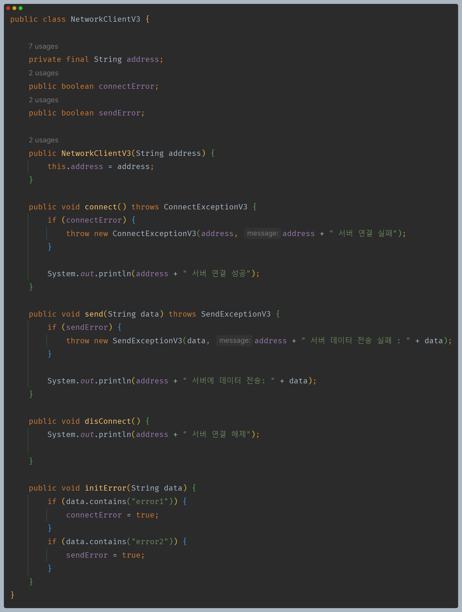
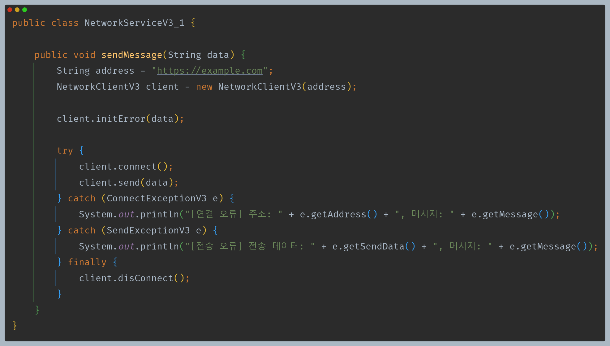
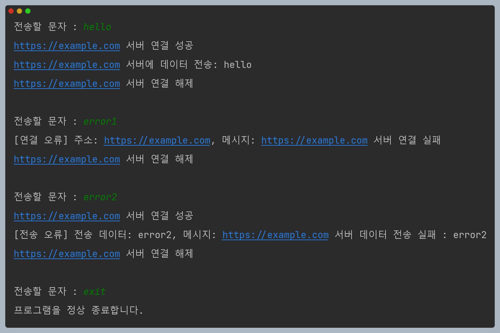
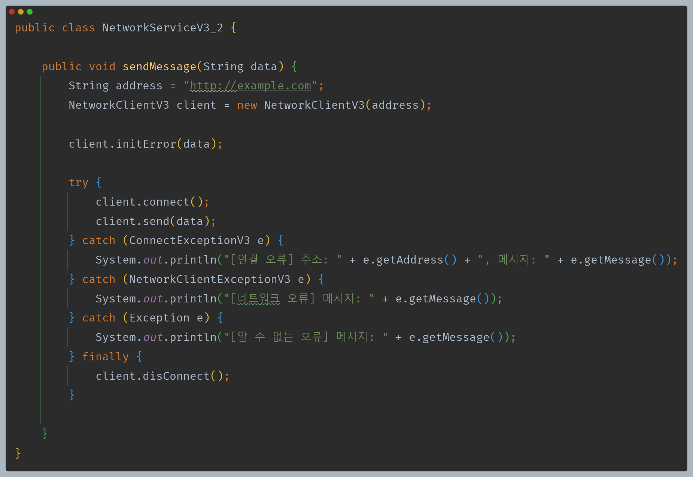
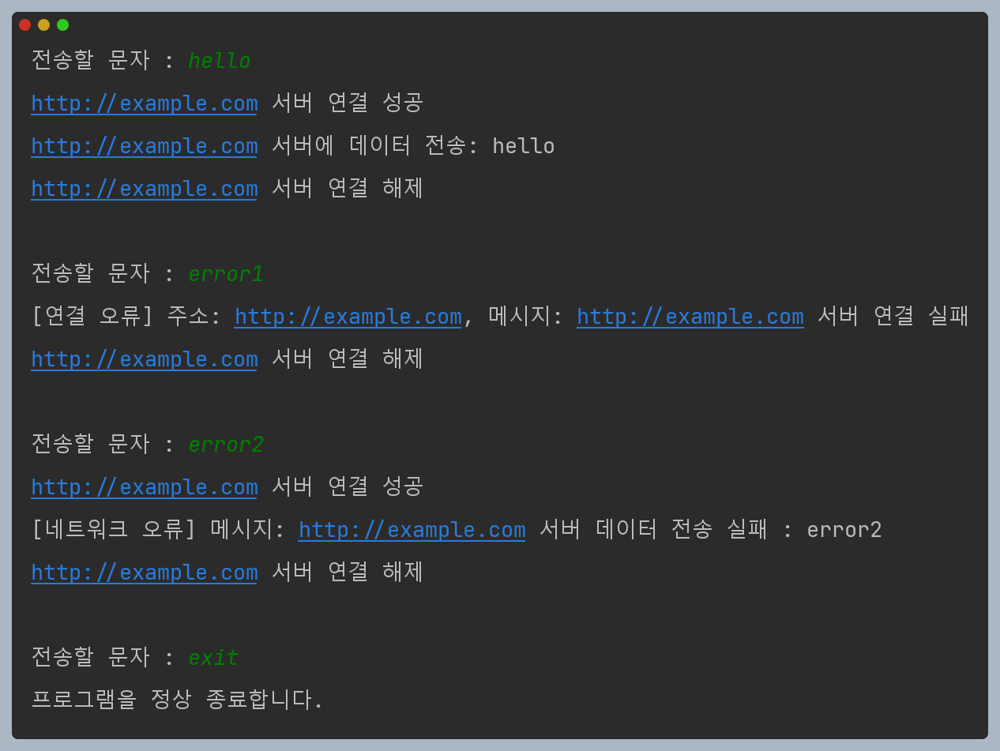

# 자바 - 예외 처리

## 예외 계층 활용

- 예외를 단순히 오류 코드로 분류하는 것이 아니라, 예외를 계층화해서 다양하게 만들면 더 세밀하게 예외를 처리할 수 있다.

- 이렇게 예외를 계층화하면 다음과 같은 장점이 있다.
  - 자바에서 예외도 객체이기 때문에 부모 예외를 잡거나 던지면 자식 예외도 함께 잡거나 던질 수 있다.
  - 특정 예외를 잡아서 처리하고 싶으면 하위 예외를 잡아서 처리하면 된다.

이제는 오류 코드로 어떤 문제가 발생했는지 이해하는 것이 아니라 예외 그 자체로 어떤 오류가 발생했는지 알 수 있다.

- 예외 클래스를 각각의 예외 상황에 맞추어 만들면, 각 필요에 맞는 예외를 잡아서 처리할 수 있다.
- 또한 각각의 예외 클래스가 가지는 고유의 기능을 활용할 수 있다.

---

**이번에는 예외를 잡아서 처리할 때 예외 계층을 활용해보자.**

- 연결 오류는 중요한 예외라 가정하고 `catch`에서 잡고, 나머지는 부모 예외로 잡아서 처리하도록 했다.
- 그 외 알 수 없는 오류도 따로 처리했다.

주의할 점은 예외가 발생했을 때 `catch` 를 순서대로 실행하므로, 더 디테일한 자식을 먼저 잡아야 한다.

**이렇게 예외를 계층화하고 다양하게 만들면 세밀한 동작들을 깔끔하게 처리할 수 있다. 그리고 특정 분류의
공통 예외들도 한번에 `catch`로 잡아서 처리할 수 있다.**

---

[이전 ↩️ - 자바(예외 처리) - 예외 처리 도입](https://github.com/genesis12345678/TIL/blob/main/Java/mid_1/Exception/%EB%8F%84%EC%9E%85.md)

[메인 ⏫](https://github.com/genesis12345678/TIL/blob/main/Java/mid_1/Main.md)

[다음 ↪️ - 자바(예외 처리) - 실무 예외 처리 방안](https://github.com/genesis12345678/TIL/blob/main/Java/mid_1/Exception/%EB%B0%A9%EC%95%88.md)