# 자바 - 예외 처리

## 예외 처리 도입

**이전에 정상 흐름과 예외 흐름이 섞여 있는 코드를 자바 예외 처리를 도입하여 해결해보자.**

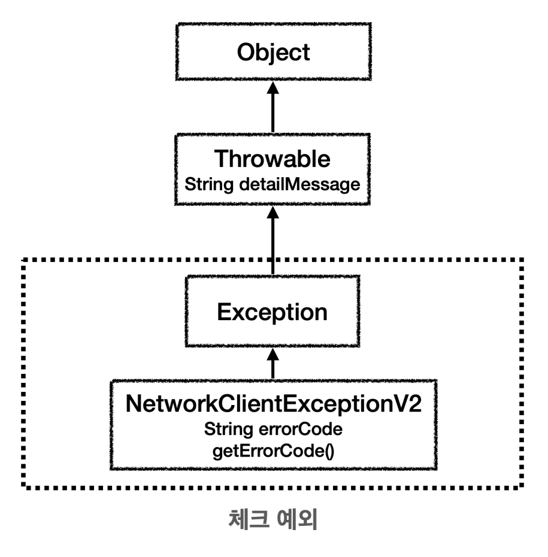

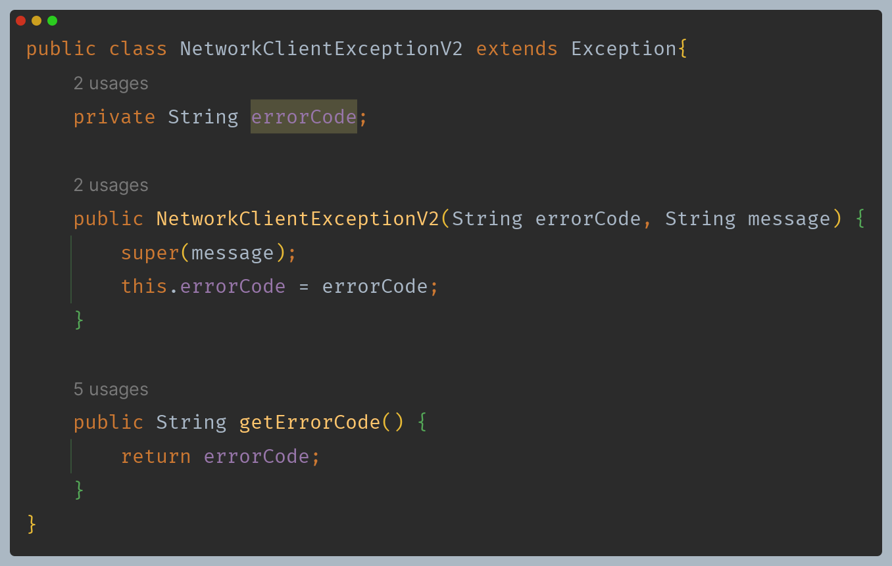

- 예외도 객체이므로 필요한 필드와 메서드를 가질 수 있다.

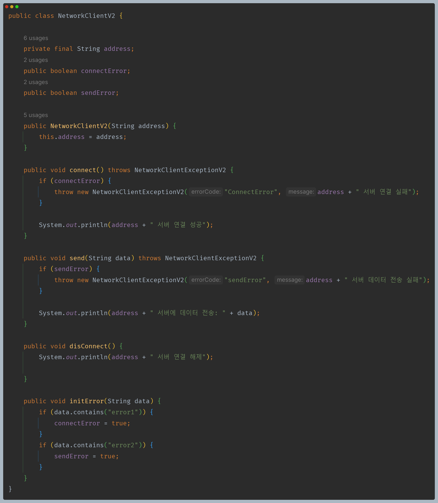

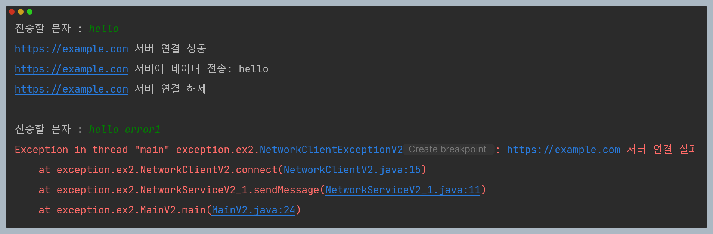

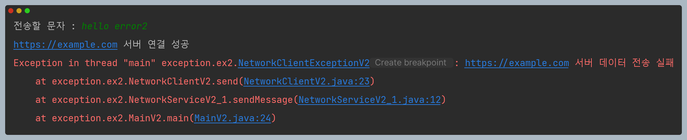

- 모든 곳에서 발생한 예외를 잡지 않았기 때문에 `main()` 밖으로 예외가 던져지게 되기 때문에 예외 메시지와
    예외를 추적할 수 있는 스택 트레이스를 출력하고 프로그램을 종료한다.

---

**예외 처리를 도입했지만, 아직 예외가 복구되지 않는다. 따라서 예외가 발생하면 프로그램이 종료된다. 사용 후에 반드시
`disconnect()`를 호출해서 연결을 해제해야 한다.**

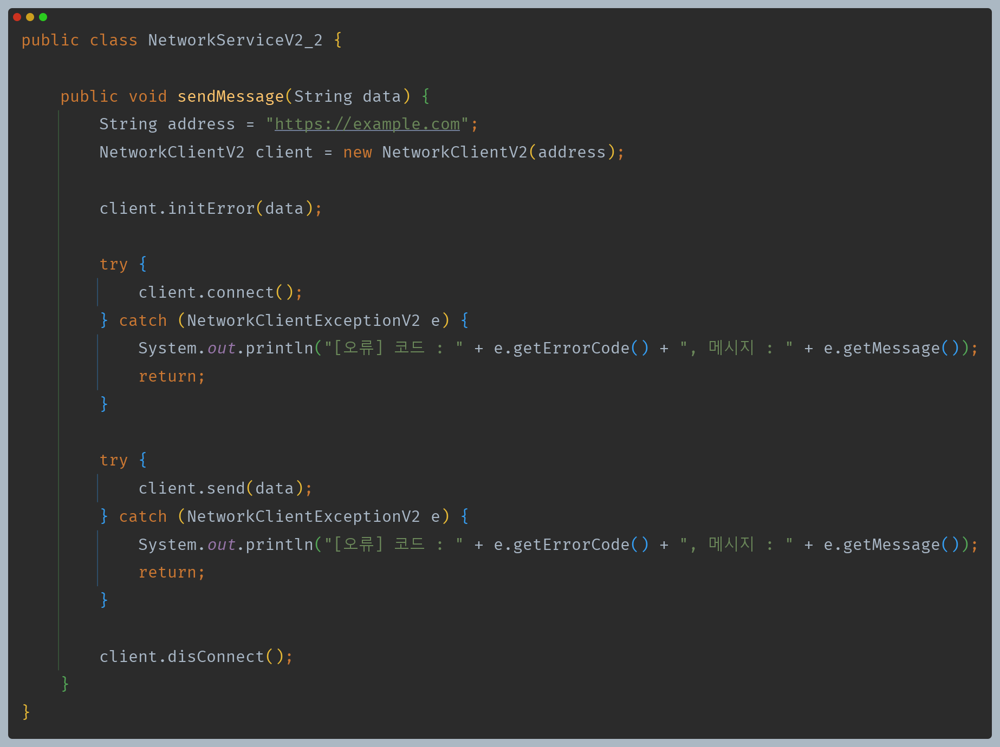

---

**예외를 잡아서 처리해 예외가 복구 되고, 프로그램도 계속 수행할 수 있다. 하지만 정상 흐름과 예외 흐름이 섞여 있어 코드를 읽기 어렵고,
사용 후에 `disconnect()`도 호출하지 못하고 있다.**

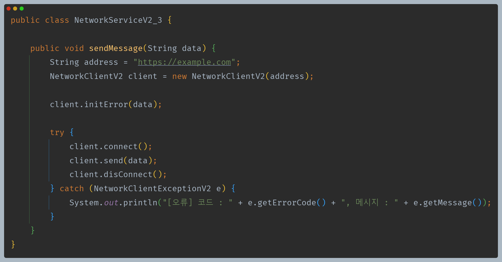

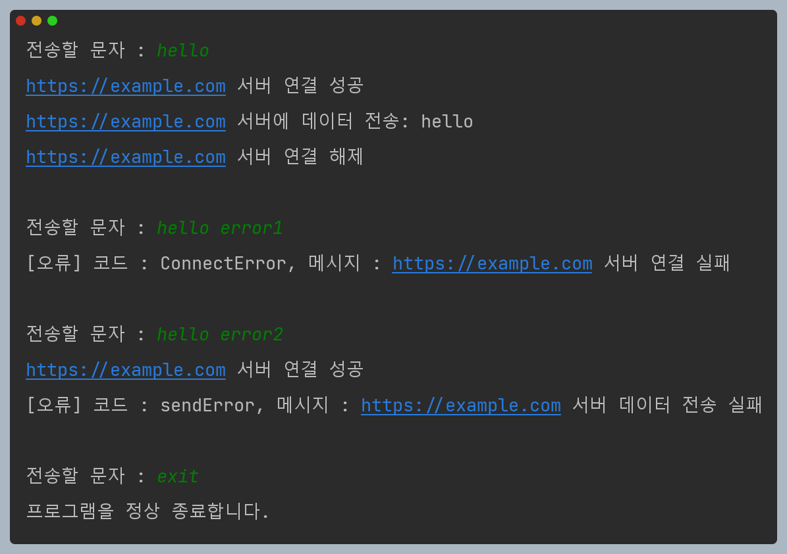

---

**정상 흐름과 예외 흐름을 명확하게 분리해서 코드를 더 쉽게 읽을 수 있게 되었다. 하지만 여전히 
사용 후에 `disconnect()`를 호출하지 못하고 있다.**

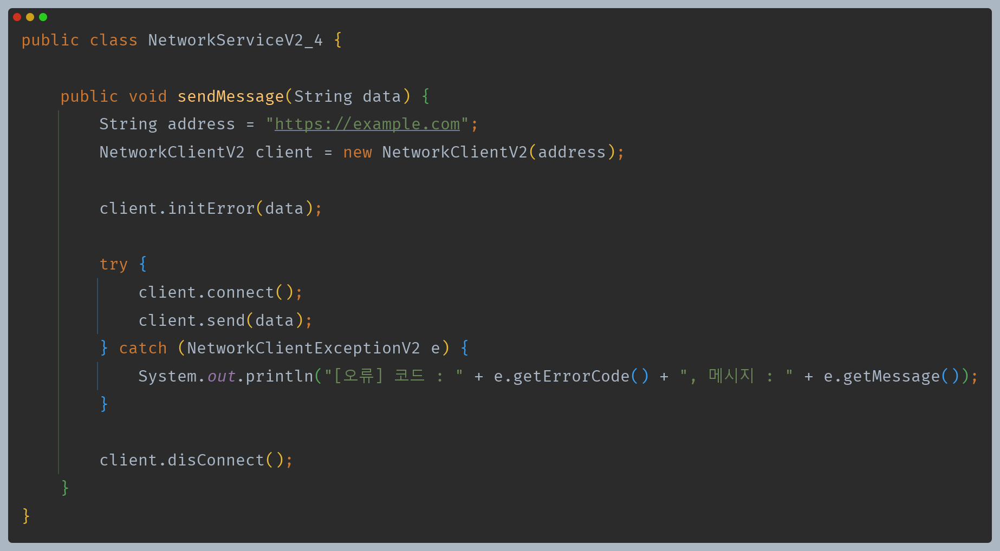

이런 식으로 만들면 될까?

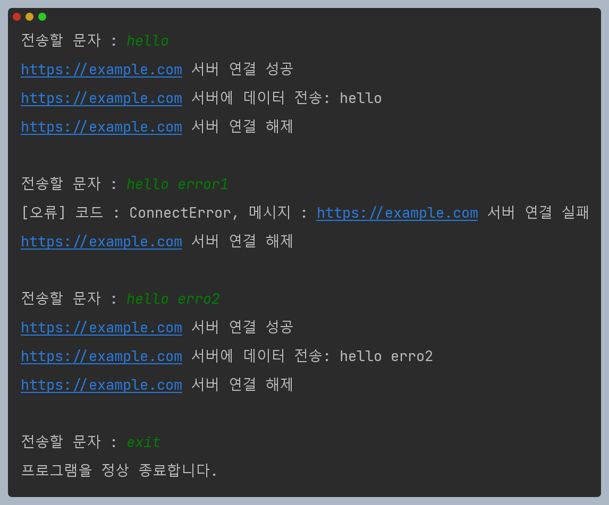

오류가 발생해도 서버 연결 해제에 성공하는 것을 확인할 수 있다.

**하지만 문제는 `catch`에서 잡을 수 없는 예외가 발생할 때이다.**

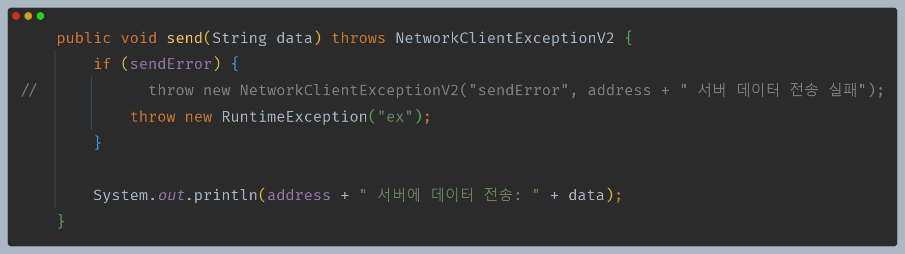

예를 들어 `catch`에서 잡지 않는 다른 예외가 발생했다고 해보자.

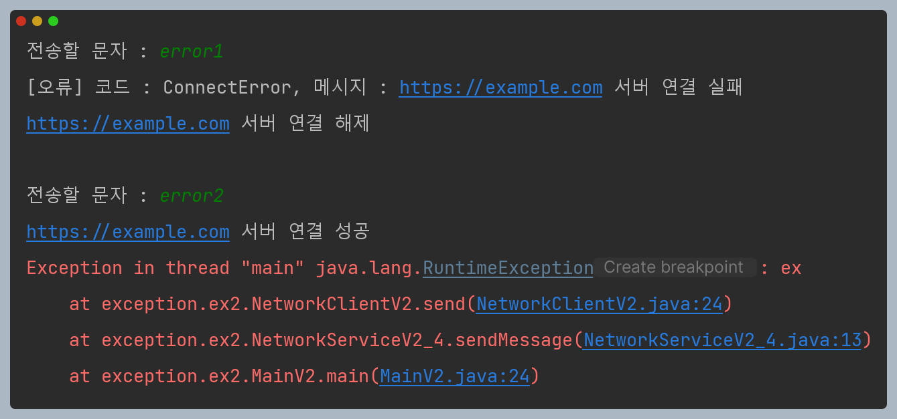

`RuntimeException`은 `catch`에서 처리하지 않기 때문에 예외가 그대로 `main()`까지 전달될 것이다.

정상적인 상황, 예외 상황 그리고 어디선가 모르는 예외를 밖으로 던지는 상황까지 모든 것을 고려해야 하기 때문에 `disconnect()` 같은
자원 해제를 보장하는 것은 쉽지 않다.

---

**자바는 어떤 경우라도 반드시 호출되는 `finally` 기능을 제공한다.**

- `try ~ catch ~ finally` 구조는 정상 흐름, 예외 흐름, 마무리 흐름을 제공한다.
- `try`를 시작하기만 하면, `finally` 코드 블럭은 어떤 경우라도 반드시 호출된다.
- `try`, `catch` 안에서 잡을 수 없는 예외가 발생해도 `finally`는 반드시 호출된다.
- 정상 흐름 -> `finally`
- 예외 흐름 -> `finally`
- 예외 던짐 -> `finally`
  - `finally` 코드 블럭이 끝나고 나서 이후에 예외가 밖으로 던져진다.

`finally` 블럭은 주로 `try`에서 사용한 자원을 해체할 때 사용한다.

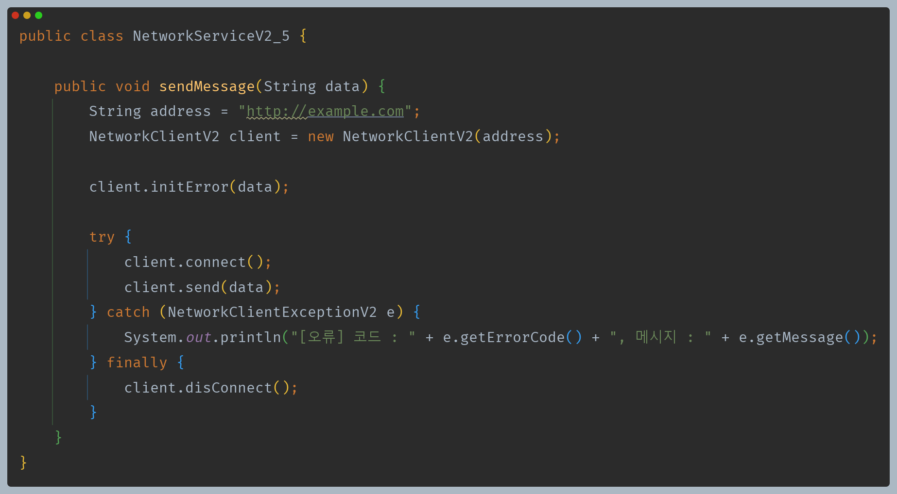

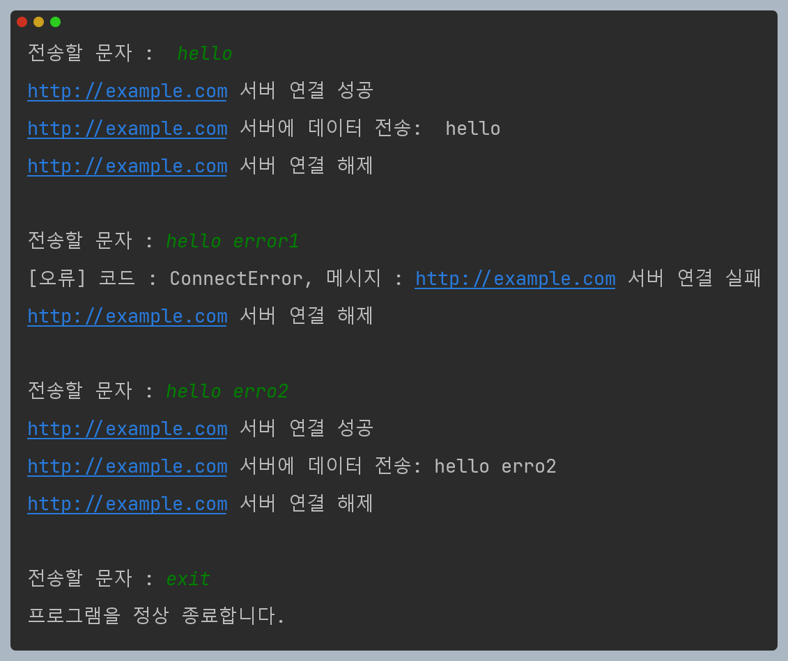

다음과 같이 `catch`에서 잡을 수 없는 예외를 던져도 `finally`는 항상 동작한다.

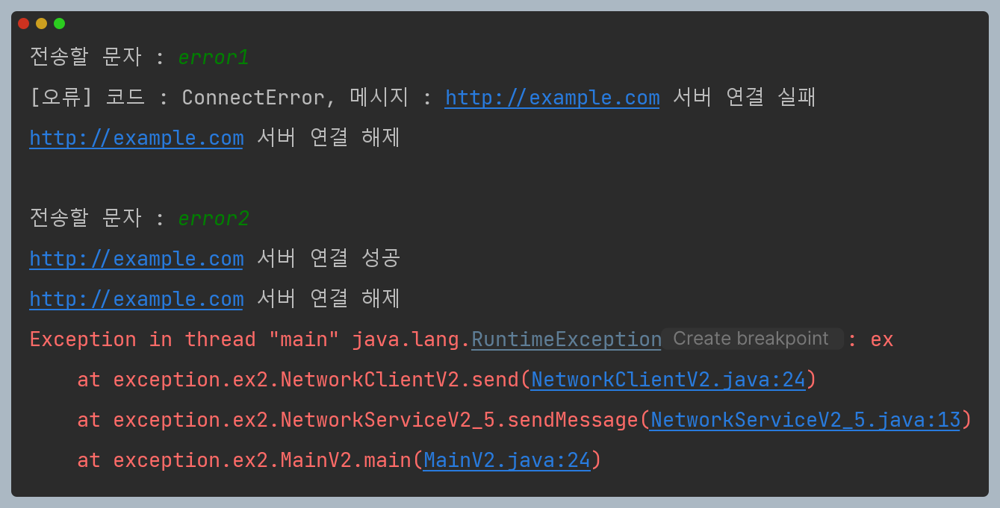

`finally`를 먼저 호출하고 나서 예외를 밖으로 던진다.

`try ~ finally` 구조도 가능하다.

**`try ~ catch ~ finally` 구조를 사용하여 정상 흐름과 예외 흐름을 명확하게 분리해서 코드를 읽기 쉽게 만들었고,
사용한 자원을 항상 반환할 수 있게 보장하도록 할 수 있다.**

---

[이전 ↩️ - 자바(예외 처리) - 예외 계층 및 예외 기본 규칙](https://github.com/genesis12345678/TIL/blob/main/Spring/database_1/javaException/javaException.md#%EC%9E%90%EB%B0%94-%EC%98%88%EC%99%B8)

[메인 ⏫](https://github.com/genesis12345678/TIL/blob/main/Java/mid_1/Main.md)

[다음 ↪️ - 자바(예외 처리) - 예외 계층 활용](https://github.com/genesis12345678/TIL/blob/main/Java/mid_1/Exception/%EB%8F%84%EC%9E%85.md)