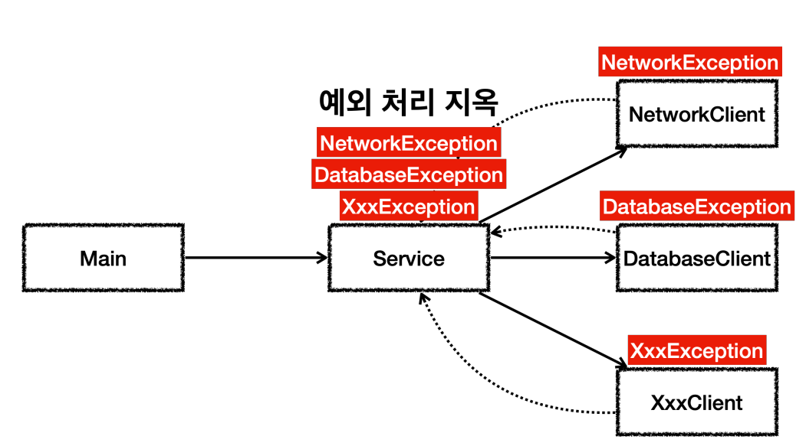
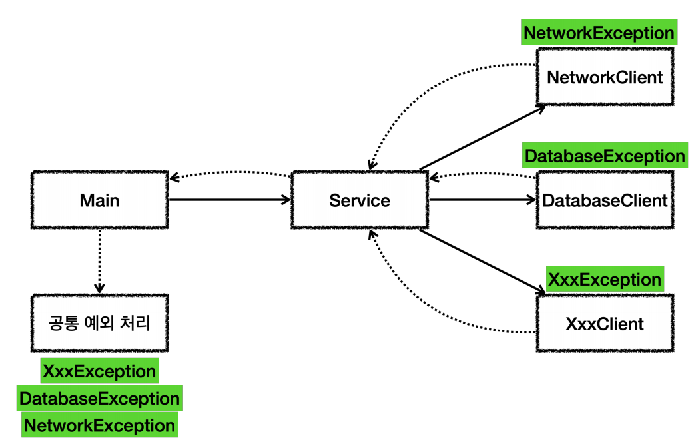
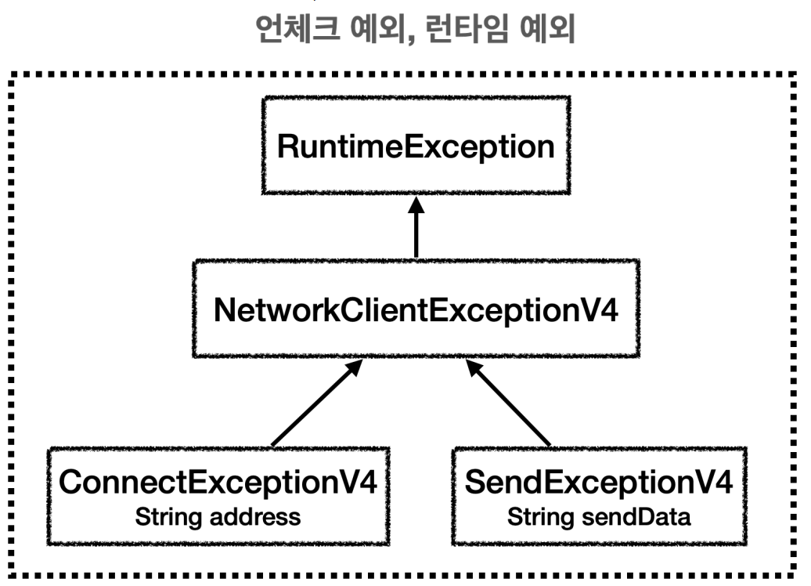
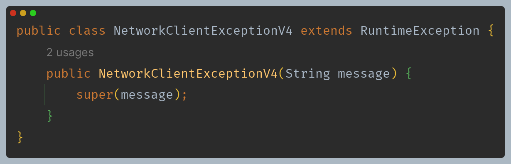
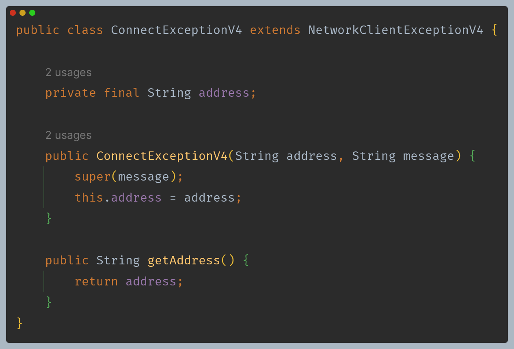
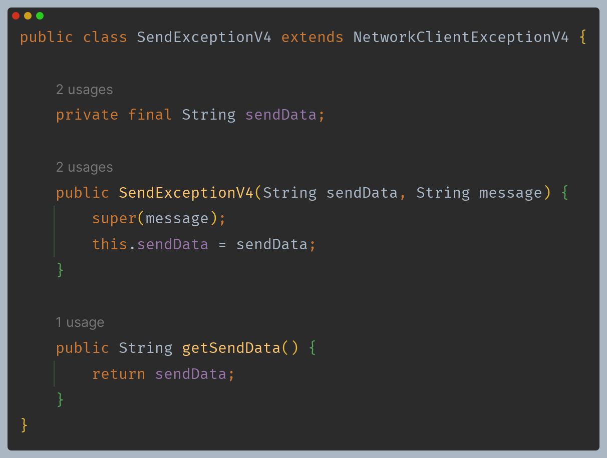
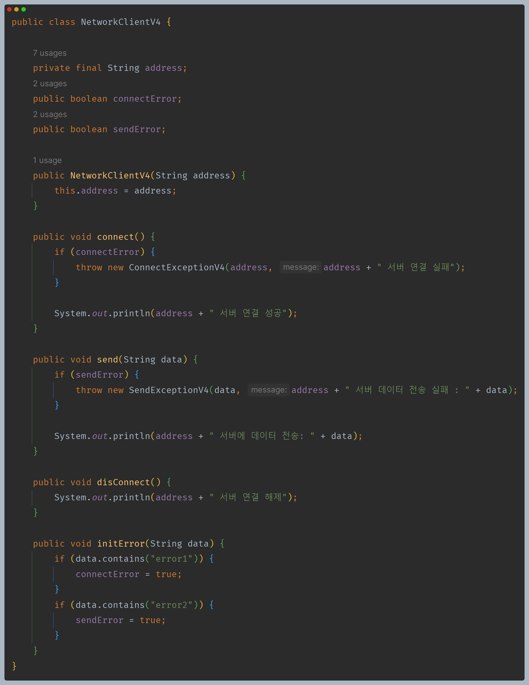
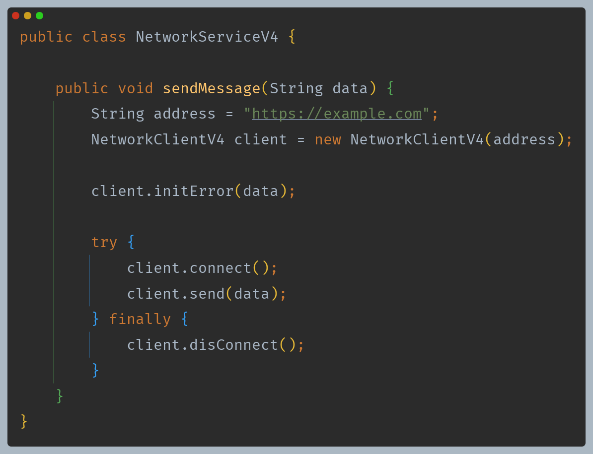
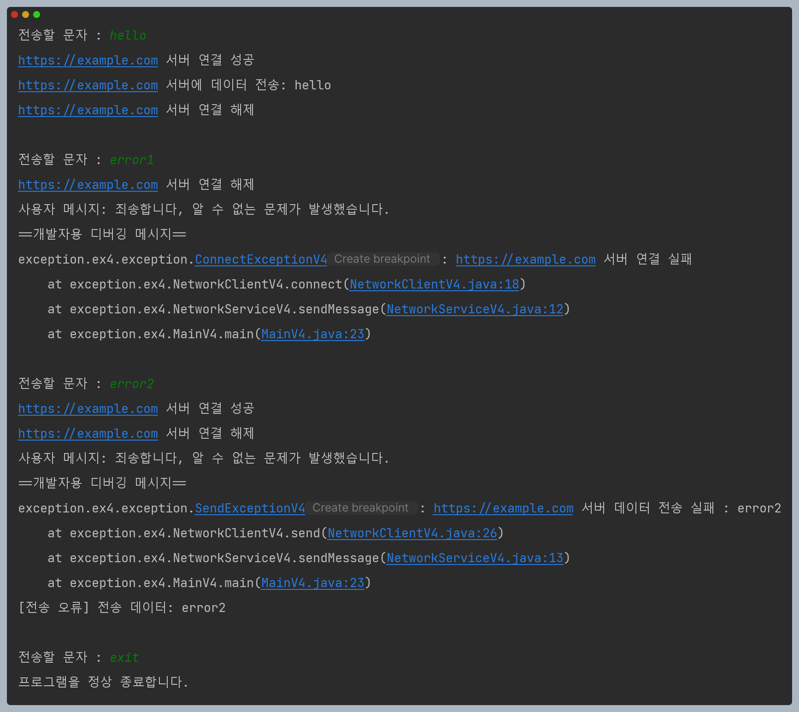

# 자바 - 예외 처리

## 실무 예외 처리 방안

- **처리할 수 없는 예외**
  - 예를 들어 네트워크 서버에 문제가 발생해서 통신이 불가능하거나, 데이터베이스 서버에 문제가 발생해서 접속이 안되면
    애플리케이션에서 연결 오류, 데이터베이스 접속 실패와 같은 예외가 발생한다.
  - 이렇게 시스템 오류 때문에 발생한 예외들은 대부분 예외를 잡아도 해결할 수 있는 것이 없다. 예외를 잡아서 다시 호출을 시도해도 같은 오류가 반복될 뿐이다.
  - 이런 경우 오류 메시지나 오류 페이지를 보여주면 된다. 그리고 개발자가 문제 상황을 빠르게 인지할 수 있도록 오류에 대한 로그를 남겨두어야 한다.
- **체크 예외의 부담**
  - 체크 예외는 개발자가 실수로 놓칠 수 있는 예외들을 컴파일러가 체크해주기 때문에 예전에는 많이 사용되었다.
  - 그런데 처리할 수 없는 예외가 많아지고, 프로그램이 점점 복잡해지면서 체크 예외를 사용하는 것이 부담스러워졌다.

### 체크 예외 사용 시나리오



- `Service`는 호출하는 곳에서 던지는 체크 예외들을 처리하거나 밖으로 던져야 한다.
- 그런데 위에서 설명했듯이 예외를 잡아도 복구할 수 있는 경우가 거의 없다.
- 그래서 어차피 처리할 수 없는 예외들이기 때문에 또 밖으로 던진다.

```java
class Service {
    void sendMessage(String data) throws NetworkException,  DatabaseException, ...{
        ... 
    }
}
```

- 이렇게 모든 체크 예외를 다 밖으로 던져야 한다.
- 그리고 중간에 다른 클래스가 생겨나면 역시 같은 문제가 발생한다.


결국 중간에 모든 클래스에서 예외를 계속 밖으로 던지는 지저분한 코드가 만들어진다.

```java
class Facade {
    void send() throws NetworkException, DatabaseException, ... 
}
class Service {
    void sendMessage(String data) throws NetworkException, DatabaseException, ...
}
```

이러다 결국 다음과 같이 최악의 수를 두게 된다.

```java
class Facade {
    void send() throws Exception {...}
}
class Service {
    void sendMessage(String data) throws Exception {...}
}
```

- **throws Exception의 문제**
  - `Exception`은 최상위 타입이므로 모든 체크 예외를 다 밖으로 던지는 문제가 발생한다.
  - 결과적으로 체크 예외의 최상위 타입을 던지게 되면 다른 체크 예외를 체크할 수 있는 기능이 무효화되고, 중요한 체크 예외를 놓치게 된다.
  - 중간에 중요한 체크 예외가 발생해도 문법상 오류는 없기 때문에 컴파일 오류가 발생하지 않는다.

개발자는 본인이 해결할 수 있는 예외만 잡아서 처리하고, 해결할 수 없는 예외는 신경쓰지 않는 것이 더 나은 선택일 수 있다.

### 언체크 예외 사용 시나리오



- 언체크 예외의 경우 `throws`를 선언하지 않고 무시할 수 있다.
- 또한 일부 언체크 예외를 잡아서 처리할 수 있다면 `catch`로 잡아서 처리하면 된다.

**예외 공통 처리**
- 처리할 수 없는 예외들은 중간에 여러 곳에서 나누어서 처리하기 보다는 예외를 공통으로 처리할 수 있는 곳에서 해결하면 된다.
- 오류 메시지나 오류 페이지를 보여주고, 오류에 대한 로그를 남겨두면 된다.

---

**이제 언체크 예외를 만들고 해결할 수 없는 예외들을 공통으로 처리해보자.**











언체크 예외이기 때문에 `throws` 생략 가능하다.



- 서비스 로직에서는 발생하는 예외들을 잡아서 복구할 수 있는 것이 없기 때문에 예외를 그대로 밖으로 던진다.
- 해결할 수 없는 예외들은 다른 곳에서 공통으로 처리되도록 하면 된다.
- 이런 방식 덕분에 서비스 로직은 깔끔하게 보인 스스로의 코드에 더 집중할 수 있다.


- **exceptionHandler()**
    - 해결할 수 없는 예외가 발생했을 때 사용자가 디테일한 오류 코드나 오류 상황까지 모두 이해할 필요는 없기 때문에 간단한 오류 메시지 정도만 보여주도록 하는 것이 좋다.
    - 개발자는 빨리 문제를 찾고 디버깅 할 수 있도록 오류 메시지를 남겨두어야 한다.
  - 예외도 객체이므로 `instanceof`로 처리할 수 있다.
- **e.printStackTrace()**
    - 예외 메시지와 스택 트레이스를 출력할 수 있다.
    - 이 기능은 예외가 발생한 지점을 역으로 추적할 수 있다.
  - `e.printStackTrace()` : `System.err`이라는 표준 오류에 결과를 출력
  - `e.printStackTrace(System.out)` : 표준 출력



---

[이전 ↩️ - 자바(예외 처리) - 예외 계층 활용]()

[메인 ⏫](https://github.com/genesis12345678/TIL/blob/main/Java/mid_1/Main.md)

[다음 ↪️ - 자바(예외 처리) - `try-with-resources`]()