# 자바 - 중첩, 내부 클래스

## 익명 클래스

- 익명 클래스(`anonymous class`)는 지역 클래스의 특별한 종류의 하나로, 클래스의 이름이 없다는 특징이 있다.

다음 지역 클래스를 한 번 살펴보자.

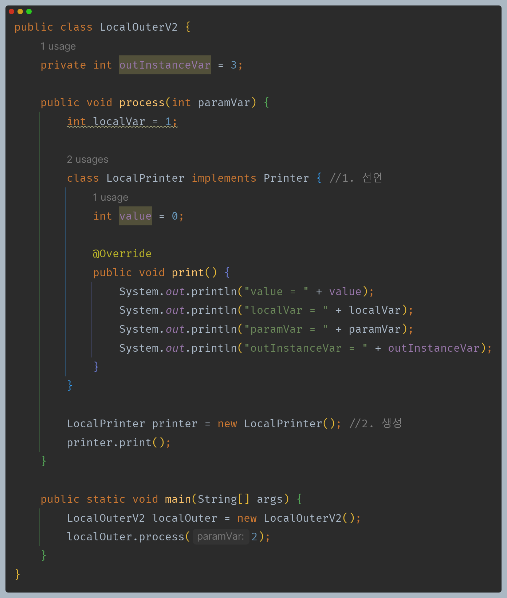

- 여기서 지역 클래스를 사용하기 위해 선언과 생성이라는 2가지 단계를 거친다.
- 익명 클래스를 사용하면 클래스의 이름을 생략하고, 클래스의 선언과 생성을 한번에 처리할 수 있다.

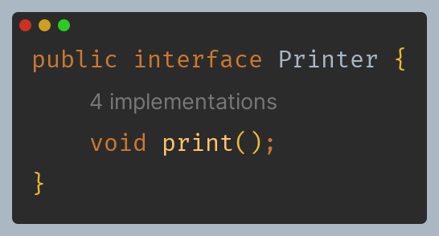

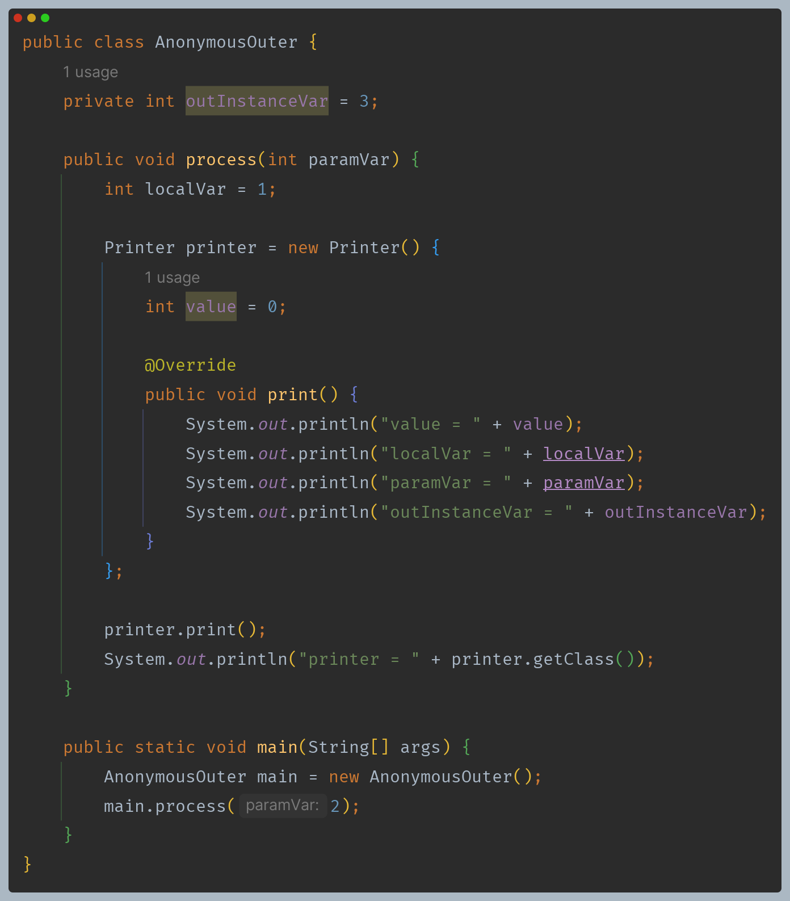

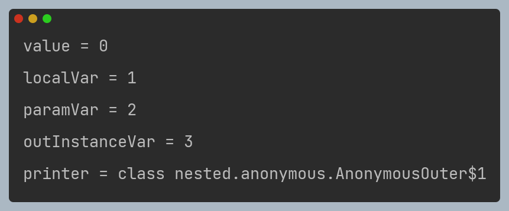

**익명 클래스 특징**
- 이름 없는 지역 클래스를 선언하면서 동시에 생성한다.
- **익명 클래스는 부모 클래스를 상속 받거나 또는 인터페이스를 구현해야 한다.**(익명 클래스를 사용할 때는 상위 클래스나 인터페이스가 필요하다.)
- 익명 클래스는 이름을 가지지 않으므로 생성자를 가질 수 없다.(기본 생성자만 사용됨)
- 익명 클래스는 자바 내부에서 "바깥 클래스 이름 + `$` + 숫자"로 정의된다. 익명 클래스가 여러개면 숫자가 증가하면서 구분된다.

**익명 클래스 장점**
- 익명 클래스를 사용하면 클래스를 별도로 정의하지 않고도 인터페이스나 추상 클래스를 즉석에서 구현할 수 있어 코드가 더 간결해진다.
- 하지만 복잡하거나 재사용이 필요한 경우에는 별도의 클래스를 정의하는 것이 좋다.

**지역 클래스가 일회성으로 사용되는 경우나 간단한 구현을 제공할 때 사용한다.**

---

## 익명 클래스 활용

예를 들어 다음과 같은 코드가 있다고 보자.

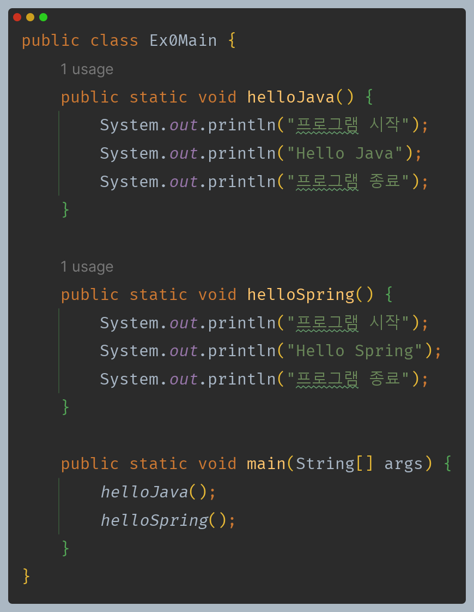

- 중복이 있어 불편한 부분을 리팩토링 해보자.
- 변하지 않는 부분과 변하는 부분을 구분하면 리팩토링을 쉽게 할 수 있다.

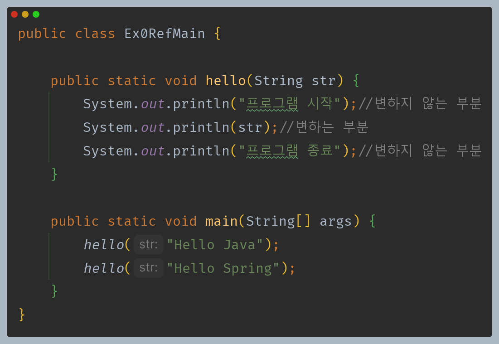

- 이렇게 변하는 부분과 변하지 않는 부분을 분리하고, 변하는 부분을 외부에서 전달 받으면 메서드(함수)의 재사용성을 높일 수 있다.
- **여기서 핵심은 변하는 부분을 메서드(함수) 내부에서 가지고 있는 것이 아니라, 외부에서 전달 받는다는 점이다.**

조금 다른 비슷한 코드를 또 한번 리팩토링 해보자.

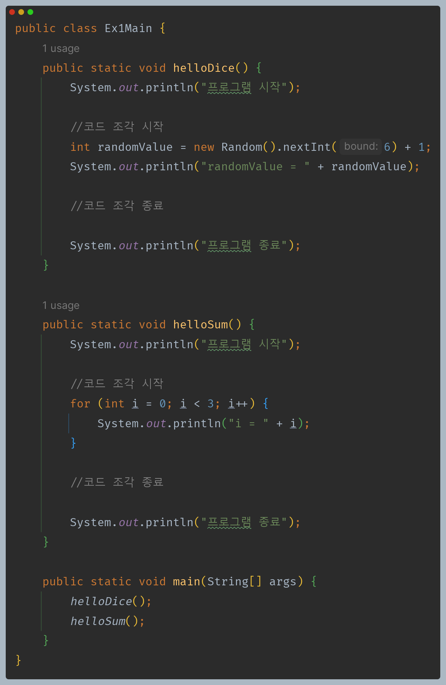

- 이번에는 문자열 같은 데이터가 아니라 **코드 조각**을 전달해야 한다.

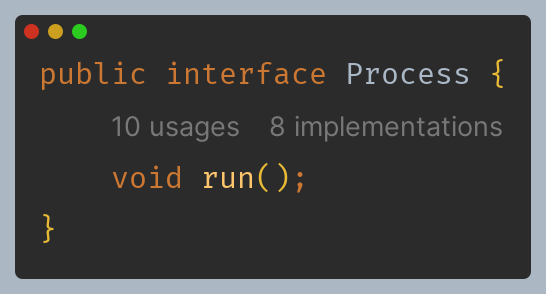

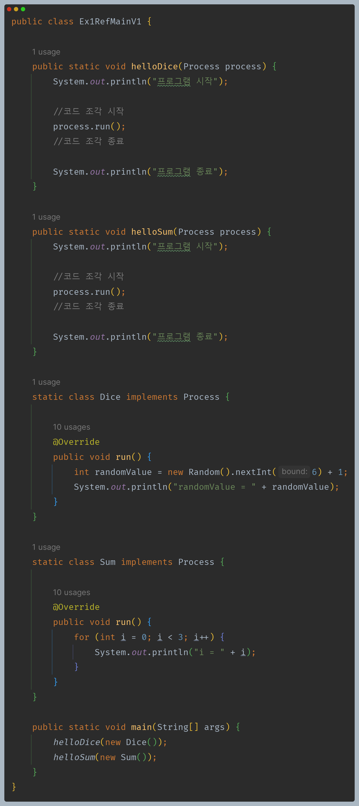

- 변하는 부분을 분리하기 위해서 단순히 문자열 같은 데이터를 전달 받는 것과는 달리 코드 조각을 시작하고 종료하는 부분을 외부에서 전달받아야 한다.
- 코드 조각은 보통 메서드(함수)에 정의한다. 따라서 코드 조각을 전달하기 위해서는 메서드가 필요하다.
- 일반적으로 생각해보면 메서드를 전달할 수 있는 방법은 없기 때문에 대신에 위 코드와 같이 인스턴스를 전달하고, 인스턴스에 있는 메서드를 호출하도록 했다.

**이번에는 지역 클래스를 사용해서 구현해보자.(위 코드는 정적 중첩 클래스)**

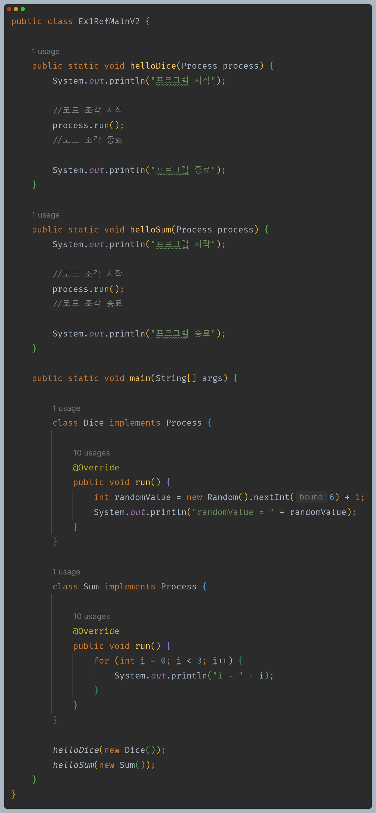

지역 클래스는 간단히 한 번만 생성해서 사용하기 때문에 이런 경우 익명 클래스로 변경할 수 있다.

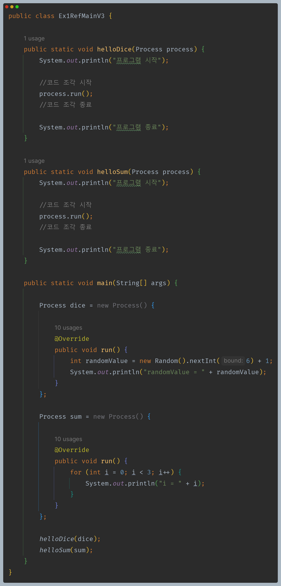

`Inline Variable`을 하면 다음과 같이 더 생략할 수 있다.

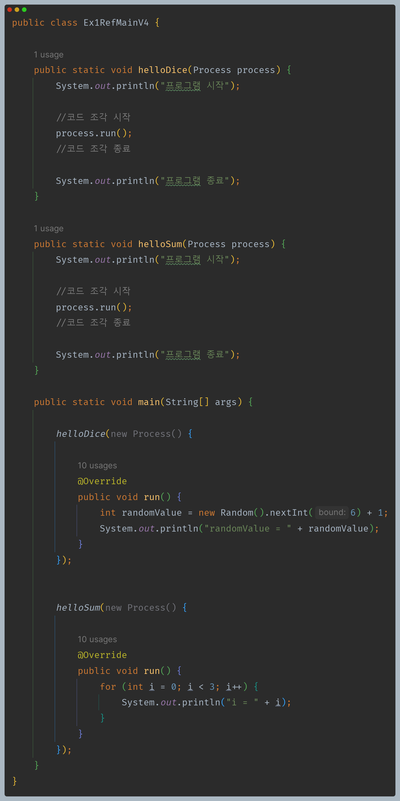

### 람다

- 자바 8 이전까지는 메서드에 인수로 전달할 수 있는 것은 크게 2가지 였다.
  - 기본형
  - 참조형
- 결국 메서드에 인수로 전달할 수 있는 것은 간단한 데이터나 인스턴스의 참조이다.

자바 8에 들어오면서 큰 변화가 있었는데 메서드(정확히는 함수)를 인수로 전달할 수 있게 되었고, 이것을 **람다(Lambda)** 라고 한다.

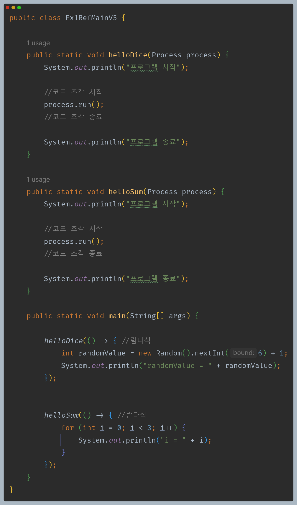

코드를 보면 클래스나 인스턴스를 정의하지 않고, 메서드(정확히는 함수)의 코드 블럭을 직접 전달하는 것을 확인할 수 있다.

---

[이전 ↩️ - 자바(중첩, 내부 클래스) - 지역 클래스]()

[메인 ⏫](https://github.com/genesis12345678/TIL/blob/main/Java/mid_1/Main.md)