# 자바 - 중첩, 내부 클래스

## 지역 클래스

- 지역 클래스(`Local class`)는 내부 클래스의 특별한 종류의 하나로, 내부 클래스의 특징을 그대로 가진다.
- 예를 들어 지역 클래스도 내부 클래스이므로 바깥 클래스의 인스턴스 멤버에 접근할 수 있다.
- 지역 클래스는 지역 변수와 같이 코드 블럭 안에서 정의된다.

```java
class Outer {
    public void process() { 
        //지역 변수
        int localVar = 0;
        //지역 클래스
        class Local {...}
        Local local = new Local();
    } 
}
```

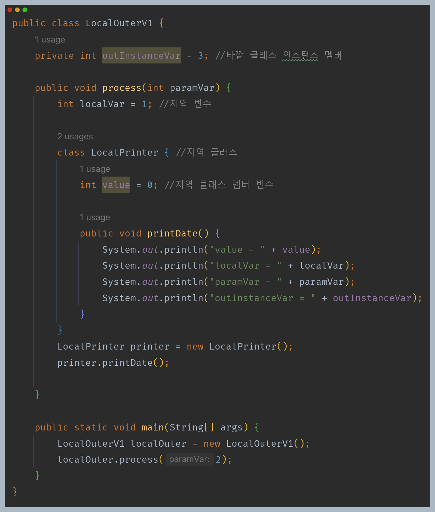

- 자신의 인스턴스 변수(`value`), 지역 변수(`localVar`), 매개변수(`paramVar`)에 접근할 수 있다. 
- 지역 클래스도 내부 클래스의 한 종류이기 때문에 바깥 클래스의 인스턴스 멤버에 접근할 수 있다.


내부 클래스를 포함한 중첩 클래스도 일반 클래스처럼 인터페이스를 구현하거나 부모 클래스를 상속할 수 있다.


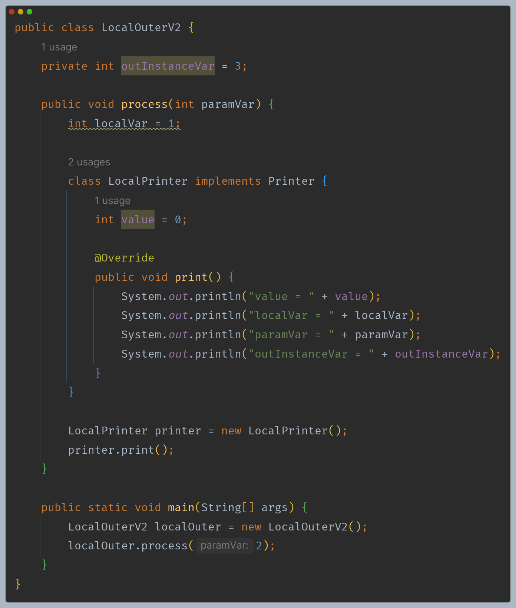

---

## 지역 클래스 - 지역 변수 캡처

- [참고 - 변수들의 생명 주기](https://github.com/genesis12345678/TIL/blob/main/Java/basic/memory/MemoryStructure.md#%EB%B3%80%EC%88%98-%EC%83%9D%EB%AA%85%EC%A3%BC%EA%B8%B0)

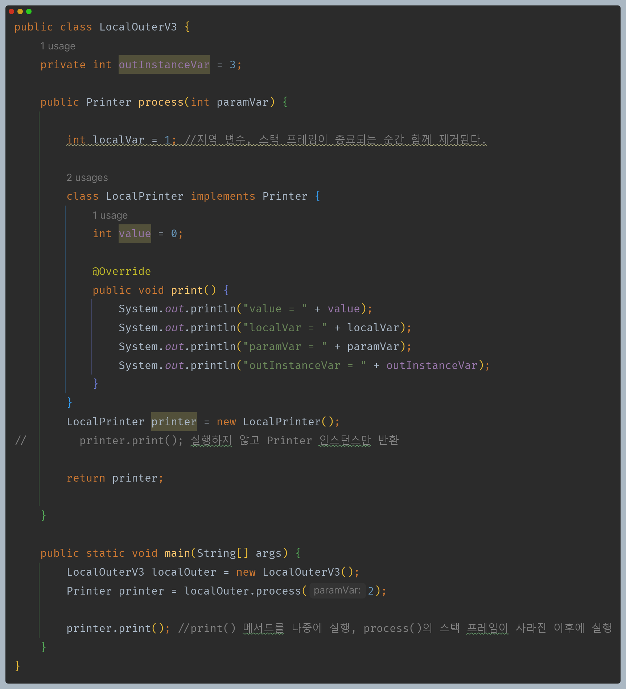

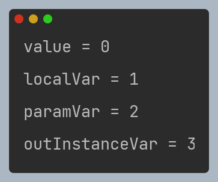

**뭔가 이상하지 않은가? 메모리를 그림으로 보자**

**LocalPrinter 인스턴스 생성 직후 메모리**

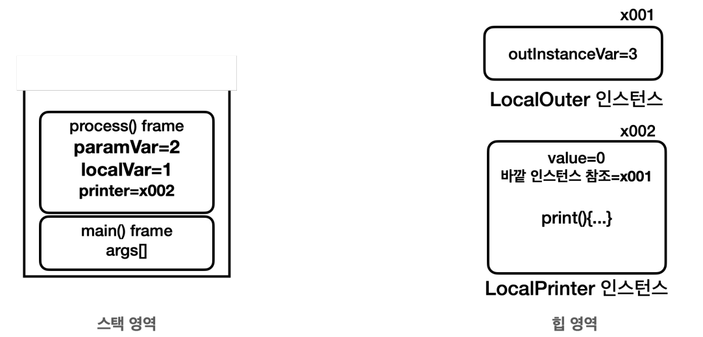

- **지역 클래스 인스턴스의 생존 범위**
  - 지역 클래스로 만든 객체도 인스턴스이기 때문에 힙 영역에 존재한다.(GC 전까지 생존)
  - `LocalPrinter` 인스턴스는 `process()` 메서드 안에서 생성되고, `main()`으로 생성한 인스턴스를 반환한다. 그리고 `printer` 변수에 참조를 보관한다. 따라서
    `LocalPrinter` 인스턴스는 `main()`이 종료될 때까지 생존한다.
  - `paramVar`, `localVar`와 같은 지역 변수는 `process()` 메서드를 실행하는 동안에만 스택 영역에서 생존하기 때문에 `process()` 메서드가 종료되면 스택 영역에서 제거된다.

**LocalPrinter.print() 접근 메모리**

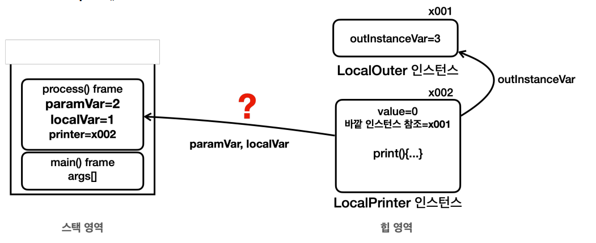

- `LocalPrinter` 인스턴스는 `print()` 메서드를 통해 힙 영역에 존재하는 바깥 인스턴스에 변수(`outInstanceVar`)에 접근한다. 이 부분은 인스턴스의 필드를 참조하는 것이기 때문에 
  특별한 문제가 없다.
- `LocalPrinter` 인스턴스는 `print()` 메서드를 통해 스택 영역에 존재하는 지역 변수도 접근하는 것처럼 보인다. 하지만 스택 영역에 존재하는 지역 변수를
  힙 영역에 있는 인스턴스가 접근하는 것은 생각처럼 단순하지 않다.

**process() 메서드 종료**

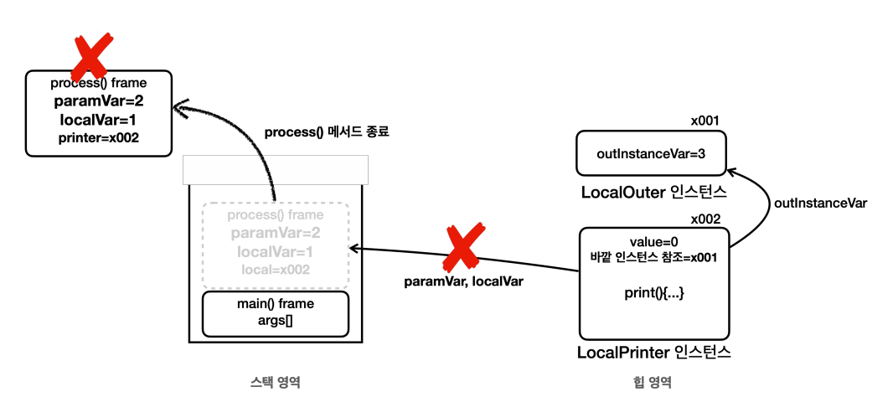

- 지역 변수의 생명주기는 매우 짧은 반면, 인스턴스의 생명주기는 GC 전까지 생존할 수 있다.
- 지역 변수는 `process()` 메서드가 종료되면서 함께 제거된다.
- 여기서 문제는 `process()` 메서드가 종료되어도 `LocalPrinter` 인스턴스는 계속 생존할 수 있다는 점이다.

**process() 메서드가 종료된 이후 지역 변수 접근**

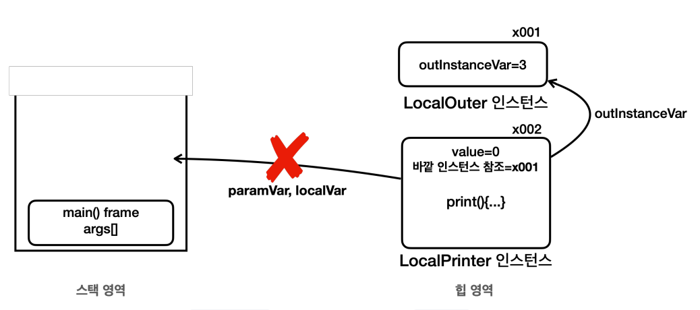

- `main()` 메서드 안에서는 `process()` 메서드가 종료된 이후에 `print()` 를 호출한다.
- `LocalPrinter` 인스턴스에 있는 `print()` 메서드는 지역 변수에 접근해야 하는데, `process()` 메서드가 이미 종료되어 해당 지역 변수들도 제거된 상태이다.

**하지만 실행 결과를 보면 모두 정상적으로 출력된 것을 확인할 수 있다. 왜 그런 것일까?**

자바는 지역 변수와 지역 클래스를 통한 인스턴스의 다른 생명 주기로 인한 문제를 해결하기 위해 **지역 클래스의 인스턴스를 생성하는 시점에 필요한 지역 변수를
복사해서 생성한 인스턴스에 함께 넣어두고**, 이런 과정을 **변수 캡처** 라 한다.

모든 지역 변수를 캡쳐하지는 않고, 접근이 필요한 지역 변수만 캡처한다.

**지역 클래스 인스턴스 생성과 지역 변수 캡처 과정 - 1**

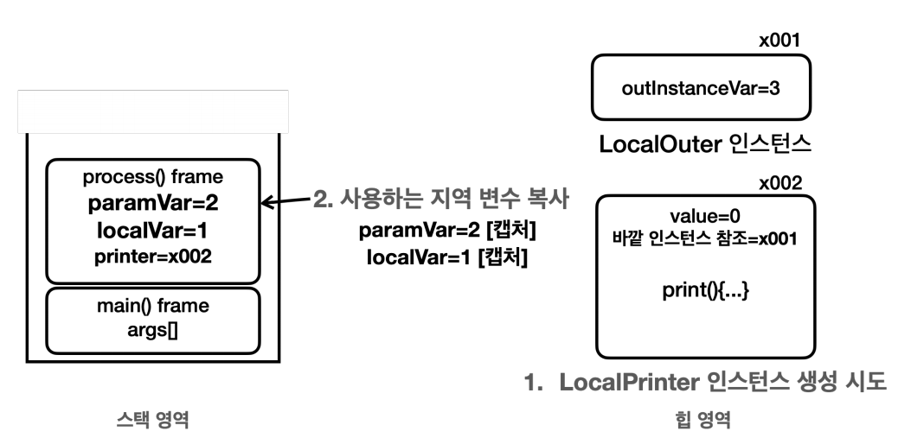

- **LocalPrinter 인스턴스 생성** : 지역 클래스의 인스턴스를 생성할 때 지역 클래스가 접근하는 지역 변수를 확인한다.
- **사용하는 지역 변수 복사** : 지역 클래스가 사용하는 지역 변수를 복사한다.(`paramVar`, `localVar` 복사)

**지역 클래스 인스턴스 생성과 지역 변수 캡처 과정 - 2**

- **지역 변수 복사 완료** : 복사한 지역 변수를 인스턴스에 복사한다.
- **인스턴스 생성 완료** : 복사한 지역 변수를 포함해서 인스턴스 생성이 완료된다. 이제 복사한 지역 변수를 인스턴스를 통해 접근할 수 있다.

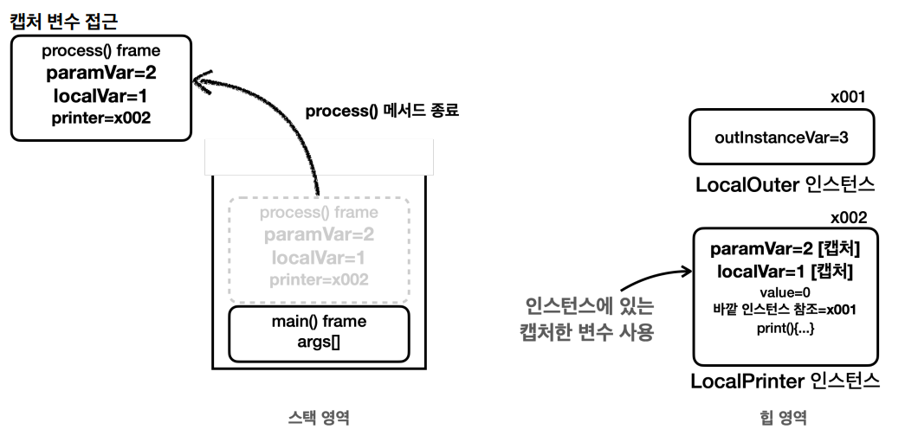

- `LocalPrinter` 인스턴스에서 `print()` 메서드를 통해 지역 변수(`paramVar`, `localVar`)에 접근하면 사실은 스택 영역에 있는 지역 변수에 접근하는 것이 아니라 인스턴스에 있는 
  캡처한 변수에 접근한다.
- 캡처한 지역 변수의 생명주기는 인스턴스의 생명주기와 같다.
- 이렇게 해서 지역 변수의 지역 클래스를 통해 생성한 인스턴스의 생명주기가 다른 문제를 해결한다.

실제로 다음 코드를 추가해보고 필드를 확인해 보자.


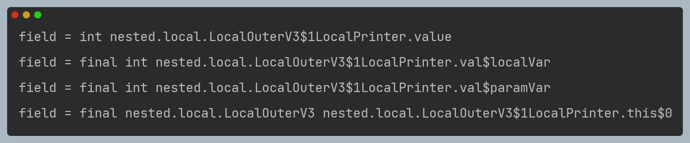

### 사실상 final

- 지역 클래스가 접근하는 지역 변수는 절대로 중간에 값이 변하면 안된다.
- 따라서 `final`로 선언하거나 또는 사실상 `final` 이어야 한다. 이것은 자바 문법이고 규칙이다.

**지역 클래스가 접근하는 지역 변수는 왜 `final` 이어야 할까? 왜 중간에 값이 변하면 안될까?**


- `LocalPrinter printer = new LocalPrinter();`
  - `LocalPrinter`를 생성하는 시점에 지역 변수 `localVar`, `paramVar`를 캡처한다.
- 그런데 이후 캡처한 지역 변수의 값을 변경하게 되면 스택 영역에 존재하는 지역 변수의 값과 인스턴스에 캡처한 캡처 변수의 값이 서로 달라지는 **동기화 문제**가 발생한다.

**캡처 변수의 값을 변경하지 못하는 이유**
- 지역 변수의 값을 변경하면 인스턴스에 캡처한 변수의 값도 변경해야 한다.(반대도 마찬가지)
- 개발자 입장에서 예상하지 못한 곳에서 값이 변경될 수 있다.
- 지역 변수의 값과 인스턴스에 있는 캡처 변수의 값을 서로 동기화 해야 하는데, 멀티 스레드 상황에서 이런 동기화는 매우 어렵고, 성능에 나쁜 영향을 줄 수 있다.

**자바는 캡처한 지역 변수의 값을 변하지 못하게 막아서 이런 복잡한 문제들을 근본적으로 차단한다.**

---

[이전 ↩️ - 자바(중첩, 내부 클래스) - 중첩 클래스, 내부 클래스]()

[메인 ⏫](https://github.com/genesis12345678/TIL/blob/main/Java/mid_1/Main.md)

[다음 ↪️ - 자바(중첩, 내부 클래스) - 익명 클래스]()