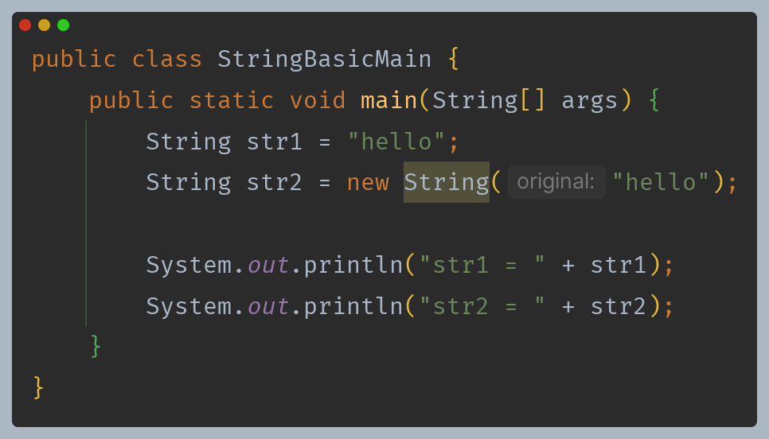
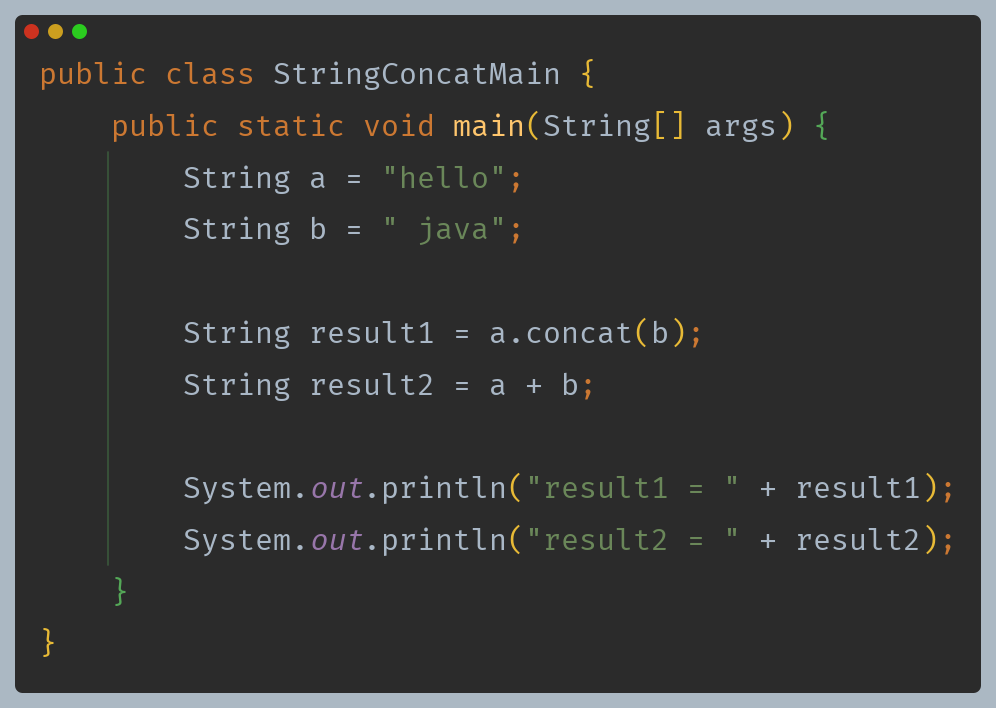
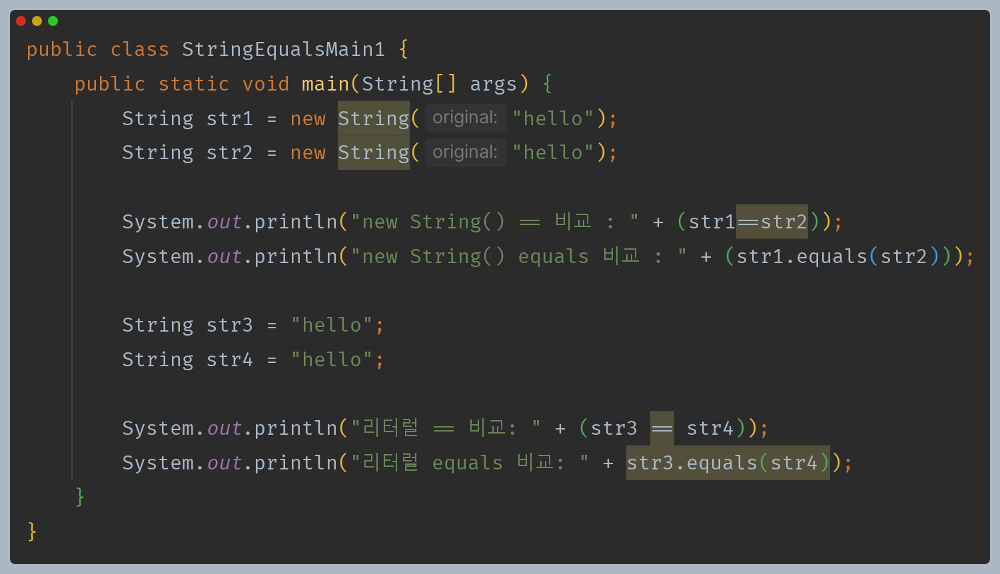
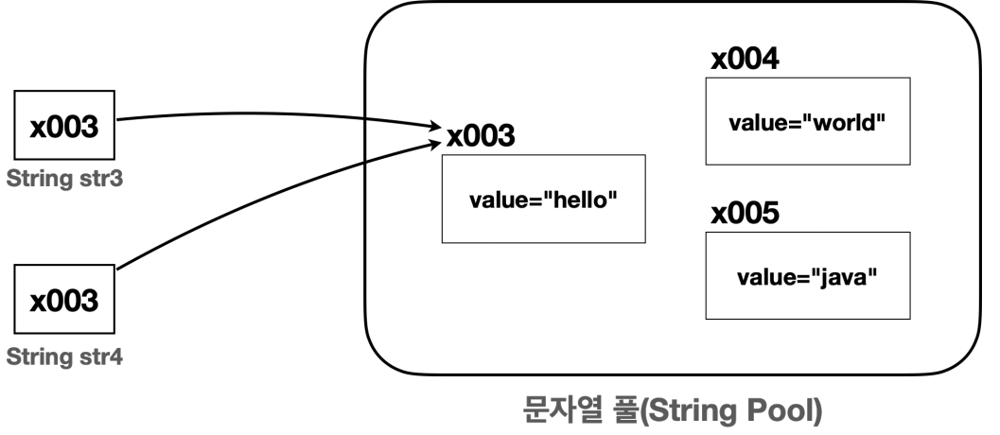
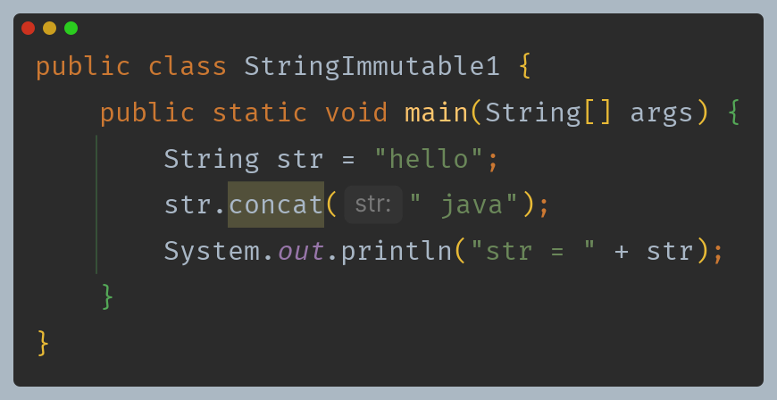
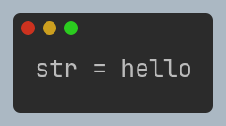
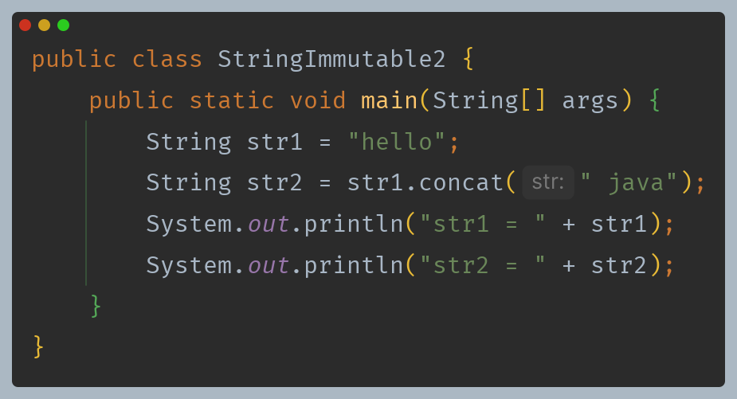
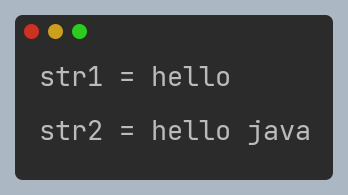
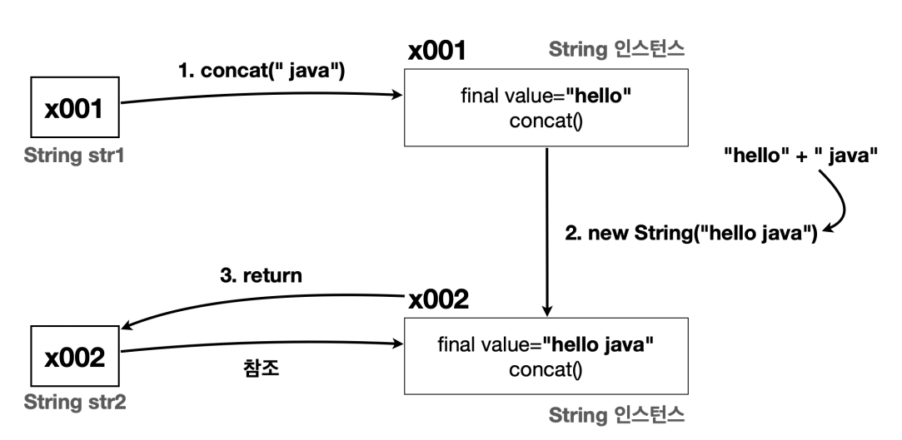
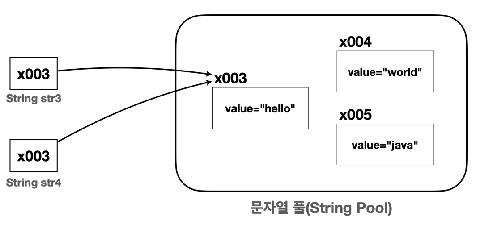

# 자바 - String 클래스

## String

- 자바에서 문자를 다루는 대표적인 타입은 `char`, `String` 2가지가 있다.
- 기본형은 `char`는 문자 하나를 다룰 때 사용하고, `char`를 사용해서 여러 문자를 나열하려면 `char[]`를 사용해야 한다.
- 하지만 이 방법은 불편하기 때문에 문자열을 편리하게 다룰 수 있는 `String` 클래스를 제공한다.

**`String` 클래스를 통해 문자열을 생성하는 방법은 2가지가 있다.**

- `String`도 엄연히 클래스이기 때문에 참조형이다. 따라서 인스턴스의 참조값만 들어가야 할 것 같다.
- 하지만 문자열은 매우 자주 사용되기 때문에 편의상 쌍따옴표로 감싸면 자바 언에서 `new String()`으로 변경해준다.(내부에서 성능 최적화를 위해 문자열 풀 사용)
- `String` 클래스는 내부에 `byte[]` 속성을 갖고 있어 여기에 실제 문자열 값이 보관된다.
  - 참고로 자바 9 이전에는 `char[]`를 사용하다가 메모리를 더 효율적으로 사용하기 위해 자바 9 이후부터 `byte[]`를 사용한다.

- `String`은 클래스이기 때문에 기본형이 아니라 참조형이다.
- 참조형은 변수에 참조값이 들어있기 때문에 원칙적으로 `+` 같은 연산을 사용할 수 없고, `concat()`같은 메서드를 사용해야 한다.
- 하지만 문자열은 자주 다루어지기 때문에 자바 언어에서 편의상 `+` 연산을 제공한다.

---

## String 클래스 비교

- `String` 클래스를 비교할 때는 `==` 비교(동일성)가 아니라 항상 `equals()` 비교(동등성)를 해야한다.

- `str1`과 `str2`는 `new String()`을 사용해서 각각 인스턴스를 생성했기 때문에 서로 다른 인스턴스 이므로 동일성 비교(`==`)에 실패한다.
- 둘은 내부에 같은 문자열 값(`hello`)을 가지고 있어 논리적으로 같기 때문에 동등성 비교(`equals()`)에 성공한다.
- `String` 클래스는 내부 문자열 값을 비교하도록 `equals()` 메서드를 재정의 해두었다.

- `str3`, `str4`와 같이 문자열 리터럴을 사용하는 경우 자바는 메모리 효율성과 성능 최적화를 위해 **문자열 풀**을 사용한다.
- 자바가 실행되는 시점에 클래스에 문자열 리터럴이 있으면 문자열 풀에 `String` 인스턴스를 미리 만들어둔다.(이때 같은 문자열이 있으면 만들지 않는다.)
- `str`과 `str4`는 문자열 리터럴을 사용한다. 따라서 문자열 풀에서 `hello`라는 문자를 가진 `String` 인스턴스를 찾게 되고, 둘은 같은 참조값을 바라보게 된다.
- **문자열 풀** 덕분에 같은 문자를 사용하는 경우 메모리 사용을 줄이고 문자를 만드는 시간도 줄어들기 때문에 성능도 최적화 할 수 있다.
- **따라서 문자열 리터럴을 사용하는 경우 같은 참조값을 가지므로 `==` 비교에 성공한다.**

> **참고**
> 
> 문자열 풀은 힙 영역을 사용하고, 문자열 풀에서 문자를 찾을 때는 해시 알고리즘을 사용하기 때문에 매우 빠른 속도로 `String` 인스턴스를 찾을 수 있다.

---

## String 클래스 불변 객체

- `String`은 불변 객체로 설계되었기 때문에 위 코드를 실행하면 기대와는 다른 결과가 출력된다.

- 불변 객체로 설계되어 반환 값이 있기 때문에 반환 값을 사용해야 한다.

### String이 불변으로 설계된 이유

- **문자열 풀에 있는 `String` 인스턴스의 값이 중간에 변경되면 같은 문자열을 참조하는 다른 변수의 값도 함께 변경된다.**

- `String`은 자바 내부에서 문자열 풀을 통해 최적화를 한다.
- 만약 `String` 내부의 값을 변경할 수 있다면, 기존에 문자열 풀에서 같은 문자를 참조하는 변수의 모든 문자가 함께 변경되어 버리는 문제가 발생한다.
- `String` 클래스는 불변으로 설계되어서 이런 사이드 이펙트 문제가 발생하지 않는다.

---

[메인 ⏫](https://github.com/genesis12345678/TIL/blob/main/Java/mid_1/Main.md)

[다음 ↪️ - 자바(String 클래스) - StringBuilder](https://github.com/genesis12345678/TIL/blob/main/Java/mid_1/String/StringBuilder.md)