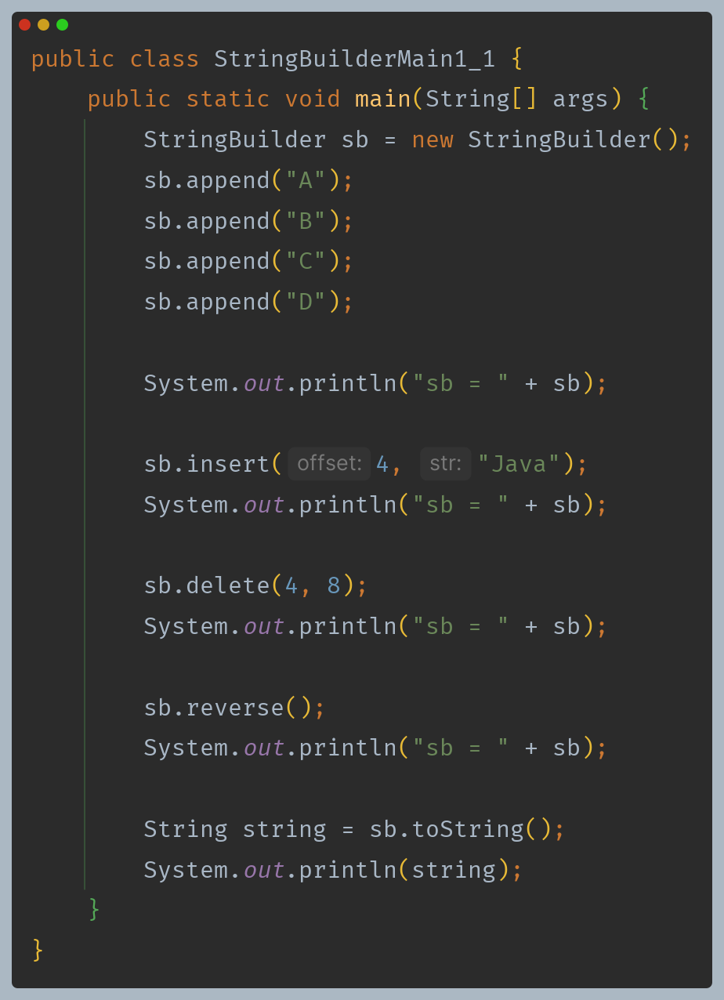
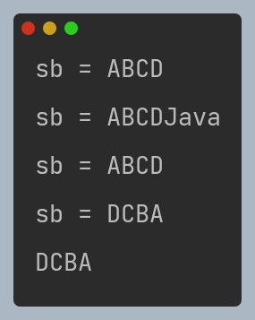

# 자바 - String 클래스

## StringBuilder

- `String` 클래스는 불변 객체여서 생기는 단점이 있다.
- 불변은 `String` 클래스는 문자를 더하거나 변경할 때 마다 계속해서 새로운 객체를 생성해야 한다는 점이다.
- 문자를 자주 더하거나 변경해야 하는 상황이라면 더 많은 `String` 객체를 만들고, GC 해야 한다. 결과적으로 컴퓨터의 CPU, 메모리 자원을 더 많이 사용하게 된다.

**이런 문제를 해결하기 위해 자바는 `StringBuilder` 라는 가변 `String`을 제공한다.**

`StringBuilder`는 내부에 `final`이 아닌 변경할 수 있는 `byte[]`를 가지고 있다.

- `String`은 불변하다. 즉, 한번 생성되면 그 내용을 변경할 수 없고 문자열에 변화를 주려고 할 때마다 새로운 `String` 객체가 생성되고, 기존 객체는 사용되지 않으면 버려진다. 
    이 과정에서 메모리와 처리 시간을 더 많이 소모한다.
- 반면 `StringBuilder`는 가변이다. 하나의 `StringBuilder` 객체 안에서 문자열을 추가, 삭제, 수정할 수 있으며 이때마다 새로운 객체를 생성하지 않는다. 따라서 메모리 사용을 줄이고
    성능을 향상시킬 수 있다.(사이드 이펙트는 주의해야 한다.)

**`StringBuilder`는 보통 문자열을 변경하는 동안만 사용하다가 문자열 변경이 끝나면 안전한 `String`(불변)으로 변환하는 것이 좋다.**

---

[이전 ↩️ - 자바(String 클래스) - String 클래스](https://github.com/genesis12345678/TIL/blob/main/Java/mid_1/String/String.md)

[메인 ⏫](https://github.com/genesis12345678/TIL/blob/main/Java/mid_1/Main.md)

[다음 ↪️ - 자바(String 클래스) - String 최적화](https://github.com/genesis12345678/TIL/blob/main/Java/mid_1/String/%EC%B5%9C%EC%A0%81%ED%99%94.md)