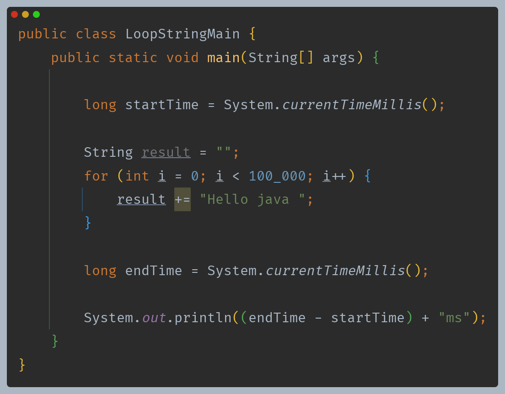
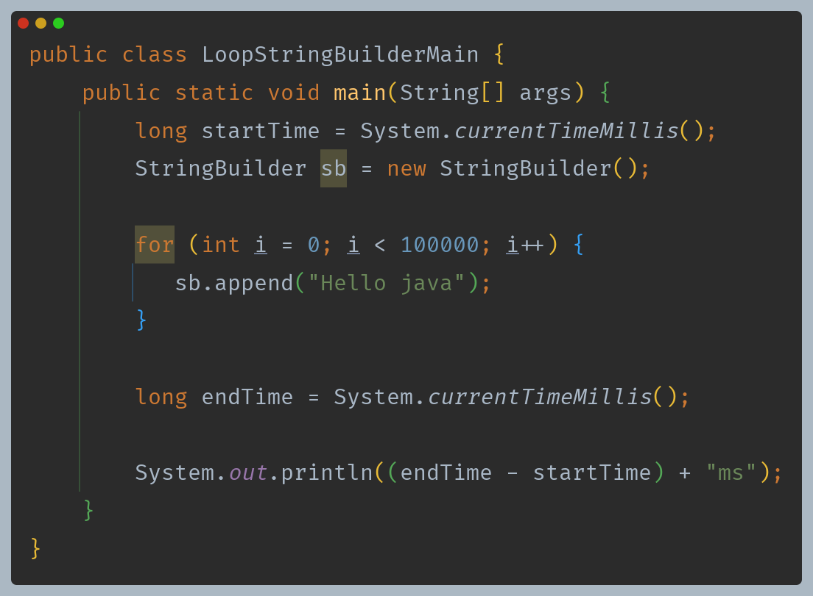

# 자바 - String 클래스

## String 최적화

- 자바 컴파일러는 문자열 리터럴을 더하는 부분을 자동으로 합쳐준다.

**컴파일 전**
```java
String str = "Hello, " + "World";
```

**컴파일 후**
```java
String str = "Hello, World";
```

따라서 런타임에 별도의 문자열 결합 연산을 수행하지 않기 때문에 성능이 향상된다.

- 하지만 문자열 변수의 경우 어떤 값이 들어있는지 컴파일 시점에는 알 수 없기 때문에 단순하게 합칠 수 없다.

```java
String result = str1 + str2;
```

이런 경우 예를 들면 다음과 같이 최적화를 수행한다.(최적화 방식은 자바 버전에 따라 달라진다.)
```java
String result = new StringBuilder().append(str1).append(str2).toString();
```
- (자바 9부터는 `StringBuilderConcatFactory`를 사용해서 최적화를 수행)

이렇게 자바가 최적화를 수행해주기 때문에 간단한 경우에는 굳이 `StringBuilder`를 사용하지 않고, `+` 연산으로도 충분하다.

---

## String 최적화가 어려운 경우



- 위 코드 같은 경우 다음과 같이 최적화 될 것이다.(자바 버전에 따라 다르다.)

```java
String result = "";
for (int i = 0; i < 100_000; i++) {
    result = new StringBuilder().append(result).append("Hello Java ").toString();
}
```

- 반복문 내부에서 최적화 되는 것처럼 보이지만, 반복 횟수만큼 객체를 생성해야 한다.
- 반복문 내에서의 문자열 연결은, 런타임에 연결할 문자열의 개수와 내용이 결정된다. 이런 경우, 컴파일러는 얼마나 많은 반복이 일어날지, 각 반복에서 문자열이 
    어떻게 변할지 예측할 수 없기 때문에 이런 상황에서는 최적화가 어렵다.
- `StringBuilder`는 물론이고 반복 횟수 만큼 `String` 객체를 생성했을 것이다.


이럴 때는 직접 `StringBuilder`를 사용하면 된다.




**정리** : 문자열을 합칠 때 대부분의 경우 최적화가 되므로 `+` 연산을 사용하면 된다.

**StringBuilder를 직접 사용하는 것이 더 좋은 경우**
- 반복문에서 문자를 연결할 때
- 조건문을 통해 동적으로 문자열을 조합할 때
- 복잡한 문자열의 특정 부분을 변경해야 할 때
- 매우 긴 대용량 문자열을 다룰 때

> **StringBuilder vs StringBuffer**
> - `StringBuilder`와 똑같은 기능을 수행하는 `StringBuffer`라는 클래스도 있다.
> - `StringBuffer`는 내부에 동기화가 되어 있어 멀티 스레드 상황에 안전하지만 동기화 오버헤드로 인해 성능이 느리다.
> - `StringBuilder`는 멀티 스레드 상황에 안전하지 않지만 동기화 오버헤드가 없으므로 속도가 빠르다.

---

[이전 ↩️ - 자바(String 클래스) - StringBuilder]()

[메인 ⏫](https://github.com/genesis12345678/TIL/blob/main/Java/mid_1/Main.md)