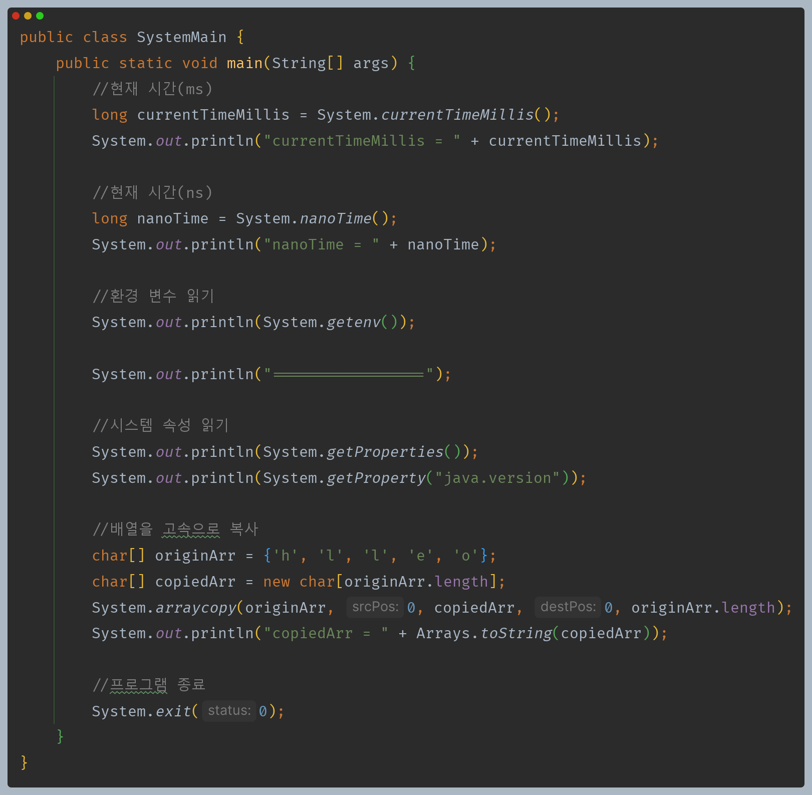
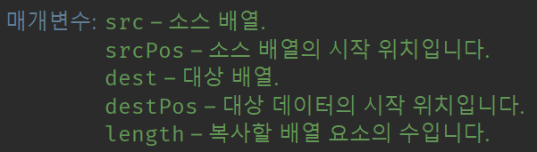
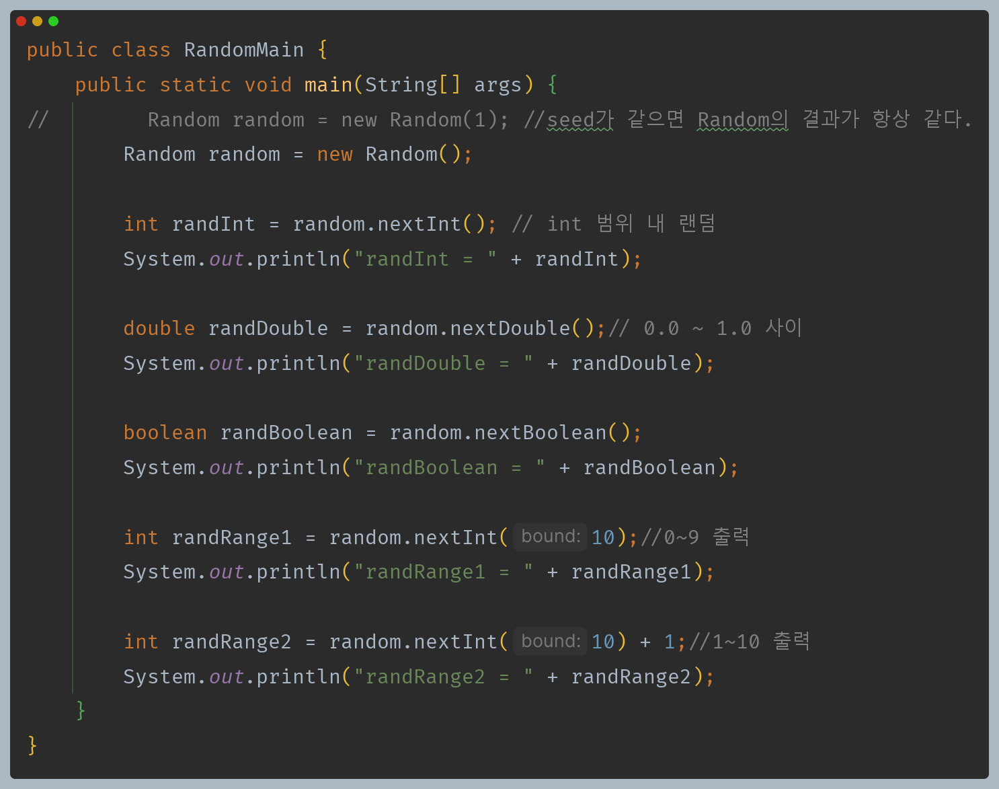
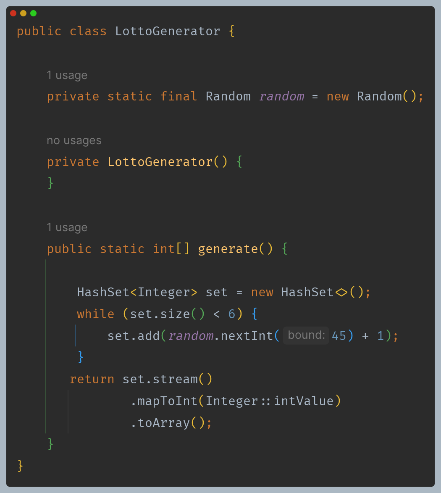
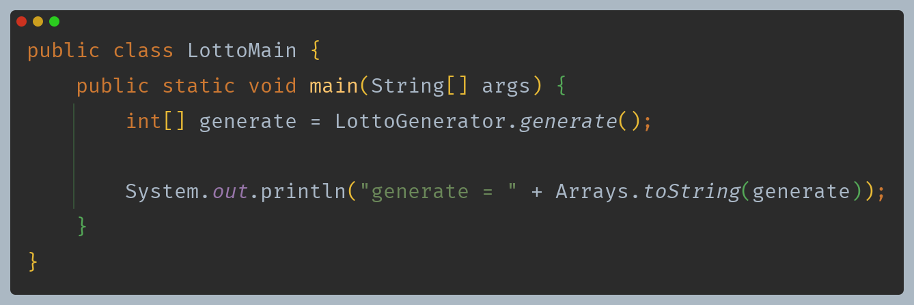

# 자바 - 래퍼, Class 클래스

## System, Random 클래스

## System

- **표준 입력, 출력, 오류 스트림** : `System.in`, `System.out`, `System.err`은 각각 표준 입력, 표준 출력, 표준 오류 스트림을 나타낸다.
- **환경 변수** : `System.getenv()` 메서드로 OS에서 설정한 환경 변수의 값을 얻을 수 있다.
- **시스템 속성** : `System.getProperties()`나 `System.getProperty(String key)`로 특정 속성을 얻을 수 있다.(시스템 속성은 자바에서 사용하는 설정값)
- **시스템 종료** : `System.exit(int status)` 메서드는 프로그램을 종료하고, OS에 프로그램 종료의 상태 코드를 전달한다.
  - 상태 코드 `0` : 정상 종료
  - 상태 코드가 `0`이 아님 : 오류나 예외적인 종료
- **배열 고속 복사** : `System.arrayCopy()`는 시스템 레벨에서 최적화된 메모리 복사 연산을 사용한다. 직접 반복문을 사용할 때보다 수 배 이상 빠른 성능을 제공한다.

---

## Random

- `Random` 클래스를 사용하면 `Math.random()`보다 더욱 다양한 랜덤값을 구할 수 있다.
- `Math.random()`도 내부에서 `Random` 클래스를 사용한다.

- `new Random()` : 내부에서 `System.nanoTime()` 에 복잡한 알고리즘을 섞어서 Seed 값을 생성한다. 따라서 반복 실행해도 결과가 항상 달라진다.
- `new Random(long seed)` : 생성자에 Seed 값을 전달할 수 있는데, Seed 값이 같으면 여러 번 반복 실행해도 실행 결과가 같다.

**Random 클래스를 활용한 로또 번호 생성기**

---

[이전 ↩️ - 자바(래퍼, Class 클래스) - Class 클래스](https://github.com/genesis12345678/TIL/blob/main/Java/mid_1/Wrapper/Class.md)

[메인 ⏫](https://github.com/genesis12345678/TIL/blob/main/Java/mid_1/Main.md)