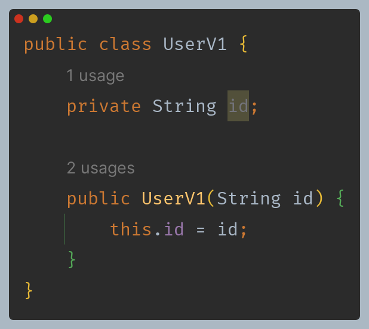
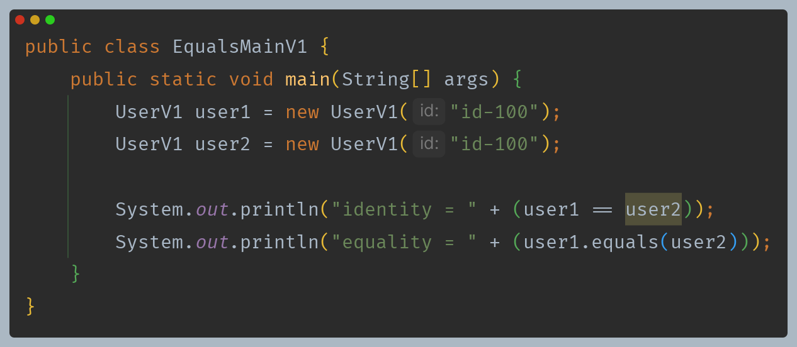
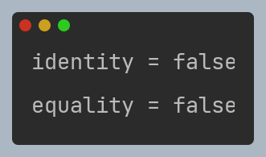
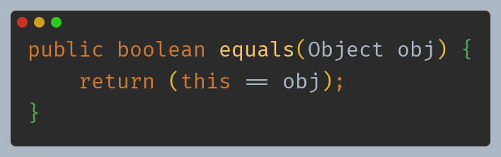
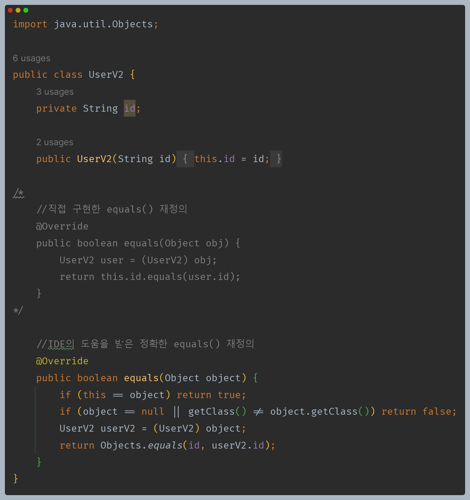

# 자바 - Object 클래스

## equals()

- `Object`는 동등성 비교를 위한 `equals()` 메서드를 제공한다.
- 자바는 두 객체가 같다 라는 표현을 2가지로 분리해서 제공한다.
  - **동일성(Identity)** : `==` 연산자로 두 객체의 참조가 동일한 객체를 가리키고 있는지 확인
  - **동등성(Equality)** : `equals()` 메서로 두 객체가 논리적으로 동등한지 확인
  - **동일**은 완전히 같음을 의미하고, **동등**은 같은 가치나 수준을 의미하지만 그 형태나 외관 등이 완전히 같지는 않을 수 있다.
  - 즉 **동일성**은 물리적으로 같은 메모리에 있는 객체 인스턴스인지 참조값을 확인하는 것이고, **동등성**은 논리적으로 같은지 확인하는 것이다.

**동일성은 `false`가 맞고, 동등성은 `true`가 나와야 할 것 같은데 `false`가 나온다. 이유는 `Object`의 `equals()` 메서드에 있다.**

- `Object`의 `equals()` 메서드는 기본적으로 `==`으로 동일성 비교를 제공한다.
- 동등성이라는 개념은 각각의 클래스마다 다를 수 있기 때문에 동등성 비교를 위해서는 `equals()` 메서드를 재정의 해야 한다.

---

## equals() 오버라이딩

- `equals()` 메서드를 직접 재정의 하는 것은 정확하지 않고, 정확하게 하는 것은 쉽지 않기 때문에 보통 IDE의 도움을 받아서 재정의 한다.(`toString()`도 마찬가지)
- `equals()` 메서드를 구현할 때 지켜야 하는 규칙
  - **반사성(Reflexivity)**: 객체는 자기 자신과 동등해야 한다. ( `x.equals(x)` 는 항상 `true` ).
  - **대칭성(Symmetry)**: 두 객체가 서로에 대해 동일하다고 판단하면, 이는 양방향으로 동일해야 한다.( `x.equals(y)` 가 `true` 이면 `y.equals(x)` 도 `true` ).
  - **추이성(Transitivity)**: 만약 한 객체가 두 번째 객체와 동일하고, 두 번째 객체가 세 번째 객체와 동일하다면, 첫 번째 객체는 세 번째 객체와도 동일해야 한다.
  - **일관성(Consistency)**: 두 객체의 상태가 변경되지 않는 한, `equals()` 메소드는 항상 동일한 값을 반환해야 한다.
  - **null에 대한 비교:** 모든 객체는 `null` 과 비교했을 때 `false` 를 반환해야 한다.

---

[이전 ↩️ - 자바(Object 클래스) - `toString()`](https://github.com/genesis12345678/TIL/blob/main/Java/mid_1/object/ToString.md)

[메인 ⏫](https://github.com/genesis12345678/TIL/blob/main/Java/mid_1/Main.md)