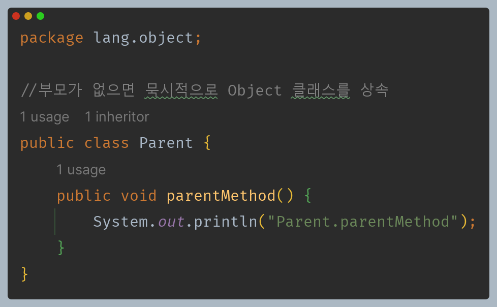
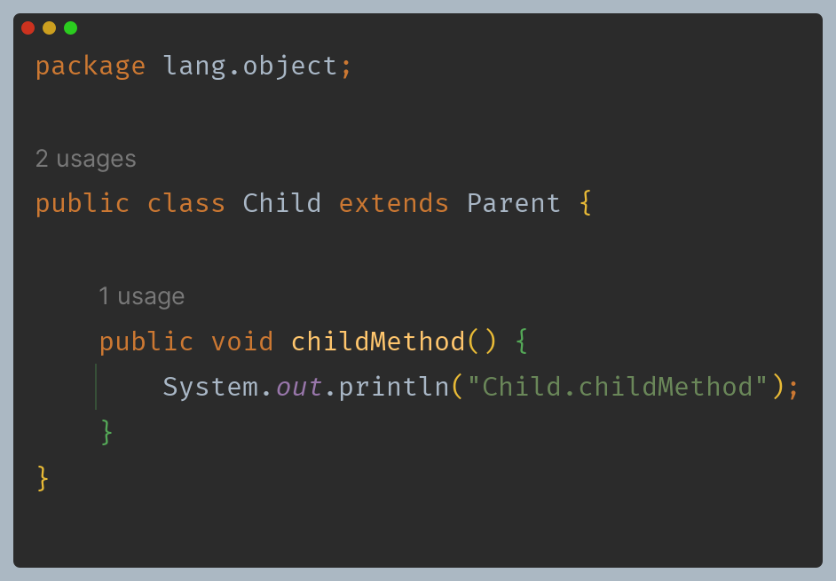
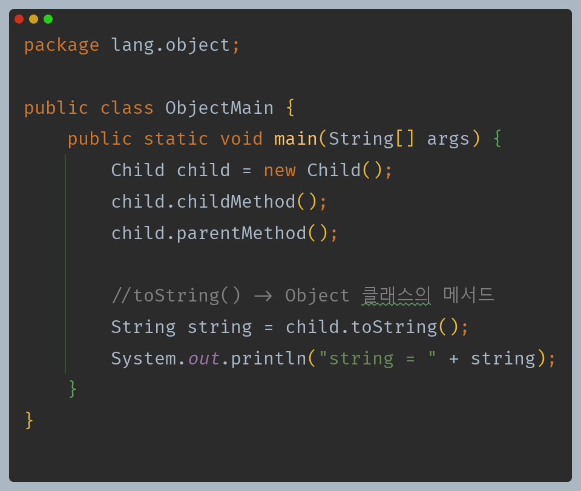
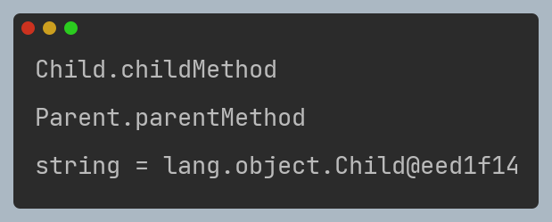
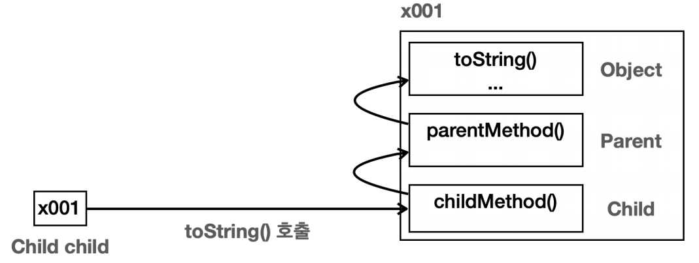

# 자바 - Object 클래스

> - `java.lang` 패키지
>   - 자바가 기본으로 제공하는 라이브러리(클래스 모음) 중에 가장 기본이 되는 것이 `java.lang` 패키지이다.(`lang = Language`)
>   - 자바 언어를 이루는 가장 기본이 되는 클래스들을 보관하는 패키지인 것이다.
>   - **`java.lang` 패키지의 대표적인 클래스들**
>     - `Object` : 모든 자바 객체의 부모 클래스
>     - `String` : 문자열
>     - `Integer`, `Long`, `Double` 등 : 래퍼 타입, 기본형 타입을 객체로 만든 것
>     - `Class` : 클래스 메타 정보
>     - `System` : 시스템과 관련된 기본 기능들을 제공
>   - 참고로 `java.lang` 패키지는 모든 자바 애플리케이션에 자동으로 `import` 되므로 `import` 구문을 사용하지 않아도 된다.

---

## Object 클래스

- **자바에는 모든 클래스의 최상위 부모 클래스는 항상 `Object` 클래스이다.**

- 클래스에 상속 받을 부모 클래스가 없으면 묵시적으로 `Object` 클래스를 상속받으며, 자바가 `extends Object`를 넣어주기 때문에 생략하는 것을 권장한다.

- 클래스에 상속 받을 부모 클래스를 명시적으로 지정하면 `Object`를 상속받지 않는다.

> - **묵시적 vs 명시적**
>   - **묵시적(Implicit)** : 개발자가 코드에 직접 기술하지 않아도 시스템 또는 컴파일러에 의해 자동으로 수행되는 것을 의미
>   - **명시적(Explicit)** : 개발자가 코드에 직접 기술해서 작동하는 것을 의미

**그림으로 표현하면 다음과 같다.**

0. `Parent`는 `Object`를 묵시적으로 상속 받았기 때문에 메모리에도 함께 생성된다.
1. `child.toString()` 호출
2. 먼저 본인의 타입인 `Child`에서 `toString()`을 찾고, 없으므로 부모 타입으로 올라가서 찾는다.
3. 부모 타입인 `Parent`에서 찾고, 없으므로 부모 타입으로 올라가서 찾는다.
4. 부모 타입인 `Object`에서 찾고, 있으므로 이 메서드를 호출한다.

**자바에서 모든 객체의 최종 부모는 `Object` 이다.**

---

## 자바에서 Object 클래스가 최상위 부모 클래스인 이유

### 공통 기능 제공

- 객체의 정보를 제공하고, 이 객체가 다른 객체와 같은지 비교하고, 객체가 어떤 클래스로 만들어졌는지 확인하는 기능은 모든 객체에게 필요한 기본 기능이다.
- 이런 기능을 객체를 만들 때마다 항상 새로운 메서드를 정의해서 만들어야 한다면 번거롭기도 하고, 개발자마다 서로 다른 이름의 메서드를 만들게 될 수도 있다.

**`Object`는 모든 객체에 필요한 공통 기능을 제공하며, 최상위 부모 클래스이기 때문에 모든 객체는 공통 기능을 편리하게 상속 받을 수 있다.**

- `Object`가 제공하는 기능
  - 객체의 정보를 제공하는 `toString()`
  - 객체의 같음을 비교하는 `equals()`
  - 객체의 클래스 정보를 제공하는 `getClass()`
  - 기타

### 다형성의 기본 구현

- `Object`는 모든 클래스의 부모 클래스이기 때문에 모든 객체를 참조할 수 있다.(부모는 자식을 담을 수 있다.)
- 모든 자바 객체는 `Object` 타입으로 처리될 수 있으며, 이는 다양한 타입의 객체를 통합적으로 처리할 수 있게 해준다.
- 즉 `Object`는 모든 객체를 다 담을 수 있으며, 타입이 다른 객체들을 `Object`에 보관할 수 있다.

---

[메인 ⏫](https://github.com/genesis12345678/TIL/blob/main/Java/mid_1/Main.md)

[다음 ↪️ - 자바(Object 클래스) - Object 다형성](https://github.com/genesis12345678/TIL/blob/main/Java/mid_1/object/%EB%8B%A4%ED%98%95%EC%84%B1.md)