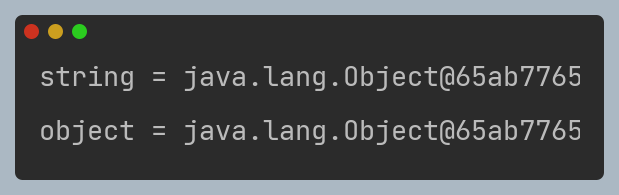
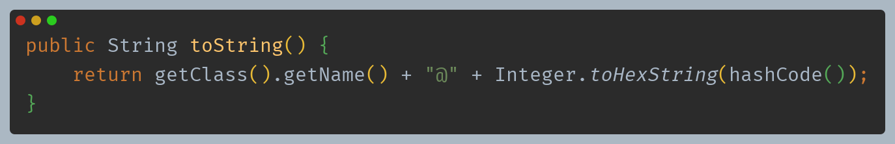
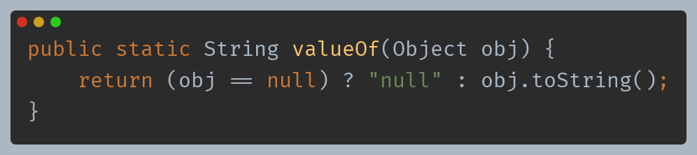
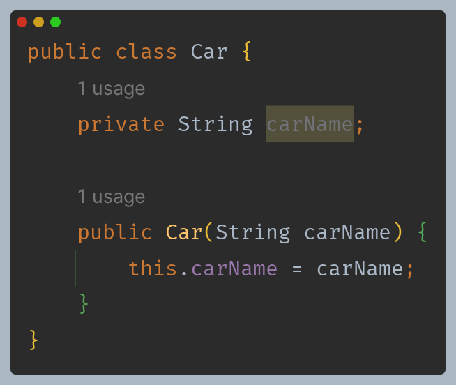
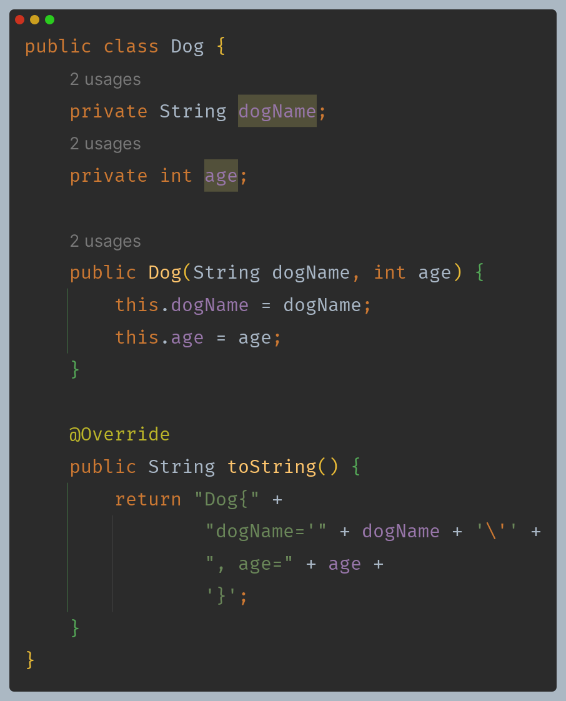
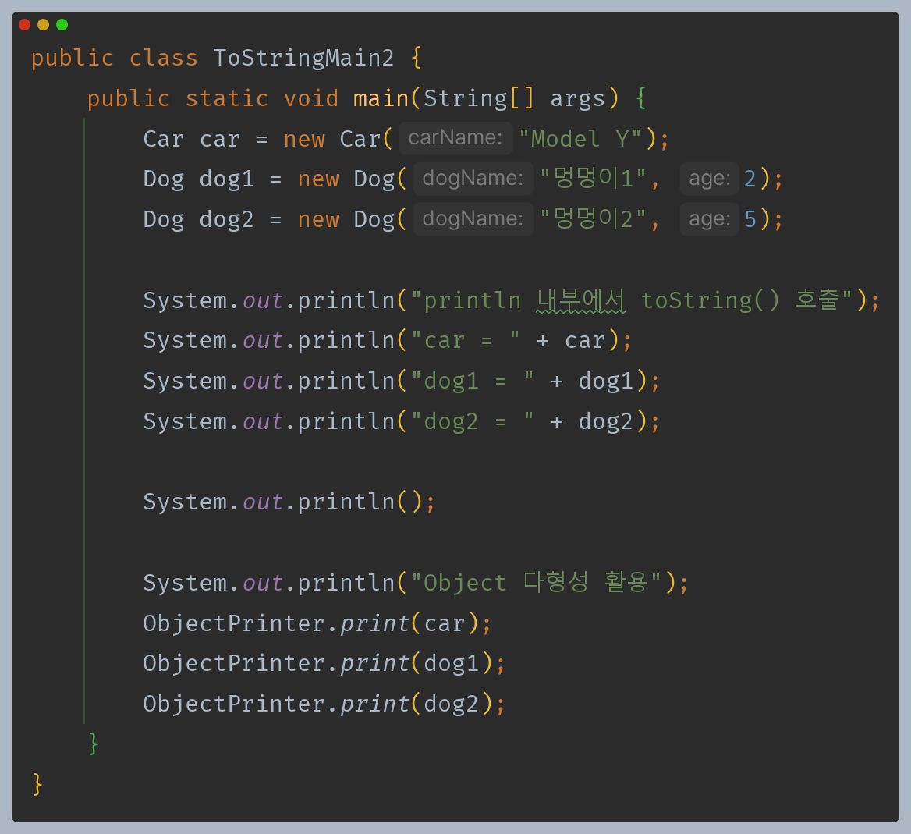
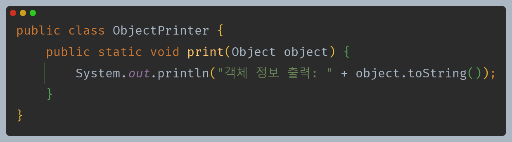
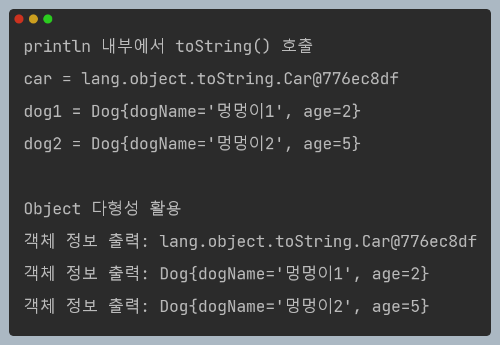
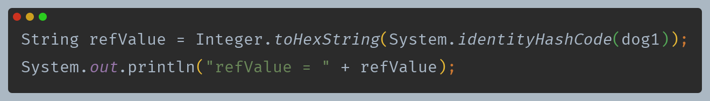
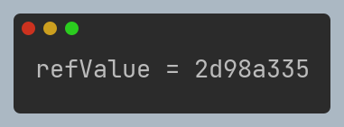

# 자바 - Object 클래스

## toString()

- `Object`의 `toString()` 메서드는 객체의 정보를 문자열 형태로 제공하는 메서드로, 모든 클래스에서 상속받아 사용할 수 있다.

**`toString()` 메서드는 다음과 같다.**

- `Object`가 제공하는 `toString()` 메서드는 기본적으로 패키지를 포함한 객체의 이름과 객체의 참조값(해시코드)를 16진수로 제공한다.

**그리고 `println`과 `toString()` 결과가 같은데 `println` 내부에서 다음과 같이 동작하기 때문에 결과가 같다.**

---

## toString() 오버라이딩

- `toString()` 을 오버라이딩 하여 클래스 정보와 객체의 참조값이 아닌 객체의 상태를 적절히 나타낼 수 있게 할 수 있다.

> **참고로 다음과 같이 객체의 참조값을 직접 출력 가능하다.**
> 
> 
> 
> 

---

[이전 ↩️ - 자바(Object 클래스) - Object 다형성]()

[메인 ⏫]()

[다음 ↪️ - 자바(Object 클래스) - `equals()`]()