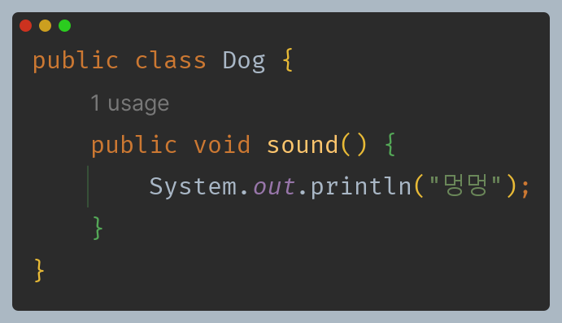
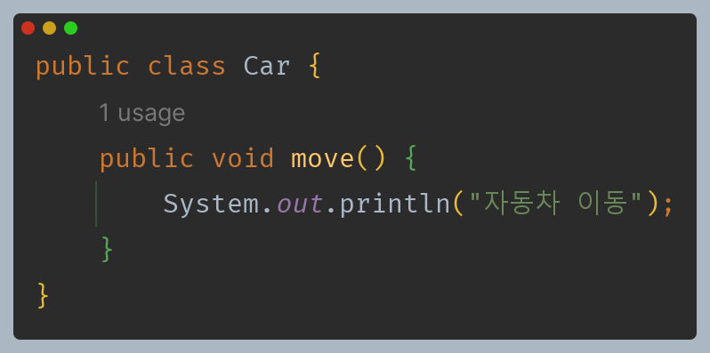
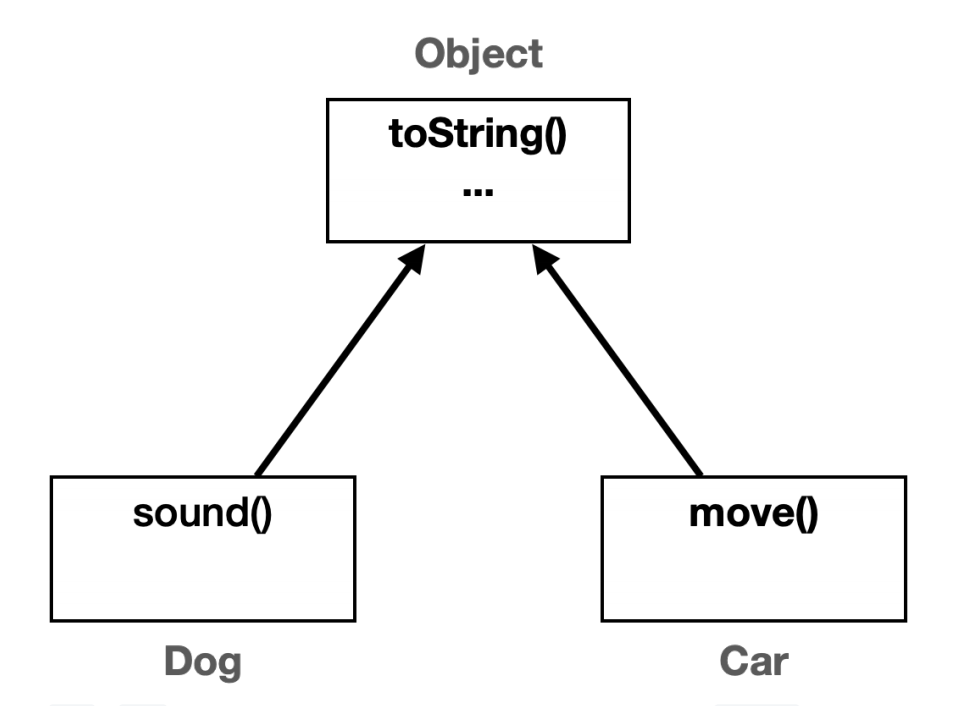
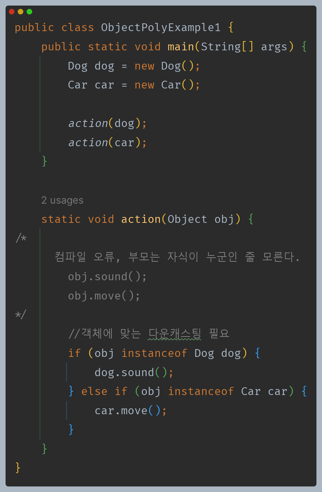
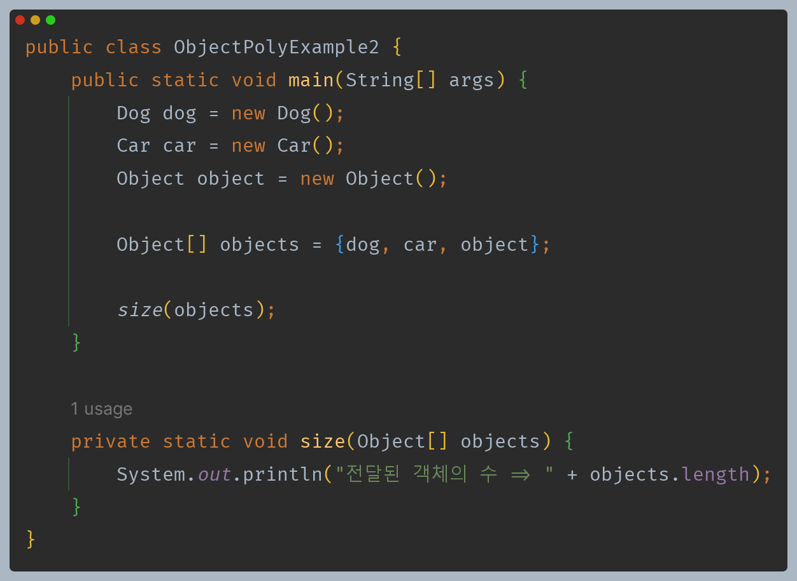
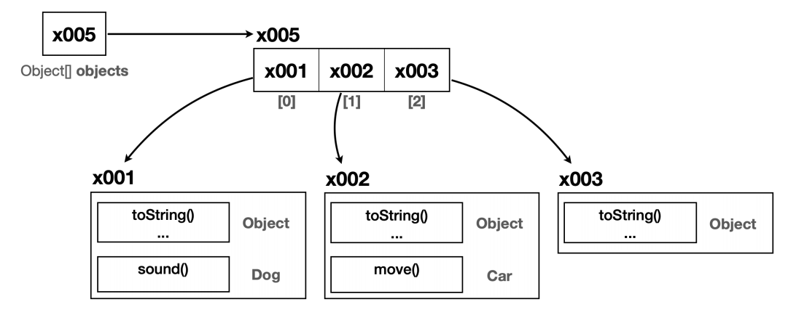

# 자바 - Object 클래스

## Object 다형성

- `Object`는 모든 클래스의 부모 클래스가 되기 때문에 모든 객체를 참조할 수 있다.

- 서로 아무런 관련이 없는 클래스이고, 둘다 부모가 없으므로 자동으로 `Object`를 상속 받는다.

- `action()`은 인자로 `Object` 타입의 매개변수를 사용한다. 그런데 `Object`는 모든 객체의 부모이기 때문에 어떤 객체든지 인자로 전달할 수 있다.
- 하지만 부모 클래스 입장에서는 자식 클래스의 메서드를 알 수가 없다.(오버라이딩 하지 않는 이상) 따라서 자식 클래스의 메서드를 호출하기 위해서는 다운캐스팅을 해야한다.

**또한 `Object`를 배열로 선언하면 모든 객체를 담을 수 있는 배열이 된다.**

---

[이전 ↩️ - 자바(Object 클래스) - Object 클래스]()

[메인 ⏫]()

[다음 ↪️ - 자바(Object 클래스) - `toString()`]()