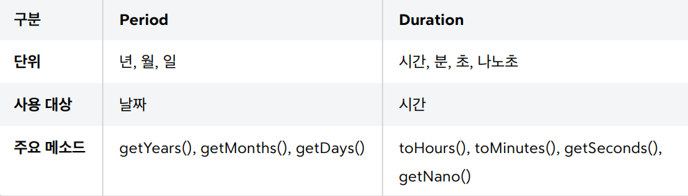
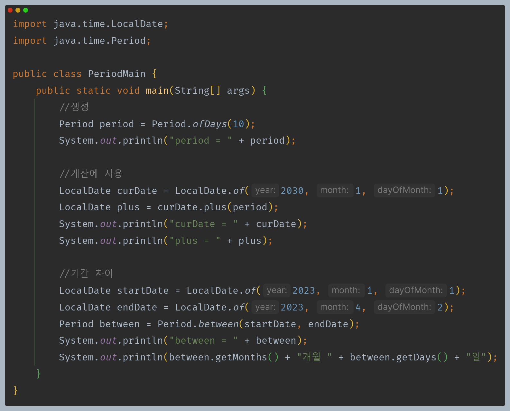
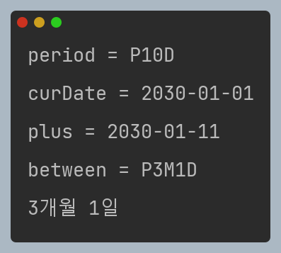
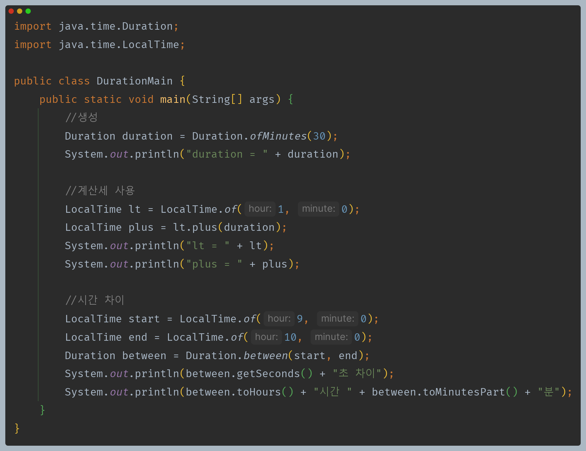
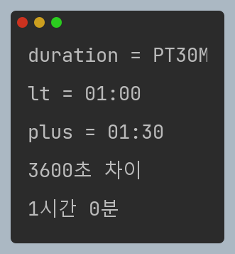

# 자바 - 날짜와 시간

## Duration, Period

- **시간의 개념은 크게 2가지로 표현할 수 있다.**
  - 특정 시점의 시간(시각)
  - 시간의 간격(기간)
- `Duration`, `Period`는 시간의 간격(`amount of time`)을 표현하는데 사용된다.

---

## Period

- 두 날짜 사이의 간격을 년, 월, 일 단위로 나타낸다.

---

## Duration

- 두 시간 사이의 간격을 시, 분, 초(나노초) 단위로 나타낸다.

---

[이전 ↩️ - 자바(날짜와 시간) - Instant](https://github.com/genesis12345678/TIL/blob/main/Java/mid_1/time/Instant.md)

[메인 ⏫](https://github.com/genesis12345678/TIL/blob/main/Java/mid_1/Main.md)

[다음 ↪️ - 자바(날짜와 시간) - 날짜와 시간 핵심 인터페이스](https://github.com/genesis12345678/TIL/blob/main/Java/mid_1/time/Interface.md)