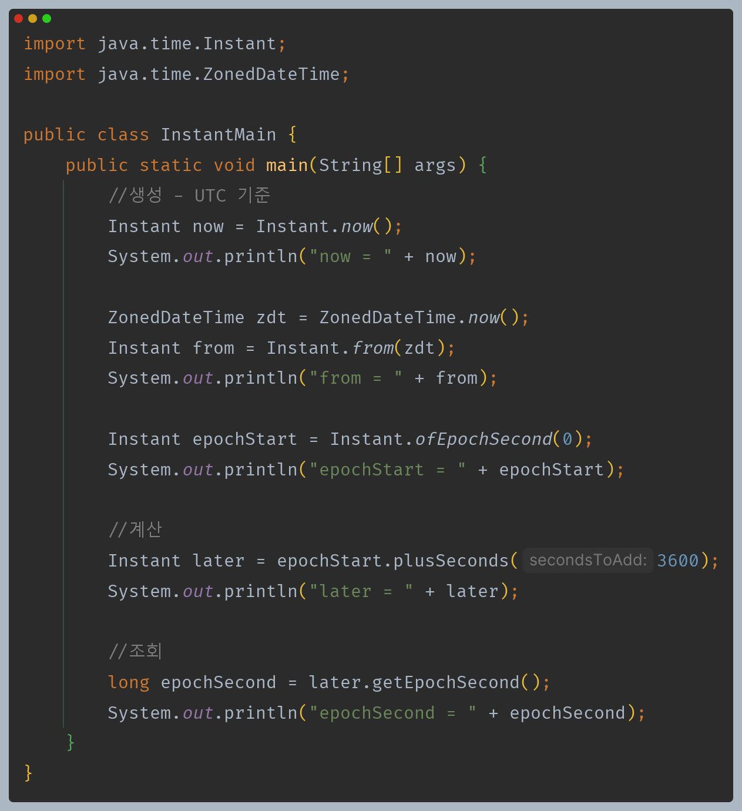
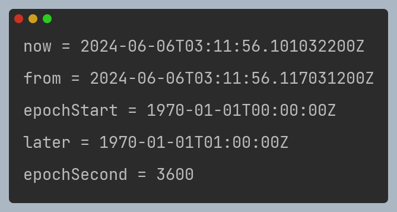

# 자바 - 날짜와 시간

## 기계 중심의 시간 - Instant

- `Instant`는 UTC 를 기준으로 하는 시간의 한 지점을 나타낸다.
- 날짜와 시간을 나노초 정밀도로 표현하며, 1970년 1월 1일 0시 0분 0초(UTC 기준)를 기준으로 경과한 시간으로 계산된다.
- 즉 `Instant` 내부에는 초 데이터만 들어있다.

---

[이전 ↩️ - 자바(날짜와 시간) - ZonedDateTime](https://github.com/genesis12345678/TIL/blob/main/Java/mid_1/time/ZonedDateTime.md)

[메인 ⏫](https://github.com/genesis12345678/TIL/blob/main/Java/mid_1/Main.md)

[다음 ↪️ - 자바(날짜와 시간) - Duration, Period](https://github.com/genesis12345678/TIL/blob/main/Java/mid_1/time/Duration.md)