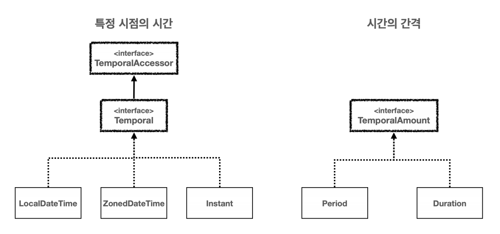
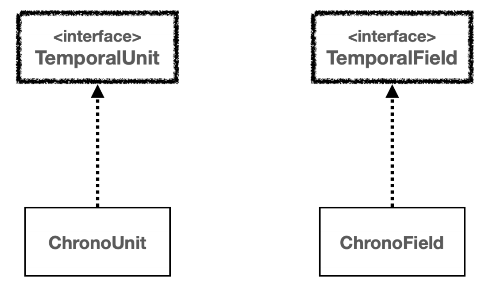
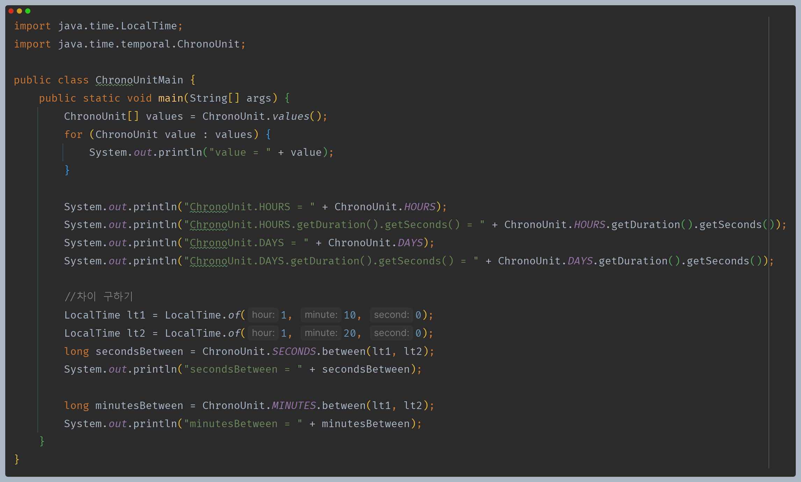
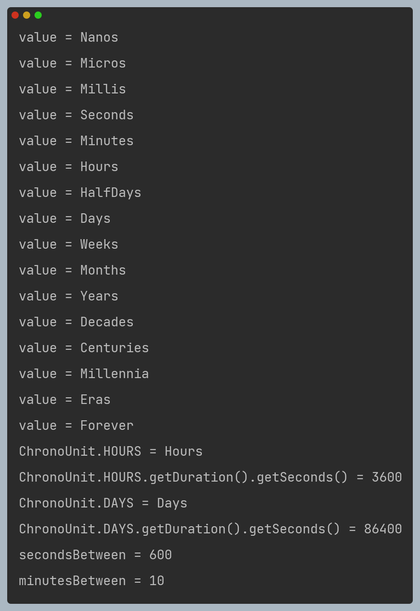
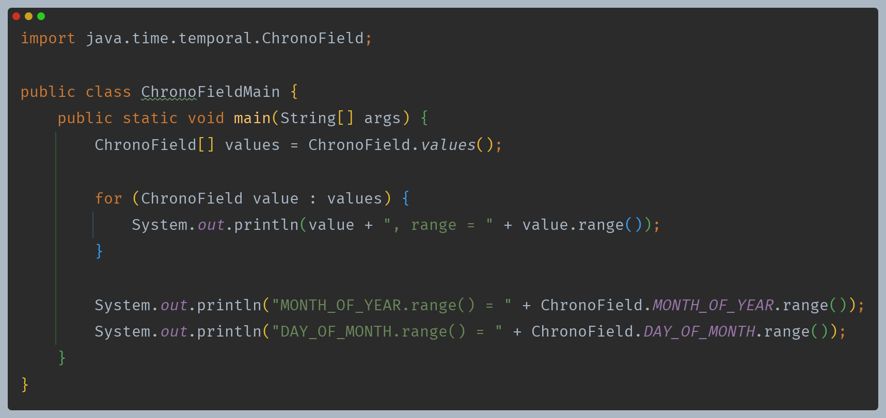
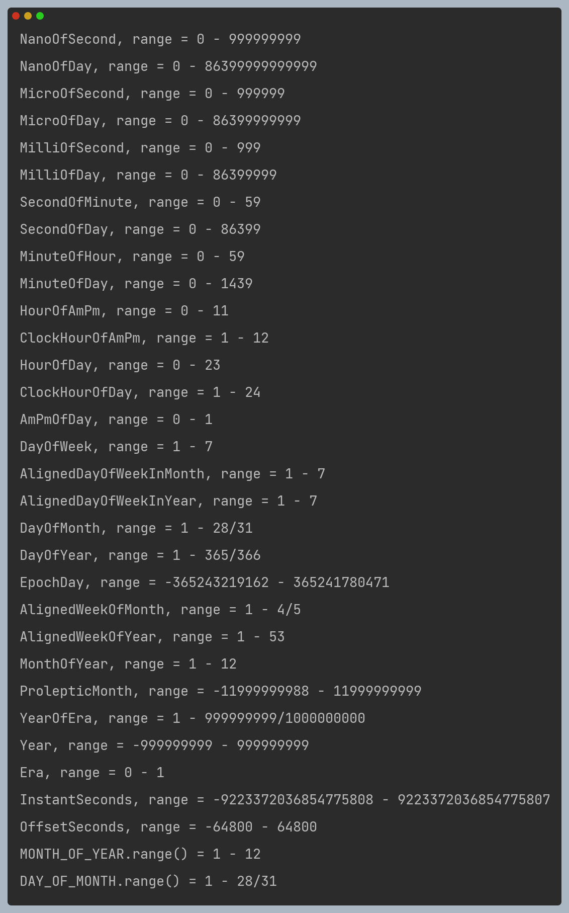

# 자바 - 날짜와 시간

## 날짜와 시간 핵심 인터페이스

- 날짜와 시간은 **특정 시점의 시간(시각)** 과 **시간의 간격(기간)** 으로 나눌 수 있다.

- **TemporalAccessor 인터페이스**
  - 날짜와 시간을 읽기 위한 기본 인터페이스
  - 이 인터페이스는 특정 시점의 날짜와 시간 정보를 읽을 수 있는 최소한의 기능을 제공한다.
- **Temporal 인터페이스**
  - `TemporalAccessor`의 하위 인터페이스로, 날짜와 시간을 조작하기 위한 기능을 제공한다.

즉, `TemporalAccessor`은 읽기 전용 접근을, `Temporal`은 읽기와 쓰기(조작)를 지원한다.

- **TemporalAmount 인터페이스**
    - 시간의 간격을 나타내며, 날짜와 시간 객체에 적용하여 그 객체를 조정할 수 있다.

### 시간의 단위와 시간 필드

- **시간의 단위 - TemporalUnit, ChronoUnit**
  - `TemporalUnit` 인터페이스는 날짜와 시간을 특정하는 단위를 나타낸다. 주로 사용되는 구현체는 `ChronoUnit` 열거형이 있다.
  - `ChronoUnit`은 다양한 시간 단위를 제공한다.
  - `TemporalField` 인터페이스는 날짜와 시간을 나타내는 데 사용된다. 주로 사용되는 구현체는 `ChronoField` 열거형이 있다.
  - `ChronoField`는 다양한 필드를 통해 날짜와 시간의 특정 부분을 나타낸다.

- `TemporalUnit(ChronoUnit)`, `TemporalField(ChronoField)`는 단독으로 사용하기 보다는 주로 날짜와 시간을 조회하거나 조작할 때 사용한다.

---

[이전 ↩️ - 자바(날짜와 시간) - Duration, Period](https://github.com/genesis12345678/TIL/blob/main/Java/mid_1/time/Duration.md)

[메인 ⏫](https://github.com/genesis12345678/TIL/blob/main/Java/mid_1/Main.md)

[다음 ↪️ - 자바(날짜와 시간) - 날짜와 시간 조회하고 조작하기](https://github.com/genesis12345678/TIL/blob/main/Java/mid_1/time/%EC%A1%B0%EC%9E%91.md)