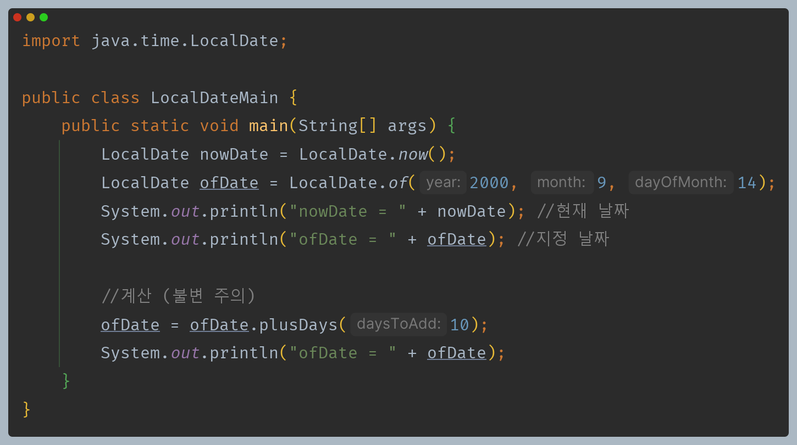
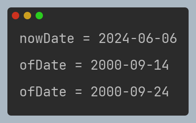
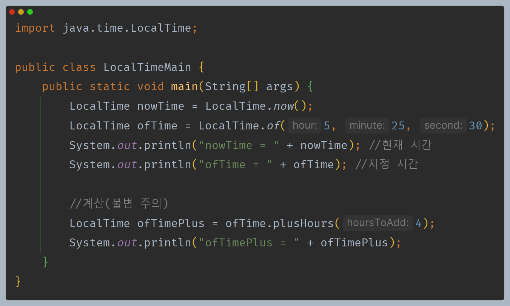
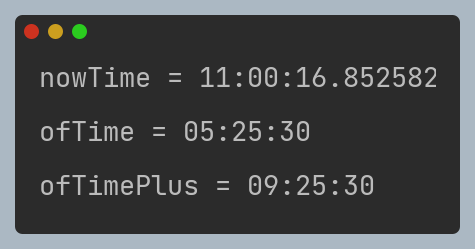
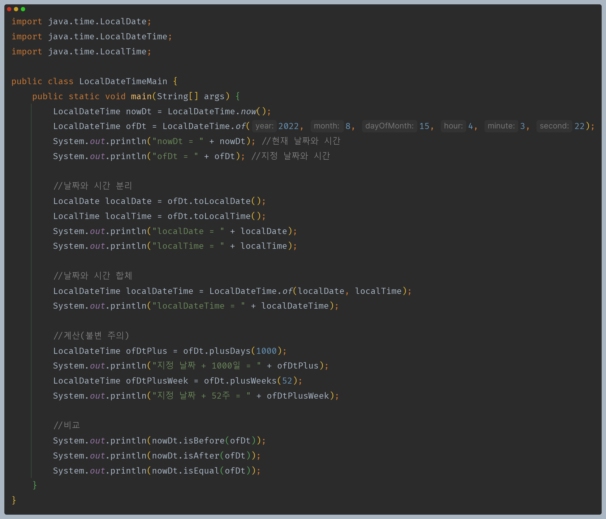
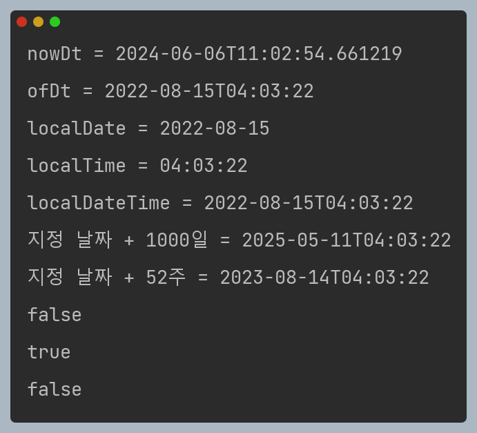

# 자바 - 날짜와 시간

## LocalDateTime

- 가장 기본이 되는 날짜와 시간 클래스는 `LocalDate`, `LocalTime`, `LocalDateTime`이 있다.
- **LocalDate** : 날짜만 표현(연, 월, 일)
- **LocalTime** : 시간만 표현(시, 분, 초(밀리초, 나노초))
- **LocalDateTime** : `LocalDate`와 `LocalTime`을 합한 개념

앞에 `Local`이 붙는 이유는 세계 시간대를 고려하지 않아서 타임존이 적용되지 않기 때문이다. 특정 지역의 날짜와 시간만 고려할 때 사용한다.

**LocalDate**

**LocalTime**

**LocalDateTime**

- `LocalDateTime`은 필드로 `LocalDate`와 `LocalTime`을 가지고 있다.
- `isEquals()` vs `eqauls()`
  - `isEquals()` : 단순히 시간을 계산해서 시간으로만 둘을 비교한다. 객체가 다르고 타임존이 달라도 시간적으로 같으면 `true`를 반환한다.
  - `equals()` : 객체의 타입, 타임존 등 내부 데이터의 모든 구성요소가 같아야 `true`를 반환한다.

---

[메인 ⏫](https://github.com/genesis12345678/TIL/blob/main/Java/mid_1/Main.md)

[다음 ↪️ - 자바(날짜와 시간) - ZonedDateTime](https://github.com/genesis12345678/TIL/blob/main/Java/mid_1/time/ZonedDateTime.md)