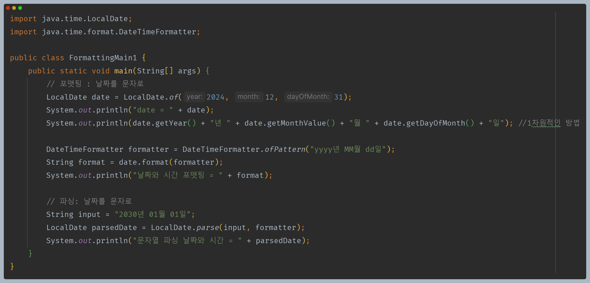
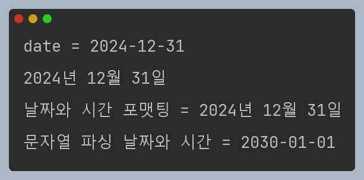
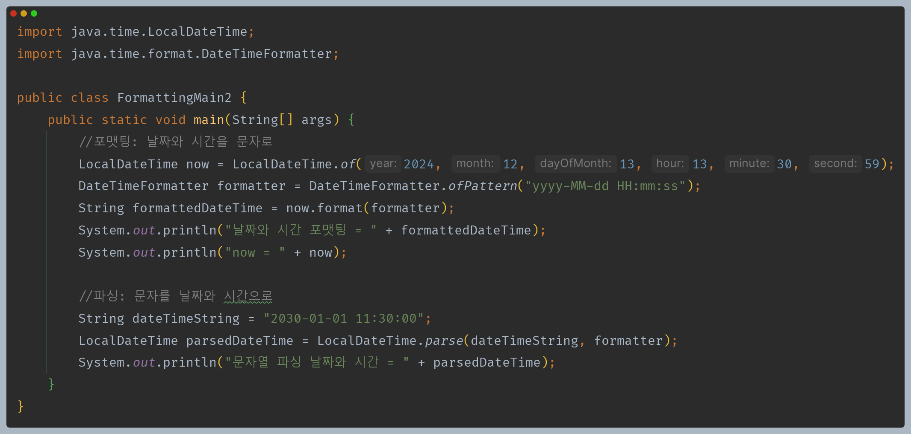
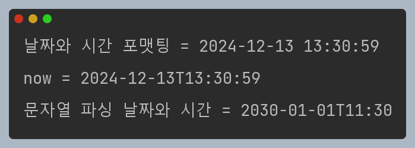

# 자바 - 날짜와 시간

## 문자열 파싱과 포맷팅

- **포맷팅** : 날짜와 시간 데이터를 원하는 포맷의 문자열로 변경
- **파싱** : 문자열을 날짜와 시간 데이터로 변경

---

[이전 ↩️ - 자바(날짜와 시간) - 날짜와 시간 조회하고 조작하기](https://github.com/genesis12345678/TIL/blob/main/Java/mid_1/time/%EC%A1%B0%EC%9E%91.md)

[메인 ⏫](https://github.com/genesis12345678/TIL/blob/main/Java/mid_1/Main.md)