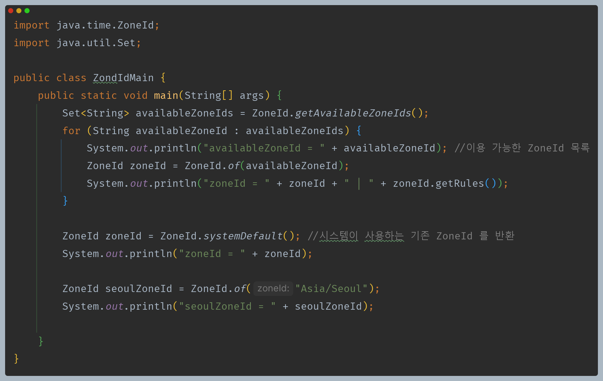
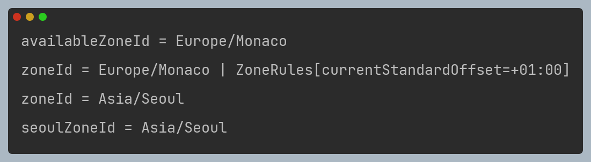
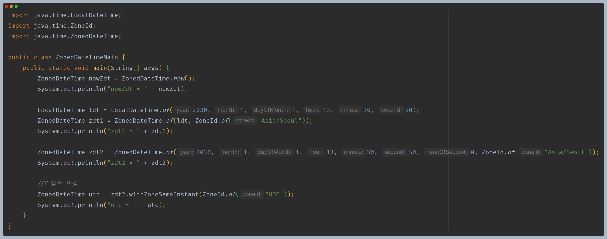
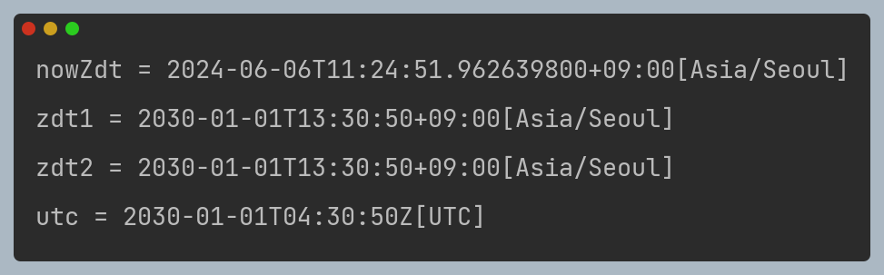
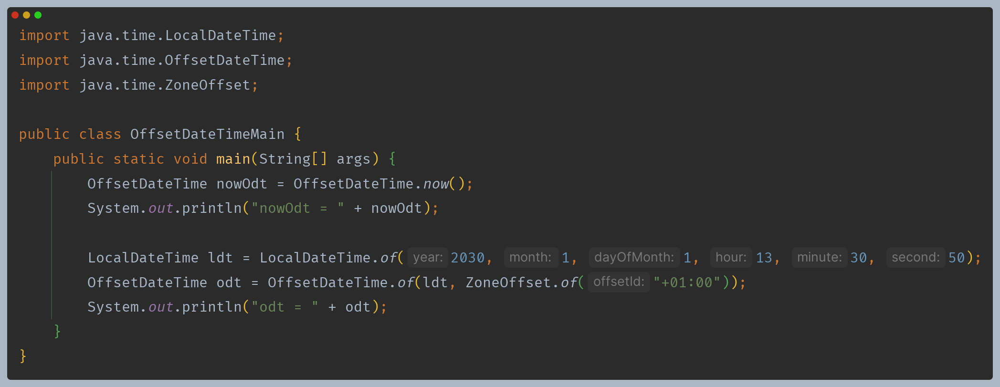
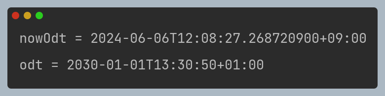

# 자바 - 날짜와 시간

## ZonedDateTime

- `Asia/Seoul` 같은 타임존 안에는 일광 절약 시간제에 대한 정보와 `UTC+9:00`와 같은 UTC로부터 시간 차이인 오프셋 정보를 모두 포함하고 있다.

### ZoneId

자바는 타임존을 `ZoneId` 클래스로 제공한다.

- 원래는 `availableZoneId`가 수백개가 출력된다.

### ZonedDateTime

- `ZonedDateTime`은 `LocalDateTime`에 시간대 정보인 `ZoneId`가 합쳐진 것이다.
- `ZonedDateTime` : 시간대를 고려한 날짜와 시간을 표현할 때 사용한다. 여기에는 시간대를 표현하는 타임존이 포함된다.

### OffsetDateTime

- `OffsetDateTime`은 `LocalDateTime`에 UTC 오프셋 정보인 `ZoneOffset`이 합쳐진 것이다.
- `OffsetDateTime` : 시간대를 고려한 날짜와 시간을 표현할 때 사용한다. 여기에는 타임존은 없고, UTC로 부터의 시간대 차이인 고정된 오프셋만 포함한다.

---

[이전 ↩️ - 자바(날짜와 시간) - LocalDateTime](https://github.com/genesis12345678/TIL/blob/main/Java/mid_1/time/LocalDateTime.md)

[메인 ⏫](https://github.com/genesis12345678/TIL/blob/main/Java/mid_1/Main.md)

[다음 ↪️ - 자바(날짜와 시간) - Instant](https://github.com/genesis12345678/TIL/blob/main/Java/mid_1/time/Instant.md)