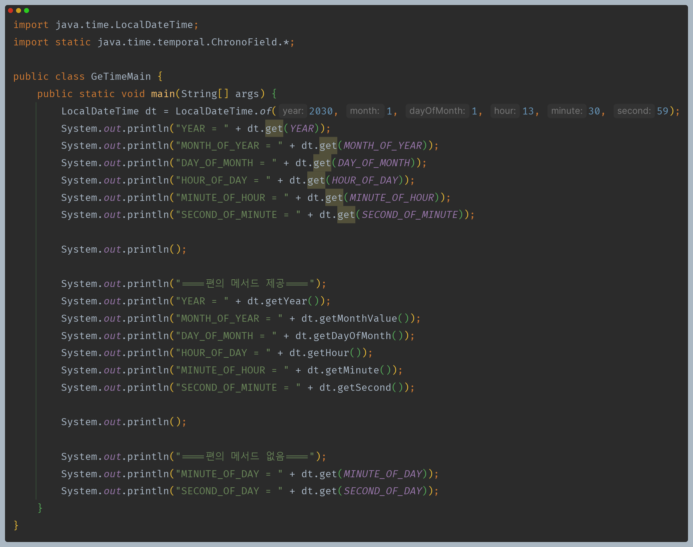
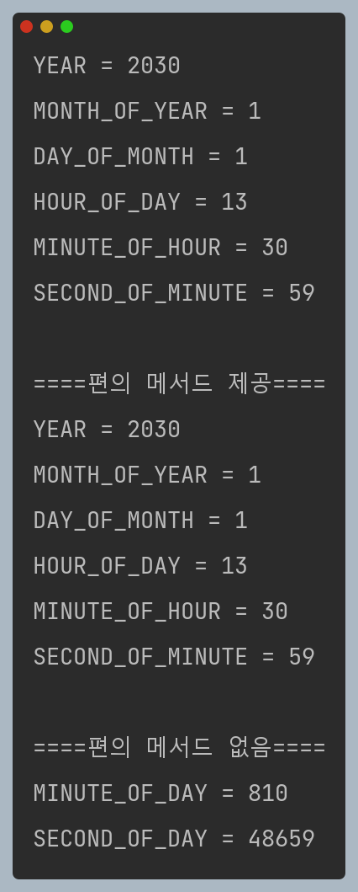
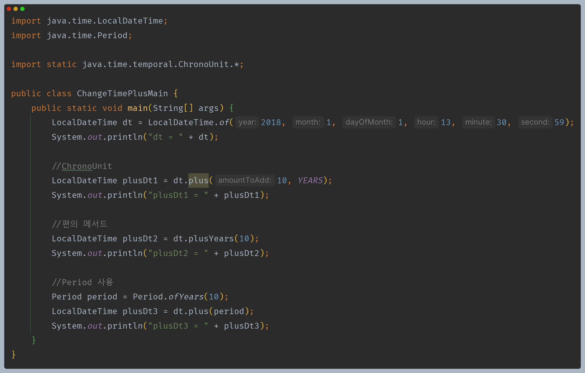
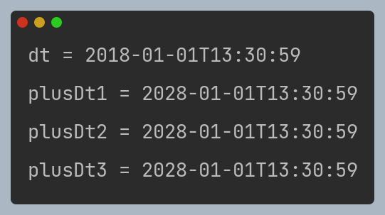
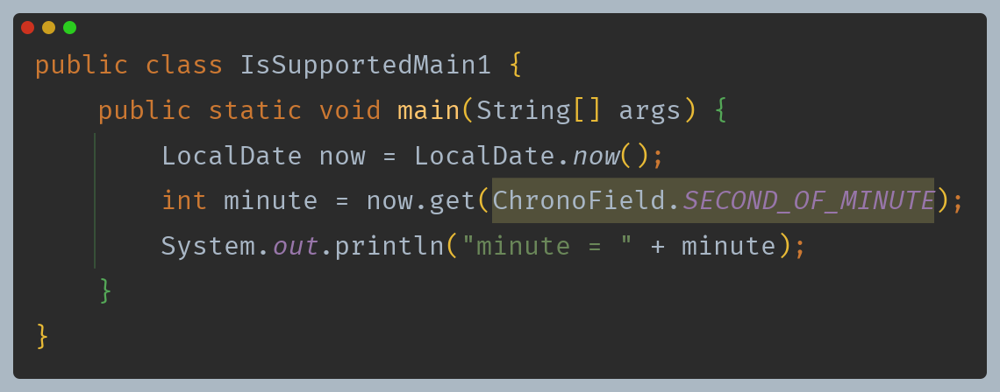
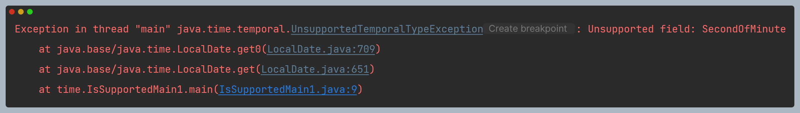
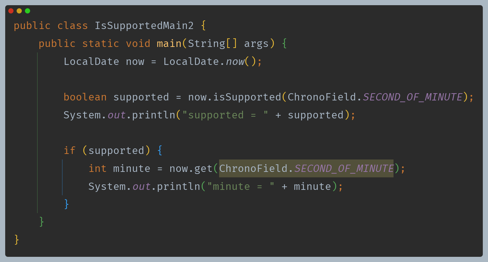
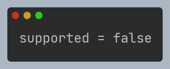
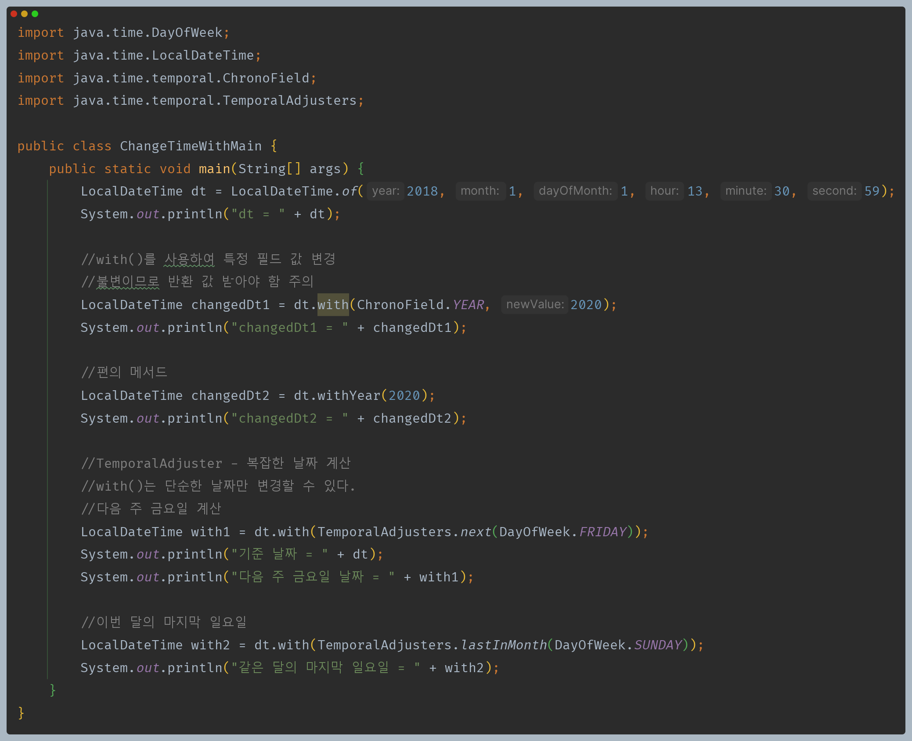
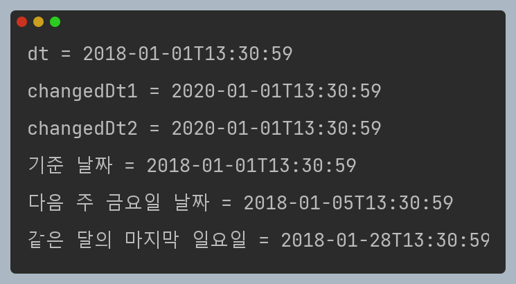

# 자바 - 날짜와 시간

## 날짜와 시간 조회하고 조작하기 - 1

- 날짜와 시간을 조회하려면 날짜와 시간 항목 중에 어떤 필드를 조회할 지 선택해야 한다. 이때 날짜와 시간을 뜻하는 `ChronoField`가 사용된다.

- 날짜와 시간을 조작하려면 어떤 시간 단위를 변경할 지 선택해야 한다. 이때 날짜와 시간의 단위를 뜻하는 `ChronoUnit`이 사용된다.

이렇게 일관성 있게 시간을 조회하고 조작할 수 있지만, 모든 시간 필드를 다 조회할 수 있는 것은 아니다.

- `LocalDate` 는 분에 대한 정보가 없기 때문에 예외가 발생한다.
- 이런 문제를 예방하기 위해 `TemporalAccessor`와 `Temporal` 인터페이스는 현재 타입에서 특정 시간 단위나 필드를 사용할 수 있는지 확인할 수 있는 `isSupported()` 메서드를 제공한다.

---

## 날짜와 시간 조회하고 조작하기 - 2

---

[이전 ↩️ - 자바(날짜와 시간) - 날짜와 시간 핵심 인터페이스]()

[메인 ⏫](https://github.com/genesis12345678/TIL/blob/main/Java/mid_1/Main.md)

[다음 ↪️ - 자바(날짜와 시간) - 문자열 파싱과 포맷팅]()