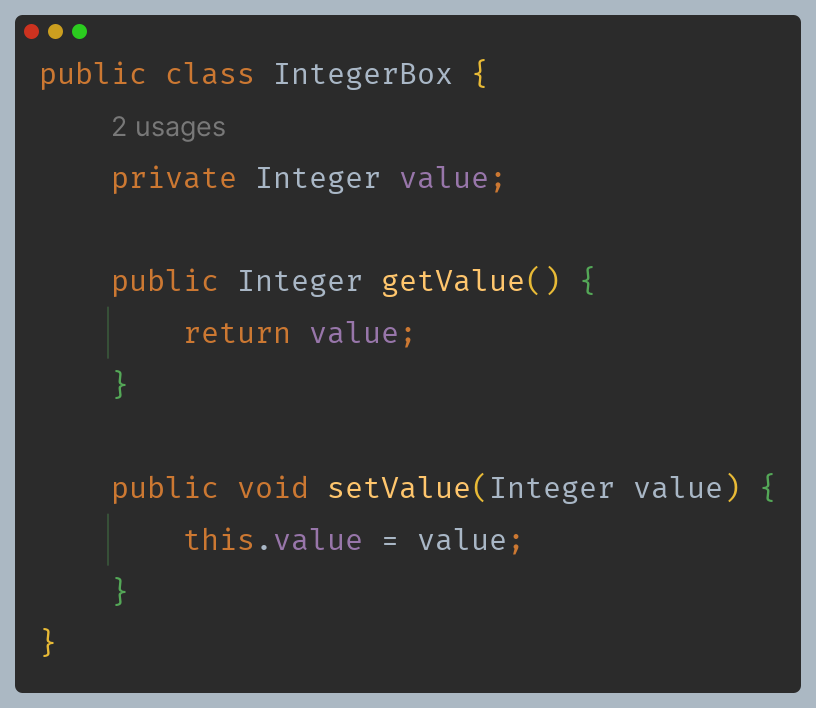
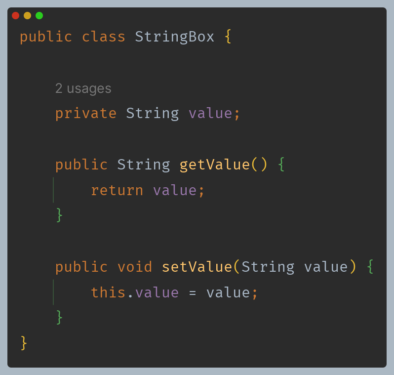
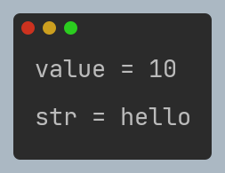
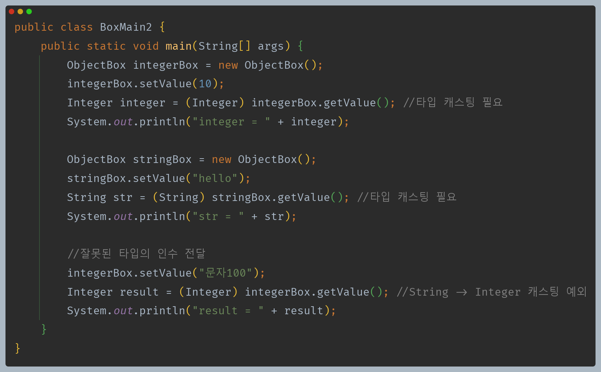
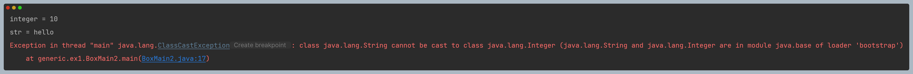

# 자바 - 제네릭

## 제네릭이 필요한 이유

- 숫자와 문자열을 보관하는 각 클래스를 만들었다.
- 이후에 `Double`, `Boolean` 등 다양한 타입을 담는 박스가 필요하다면 각각의 타입별로 새로운 클래스를 생성해야 한다.
- 그렇게 되면 거의 비슷한 클래스들이 수십개 생겨날 것이다.

---

**`Object`를 사용해서 다형성으로 이 문제를 해결해보자.**

- 다형성을 활용한 덕분에 코드의 중복을 제거하고, 기존 코드를 재사용 할 수 있게 되었다.
- 하지만 입력할 때 실수로 원하지 않는 타입이 들어갈 수 있는 타입 안전성 문제가 발생한다.
- `set()`의 매개변수가 `Object`이기 때문에 다른 타입의 값을 입력할 수 있고, 반환도 `Object`를 반환하기 때문에
    원하는 타입을 정확하게 받을 수 없고, 항상 위험한 다운 캐스팅을 시도해야 한다.
- 각각의 타입별로 `xxxBox`와 같은 클래스를 모두 정의하면 코드 재사용성은 떨어지지만 타입 안전성 문제는 발생하지 않는다.
- `Object`를 사용하면 코드 재사용성은 가능하지만 타입 안전성 문제가 발생한다.

**제네릭을 사용하여 코드 재사용성과 타입 안전성을 동시에 챙길 수 있다.**

---

[메인 ⏫](https://github.com/genesis12345678/TIL/blob/main/Java/mid_2/Main.md)

[다음 ↪️ - 자바(제네릭) - 제네릭]()