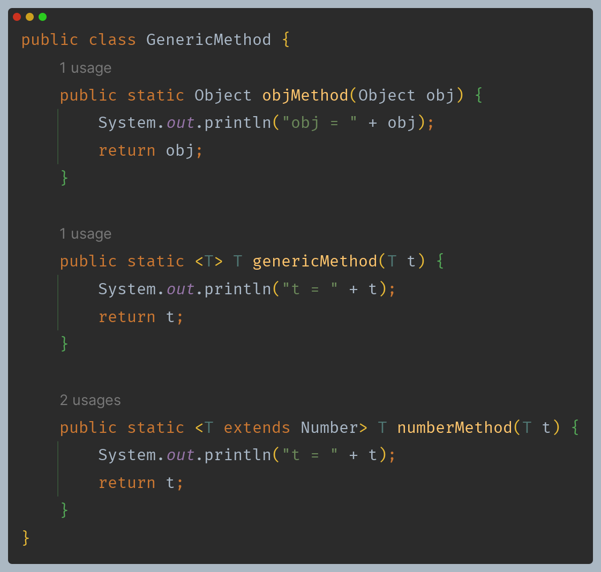
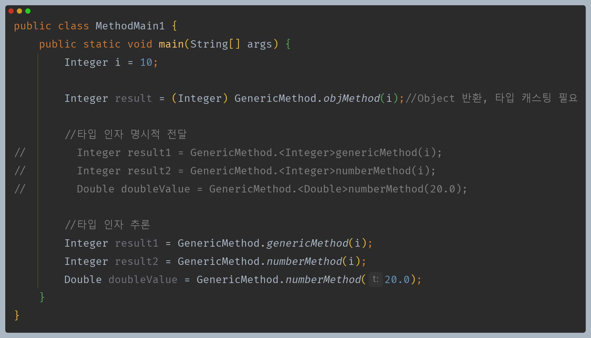
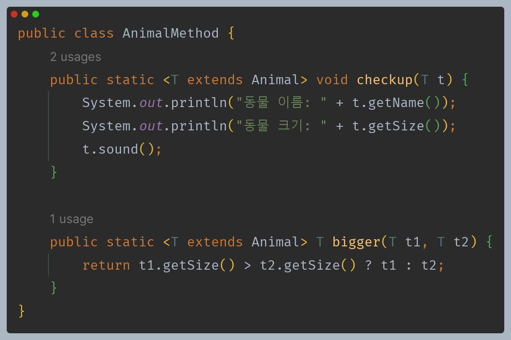
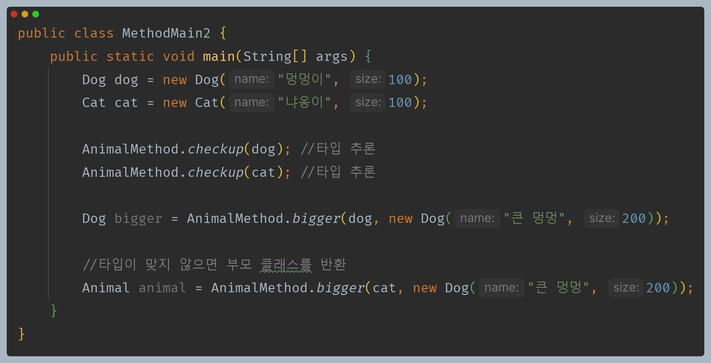
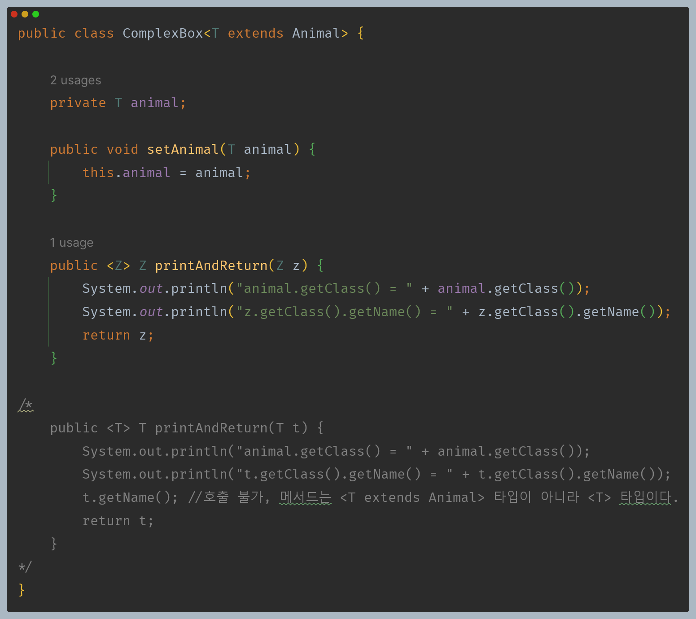

# 자바 - 제네릭

## 제네릭 메서드

- 특정 메서드에 제네릭을 적용한 메서드를 제네릭 메서드라 한다.
- 제네릭 타입과 제네릭 메서드는 둘다 제네릭을 사용하기는 하지만 서로 다른 기능을 제공한다.





**제네릭 타입**
- 정의 : `GenericClass<T>`
- 타입 인자 전달 : 객체를 생성하는 시점
  - `new GenericClass<String>`

**제네릭 메서드**
- 정의 : `<T> T genericMethod(T t)`
- 타입 인자 전달 : 메서드를 호출하는 시점
  - `GenericMethod.<Integer>genericMethod(i)`
- 제네릭 메서드는 클래스 전체가 아니라 특정 메서드 단위로 제네릭을 도입할 때 사용한다.
- 제네릭 메서드를 정의할 때는 메서드의 반환 타입 왼쪽에 `<>`(다이아몬드)를 사용해서 `<T>`와 같이 타입 매개변수를 적어준다.
- 제네릭 메서드는 메서드를 실제 호출하는 시점에 다이아몬드를 사용해서 타입을 정하고 호출한다.
- 제네릭 메서드의 핵심은 메서드를 호출하는 시점에 타입 인자를 전달해서 타입 인자를 지정하는 것이다. 따라서 타입을 지정하면서 메서드를 호출한다.

**제네릭 메서드는 인스턴스 메서드와 `static` 메서드에 모두 적용할 수 있다.**

```java
class Box<T> { //제네릭 타입
    static <V> V staticMethod2(V t) {} //static 메서드에 제네릭 메서드 도입 
    <Z> Z instanceMethod2(Z z) {} //인스턴스 메서드에 제네릭 메서드 도입 가능 
}
```

- 하지만 제네릭 타입은 `static` 메서드에 타입 매개변수를 사용할 수 없다.
- 제네릭 타입은 객체를 생성하는 시점에 타입이 정해지는데, `static` 메서드는 인스턴스 단위가 아니라 클래스 단위로 작동하기 때문에 제네릭 타입과는 무관하다.
- 따라서 `static` 메서드에 제네릭을 도입하려면 제네릭 메서드를 사용해야 한다.

```java
class Box<T> {
    T instanceMethod(T t) {} //가능
    static T staticMethod1(T t) {} //제네릭 타입의 T 사용 불가능 
}
```

**타입 매개변수 제한**
- 제네릭 메서드도 제네릭 타입과 같이 타입 매개변수 제한 할 수 있다.

**제네릭 메서드 타입 추론**
- 자바 컴파일러는 제네릭 메서드에 전달되는 인자의 타입을 보고 타입 인자를 추론할 수 있다.

---

## 제네릭 메서드 활용

제네릭 타입으로 만들었던 코드를 제네릭 메서드를 사용해 만들어보자.





### 제네릭 타입과 제네릭 메서드 우선순위

- 정적 메서드는 제네릭 메서드만 적용할 수 있지만, 인스턴스 메서드는 제네릭 타입도 제네릭 메서드도 둘다 적용할 수 있다.
- 여기에 제네릭 타입과 제네릭 메서드의 타입 매개변수를 같은 이름으로 사용하면 어떻게 될까?



- 제네릭 타입보다 제네릭 메서드가 높은 우선순위를 가진다.
- 밑에 주석 처리된 메서드는 제네릭 타입과는 무관하고 제네릭 메서드가 적용된다.
- 여기서 적용된 제네릭 메서드의 타입 매개변수 `T`는 상한이 없기 때문에 `Object`로 취급된다.

프로그래밍에서 이렇게 모호하면 좋지 않으니 애초에 이름이 같지 않도록 하자.

---

[이전 ↩️ - 자바(제네릭) - 타입 매개변수 제한]()

[메인 ⏫](https://github.com/genesis12345678/TIL/blob/main/Java/mid_2/Main.md)

[다음 ↪️ - 자바(제네릭) - 와일드카드]()