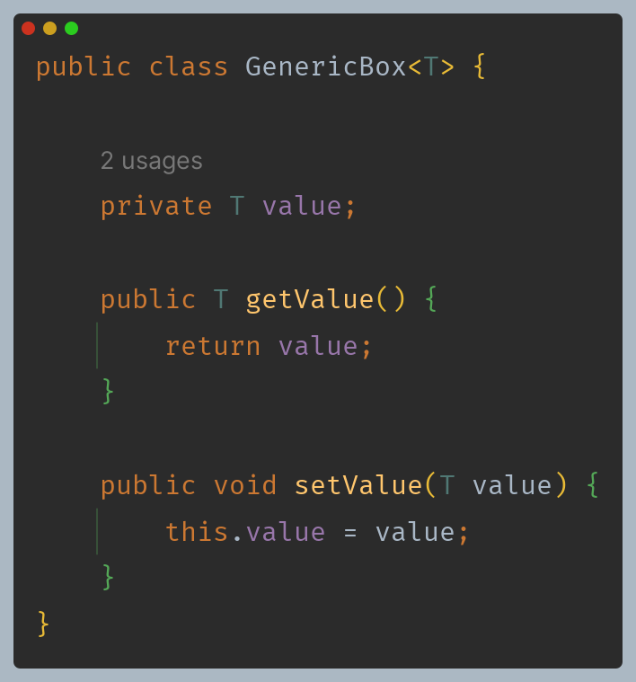
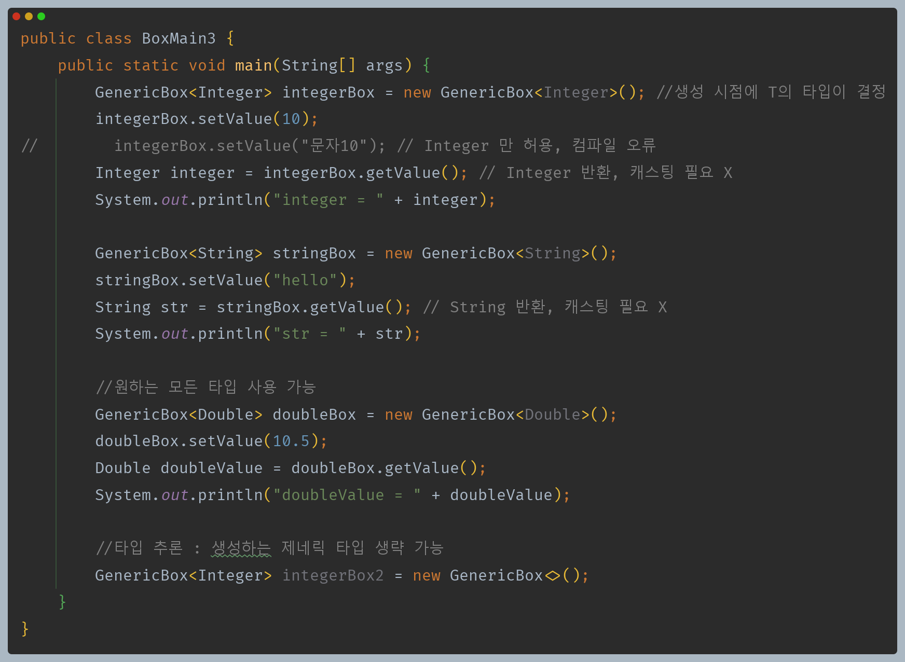
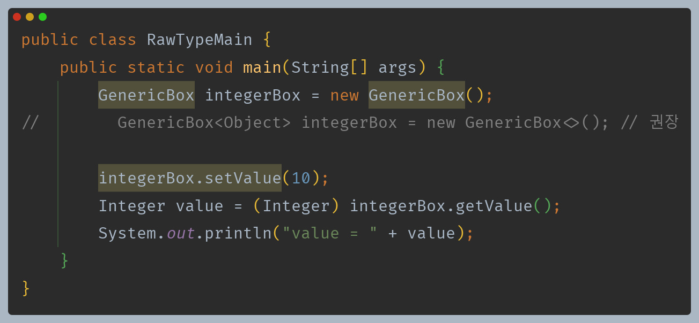
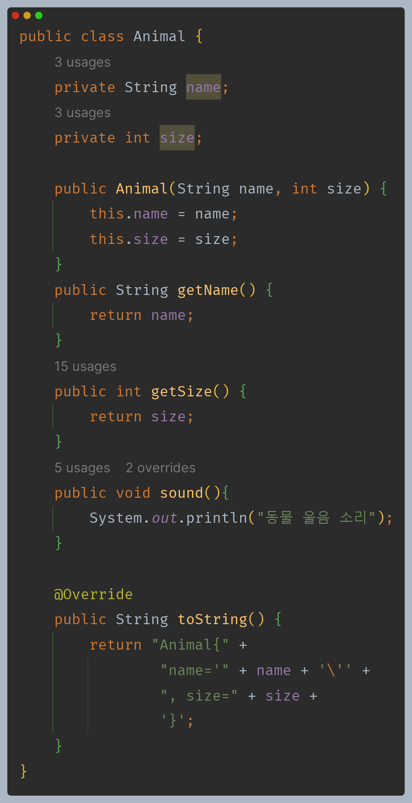
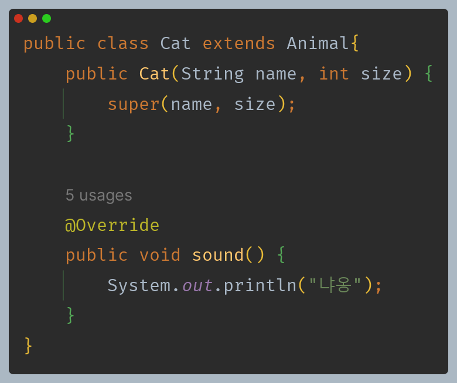
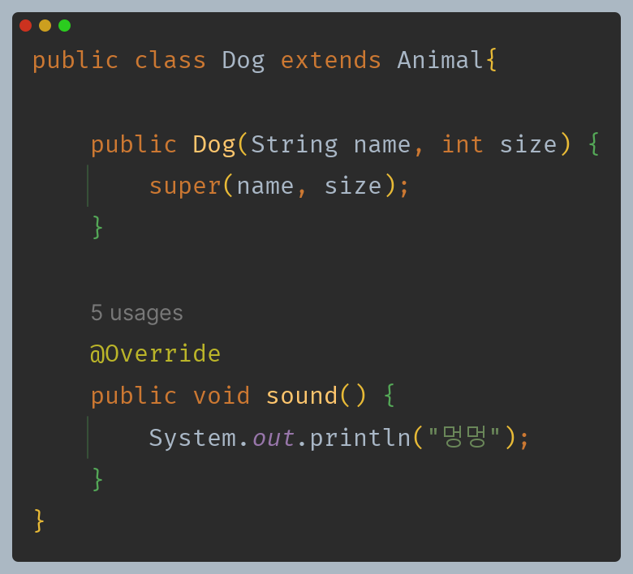
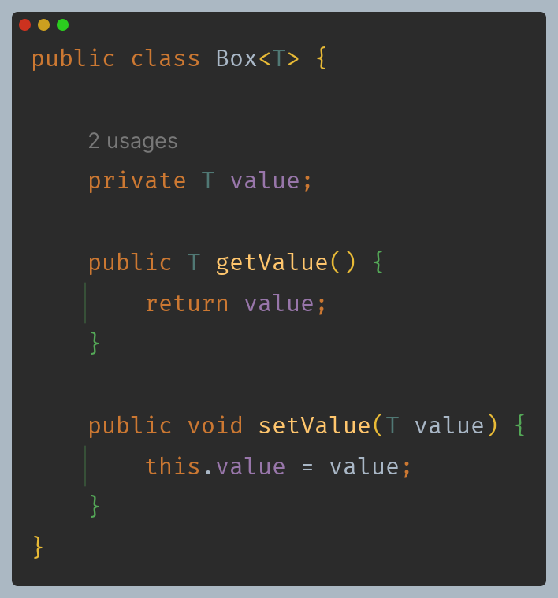
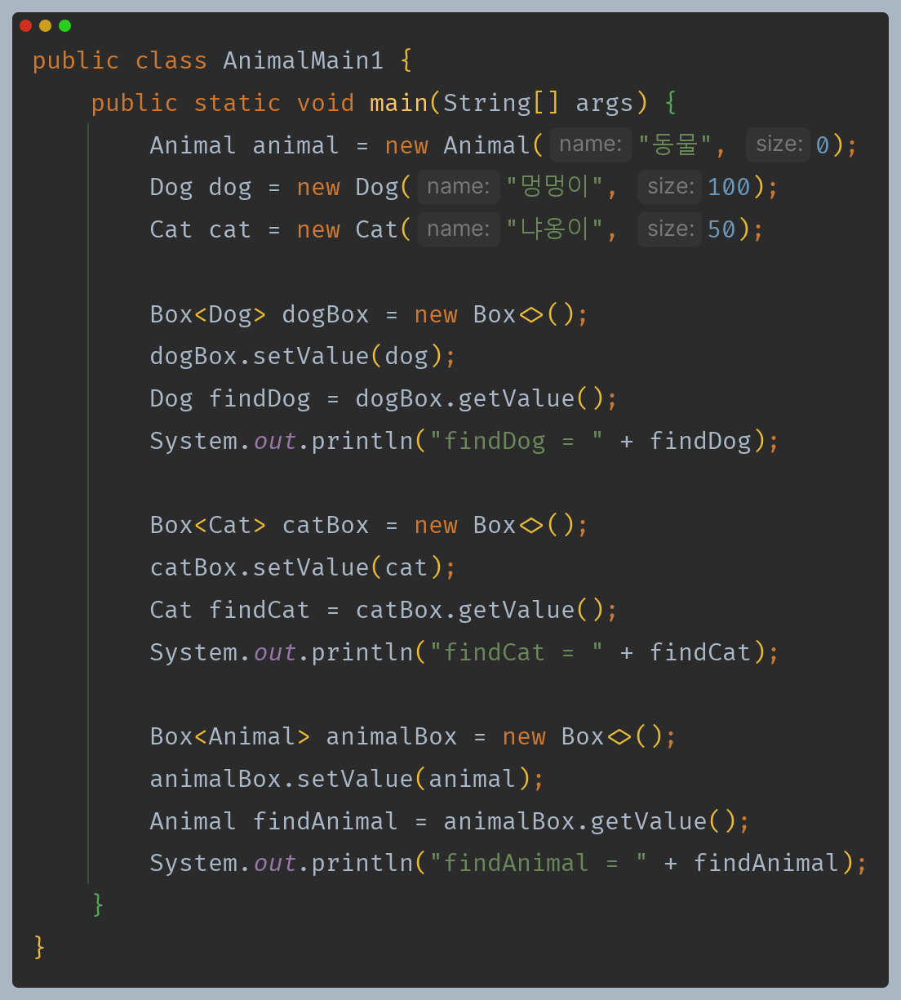
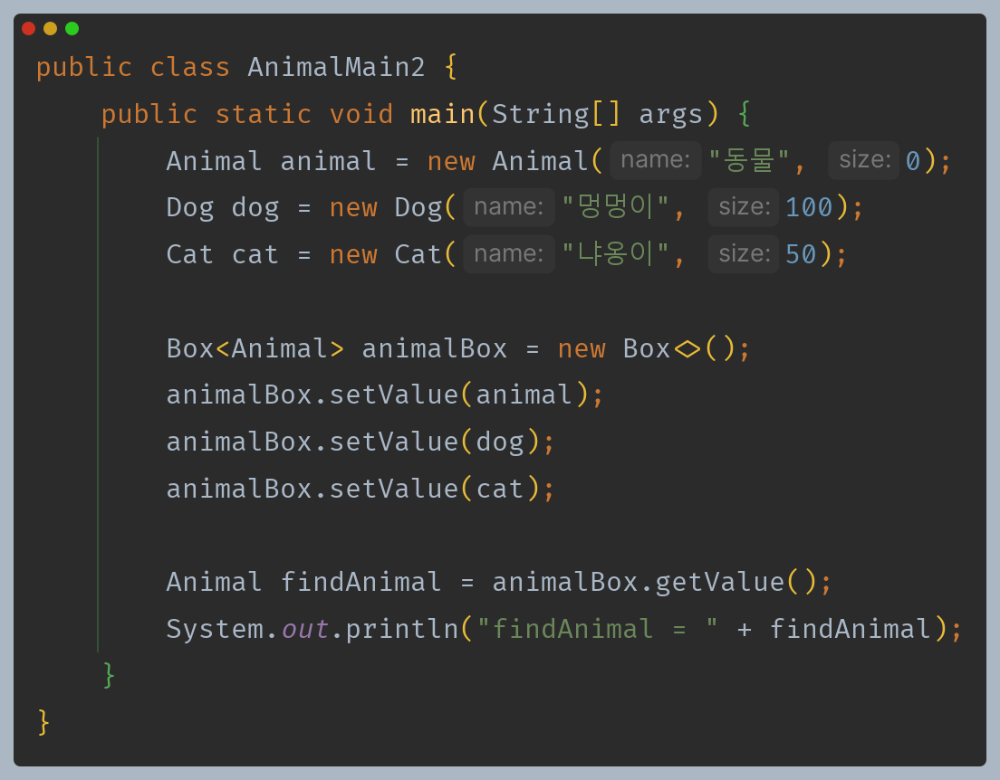

# 자바 - 제네릭

## 제네릭

**제네릭을 사용하여 코드 재사용과 타입 안전성 둘 다를 챙겨보자.**



- `<>`(다이아몬드)를 사용한 클래스를 제네릭 클래스라 한다.
- 제네릭 클래스를 사용할 때는 `Integer`, `String` 같은 타입을 미리 결정하지 않는다.
- 대신에 클래스명 오른쪽에 `<T>`와 같이 선언하면 제네릭 클래스가 된다. 여기서 `T`를 **타입 매개변수**라고 한다. 이 타입 매개변수는
    이후에 `Integer`, `String`으로 변할 수 있다.
- 그리고 클래스 내부에 `T` 타입이 필요한 곳에 `T value`와 같이 타입 매개변수를 적어두면 된다.



T에 Integer를 적용하면 다음과 같다.

```java
public class GenericBox<Integer> {
    private Integer value;
    
    public void set(Integer value) {
        this.value = value;
    }
    public Integer get() {
        return value;
    }
}
```

T에 String을 적용하면 다음과 같다.

```java
public class GenericBox<String> {
    private String value;
    
    public void set(String value) {
        this.value = value;
    }
    public String get() {
        return value;
    }
}
```

- 제네릭을 도입한다고 해서 위와 같은 코드가 실제 만들어지는 것은 아니다.
- 대신에 자바 컴파일러가 우리가 입력한 타입 정보를 기반으로 이런 코드가 있다고 가정하고 컴파일 과정에 타입 정보를 반영한다.
- 이 과정에서 타입이 맞지 않으면 컴파일 오류가 발생한다.

**타입 추론**
- 자바는 왼쪽에 있는 변수를 선언할 때의 타입을 보고 오른쪽에 있는 객체를 생성할 때 타입 정보를 얻을 수 있다.
- 따라서 오른쪽 코드에서 타입 정보를 생략할 수 있다.
- 이렇게 자바가 스스로 타입 정보를 추론해서 개발자가 타입 정보를 생략할 수 있는 것을 **타입 추론**이라고 한다.
- 타입 추론은 자바 컴파일러가 타입을 추론할 수 있는 상황에만 가능하다. 읽을 수 있는 타입 정보가 주변에 있어야 추론할 수 있다.

---

## 제네릭 용어와 관례

- 제네릭의 핵심은 **사용할 타입을 미리 결정하지 않는다는 점**이다.
- 클래스 내부에서 사용하는 타입을 클래스를 정의하는 시점에 결정하는 것이 아니라 실제 사용하는 생성 시점에 타입을 결정하는 것이다.
- 이것은 메서드의 **매개변수와 인자**의 관계와 비슷하다.

**메서드의 매개변수와 인자**

```java
void method(String param) //매개변수 
        
void main() {
    String arg = "hello";
    method(arg) //인수 전달
}
```

메서드의 매개변수에 인자를 전달해서 메서드의 사용 값을 전달한다.

**제네릭의 타입 매개변수와 타입 인자**
- 제네릭도 메서드의 매개변수와 인자의 관계와 비슷하게 작동한다.
- 제네릭 클래스를 정의할 때 내부에서 사용할 타입을 미리 결정하는 것이 아니라, 해당 클래스를 실제 사용하는 생성 시점에 내부에서
    사용할 타입을 결정하는 것이다.
- 차이가 있다면 **메서드의 매개변수는 사용할 값에 대한 결정을 나중으로 미루는 것**이고, **제네릭의 타입 매개변수는 사용할 
    타입에 대한 결정을 나중으로 미루는 것**이다.
- 메서드는 **매개변수에 인자**를 전달해서 사용할 값을 결정한다.
- 제네릭은 **타입 매개변수에 타입 인자**를 전달해서 사용할 타입을 결정한다.

제네릭 타입의 타입 매개변수 `<T>`에 타입 안자를 전달해서 제네릭의 사용 타입을 결정한다.
- 타입 매개변수 : `Generic<T>`에서 `T`
- 타입 인자
  - `Generic<Integer>`에서 `Integer`
  - `Generic<String>`에서 `String`

**제네릭 명명 관례**

- 타입 매개변수는 일반적인 변수명처럼 소문자로 사용해도 상관 없다.
- 하지만 일반적으로 대문자를 사용하고 용도에 맞는 단어의 첫 글자를 사용하는 관례를 따른다.
- 주로 사용하는 키워드
  - `E` - Element
  - `K` - Key
  - `N` - Number
  - `T` - Type
  - `V` - Value
  - `S, U, V` -  2nd, 3rd, 4th types

다음과 같이 한번에 여러 타입 매개변수를 선언할 수 있다.
```java
class Data<K, V>{...}
```

**타입 인자로 기본형은 사용할 수 없다.**

---

> ### 기타 - raw type
> 
> 
> 
> - 제네릭 타입을 사용할 때는 항상 `<>`를 사용해서 사용 시점에 원하는 타입을 지정해야 한다.
> - 그런데 `<>`를 지정하지 않을 수 있는데, 이런 것을 로 타입(raw type), 또는 원시 타입 이라 한다.
> - 원시 타입을 사용하면 내부의 타입 매개변수가 `Object`로 사용된다고 보면 된다.

---

## 제네릭 활용 예제











`Animal`은 부모 클래스이기 때문에 다음과 같이도 가능하다.



물론 꺼낼 때는 `Animal` 타입으로만 꺼낼 수 있다.

---

[이전 ↩️ - 자바(제네릭) - 제네릭이 필요한 이유]()

[메인 ⏫](https://github.com/genesis12345678/TIL/blob/main/Java/mid_2/Main.md)

[다음 ↪️ - 자바(제네릭) - 타입 매개변수 제한]()