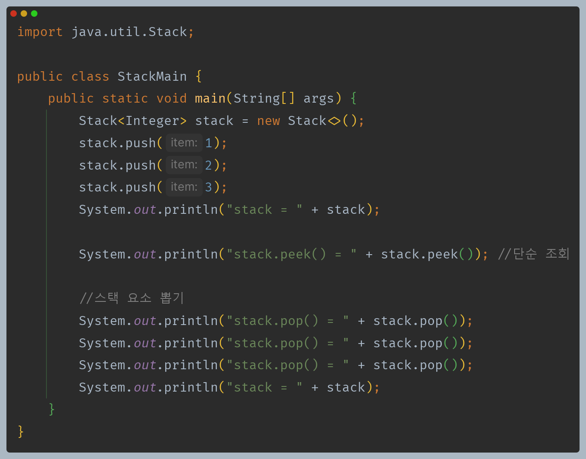
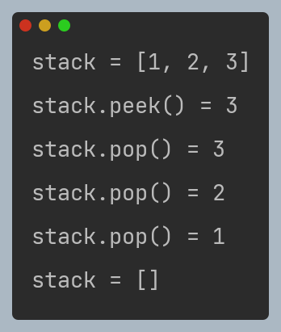
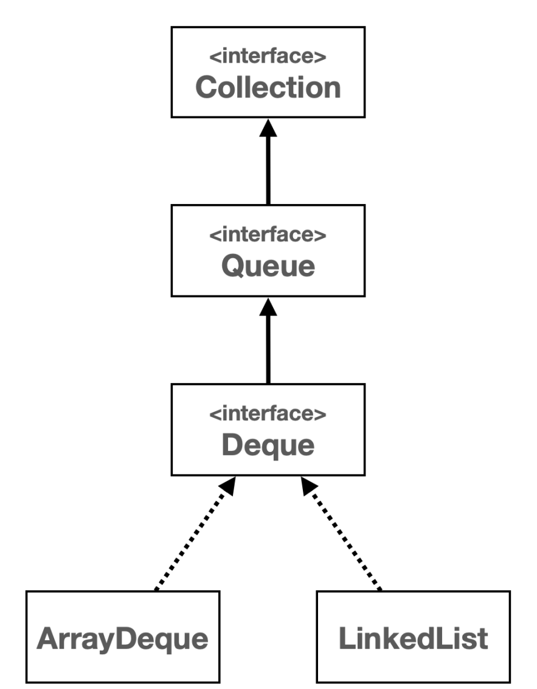
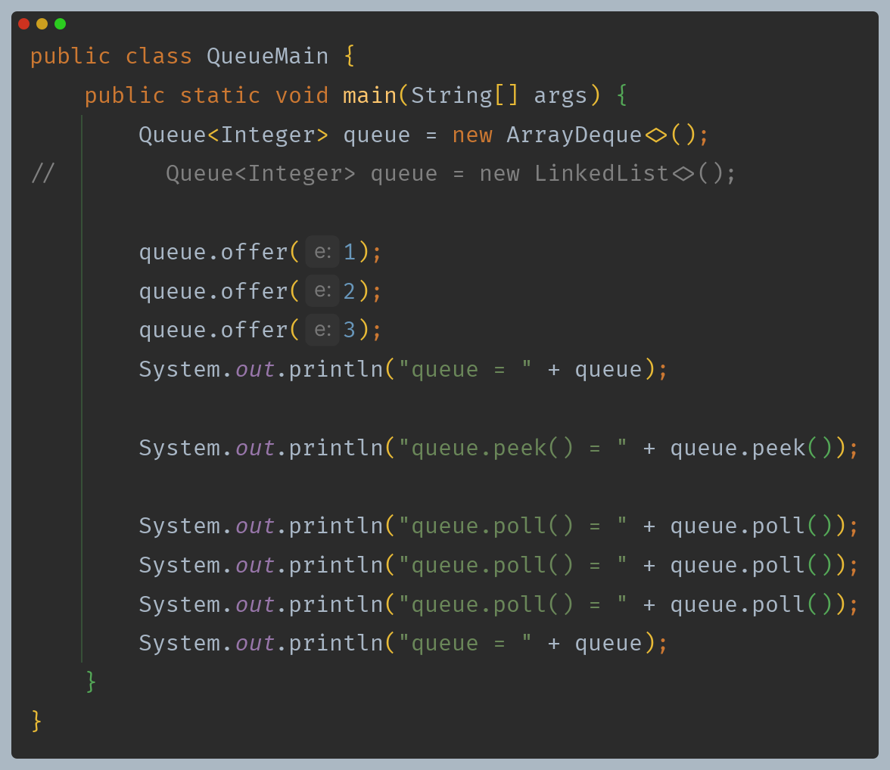
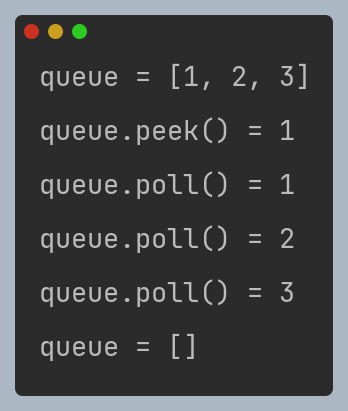
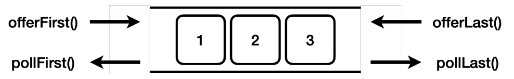
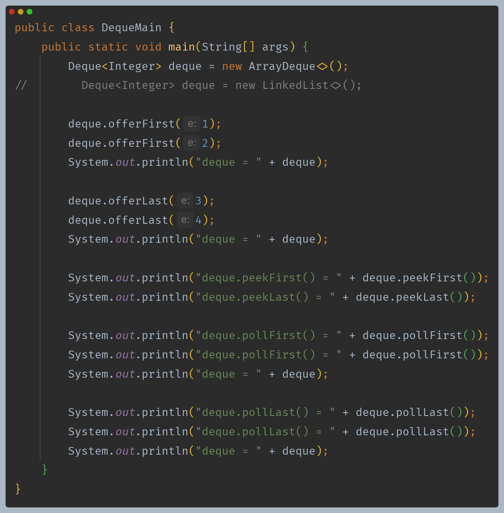
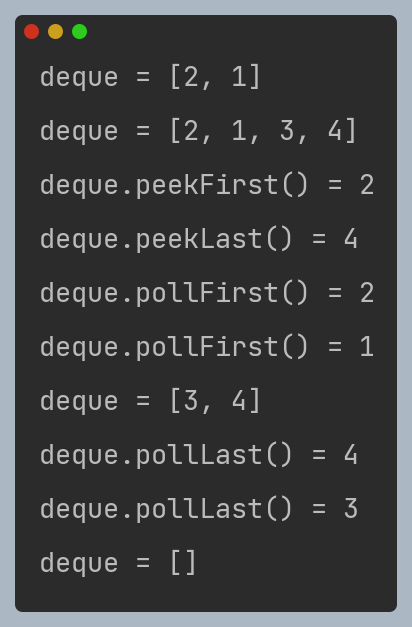
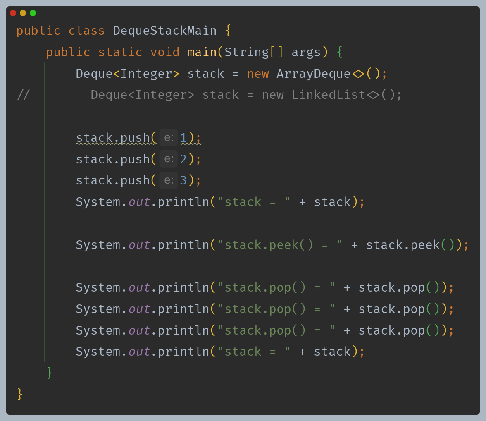
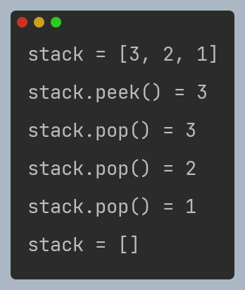

# 자바 - 컬렉션 프레임워크 - 스택, 큐, 데크

## [스택 (Stack) 자료 구조](https://github.com/genesis12345678/TIL/blob/main/dataStructure/linear/stack/Stack.md#stack---%EC%8A%A4%ED%83%9D)

**후입 선출(LIFO, Last In First Out) 자료 구조**

- **Stack 클래스는 사용하지 말자**
  - 자바의 `Stack` 클래스는 내부에서 `Vector` 라는 자료 구조를 사용한다.
  - 이 자료 구조는 자바 1.0 에 개발되었는데, 지금은 사용되지 않고 하위 호환을 위해 존재한다.
  - 지금은 더 빠르고 좋은 자료 구조가 많으므로 `Vector`를 사용하는 `Stack`도 사용하지 않는 것을 권장한다.
  - 대신 `Deque`를 사용하는 것이 좋다.

---

## [큐 (Queue) 자료 구조](https://github.com/genesis12345678/TIL/blob/main/dataStructure/linear/queue/Queue.md#queue---%ED%81%90)

**선입 선출(FIFO, First In First Out) 자료 구조**

- `Queue` 인터페이스는 `List`, `Set`과 같이 `Collection`의 자식이다.
- `Queue`의 대표적인 구현체는 `ArrayDeque`와 `LinkedList`가 있다.
- 참고 : `LinkedList`는 `Deque`와 `List` 인터페이스를 모두 구현한다.

---

## [데크 (Deque) 자료 구조](https://github.com/genesis12345678/TIL/blob/main/dataStructure/linear/dequeue/Deque.md#deque-%EB%8D%B0%ED%81%AC)

- `Deque` : **Double Ended Queue**
- 이름에서 알 수 있듯, 양쪽 끝에서 요소를 추가하거나 제거할 수 있다.
- `Deque`는 일반적인 큐와 스택의 기능을 모두 포함하고 있어 매우 유연한 자료 구조이다.
- `Deque`의 대표적인 구현체는 `ArrayDeque`와 `LinkedList`가 있다.

### 데크 구현체 성능 비교

- `Deque`의 대표적인 구현체 `ArrayDeque`와 `LinkedList` 중에 `ArrayDeque`가 모든 면에서 더 빠르다.
- 둘의 차이는 `ArrayList`와 `LinkedList`의 차이와 비슷한데, 작동 원리가 하나는 배열을 사용하고 하나는 동적 노드 링크를 사용하기 때문이다.
- `ArrayDeque`는 추가로 특별한 원형 큐 자료 구조를 사용하는데, 덕분에 앞, 뒤 입력 모두 `O(1)`의 성능을 제공한다.
- `LinkedList`도 앞, 뒤 입력 모두 `O(1)`의 성능을 제공한다.
- 이론적으로 `LinkedList`가 삽입, 삭제가 자주 발생할 때 더 효율적일 수 있지만, 현대 컴퓨터 시스템의 메모리 접근 패턴, CPU 캐시 최적화 등을 고려할 때
  배열을 사용하는 `ArrayDeque`가 실제 사용 환경에서 더 나은 성능을 보여주는 경우가 많다.

---

## Deque 와 Stack, Queue

- `Deque`는 양쪽으로 데이터를 입력하고 출력할 수 있으므로, 스택과 큐의 역할을 모두 수행할 수 있다.
- `Deque`를 스택과 큐로 사용하기 위한 메서드 이름까지 제공한다.

### Deque - Stack

- `Deque`에서 스택을 위한 메서드 이름까지 제공하는 것을 확인할 수 있다.
- 자바의 스택 클래스는 성능이 좋지 않고 하위 호한을 위해서 남겨져 있다.
- 스택 자료 구조가 필요하면 `Deque`에 `ArrayDeque` 구현체를 사용하자.

### Deque - Queue

- `Deque`에서 큐를 위한 메서드 이름까지 제공하는 것을 확인할 수 있다.
- `Deque` 인터페이스는 `Queue` 인터페이스의 자식이기 때문에, 단순히 `Queue`의 기능만 필요하면 `Queue` 인터페이스를 사용하고, 더 많은 기능이 필요하다면
  `Deque` 인터페이스를 사용하면 된다.
- 구현체로 성능이 빠른 `ArrayDeque`를 사용하자.

---

[이전 ↩️ - 자바(컬렉션 프레임워크) - Map](https://github.com/genesis12345678/TIL/blob/main/Java/mid_2/jcf/Map.md)

[메인 ⏫](https://github.com/genesis12345678/TIL/blob/main/Java/mid_2/Main.md)

[다음 ↪️ - 자바(컬렉션 프레임워크) - 직접 구현하는 `Iterable`, `Iterator`](https://github.com/genesis12345678/TIL/blob/main/Java/mid_2/jcf/%EC%A7%81%EC%A0%91%EA%B5%AC%ED%98%84Iterable.md)