# 자바 - 컬렉션 프레임워크 - Map

## Map

- `Map`은 **키-값의 쌍**을 저장하는 자료 구조이다.
- 키는 `Map` 내에서 유일해야 한다. 키를 통해 값을 빠르게 검색할 수 있다.
- 키는 중복될 수 없지만, 값은 중복될 수 있다.
- `Map`은 순서를 유지하지 않는다.

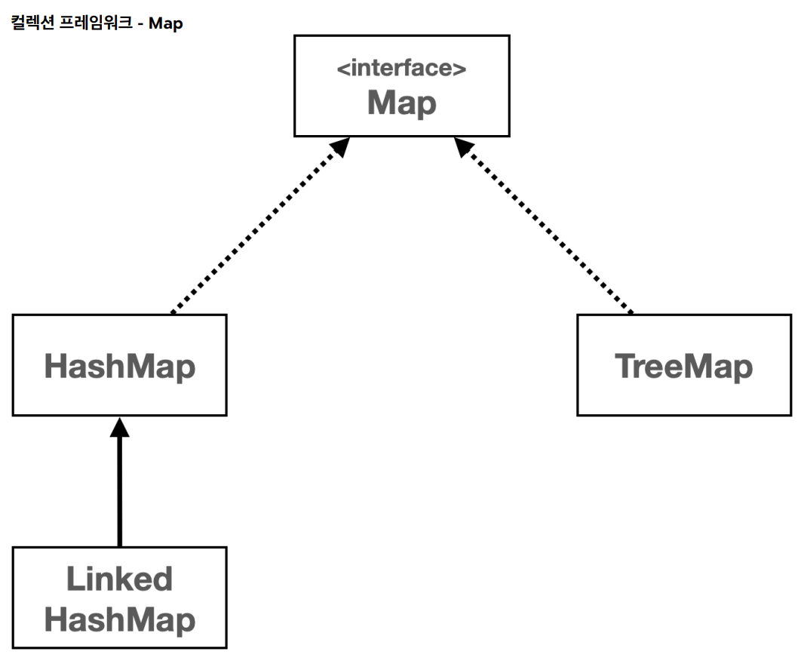

- 자바는 `HashMap`, `LinkedHashMap`, `TreeMap` 등 다양한 `Map` 구현체를 제공한다.
- 이들은 `Map` 인터페이스의 메서드를 구현하며, 각기 다른 특성과 성능 특징을 가지고 있다.
- 이중 `HashMap`을 가장 많이 사용한다.

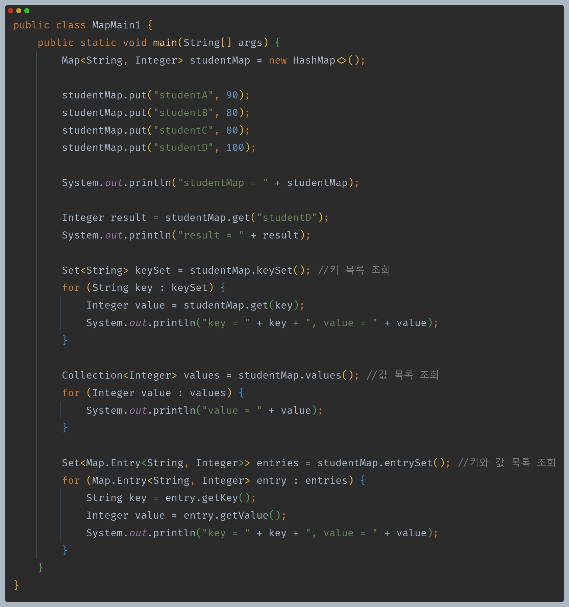

- **키 목록 조회**
  - `keySet()`
  - `Map`의 키는 중복을 허용하지 않는다.
  - `Map`의 모든 키 목록을 조회하는 `keySet()`을 호출하면 중복을 허용하지 않는 자료 구조인 `Set`을 반환한다.
- **값 목록 조회**
  - `values()`
  - `Map`의 값은 중복을 허용한다.
  - 중복을 허용하지 않는 `Set`으로 반환할 수는 없고, 입력 순서를 보장하지 않기 때문에 `List`로 반환하기도 애매하다.
  - 따라서 단순히 값의 모음이라는 의미의 상위 인터페이스인 `Collection`으로 반환한다.
- **키와 값 목록 조회**
  - `entrySet()`
  - `Map`은 키와 값을 보관하는 자료 구조이다. 키와 갑을 하나로 묶을 수 있는 방법이 필요한데, 이때 `Entry`를 사용한다.
  - `Entry`는 키-값의 쌍으로 이루어진 간단한 객체이다. `Map` 내부에서 키와 값을 함께 묶어서 저장할 때 사용한다.
  - 우리가 `Map`에 키와 값으로 데이터를 저장하면 `Map`은 내부에서 키와 값을 하나로 묶는 `Entry` 객체를 만들어서 보관한다.
    - 하나의 `Map`에 여러 `Entry`가 저장될 수 있다.

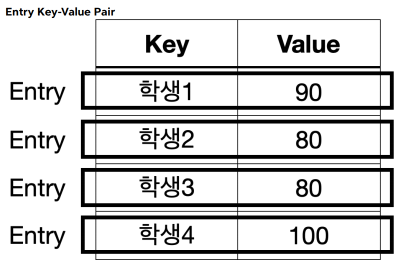

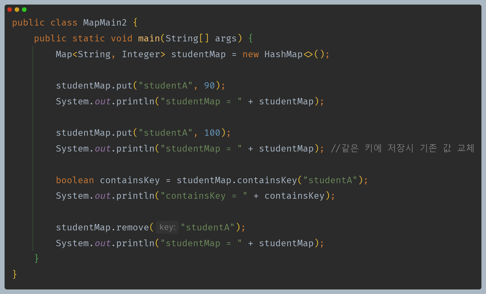

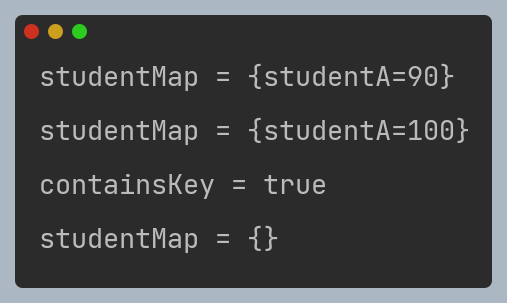

`Map`에 값을 저장할 때 같은 키에 다른 값을 저장하면 기존 값을 교체한다.

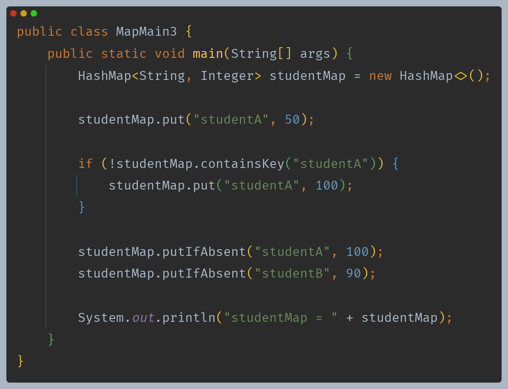

- 위 코드와 같이 특정 키가 없는 경우에만 데이터를 저장할 수 있다.
- `if`문과 `contains()` 메서드를 통해 키를 확인하는 방법도 있지만, `putIfAbsent()` 라는 메서드를 제공한다.

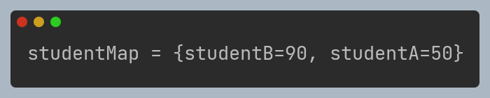

---

## Map 구현체

- 자바의 `Map` 인터페이스는 키-값 쌍을 저장하는 자료 구조이다.
- `Map`은 인터페이스이기 때문에 `Map` 인터페이스를 구현한 여러 클래스를 통해 사용할 수 있다.
- 대표적으로 `HashMap`, `TreeMap`, `LinkedHashMap`이 있다.

### Map vs Set

- `Map`의 키는 중복을 허용하지 않고, 순서를 보장하지 않는다.
- `Map`의 키가 바로 `Set`과 같은 구조이고, `Map`은 모든 것이 `Key`를 중심으로 동작한다.
- `value`는 단순히 `key` 옆에 따라 붙은 것 뿐이다. `Key` 옆에 `value`만 하나 추가해주면 `Map`이 되는 것이다.
- `Map`와 `Set`은 거의 같다. 단지 옆에 `value`를 가지고 있는가 없는가의 차이가 있을 뿐이다.

**이런 이유로 `Set`과 `Map`의 구현체는 거의 같다.**

- `HashSet -> HashMap`
- `LinkedHashSet -> LinkedHashMap`
- `TreeSet -> TreeMap`

**실제로 자바 `HashSet`의 구현은 대부분 `HashMap`의 구현을 가져다 사용한다. `Map`에서 `value`만 비워두면 `Set`으로 사용할 수 있다.**

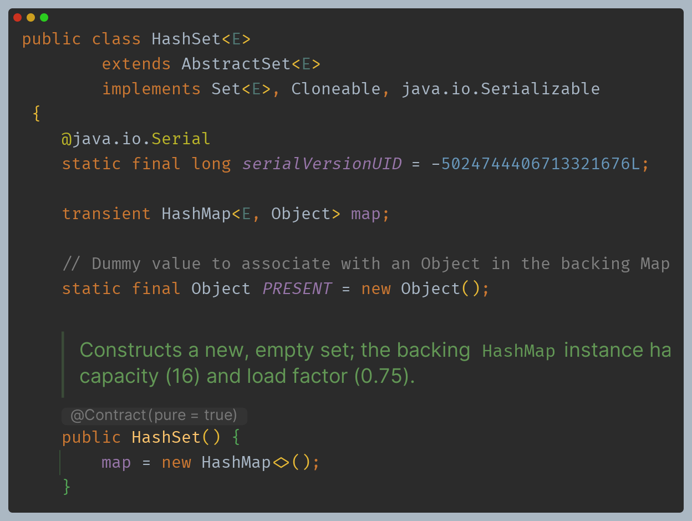

`HashSet`에서 `add()`를 실행하면 키는 데이터를 넣고, 값으로 더미 값인 `PRESENT`를 저장시킨다.

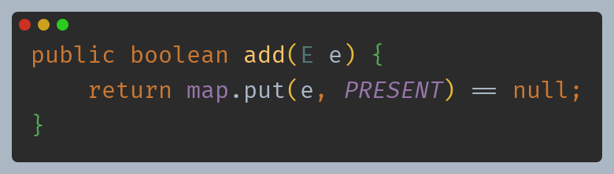

### 1. HashMap

- **구조** : 해시를 사용해서 요소를 저장한다. 키 값은 해시 함수를 통해 해시 코드로 변환되고, 이 해시 코드는 데이터를 저장하고 검색하는 데 사용된다.
- **특징** : 삽입, 삭제, 검색 작업은 해시 자료 구조를 사용하므로 일반적으로 `O(1)`의 시간 복잡도를 가진다.
- **순서** : 순서를 보장하지 않는다.

### 2. LinkedHashMap

- **구조** : `HashMap`과 유사한데, 연결 리스트를 사용하여 삽입 순서 또는 최근 접근 순서에 따라 요소를 유지한다.
- **특징** : 입력 순서에 따라 순회가 가능하다. 입력 순서를 링크로 유지해야 하므로 `HashMap` 보다는 조금 더 무겁다.
- **순서** : 입력 순서를 보장한다.
- **성능** : `HashMap`과 유사하게 대부분의 작업은 `O(1)`의 시간 복잡도를 가진다.

### 3. TreeMap

- **구조** : 레드-블랙 트리를 기반으로 한 구현이다.
- **특징** : 모든 키는 자연 순서 또는 생성자에 제공된 `Comparator`에 의해 정렬된다.
- **순서** : 키는 정렬된 순서로 저장된다.
- **성능** : `get`, `put`, `remove`와 같은 주요 작업들은 `O(log n)`의 시간 복잡도를 가진다.

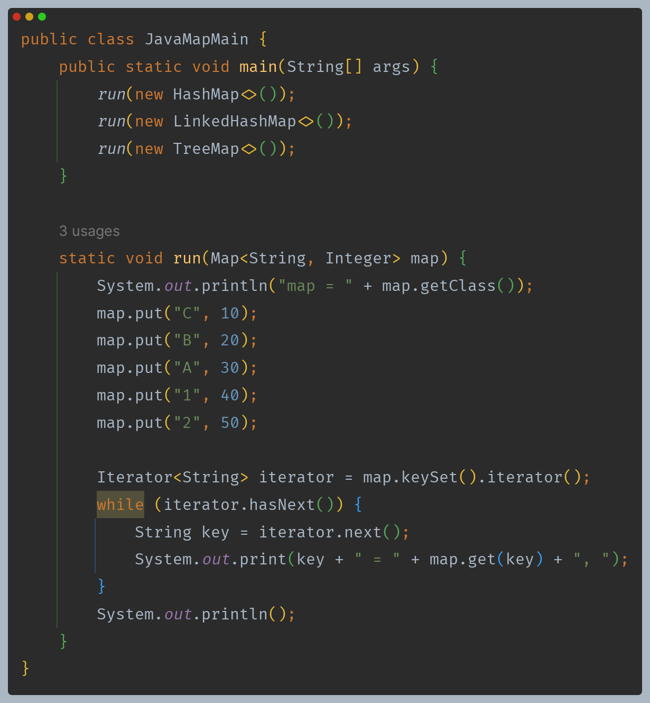

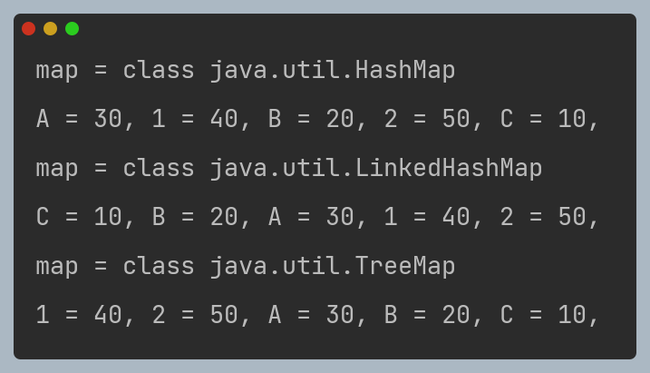

- `HashMap` : 입력 순서를 보장하지 않는다.(`O(1)`)
- `LinkedHashMap` : 키를 기준으로 입력 순서를 보장한다.(`O(1)`)
- `TreeMap` : 키 자체의 데이터 값을 기준으로 정렬한다.(`O(log n)`)

---

## 자바 HashMap 작동 원리

- 자바의 `HashMap`은 `HashSet`과 작동 원리가 같고, `Set`과 비교하면 다음과 같은 차이가 있다.
  - `key`를 사용해서 해시 코드를 생성한다.
  - `key` 뿐만 아니라 `value`를 추가로 저장해야 하기 때문에 `Entry`를 사용해서 `key`, `value`를 하나로 묶어서 저장한다.

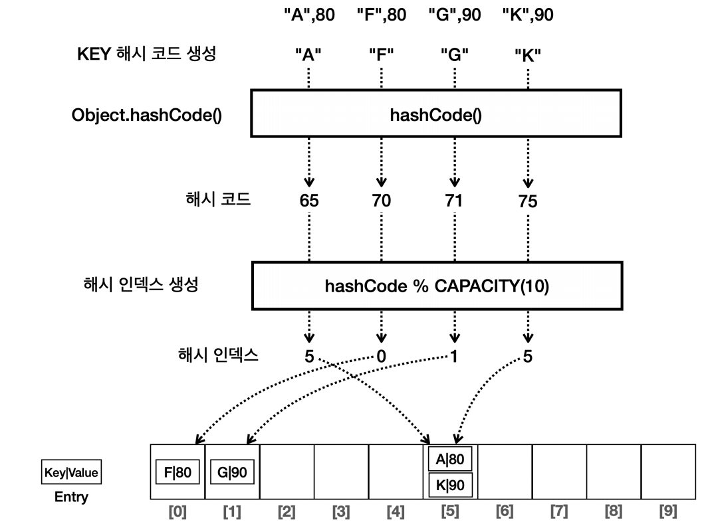

- 이렇게 해시를 사용해서 키와 값을 저장하는 자료 구조를 일반적으로 **해시 테이블** 이라 한다.
- `HashSet`은 해시 테이블의 주요 원리를 사용하지만, 키-값 저장 방식 대신 키만 저장하는 특수한 형태의 해시 테이블인 것이다.

> **`Map`의 `key`로 사용되는 객체는 `hashCode()`, `equals()`를 반드시 구현해야 한다.**

> 실무에서는 `Map`이 필요한 경우 `HashMap`을 가장 많이 사용하고, 필요에 따라 `LinkedHashMap`, `TreeMap` 을 선택하면 된다.

---

[메인 ⏫](https://github.com/genesis12345678/TIL/blob/main/Java/mid_2/Main.md)

[다음 ↪️ - 자바(컬렉션 프레임워크) - 스택, 큐, 데크]()