# 자바 - 컬렉션 프레임워크 - 컬렉션 유틸

자바는 컬렉션을 편리하게 다룰 수 있는 다양한 기능을 제공한다.

## 컬렉션 유틸 - 정렬


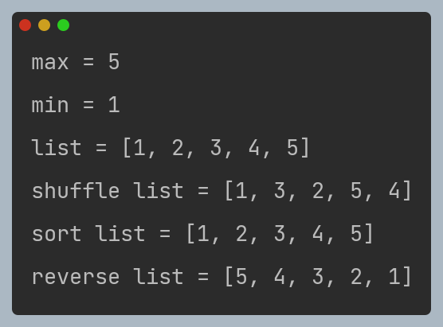

---

## 컬렉션 유틸 - 편리한 컬렉션 생성

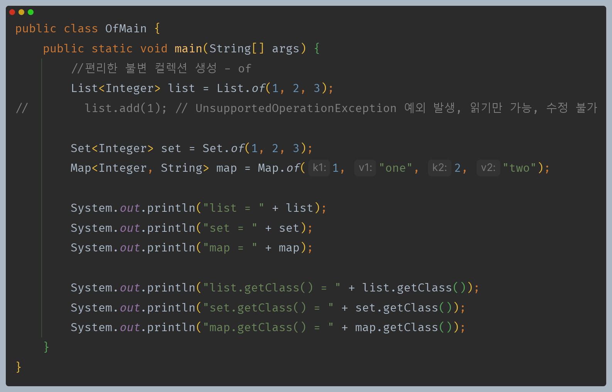

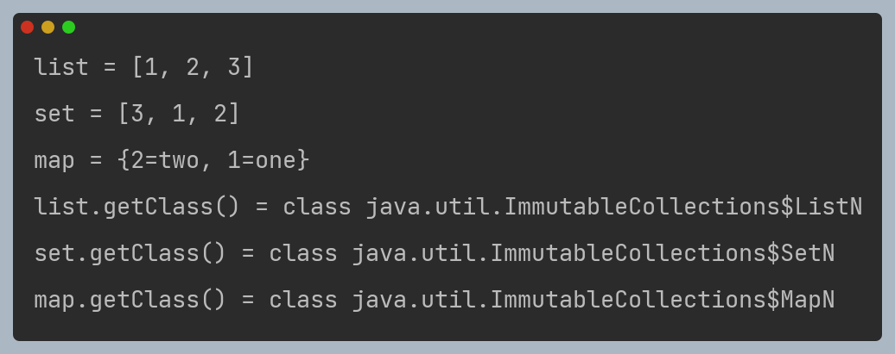

- `of()` 메서드를 사용하면 **불변 컬렉션**을 편리하게 생성할 수 있다.
- 불변 컬렉션은 변경할 수 없다. 변경 메서드를 호출하면 예외가 발생한다.

---

## 컬렉션 유틸 - 불변 컬렉션과 가변 컬렉션 전환

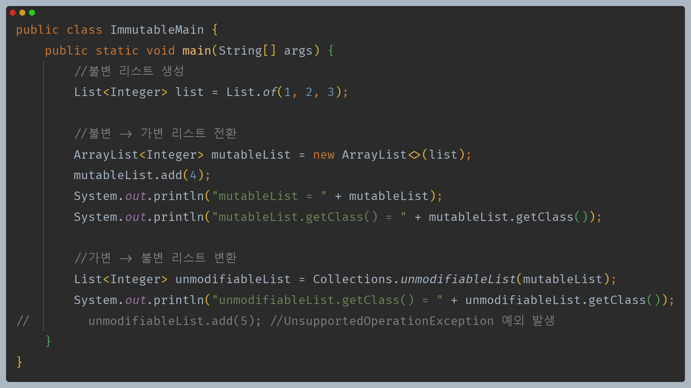

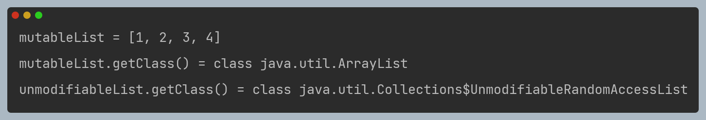

- 불변 컬렉션을 가변 컬렉션으로 전환하려면 생성자에 불변 컬렉션을 전달하면 된다.
- 가변 컬렉션을 불변 컬렉션을 전환하려면 `Collections.unmodifableXxx()`를 사용하면 된다.

---

## 컬렉션 유틸 - 빈 컬렉션 생성

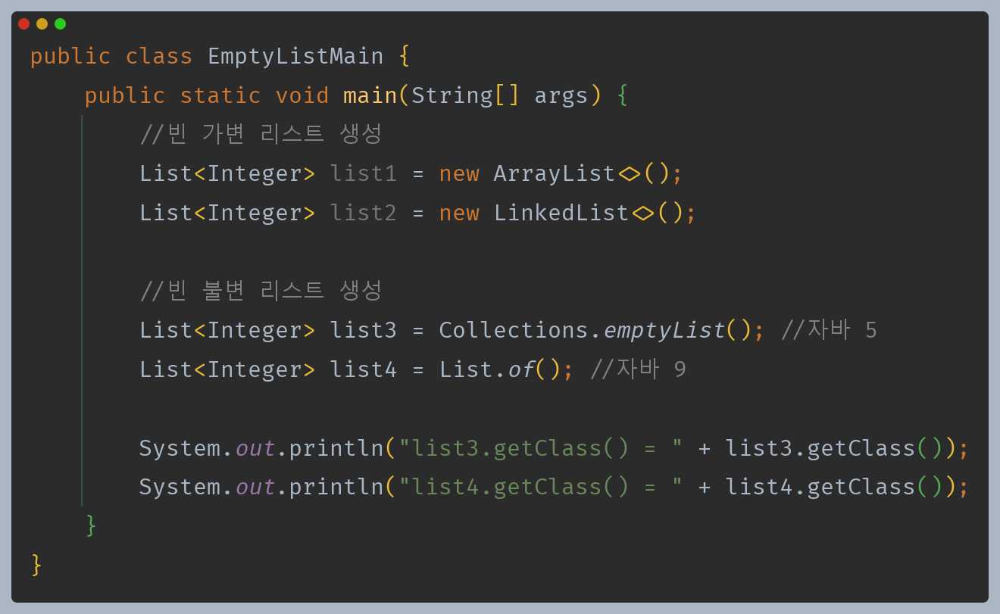

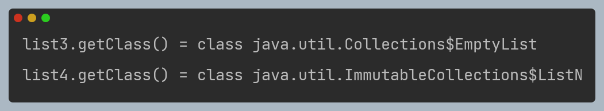

- 빈 가변 컬렉션은 컬렉션의 구현체를 직접 생성하면 된다.
- 빈 불변 컬렉션은 2가지 생성 방법이 있다.
  - `Collections.emptryXxx()` : 자바 5부터 제공되는 기능
  - `Xxx.of()` : 자바 9부터 제공되는 최신 기능
  - `Xxx.of()`가 더 간결하고 불변이기 때문에 사용법에 일관성이 있다. 자바 9 이상을 사용한다면 이 기능을 권장한다.

### Arrays.asList()

- `Arrays.asList()` 메서드를 사용해도 리스트를 생성할 수 있다.
- 이 메서드는 자바 1.2부터 존재했다. 자바 9 이상을 사용한다면 `List.of()`를 권장한다.

```java
List<Integer> list = Arrays.asList(1, 2, 3); 
List<Integer> list = List.of(1, 2, 3);
```

- `Arrays.asList()`로 생성된 리스트는 **고정된 크기를 가지지만, 요소들은 변경할 수 있다.** 즉, 리스트의 길이는 변경할 수 없지만, 기존 위치에 있는 요소들을 다른 요소로 교체할 수 있다.
  - `set()`을 통해 요소를 변경할 수 있다.
  - `add()`, `remove()` 같은 메서드를 호출하면 `UnsupportedOperationException` 예외가 발생한다.
- 고정도 가변도 아닌 애매한 리스트이다.
- 일반적으로 `List.of()`를 사용하는 것을 권장한다.

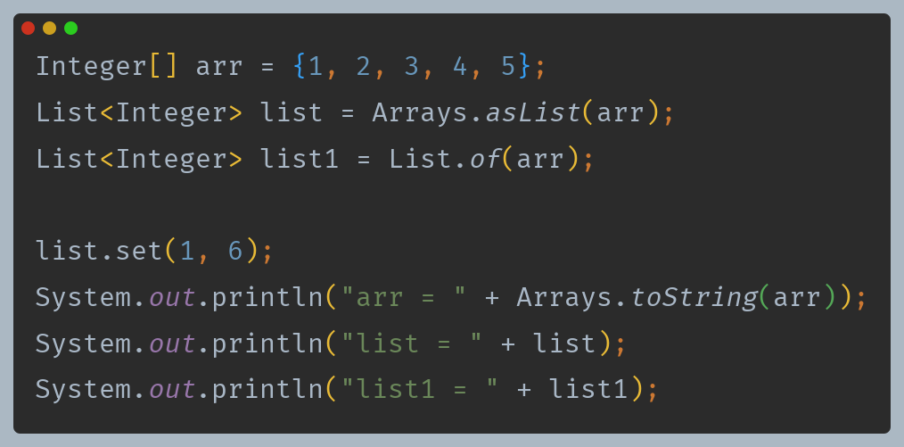

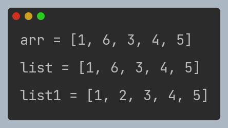

- `Arrays.asList()`는 배열의 참조값을 그대로 사용한다.
- 반면 `List.of()`는 값을 가지고 새로운 리스트를 반환한다.

---

## 컬렉션 유틸 - 멀티 스레드 동기화

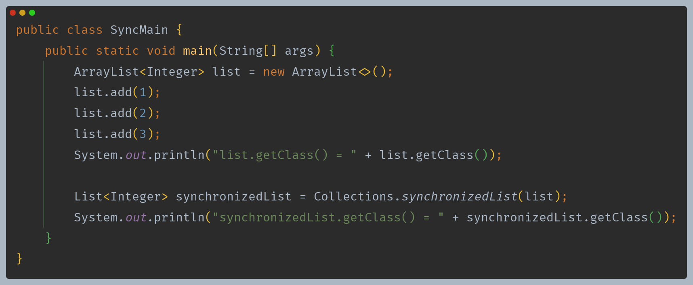

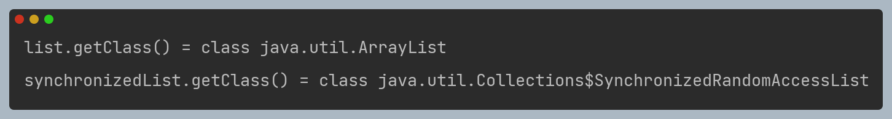

- `Collections.synchronizedXxx()`를 사용하면 일반 컬렉션을 멀티 스레드 상황에서 동기화 문제가 발생하지 않는 안전한 컬렉션으로 만들 수 있다.
- 동기화 작업으로 인해 일반 컬렉션보다 성능은 더 느리다.


---

[이전 ↩️ - 자바(컬렉션 프레임워크) - 정렬(`Comparable`, `Comparator`)](https://github.com/genesis12345678/TIL/blob/main/Java/mid_2/jcf/Sort.md)

[메인 ⏫](https://github.com/genesis12345678/TIL/blob/main/Java/mid_2/Main.md)

[다음 ↪️ - 자바(컬렉션 프레임워크) - 컬렉션 프레임워크 전체 정리](https://github.com/genesis12345678/TIL/blob/main/Java/mid_2/jcf/%EC%A0%95%EB%A6%AC.md)