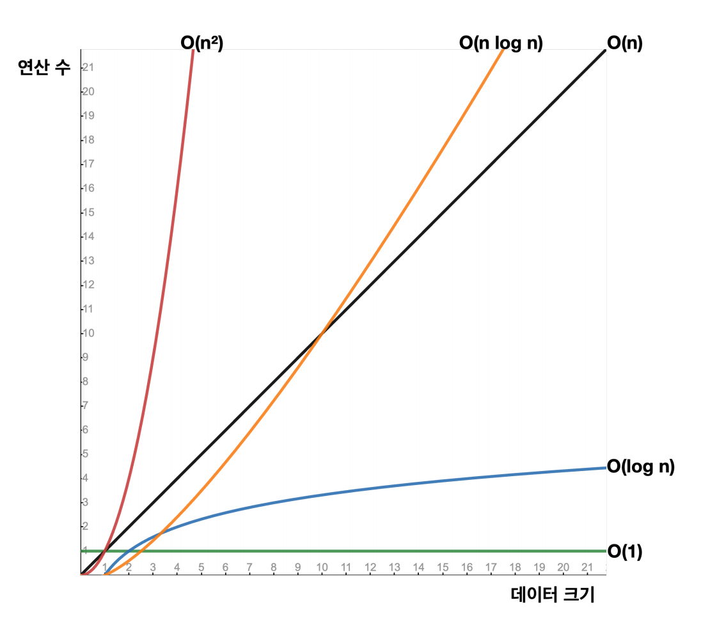

# 자바 - 컬렉션 프레임워크 - ArrayList

## 빅오(O) 표기법

- 빅오(`Big O`) 표기법은 알고리즘의 성능을 분석할 때 사용하는 수학적 표현 방식으로, 특히 알고리즘이 처리해야 할 데이터의 양이 증가할 때, 그 알고리즘이 얼마나 빠르게 실행되는지 나타낸다.
- 여기서 중요한 것은 알고리즘의 정확한 실행 시간을 계산하는 것이 아니라, **데이터 양의 증가에 따른 성능의 변화 추세를 이해하는 것**이다.

**빅오 표기법 예시**
- **O(1)**
  - 상수 시간
  - 입력 데이터의 크기에 관계없이 알고리즘의 실행 시간이 일정하다.
  - 예 : 배열에서 인덱스를 사용하는 경우
- **O(n)**
  - 선형 시간
  - 알고리즘의 실행 시간이 입력 데이터의 크기에 비례하여 증가한다.
  - 예 : 배열의 검색, 배열의 모든 요소를 순회하는 경우
- **O(n^2)**
  - 제곱 시간
  - 알고리즘의 실행 시간이 입력 데이터의 크기의 제곱에 비례하여 증가한다.
  - 예 : 이중 루프를 사용하는 알고리즘
- **O(log n)**
  - 로그 시간
  - 알고리즘의 실행 시간이 데이터 크기의 로그에 비례하여 증가한다.
  - 예 : 이진 탐색
- **O(n log n)**
  - 선형 로그 시간
  - 예 : 많은 효율적인 정렬 알고리즘들

- 빅오 표기법은 매우 큰 데이터를 입력한다고 가정하고, 데이터 양 증가에 따른 성능의 변화 추세를 비교하는데 사용한다.
- **정확한 성능 측정이 목표가 아니라 매우 큰 데이터가 들어왔을 때의 대략적인 추세를 비교하는 것**이 목적이다.
- 따라서 데이터가 매우 많이 들어오면 추세를 보는데 상수는 크게 의미가 없어진다.
- 이런 이유로 빅오 표기법에서는 상수를 제거한다. 예를 들어 `O(n+2)`, `O(n/2)` 모두 `O(n)`으로 표시한다.

**빅오 표기법은 별도의 내용이 없으면 보통 최악의 상황을 가정해서 표기하고, 최적, 최악, 평균적인 경우가 있다.**

예를 들어 배열의 순차검색의 경우 다음과 같다.
- **최적의 경우** : 배열의 첫 번째 항목에서 바로 값을 찾으면 `O(1)`
- **최악의 경우** : 마지막 항목에 있거나 항목이 없는 경우 전체 요소를 순회하는 경우 `O(n)`
- **평균의 경우** : 평균적으로 보면 보통 중간쯤 데이터를 발견하게 되는 경우 `O(n/2)` 이지만, 상수를 제외해서 `O(n)`으로 표기한다.
  (최악과 비교를 위해 `O(n/2)`로 표기하는 경우도 있다.)

---

[메인 ⏫](https://github.com/genesis12345678/TIL/blob/main/Java/mid_2/Main.md)

[다음 ↪️ - 자바(컬렉션 프레임워크(ArrayList)) - 배열의 특징]()