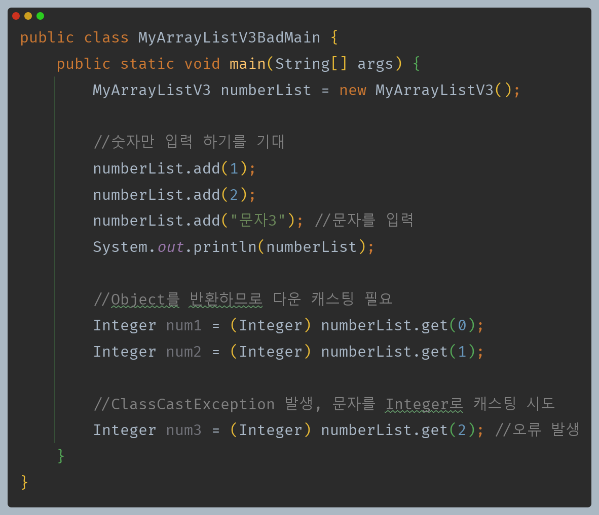
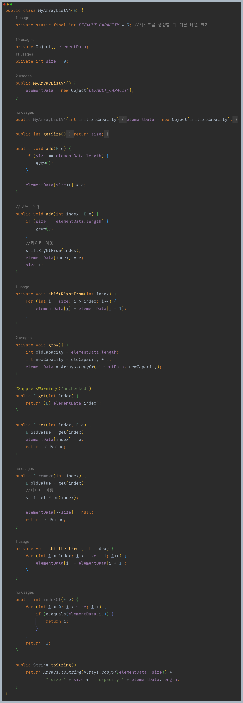
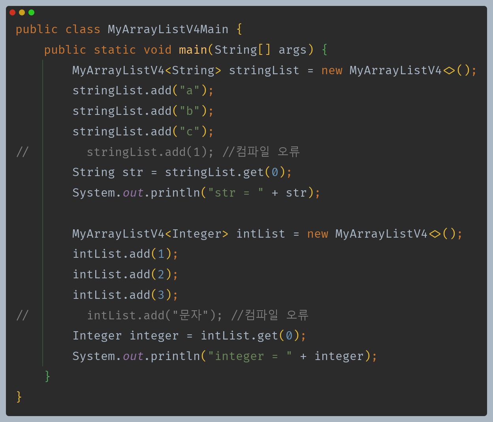

# 자바 - 컬렉션 프레임워크 - ArrayList

## 직접 구현하는 배열 리스트 - 제네릭 적용

앞서 직접 만든 배열 리스트는 `Object`를 입력받기 때문에 아무 데이터나 입력받을 수 있고, 반환값도 `Object`이기 때문에 타입 안전성이 떨어지는 단점이 있다.

- 일반적으로 하나의 자료 구조에 숫자와 문자처럼 서로 관계없는 여러 데이터 타입을 섞어서 보관하는 일은 거의 없고, 같은 데이터 타입을 보관하고 관리한다.
- 제네릭은 자료를 보관하는 자료 구조에 가장 어울린다. 제네릭을 도입하여 타입 안전성을 확보하면서 문제를 해결해보자.

- `E`는 `Element`로 요소의 줄임말이다.
- `Object`로 입력받고 출력했던 곳을 타입 매개변수 `E`로 변경했다.
- `Object[] elementData`는 유지해야 한다.

- 제네릭을 사용한 덕분에 타입 인자로 지정한 타입으로만 안전하게 데이터를 저장하고, 데이터를 조회할 수 있다.
- 제네릭의 도움으로 타입 안전성이 높은 자료 구조를 만들 수 있다.

---

### Object 배열을 사용한 이유

- `Object[] elementData`을 유지하는 이유
  - 제네릭은 런타임에 이레이저에 의해 타입 정보가 사라진다.
  - 따라서 런타임에 타입 정보가 필요한 생성자에 사용할 수 없다. 
  - 제네릭을 기반으로 배열을 생성하는 다음 코드는 작동하지 않고, 컴파일 오류가 발생한다.(이것이 자바가 제공하는 제네릭의 한계)
    - `new E[DEFAULT_CAPACITY]`
  - 대신에 모든 데이터를 담을 수 있는 `Object[]`을 그대로 사용해야 한다.

**그렇다면 이렇게 `Object[]`을 생성해서 사용해도 문제가 없는가?**    
- 배열에 데이터를 보관하는 `add(E e)` 메서드를 보면 `E` 타입으로 데이터를 입력한다.
- 배열에 데이터를 조회하는 `get()` 메서드를 보면 보관할 때와 같은 `E` 타입으로 데이터를 다운 캐스팅해서 반환한다.
- **배열의 모든 데이터는 `E` 타입으로 보관이 된다.** 따라서 `get()`으로 데이터를 꺼낼 때 `E`로 다운 캐스팅해도 보관한 `E` 타입으로 다운 캐스팅하는 것이기 때문에 
    아무런 문제가 되지 않는다.

생성자에는 제네릭의 타입 매개변수를 사용할 수 없는 한계가 있다. 따라서 배열을 생성할 때 대안으로 `Object` 배열을 사용해야 한다. 하지만 제네릭이 리스트의 데이터를
입력 받고 반환하는 곳의 타입을 고정해주기 때문에 고정된 타입으로 `Object` 배열에 데이터를 보관하고, 또 데이터를 꺼낼 때도 같은 고정된 타입으로 안전하게 다운 캐스팅 할 수 있다.

**배열을 사용한 리스트인 `ArrayList`는 다음과 같은 단점이 있다.**
- 정확한 크기를 미리 알지 못하면 메모리가 낭비된다. 배열을 사용하므로 배열 뒷 부분이 사용되지 않고, 낭비되는 메모리가 있다.
- 데이터를 중간에 추가하거나 삭제할 때 비효율적이다.
  - 이 경우 데이터를 한 칸씩 밀어야 한다. 이것은 `O(n)`으로 성능이 좋지 않다.

**`ArrayList` 빅오 정리**
- 데이터 추가
  - 마지막에 추가 : `O(1)`
  - 앞, 중간에 추가 : `O(n)`
- 데이터 삭제
  - 마지막에 삭제 : `O(1)`
  - 앞, 중간에 삭제 : `O(n)`
- 인덱스 조회 : `O(1)`
- 데이터 검색 : `O(n)`

배열 리스트는 순서대로 마지막에 데이터를 추가하거나 삭제할 때는 성능이 좋지만, 앞이나 중간에 데이터를 추가하거나 삭제할 때는 성능이 좋지 않다.
이런 단점을 해결한 자료 구조가 링크드 리스트(`LinkedList`) 이다.

---

[이전 ↩️ - 자바(컬렉션 프레임워크(ArrayList)) - 직접 구현하는 배열 리스트]()

[메인 ⏫](https://github.com/genesis12345678/TIL/blob/main/Java/mid_2/Main.md)

[다음 ↪️ - 자바(컬렉션 프레임워크(LinkedList)) - 노드와 연결]()