# 자바 - 컬렉션 프레임워크 - ArrayList

## 배열의 특징 - 배열과 인덱스

자료 구조의 가장 기본이 되는 배열의 특징을 알아보자.

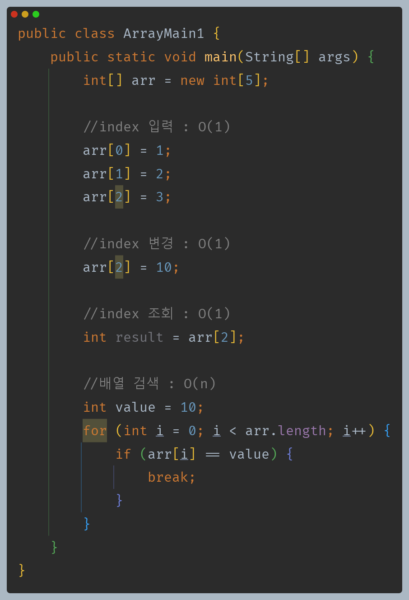

- **배열의 특징**
  - 배열에서 자료를 찾을 때 인덱스(`index`)를 사용하면 매우 빠르게 자료를 찾을 수 있다.
  - 인덱스를 통한 입력, 변경, 조회의 경우 한번의 계산으로 자료의 위치를 찾을 수 있다.

**메모리 그림으로 보면 다음과 같다.**

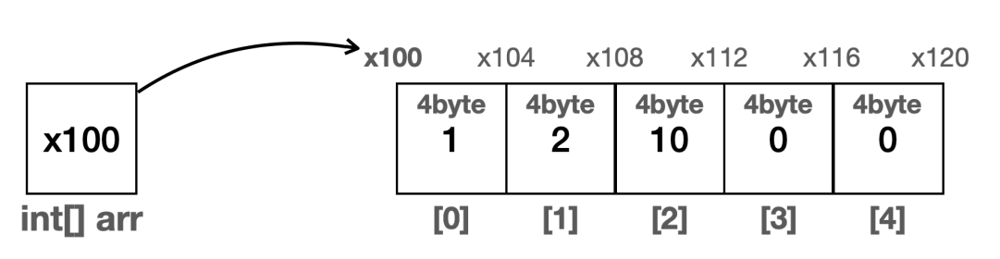

- `arr[2]`에 위치한 자료를 찾는다고 해보자.
- 배열은 메모리 상에 순서대로 붙어서 존재하며, `int`는 `4byte`를 차지한다.
- 배열의 시작 위치(`x100`) 부터 시작해서 자료의 크기(`4byte`)와 인덱스 번호를 곱하면 원하는 메모리 위치를 찾을 수 있다.

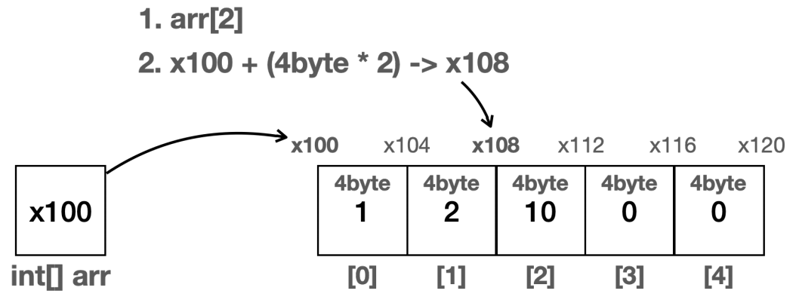

- 배열의 경우 인덱스를 사용하면 한번의 계산으로 매우 효율적으로 자료의 위치를 찾을 수 있다.
- 인덱스를 통한 입력, 변경, 조회 모두 한번의 계산으로 필요한 위치를 찾아서 처리할 수 있다.
- **즉 배열에서 인덱스를 사용하는 경우 데이터가 아무리 많아도 한 번의 연산으로 필요한 위치를 찾을 수 있다.**

**배열의 검색**
- 배열에 들어있는 데이터를 검색할 때는 배열에 들어있는 데이터를 하나하나 비교해야 한다. 이때는 인덱스를 사용해서 한번에 찾을 수 없다.
- 배열 안에 들어있는 데이터를 하나하나 확인해야 하기 때문에 평균적으로 볼 때 배열의 크기가 클 수록 오랜 시간이 걸린다.
- 배열의 순차 검색은 배열의 들어있는 데이터의 크기 만큼 연산이 필요하다. **배열의 크기가 `n`이면 연산도 `n`만큼 필요하다.**

---

## 배열의 특징 - 데이터 추가

- 추가는 기존 데이터를 유지하면서 새로운 데이터를 입력하는 것을 뜻한다.
- 데이터를 중간에 추가하면 기존 데이터가 오른쪽으로 한 칸씩 이동해야 한다.(기존 데이터의 인덱스를 하나씩 증가시켜야 한다.)

배열에 데이터를 추가하는 위치에 따라 크게 3가지로 나눌 수 있다.
- 배열의 첫번째 위치에 추가
- 배열의 중간 위치에 추가
- 배열의 마지막 위치에 추가

### 배열의 첫번째 위치에 추가

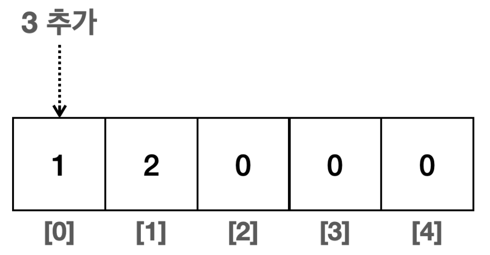

- 배열의 첫번째 위치에 3을 추가해보자.
- 기존 데이터들을 모두 오른쪽으로 한 칸씩 밀어서 추가할 위치를 확보해야 한다.
- **이때 배열의 마지막 부분부터 오른쪽으로 밀어야 기존 데이터를 유지할 수 있다.**
- 왼쪽의 데이터를 오른쪽에 대입하는 과정을 반복한다.

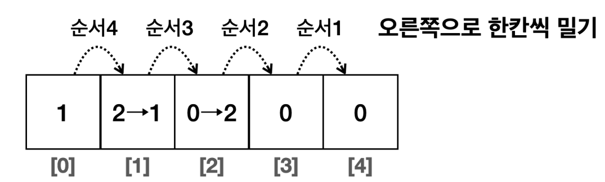

- 첫 번째 공간이 확보되었고, 여기에 새로운 값을 추가하면 된다.

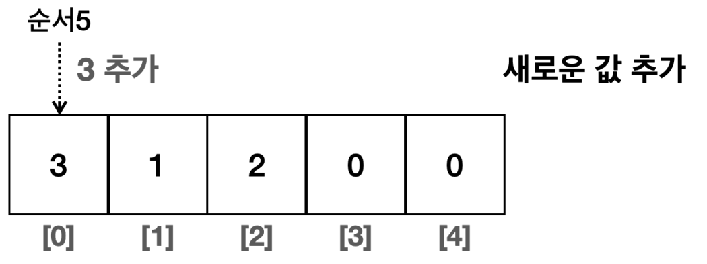

### 배열의 중간 위치에 추가

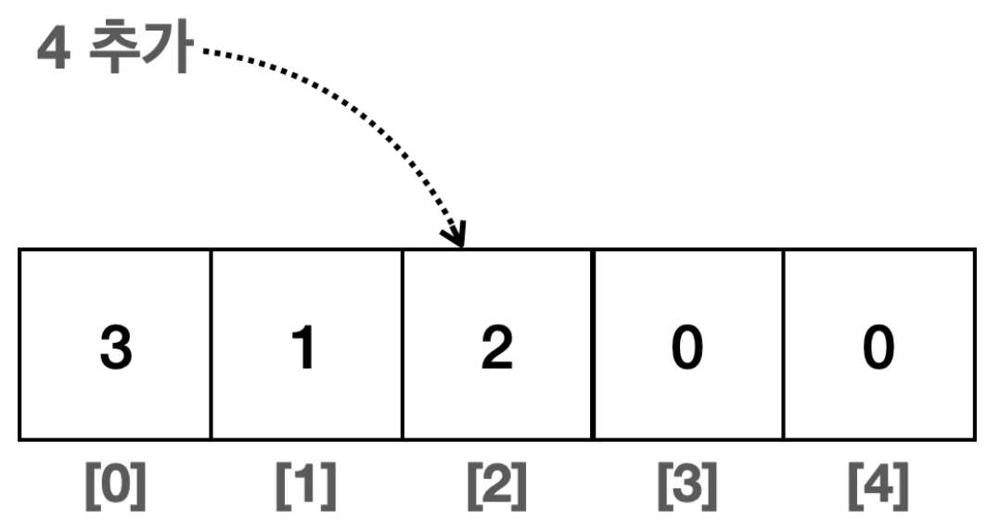

- 지정한 `index`에 데이터를 추가할 위치를 확보해야 한다. 따라서 `index`부터 시작해서 데이터들을 오른쪽으로 한 칸씩 밀어야 한다.
- 이 경우 `index` 왼쪽의 데이터는 이동하지 않아도 된다.

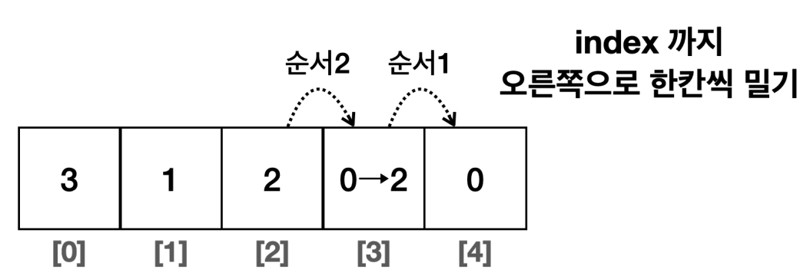

- 인덱스 2의 공간이 확보되었고, 여기세 새로운 값을 추가하면 된다.

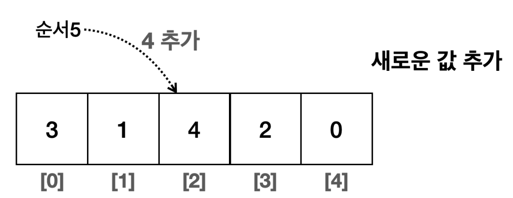

### 배열의 마지막 위치에 추가

- 배열의 마지막 위치에 데이터를 추가하는 경우 기존 데이터를 이동하지 않아도 되며, 단순하게 값만 입력하면 된다.

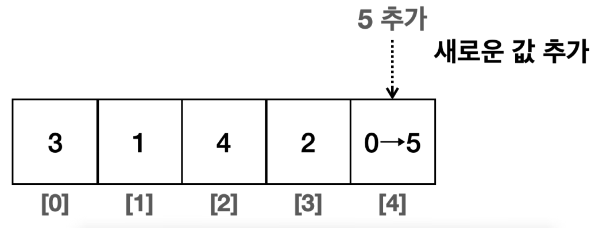

> **배열에 데이터를 추가할 때 위치에 따른 성능 변화**
> 
> - **배열의 첫번째 위치에 추가**
>   - 배열의 첫번째 위치를 찾는데 인덱스를 사용하므로 `O(1)` 이 걸린다.
>   - 모든 데이터를 배열의 크기만큼 한 칸씩 이동해야 하므로 `O(n)` 만큼의 연산이 걸린다.
>   - `O(1 + n)` -> 상수 제거 -> `O(n)`
> - **배열의 중간 위치에 추가**
>   - 배열의 위치를 찾는데 `O(1)`이 걸린다.
>   - `index`의 오른쪽에 있는 데이터를 모두 한 칸씩 이동해야 한다. 평균 연산은 `O(n/2)`가 된다.
>   - `O(1 + n/2)` -> 상수 제거 -> `O(n)`
> - **배열의 마지막 위치에 추가**
>   - 배열이 이동하지 않고 배열의 길이를 사용하면 마지막 인덱스에 접근할 수 있으므로 한번의 계산으로 위치를 찾을 수 있고, 기존 배열을 이동하지 않으므로 `O(1)`이 된다.

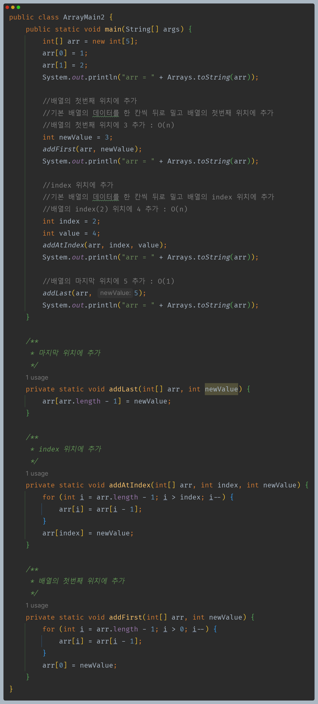

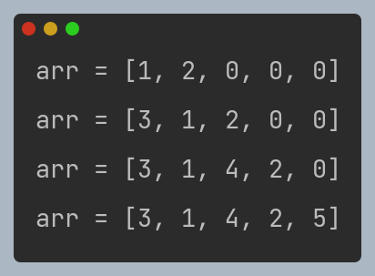

- **배열의 한계**
  - 배열은 가장 기본적인 자료 구조이고, 특히 인덱스를 사용할 때 최고의 효율이 나온다.
  - 하지만 이런 배열에는 큰 단점이 있는데, 배열의 크기를 배열을 생성하는 시점에 미리 정해야 한다는 점이다.
  - 그렇다고 처음부터 너무 많은 배열을 확보하면 메모리가 많이 낭비된다.
  - 배열처럼 처음부터 정적으로 길이가 정해져 있는 것이 아니라, 동적으로 언제든지 길이를 늘리고 줄일 수 있는 자료 구조가 있다면 편리할 것이다.

---

[이전 ↩️ - 자바(컬렉션 프레임워크(ArrayList)) - 빅오(O) 표기법](https://github.com/genesis12345678/TIL/blob/main/Java/mid_2/jcf/arraylist/BigO.md)

[메인 ⏫](https://github.com/genesis12345678/TIL/blob/main/Java/mid_2/Main.md)

[다음 ↪️ - 자바(컬렉션 프레임워크(ArrayList)) - 직접 구현하는 배열 리스트](https://github.com/genesis12345678/TIL/blob/main/Java/mid_2/jcf/arraylist/ArrayList.md)
