# 자바 - 컬렉션 프레임워크 - Hash

## 해시 알고리즘

해시(`hash`) 알고리즘을 사용하면 데이터를 찾는 검색 성능을 평균 `O(1)`로 비약적으로 끌어올릴 수 있다.

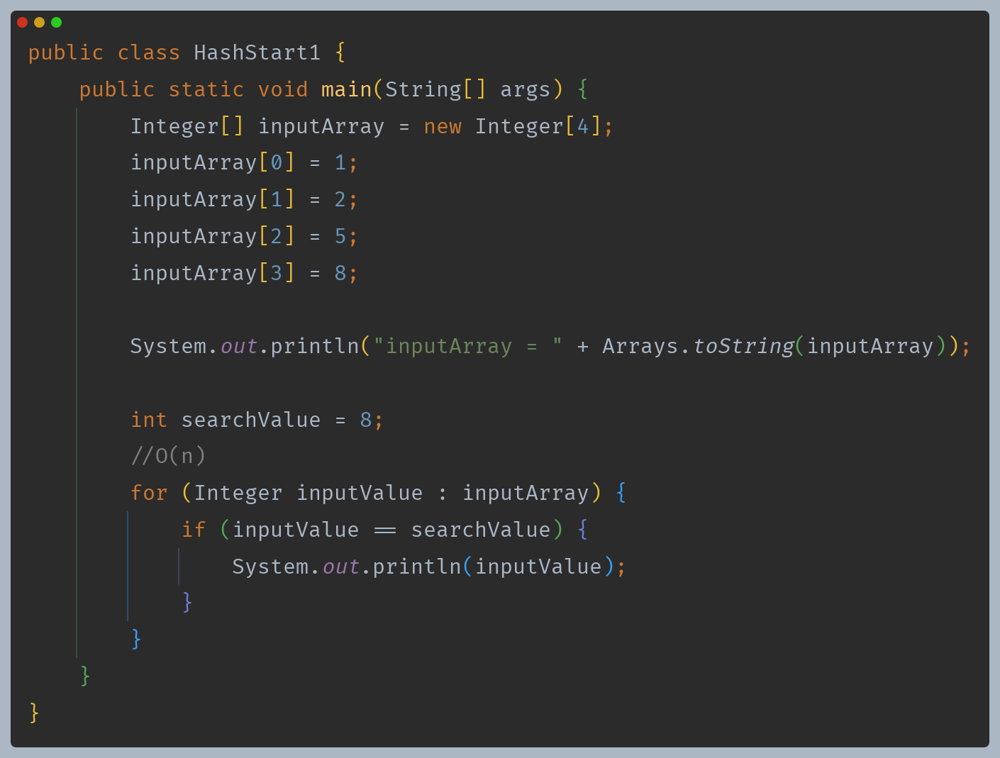

여기서 `searchValue`를 찾기 위해서는 배열에 들어있는 데이터를 모두 찾아서 값을 비교해야 하기 때문에 `O(n)`으로 느리다.

---

## 해시 알고리즘 - index 사용

- 배열은 인덱스의 위치를 사용해서 데이터를 찾을 때 `O(1)`로 매우 빠른 특징을 가지고 있다.
- 반면 데이터를 검색할 때는 배열에 들어있는 데이터 하나하나를 모두 비교해야 하므로 인덱스를 활용할 수 없다.
- 하지만 **데이터의 값 자체를 배열의 인덱스와 맞추어 저장하면 데이터가 인덱스 번호가 되므로 배열의 인덱스를 활용해서 단번에 필요한 데이터를 찾을 수 있을 것이다.**

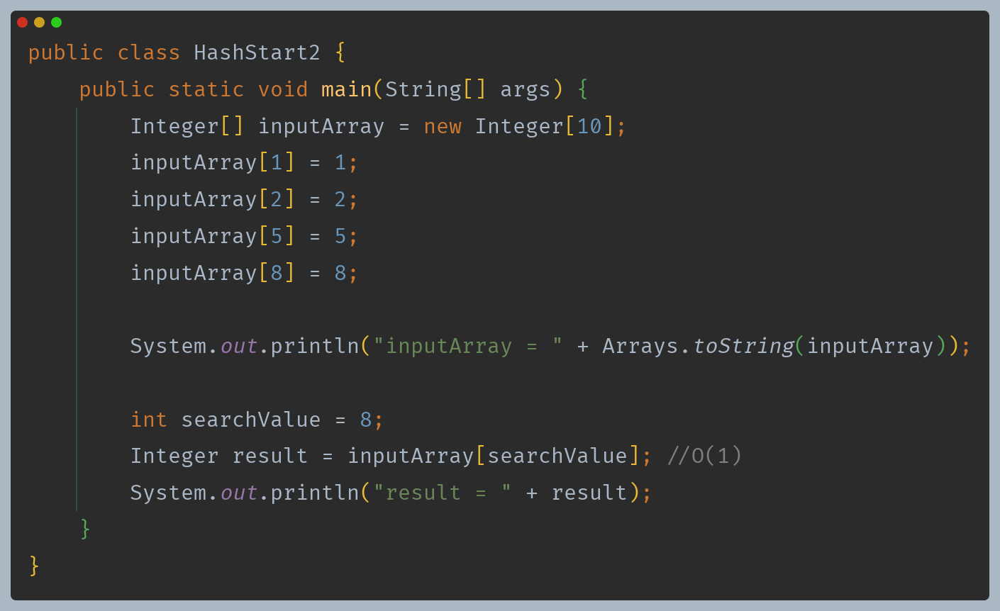

- 데이터의 값 자체를 배열의 인덱스로 사용했고, 배열에서 인덱스로 데이터를 찾는 것은 `O(1)`로 매우 빠르기 때문에 성능을 개선시킬 수 있었다.
- 하지만 당연한 문제가 있다. **입력 값의 범위만큼 큰 배열을 사용해야 하고, 배열에 낭비되는 공간이 많이 발생하는 점**이다.
- 예를 들어 `int` 의 모든 범위를 입력할 수 있도록 하려면 배열의 크기를 약 `4byte * 42억 = 17기가 바이트`가 필요하다.
- 데이터의 값을 인덱스로 사용하는 방법은 매우 빠른 성능을 보장하지만, 입력 값의 범위가 조금만 커져도 메모리 낭비가 너무 심하다.

---

## 해시 알고리즘 - 나머지 연산

- 나머지 연산을 사용해서 공간도 절약하면서 넓은 범위의 값을 사용할 수 있다.
- 배열의 크기를 나머지 연산으로 사용하면 나머지 연산의 결과는 절대 배열의 크기를 넘지 않는다.
- 따라서 안전하게 인덱스로 사용할 수 있다.

이렇게 배열의 인덱스로 사용할 수 있도록 원래의 값을 계산한 인덱스를 **해시 인덱스(`hashIndex`)** 라 한다.

**해시 인덱스와 데이터 저장**

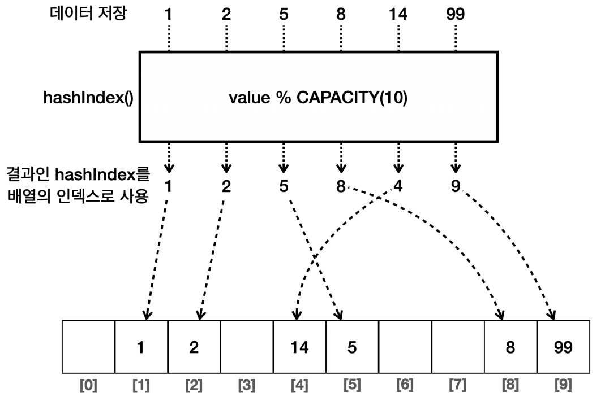

**해시 인덱스와 데이터 조회**

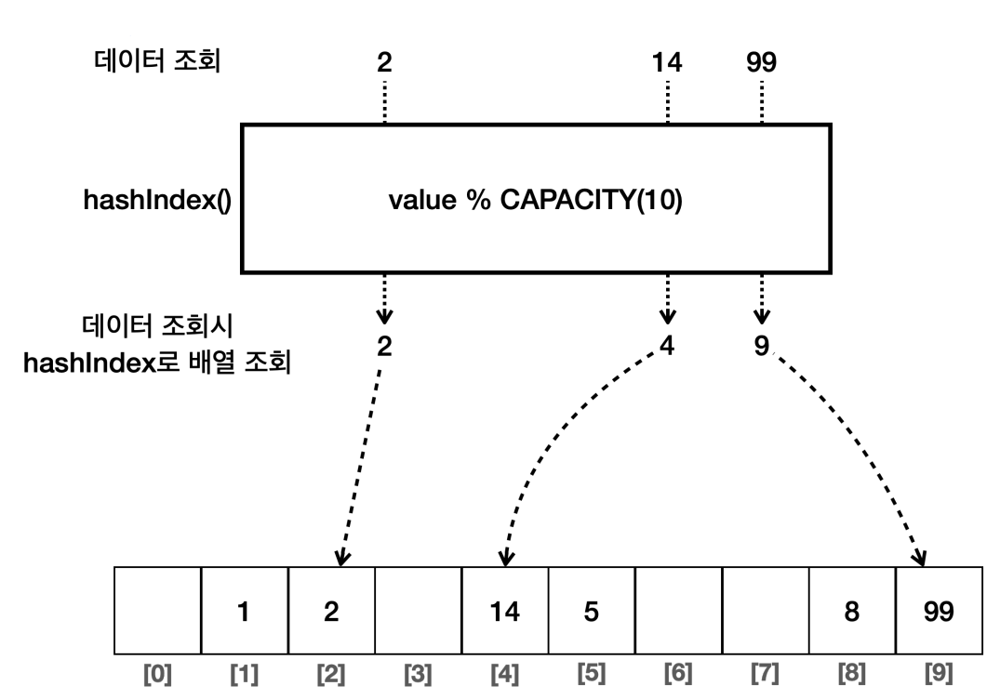

데이터 저장과 데이터 조회 모두 배열의 인덱스를 사용하기 때문에 `O(1)`로 빠른 성능을 제공한다.

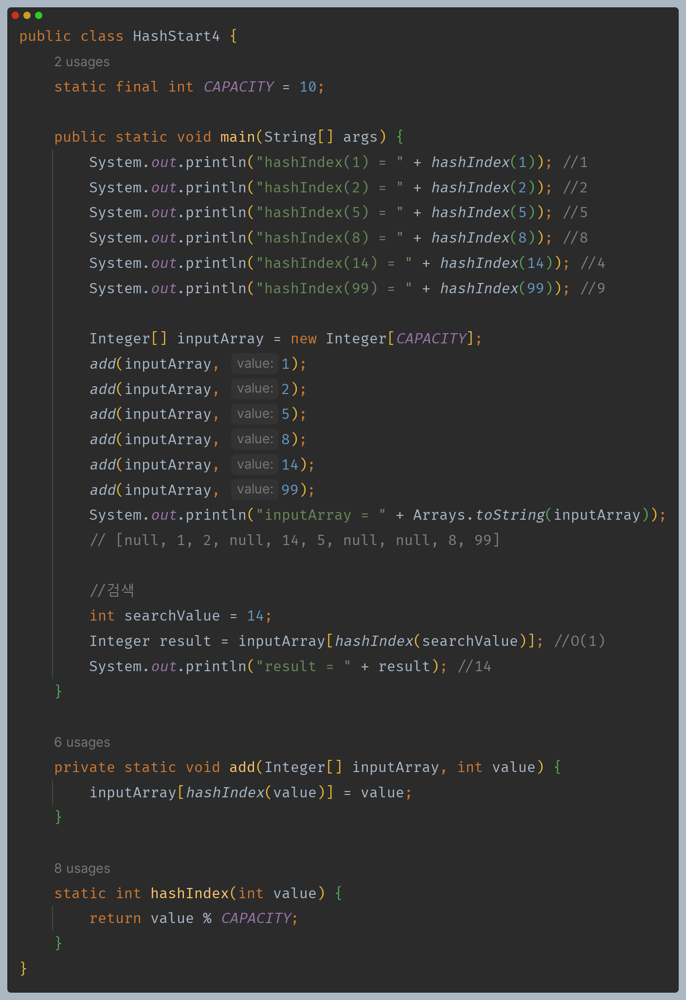

- 입력 값의 범위가 널벙도 실제 모든 값이 들어오지는 않기 때문에 배열의 크기를 제한하고, 나머지 연산을 통해 메모리가 낭비되는 문제도 해결할 수 있다.
- 해시 인덱스를 사용해서 `O(1)`의 성능으로 데이터를 저장하고, `O(1)`의 성능으로 데이터를 조회할 수 있게 되었다.

**하지만 저장할 위치가 충돌할 수 있다는 한계가 있다. 같은 해시 인덱스가 나와버리면 충돌이 발생한다.**

---

## 해시 알고리즘 - 해시 충돌

예를 들어 99와 9는 10으로 나눈 나머지가 9로 같기 때문에 해시 충돌이 발생한다.

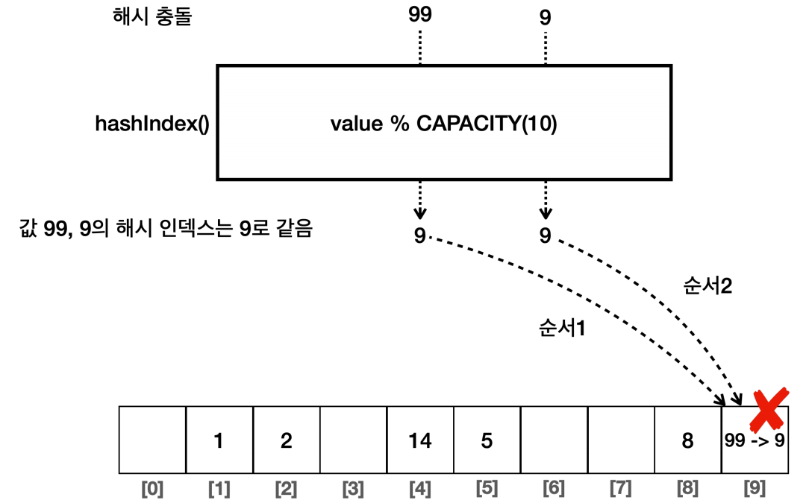

- 이 문제를 해결하는 가장 단순한 방법은 `CAPACITY`를 값의 입력 범위만큼 키우는 것이다. 그러면 충돌이 발생하지 않는다.
- 하지만 메모리 낭비가 너무 심하다는 문제가 있기 때문에 해결할 수 없다.

**해시 충돌 해결**
- 해시 충돌을 인정하고, 해시 충돌은 낮은 확률로 일어날 수 있다고 가정하는 것이다.
- 해결 방안은 해시 충돌이 일어났을 때 단순하게 같은 해시 인덱스의 값을 같은 인덱스에 함께 저장해버리는 것이다.

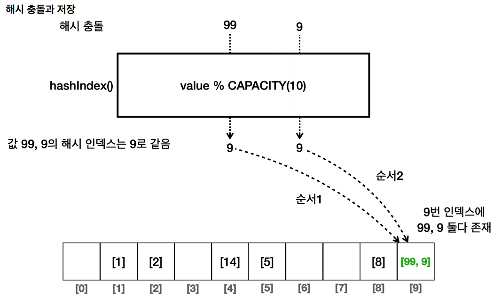

배열 안에 배열 또는 리스트 같은 자료 구조를 사용한다.

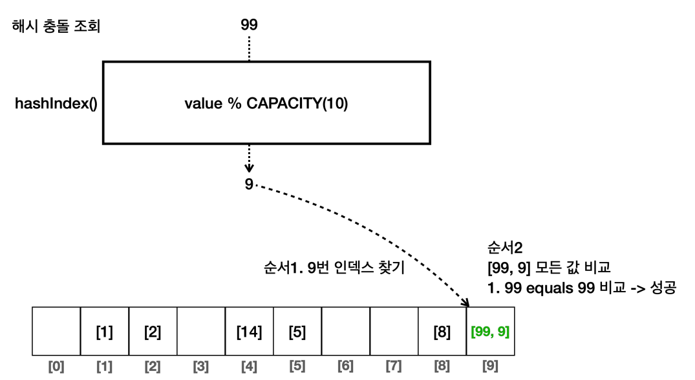

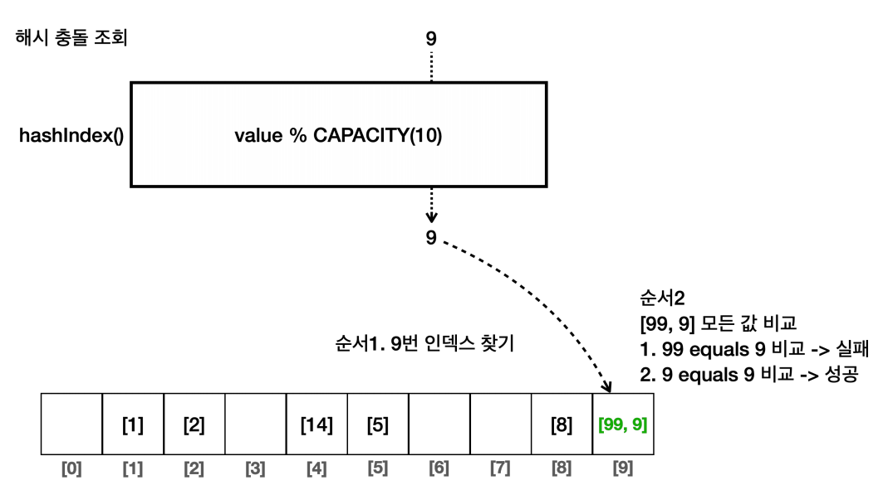

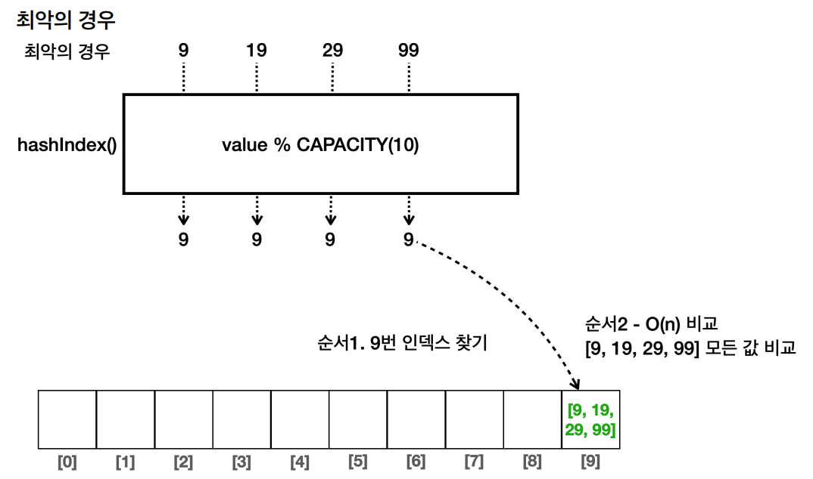

- 해시 인덱스를 사용하는 방식은 최악의 경우 `O(n)`의 성능을 보인다.
- 하지만 확률적으로 보면 어느 정도 넓게 퍼지기 때문에 평균으로 보면 대부분 `O(1)`의 성능을 제공한다.
- 해시 충돌이 가끔 발생해도 내부에서 값을 몇 번만 비교하는 수준이기 때문에 대부분의 경우 매우 빠르게 값을 찾을 수 있다.

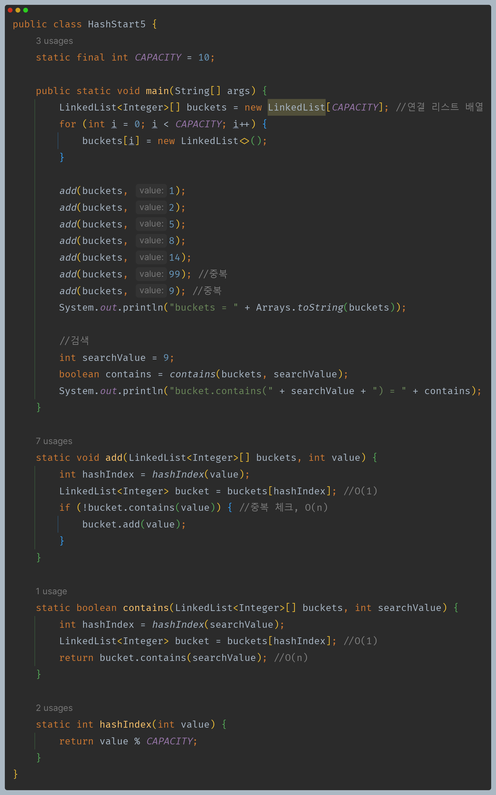

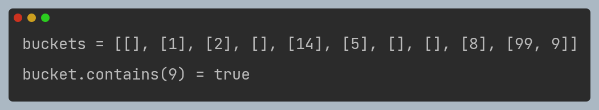

- 연결 리스트의 `contains()`는 모든 항목을 다 순회하기 때문에 `O(n)`의 성능이다.
- 하지만 해시 충돌이 발생하지 않으면 데이터가 1개만 들어있기 때문에 `O(1)`의 성능을 제공한다.

### 해시 인덱스 충돌 확률

- 해시 충돌이 발생하면 데이터를 추가하거나 조회할 때 연결 리스트 내부에서 `O(n)`의 추가 연산을 해야 하므로 성능이 떨어진다. 따라서 해시 충돌은 가급적 발생하지 않도록 해야 한다.
- 해시 충돌이 발생할 확률은 입력하는 데이터의 수와 배열의 크기와 관련이 있다. 
- 입력하는 데이터의 수와 비교해서 배열의 크기가 클수록 충돌 확률은 낮아진다.

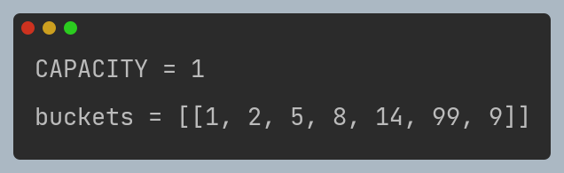

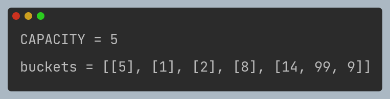

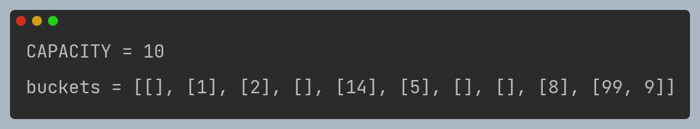

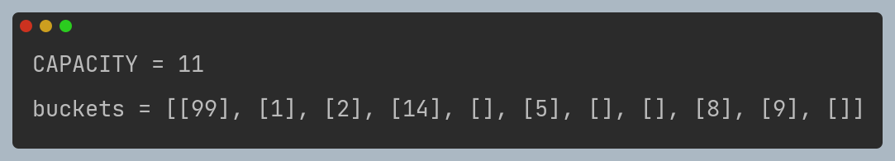

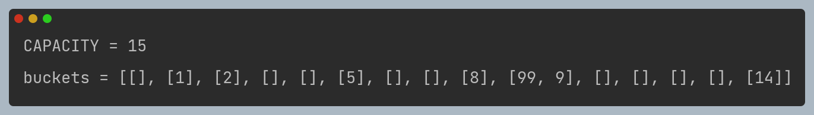

`CAPACITY = 11`의 경우가 충돌이 발생하지 않은 경우다.

- 간단한 예제였지만, 통계적으로 입력한 데이터의 수가 배열의 크기를 `75%` 넘지 않으면 해시 인덱스는 자주 충돌하지 않는다. 반대로 `75%`를 넘으면 자주 충돌하기 시작한다.
- 배열의 크기를 크게 만들면 해시 충돌은 줄겠지만, 많은 메모리가 낭비된다.
- 반대로 배열의 크기를 너무 작게 만들면 해시가 자주 충돌한다.
  - 상황에 따라 다르겠지만 보통 `75%` 를 적절한 크기로 보고 기준으로 잡는 것이 효과적이다.

**정리**
- 해시 인덱스를 사용하는 경우
  - 데이터 저장
    - 평균 : `O(1)`
    - 최악 : `O(n)`
  - 데이터 조회
    - 평균 : `O(1)`
    - 최악 : `O(n)`

해시 인덱스를 사용하는 방식은 사실 최악의 경우는 거의 발생하지 않는다. 배열의 크기만 적절하게 잡아주면 대부분 `O(1)`에 가까운 매우 빠른 성능을 보여준다.

---

[이전 ↩️ - 자바(컬렉션 프레임워크(Hash)) - 직접 구현하는 SetV0](https://github.com/genesis12345678/TIL/blob/main/Java/mid_2/jcf/hash/ListSet.md)

[메인 ⏫](https://github.com/genesis12345678/TIL/blob/main/Java/mid_2/Main.md)

[다음 ↪️ - 자바(컬렉션 프레임워크(Hash)) - 직접 구현하는 HashSetV1](https://github.com/genesis12345678/TIL/blob/main/Java/mid_2/jcf/hashSet/MyHashSetV1.md)