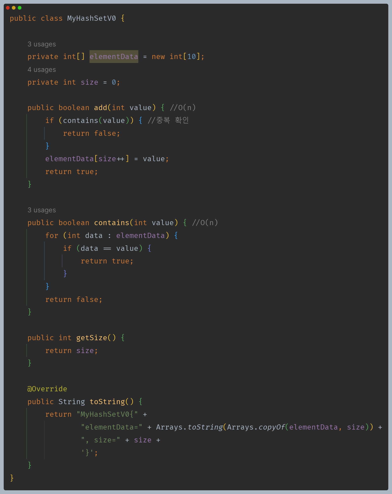
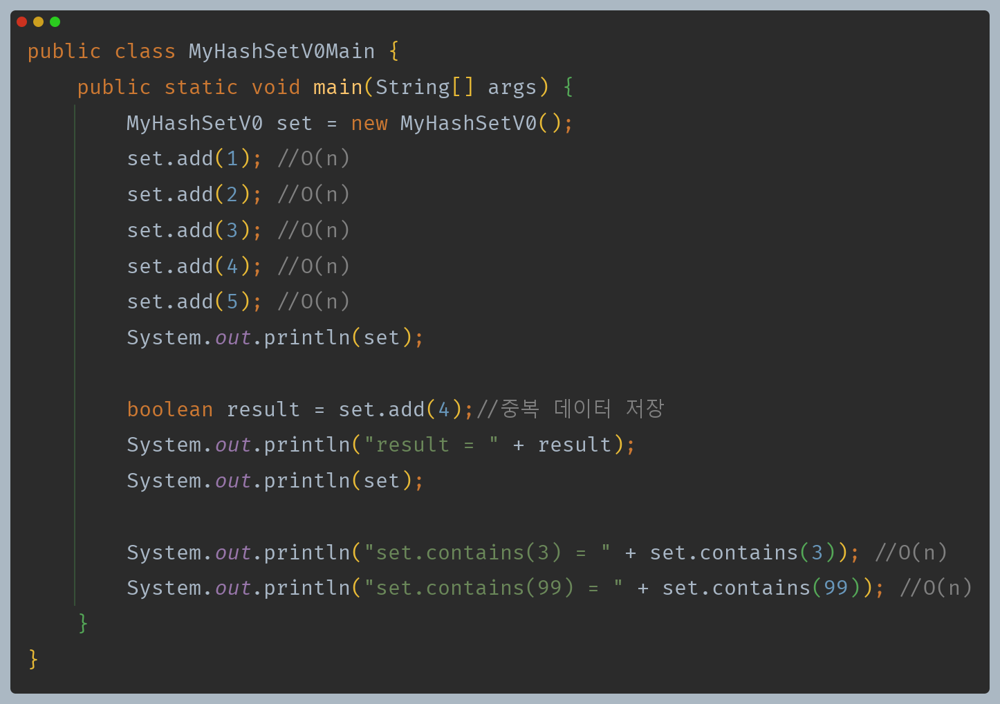
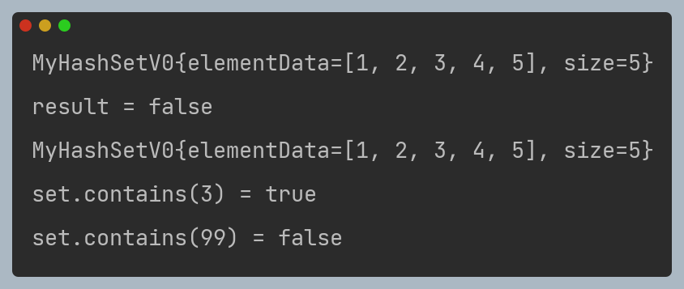

# 자바 - 컬렉션 프레임워크 - Hash

**List vs Set**

- **List**
  - **정의** : 요소들의 순차적인 컬렉션, 요소들은 특정 순서를 가지며, 같은 요소가 여러 번 나타날 수 있다.
  - **특징**
    - **순서 유지** : 리스트에 추가된 요소는 특정한 순서를 유지한다. 이 순서는 요소가 추가된 순서를 반영할 수 있다.
    - **중복 허용** : 리스트는 동일한 값이나 객체의 중복을 허용한다.
    - **인덱스 접근** : 리스트의 각 요소는 인덱스를 통해 접근할 수 있다.
  - **용도** : 순서가 중요하거나 중복된 요소를 허용해야 하는 경우에 주로 사용된다.
- **Set**
  - **정의** : 유일한 요소들의 컬렉션.
  - **특징**
    - **유일성** : 셋에는 중복된 요소가 존재하지 않는다. 셋에 요소를 추가할 때, 이미 존재하는 요소면 무시된다.
    - **순서 미보장** : 대부분의 셋 구현에서는 요소들의 순서를 보장하지 않는다. 즉, 요소를 출력할 때 입력 순서와 다를 수 있다.
    - **빠른 검색** : 셋은 요소의 유무를 빠르게 확인할 수 있도록 최적화되어 있다. 이는 데이터의 중복을 방지하고 빠른 조회를 가능하게 한다.
  - **용도** : 중복을 허용하지 않고, 요소의 유무만 중요한 경우에 사용된다.

---

## 직접 구현하는 SetV0

- 셋을 구현하는 것은 인덱스가 없기 때문에 단순히 데이터를 넣고, 데이터가 있는지 확인하고, 데이터를 삭제하는 정도면 충분하다. 그리고 데이터를
    추가할 때 중복 여부만 체크해주면 되기 때문에 단순하다.

**데이터를 추가할 때마다 중복 데이터가 있는지 체크하기 위해 셋의 전체 데이터를 확인해야 한다. 이때 `O(n)`으로 성능이 떨어진다.
이런 부분을 어떻게 개선할 수 있을까?**

---

[이전 ↩️ - 자바(컬렉션 프레임워크(List)) - 자바 리스트 성능 비교]()

[메인 ⏫](https://github.com/genesis12345678/TIL/blob/main/Java/mid_2/Main.md)

[다음 ↪️ - 자바(컬렉션 프레임워크(Hash)) - 해시 알고리즘]()