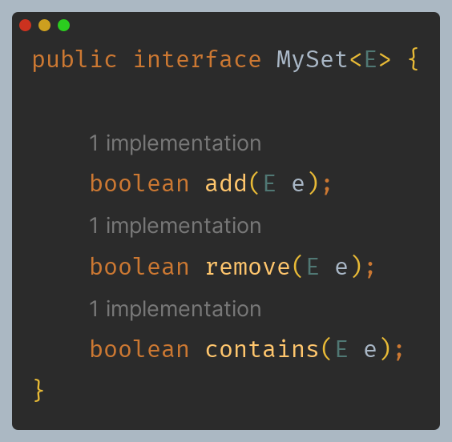
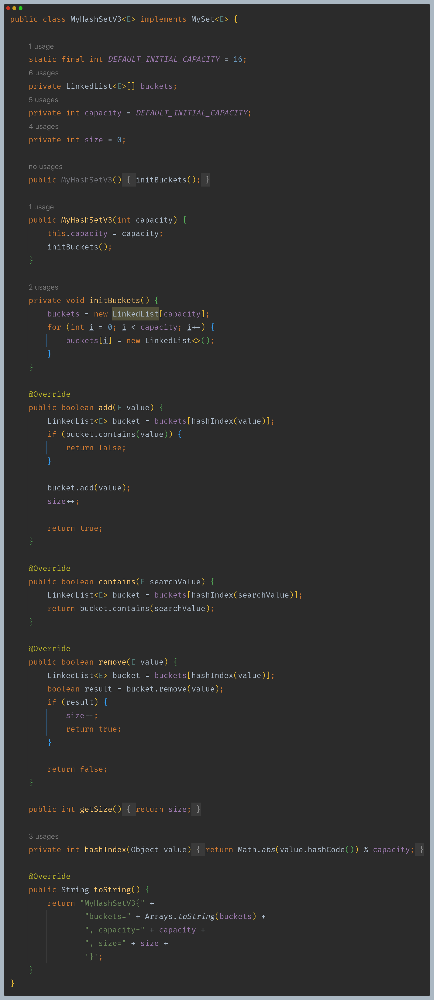
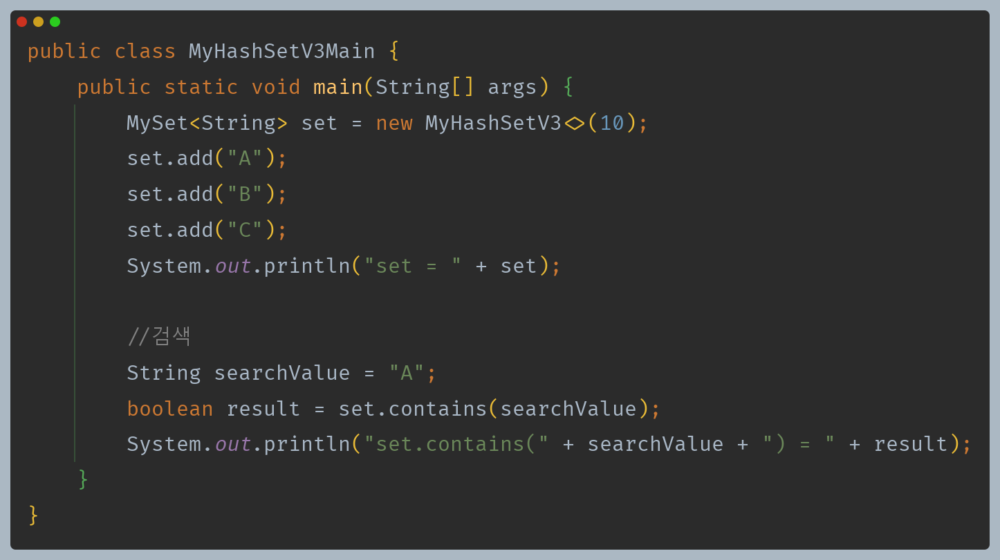
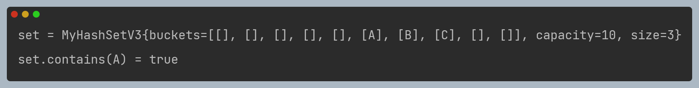

# 자바 - 컬렉션 프레임워크 - HashSet

## 직접 구현하는 HashSetV3(제네릭 적용)

- 핵심 기능을 인터페이스로 뽑았다.
- 이 인터페이스를 구현하면 해시 기반이 아니라 다른 자료 구조 기반의 `Set`도 만들 수 있다.

제네릭을 사용하여 타입 안전성이 높은 자료 구조를 만들 수 있다.

---

[이전 ↩️ - 자바(컬렉션 프레임워크(HashSet)) - equals, hashCode의 중요성](https://github.com/genesis12345678/TIL/blob/main/Java/mid_2/jcf/hashSet/Eq%26HashCode.md)

[메인 ⏫](https://github.com/genesis12345678/TIL/blob/main/Java/mid_2/Main.md)

[다음 ↪️ - 자바(컬렉션 프레임워크(HashSet)) - 자바가 제공하는 Set](https://github.com/genesis12345678/TIL/blob/main/Java/mid_2/jcf/hashSet/JavaSet.md)