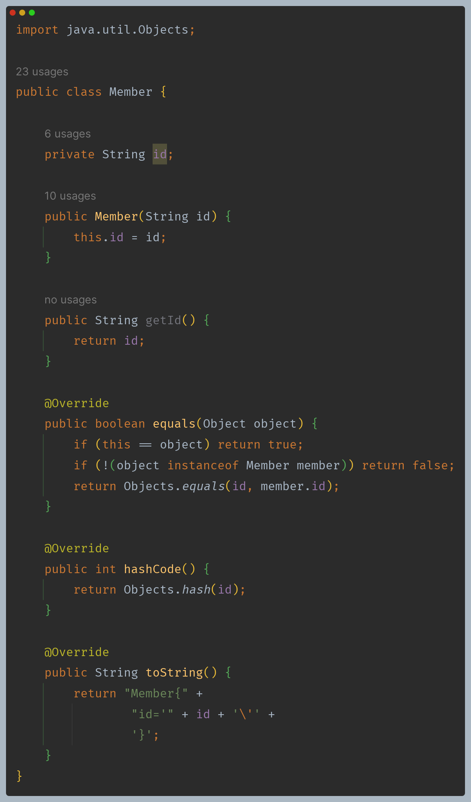
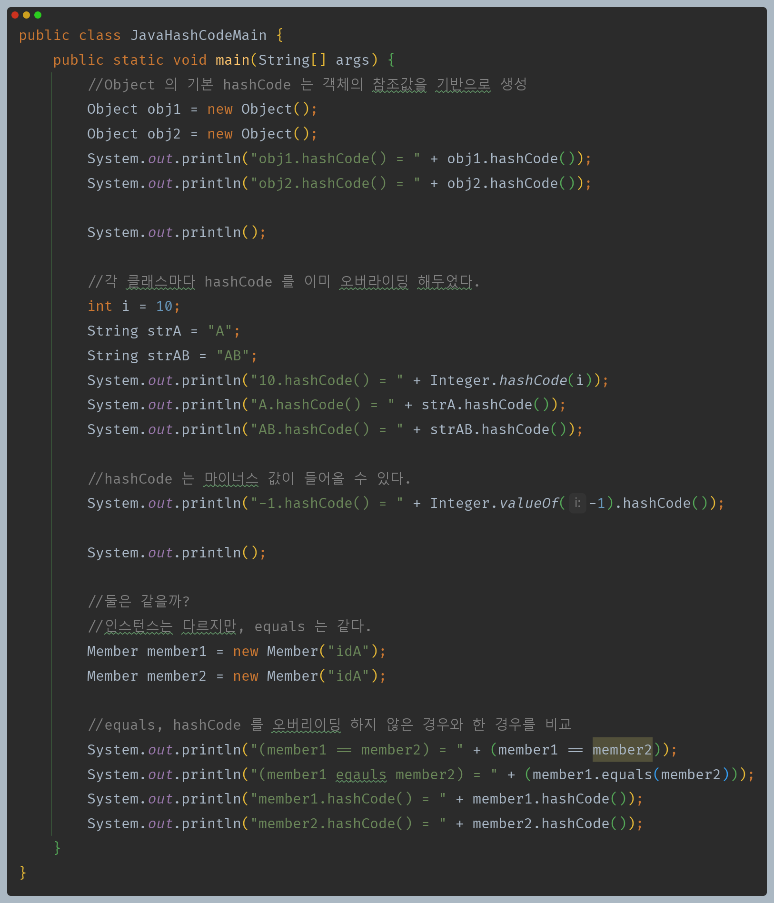
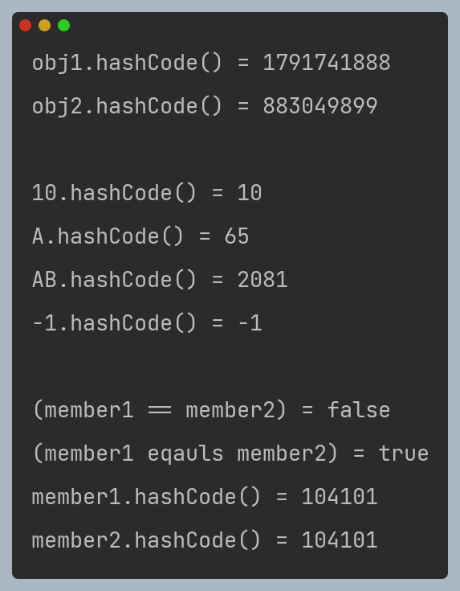

# 자바 - 컬렉션 프레임워크 - HashSet

## 자바의 `hashCode()`

- 해시 인덱스를 사용하는 해시 자료 구조는 데이터 추가, 검색, 삭제의 성능이 `O(1)`로 매우 빠르다. 따라서 많은 곳에서 자주 사용된다.
- 그런데 자바에는 정수형 외에 `String`, `Boolean` 등 수 많은 타입에 더해 직접 정의한 클래스도 있다.
- 이 모든 타입을 해시 자료 구조에 저장하려면 모든 객체가 숫자 해시 코드를 제공할 수 있어야 한다.

**자바는 모든 객체가 자신만의 해시 코드를 표현할 수 있는 기능을 제공한다. `Object`에 있는 `hashCode()` 메서드이다.**
- 이 메서드를 그대로 사용하기 보다는 보통 재정의해서 사용한다.
- 이 메서드의 기본 구현은 객체의 참조값을 기반으로 해시 코드를 생성한다.
- 즉 객체의 인스턴스가 다르면 해시 코드도 다르다.

- IDE의 도움을 받아 `equals()`와 `hashCode()` 메서드를 재정의했다.
- `id`를 기준으로 `equals` 비교를 하고, `hashCode`도 생성한다.

- **Object의 해시 코드 비교**
  - `Object`가 기본으로 제공하는 `hashCode()`는 객체의 참조값을 해시 코드로 사용한다. 각각의 인스턴스마다 서로 다른 값을 반환한다.
- **자바 기본 클래스의 해시 코드**
  - `Integer`, `String` 같은 자바의 기본 클래스들은 대부분 내부 값을 기반으로 해서 해시 코드를 구축할 수 있도록 `hashCode()` 메서드를 재정의 해 두었다.
  - 데이터의 값이 같으면 같은 해시 코드를 반환한다.
  - 해시 코드의 경우 정수를 반환하기 때문에 마이너스 값이 나올 수 있다.
- **직접 구현하는 해시 코드**
  - 예를 들어 `Member`의 경우 `id`가 같으면 논리적으로 같은 회원으로 표현할 수 있다. `id`를 기반으로 동등성을 비교하도록 `equals()`를 재정의해야 한다.
  - 여기에 `hashCode()`도 같은 원리가 적용된다. `id`가 같으면 논리적으로 같은 회원으로 표현할 수 있으므로 `id`를 기반으로 해시 코드를 생성해야 한다.
  - `hashCode()`를 재정의 하지 않으면 `Object`가 기본으로 제공하는 `hashCode()`를 사용하게 되는데, 이것은 객체의 참조값을 기반으로 해시 코드를 제공하기 때문에
    `id`가 같아도 인스턴스가 다르면 다른 해시 코드를 반환한다.
  - 위 코드에서는 `hashCode()`를 재정의 했기 때문에 인스턴스가 달라도 같은 해시 코드를 반환하는 것을 확인할 수 있다.

**정리**
- 자바가 기본으로 제공하는 클래스 대부분은 `hashCode()`를 재정의 해두었다.
- 객체를 직접 만들어야 하는 경우 `hashCode()`를 재정의 하면 된다.
- `hashCode()` 와 `equals()`를 재정의하면 필요한 모든 종류의 객체를 해시 자료 구조에 보관할 수 있다.
- 즉, 해시 자료 구조에 데이터를 저장하는 경우 `hashCode()`와 `equals()`를 구현해야 한다.

---

[이전 ↩️ - 자바(컬렉션 프레임워크(HashSet)) - 문자열 해시코드](https://github.com/genesis12345678/TIL/tree/main/Java/mid_2/jcf/hashSet)

[메인 ⏫](https://github.com/genesis12345678/TIL/blob/main/Java/mid_2/Main.md)

[다음 ↪️ - 자바(컬렉션 프레임워크(HashSet)) - 직접 구현하는 HashSetV2](https://github.com/genesis12345678/TIL/blob/main/Java/mid_2/jcf/hashSet/MyHashSetV2.md)