# 자바 - 컬렉션 프레임워크 - HashSet

## 자바가 제공하는 Set

**컬렉션 프레임워크 - Set**

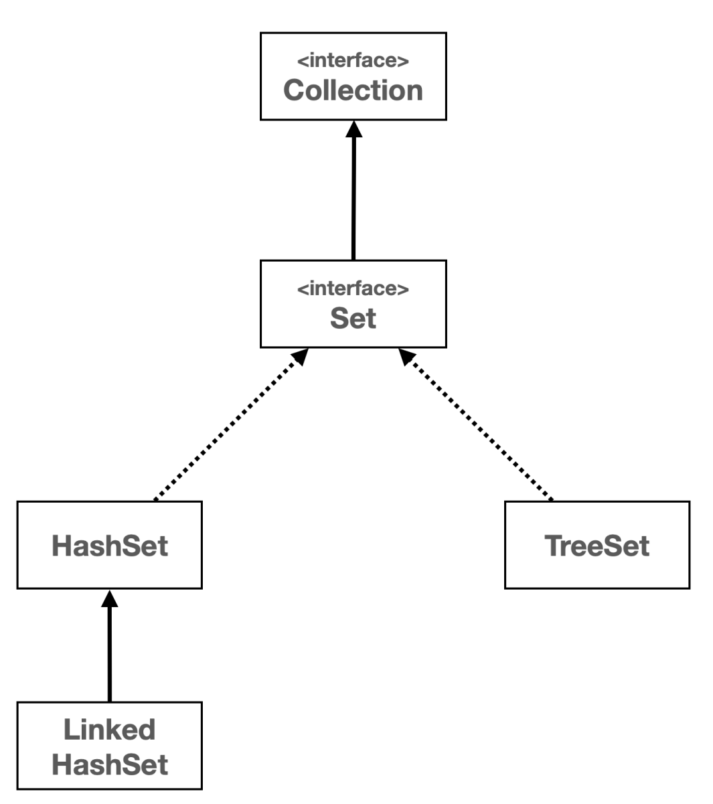

- **Collection 인터페이스**
  - `Collection` 인터페이스는 `java.util` 패키지의 컬렉션 프레임워크의 핵심 인터페이스 중 하나이다.
  - 이 인터페이스는 자바에서 다양한 컬렉션, 데이터 그룹을 다루기 위한 메서드를 정의한다.
  - 이를 통해 데이터를 리스트, 셋, 큐 등의 형태로 관리할 수 있다.
- **Set 인터페이스**
  - `Set` 인터페이스는 `java.util` 패키지의 컬렉션 프레임워크에 속하는 인터페이스 중 하나이다.
  - `Set` 인터페이스는 중복을 허용하지 않는 유일한 요소의 집합을 나타낸다. 즉, 어떤 요소도 같은 `Set` 내에 두 번 이상 나타날 수 없다.
  - `Set`은 수학적 집합 개념을 구현한 것으로 순서를 보장하지 않으며, 특정 요소에 집합에 있는지 여부를 확인하는 데 최적화되어 있다.

`Set` 인터페이스는 `HashSet`, `LinkedHashSet`, `TreeSet` 등 여러 구현 클래스를 가지고 있으며 각 클래스는 `Set` 인터페이스를 구현하며 각각의 특성을 가지고 있다.

---

## 자바가 제공하는 Set - HashSet

- **구현** : 해시 자료 구조를 사용해서 요소를 저장
- **순서** : 특정한 순서 없이 저장, 요소를 추가한 순서를 보장하지 않는다.
- **시간 복잡도** : 주요 연산(추가, 삭제, 검섹)은 평균적으로 `O(1)` 시간 복잡도를 가진다.
- **용도** : 데이터의 유일성만 중요하고, 순서가 중요하지 않은 경우에 적합

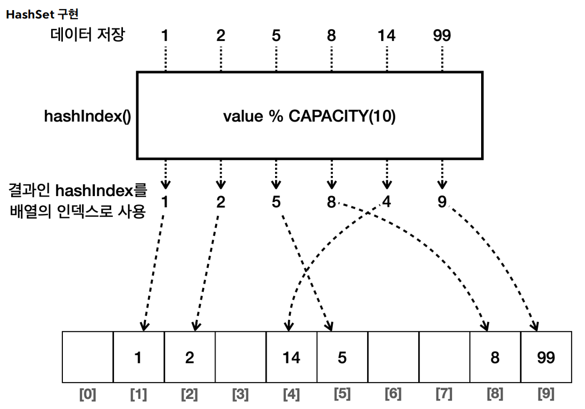

---

## 자바가 제공하는 Set - LinkedHashSet

- **구현** : `HashSet`에 연결 리스트를 추가해서 요소들의 순서를 유지한다.
- **순서** : 요소들은 추가된 순서대로 유지된다. 순서대로 조회 시 요소들이 추가된 순서대로 반환된다.
- **시간 복잡도** : 주요 연산(추가, 삭제, 검섹)은 평균적으로 `O(1)` 시간 복잡도를 가진다.
- **용도** : 데이터의 유일성과 함께 삽입 순서를 유지해야 할 때 적합
- **참고** : 연결 링크를 유지해야 하기 때문에 `HashSet` 보다는 조금 더 무겁다.

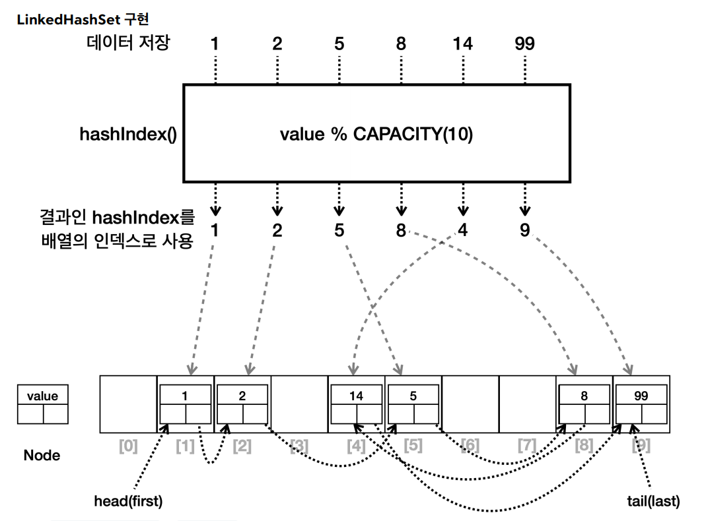

---

## 자바가 제공하는 Set - TreeSet

- **구현** : 이진 탐색 트리를 개선한 레드-블랙 트리를 내부에서 사용한다.
- **순서** : 요소들은 정렬된 순서로 저장된다. 순서의 기준은 비교자(`Comparator`)로 변경할 수 있다.
- **시간 복잡도** : 주요 연산들은 `O(log n)`의 시간 복잡도를 가진다. `HashSet` 보다는 느리다.
- **용도** : 데이터들을 정렬된 순서로 유지하면서 집합의 특성을 유지해야 할 때 사용한다.

### 트리 구조

- 트리는 부모 노드와 자식 노드로 구성된다.
- 가장 높은 조상을 루트(`root`) 라고 한다.
- 자식이 2개까지 올 수 있는 트리를 **이진 트리**라 한다.
- 여기에 노드의 왼쪽 자손은 더 작은 값을 가지고, 오른쪽 자손은 더 큰 값을 가지는 것을 **이진 탐색 트리**라 한다.
- `TreeSet`은 이진 탐색 트리를 개선한 레드-블랙 트리를 사용한다.

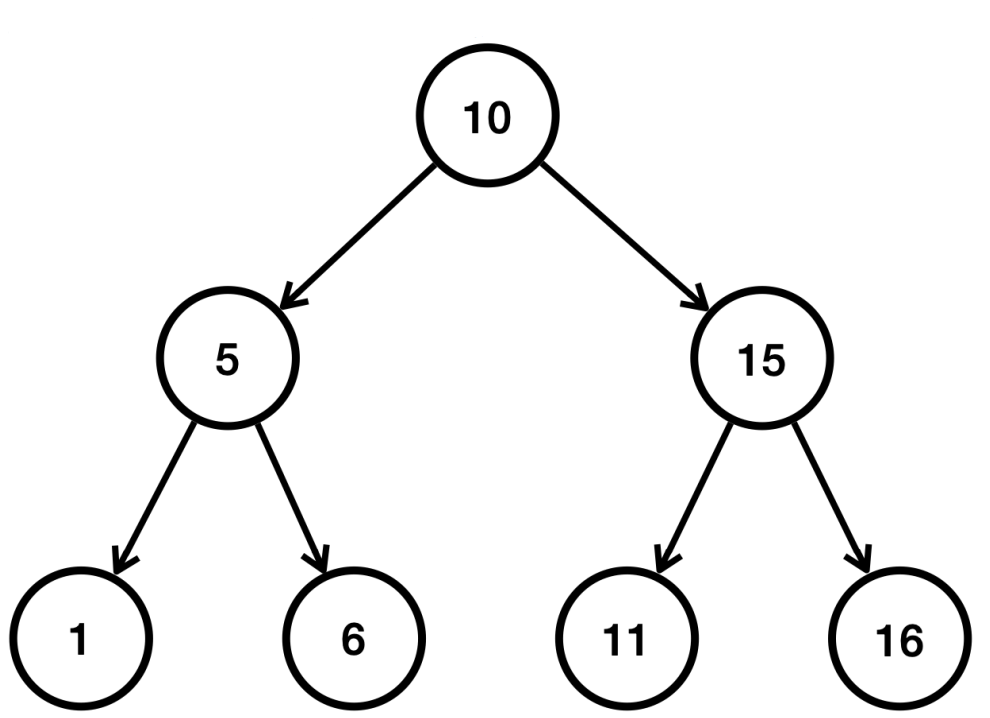

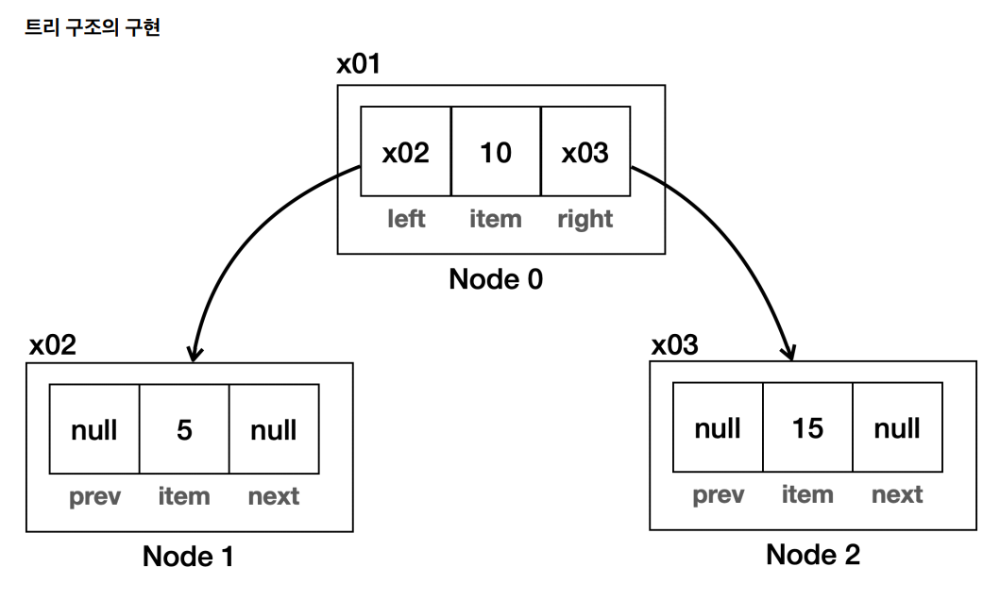

트리 구조는 왼쪽, 오른쪽 노드를 알고 있으면 된다.

```java
class Node { 
    Object item; 
    Node left; 
    Node right;
}
```

### 이진 탐색 트리 - 입력

- 이진 탐색 트리의 핵심은 데이터를 입력하는 시점에 정렬해서 보관한다는 점이다.
- 작은 값은 왼쪽에, 큰 값은 오른쪽에 저장하면 된다.

데이터를 10, 5, 15, 1, 6, 11, 16 순서대로 입력해보면 이렇게 저장된다.

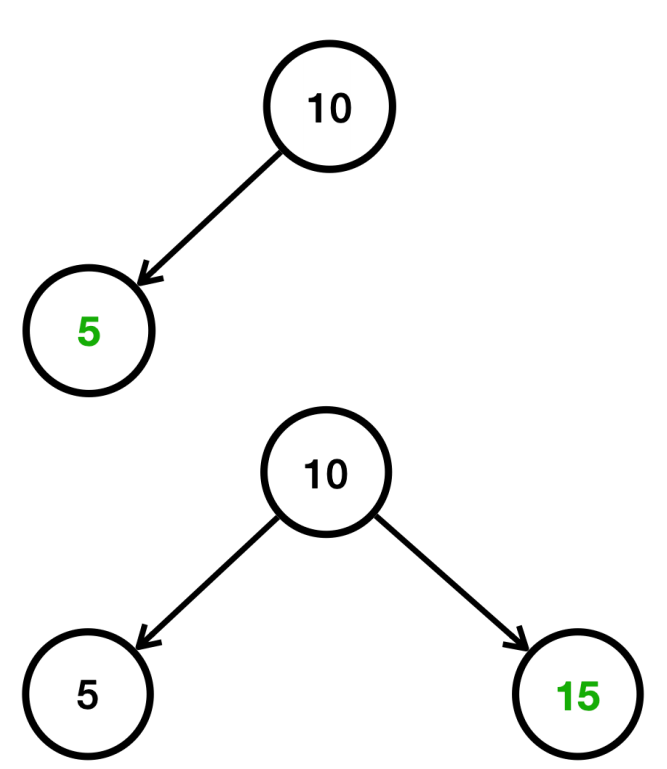

- `5 < 10` 이므로 왼쪽에 저장
- `15 > 10` 이므로 오른쪽에 저장

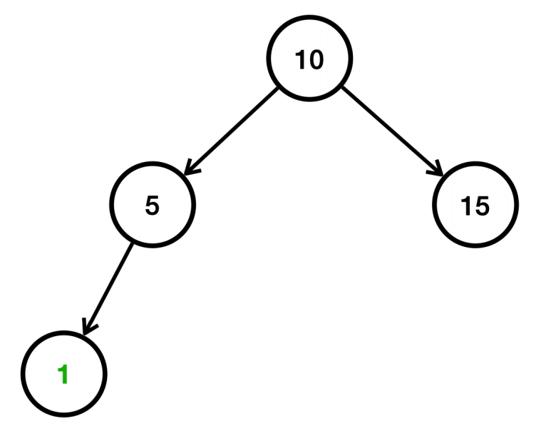

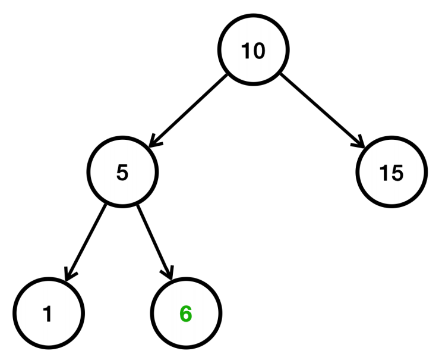

- `1 < 10` 이므로 왼쪽으로 찾아간다, `1 < 5` 이므로 왼쪽에 저장
- `6 < 10` 이므로 왼쪽으로 찾아간다, `6 > 5` 이므로 오른쪽에 저장

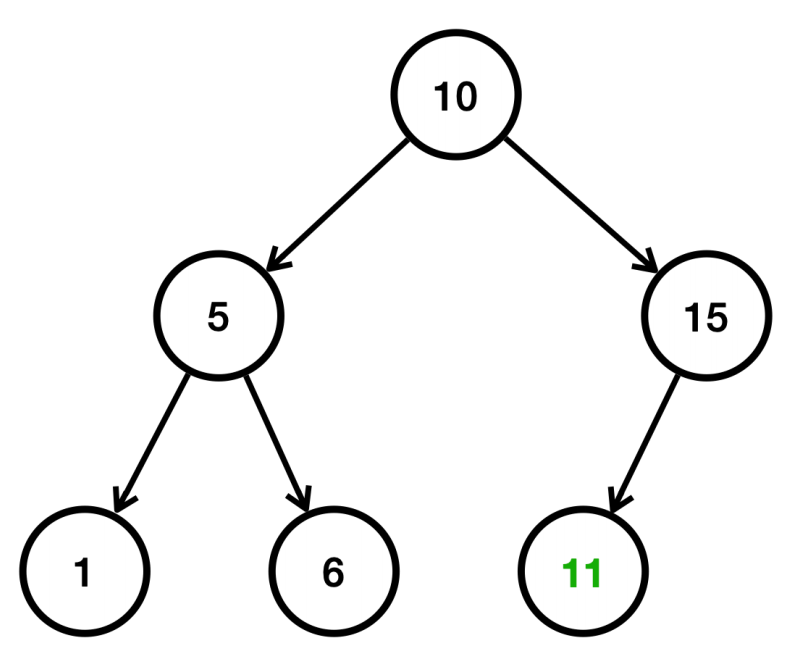

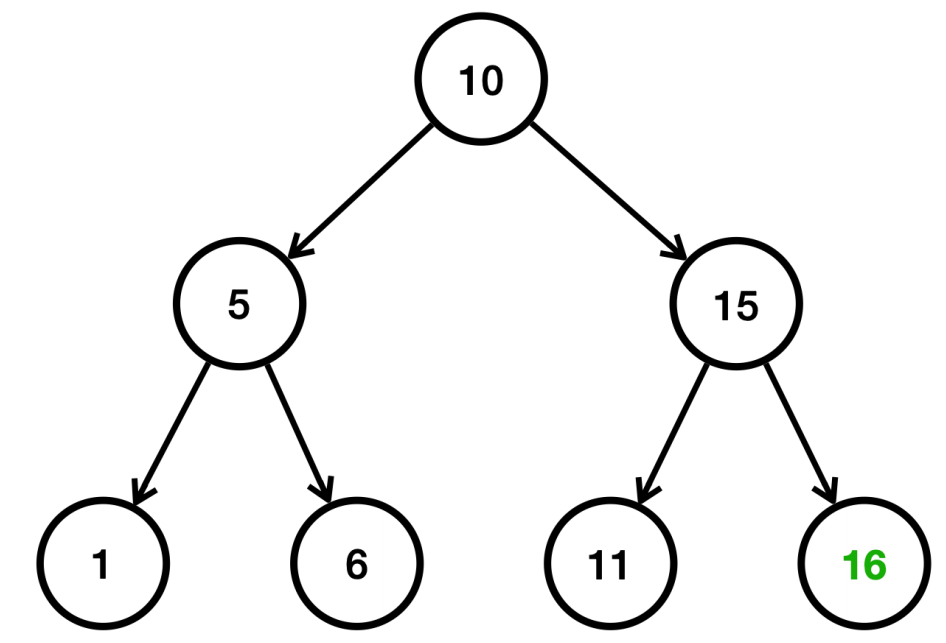

- `11 > 10` 이므로 오른쪽으로 찾아간다, `11 < 15` 이므로 왼쪽에 저장
- `16 > 10` 이므로 오른쪽으로 찾아간다, `16 > 15` 이므로 오른쪽에 저장

### 이진 탐색 트리 - 검색

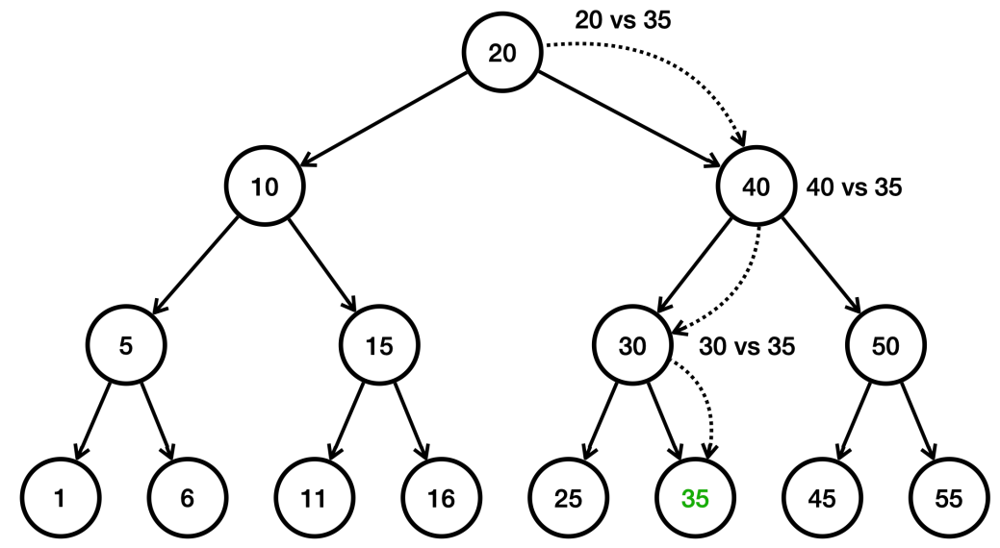

15개의 데이터가 있는 이진 트리에서 `35`를 검색
1. 루트부터 비교, `20 < 35` 이므로 오른쪽으로 찾아간다.
2. `40 > 35` 이므로 왼쪽으로 찾아간다.
3. `30 < 35` 이므로 오른쪽으로 찾아간다.
4. `35 = 35` 이므로 값을 찾았다.

데이터가 총 15개 인데 4번의 계산으로 필요한 결과를 얻었다. 이것은 `O(n)`인 리스트 검색보다는 빠르고, `O(1)`인 해시의 검색 보다는 느리다.

**이진 탐색 트리 계산의 핵심은 한번에 절반을 날린다는 점이다. 각 노드에서 비교를 통해 왼쪽 또는 오른쪽으로 찾아갈 때, 반대쪽은 비교할 필요가 없어지므로 찾아갈 때마다 데이터 개수가 절반씩 줄어든다.**

**이진 탐색 트리의 빅오 - O(log n)**
- 예를 들어 데이터 16개의 경우 단 4번의 비교 만으로 최종 노드에 도달할 수 있다. 정리하면 다음과 같다.
  - 2개의 데이터 -> 2로 1번 나누기, `log₂(2) = 1`
  - 4개의 데이터 -> 2로 2번 나누기, `log₂(4) = 2`
  - 8개의 데이터 -> 2로 3번 나누기, `log₂(8) = 3`
  - 16개의 데이터 -> 2로 4번 나누기, `log₂(16) = 4`
  - ...
  - 1024개의 데이터 -> 2로 10번 나누기, `log₂(1024) = 10`

1024개의 데이터를 단 10번의 계산으로 원하는 결과를 찾을 수 있다. 데이터의 크키가 늘어나도 늘어난 만큼 한 번의 계산으로 절반을 날려버리기 때문에 `O(n)`
과 비교해서 데이터의 크기가 클수록 효과적이다.

이것을 수학으로 `log₂(n)`으로 표현한다. 로그는 쉽게 생각하면 2로 몇번 나누어서 1에 도달할 수 있는지 계산하면 된다.
그리고 빅오 표기법에서 상수는 사용하지 않으므로 단순히 `O(log n)`으로 표현한다.

### 이진 탐색 트리의 성능

- 이진 탐색 트리의 검색, 삽입, 삭제의 평균 성능은 `O(log n)`이다. 
- 하지만 트리의 균형이 맞지 않으면 최악의 경우 `O(n)`의 성능이 나온다.

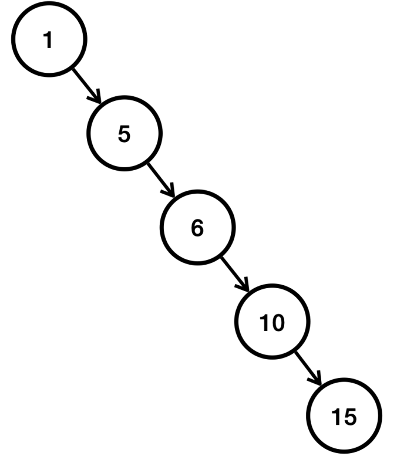

이렇게 한쪽으로 치우치게 되는 경우가 최악의 경우로, `O(n)`의 성능이 나온다.

이런 문제를 해결하기 위한 다양한 해결 방안 중 하나는, 트리의 균형이 너무 깨진 경우 동적으로 균형을 다시 맞추는 것이다.

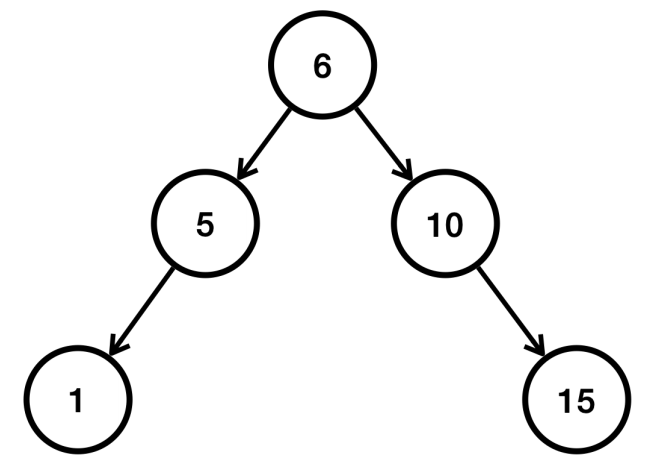

- 중간에 있는 6을 기준으로 다시 정렬한다.
- AVL 트리, 레드-블랙 트리 같은 균형을 맞추는 다양한 알고리즘이 존재한다.
- 자바의 `TreeSet`은 레드-블랙 트리를 사용해서 균형을 지속해서 유지하기 때문에 최악의 경우에도 `O(log n)`의 성능을 제공한다.

### 이진 탐색 트리 - 순회

- 이진 탐색 트리의 핵심은 입력 순서가 아니라, 데이터의 값을 기준으로 정렬해서 보관한다는 점이다.
- 따라서 정렬된 순서로 데이터를 차례로 조회(순회)할 수 있다.
- 데이터를 차례로 순회하려면 **중위 순회** 하면 된다. `왼쪽 서브트리 -> 현재 노드 -> 오른쪽 서브트리` 순서로 방문한다.
- 이 방식은 이진 탐색 트리의 특성상, 노드를 오름차순으로 방문한다.

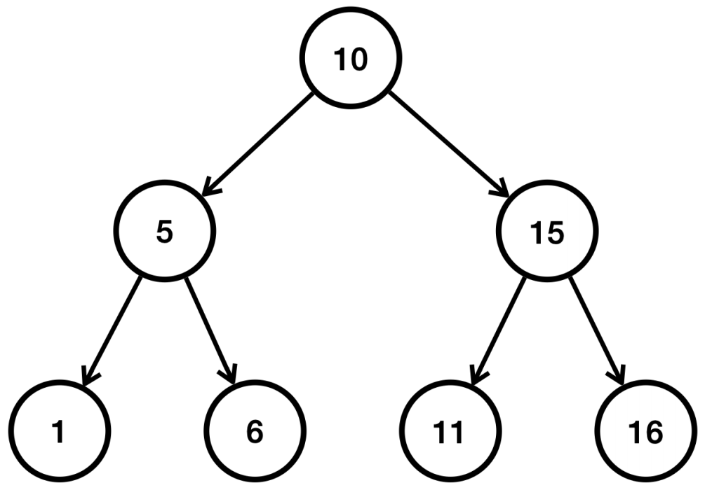

중위 순회를 하면 `1, 5, 6, 10, 11, 15, 16` 순서로 출력한다.

---

## 코드 예시


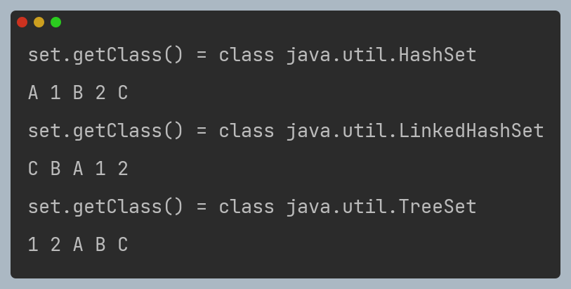

- `HashSet`은 입력 순서를 유지하지 않는다.
- `LinkedHashSet`은 입력 순서를 유지한다.
- `TreeSet`은 데이터를 정렬한다.

---

## 자바가 제공하는 Set - 최적화

- 해시 기반 자료 구조를 사용하는 경우 통계적으로 입력한 데이터의 수가 배열의 크기를 75% 정도 넘어가면 해시 인덱스가 자주 충돌한다. 75%가 넘어가면 성능이 떨어지기 시작한다.
  - 해시 충돌로 같은 해시 인덱스에 들어간 데이터를 검색하려면 모두 탐색해야 하므로 성능이 `O(n)`으로 좋지 않다.
- 하지만 데이터가 동적으로 계속 추가되기 때문에 적절한 배열의 크기를 정하는 것은 어렵다.
- 자바의 `HashSet`은 데이터의 양이 배열 크기의 75%를 넘어가면 배열의 크기를 2배로 늘리고 2배 늘어난 크기를 기준으로 모든 요소에 해시 인덱스를 다시 적용한다.
  - 해시 인덱스를 다시 적용하는 시간이 걸리지만, 결과적으로 해시 충돌이 줄어든다.
- 참고로 자바 `HashSet`의 기본 크기는 16 이다.

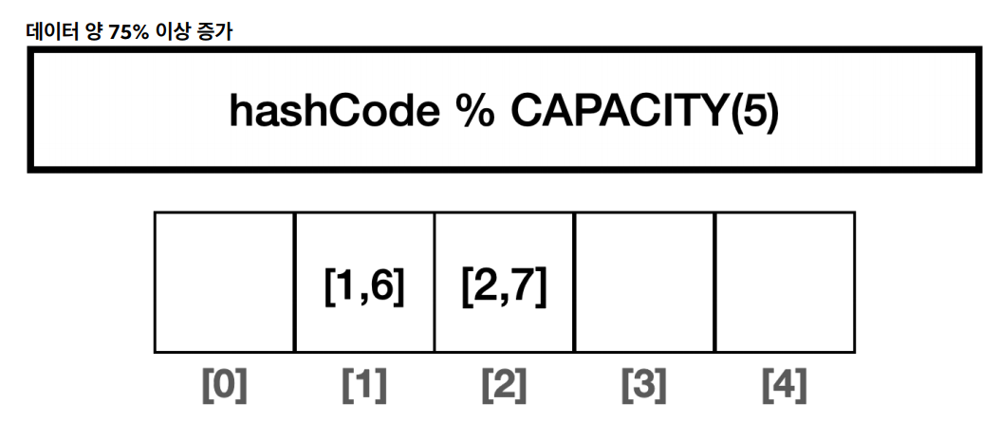

- 배열의 크기는 5이고, 데이터의 양은 4개로 데이터의 수가 배열 크기의 80% 이므로 75%를 넘어갔다.
- 데이터 양이 75% 이상 증가하면 그 만큼 해시 인덱스의 충돌 가능성도 높아진다.

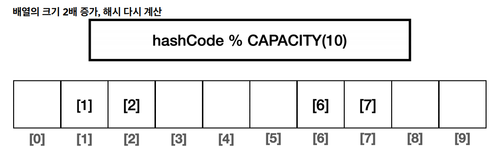

- 배열의 크기를 2배로 증가하고, 모든 데이터의 해시 인덱스를 커진 배열에 맞춰 다시 계산한다. 이 과정을 재해싱(rehashing) 이라 한다.
- 인덱스 충돌 가능성이 낮아진다.

**정리**
- 실무에서는 `Set`이 필요한 경우 `HashSet`을 가장 많이 사용한다.
- 추가로 입력 순서 유지, 값 정렬의 필요에 따라서 `LinkedHashSet`, `TreeSet`을 선택하면 된다.

---

[이전 ↩️ - 자바(컬렉션 프레임워크(HashSet)) - 직접 구현하는 HashSetV3(제네릭 적용)](https://github.com/genesis12345678/TIL/blob/main/Java/mid_2/jcf/hashSet/Generic.md)

[메인 ⏫](https://github.com/genesis12345678/TIL/blob/main/Java/mid_2/Main.md)