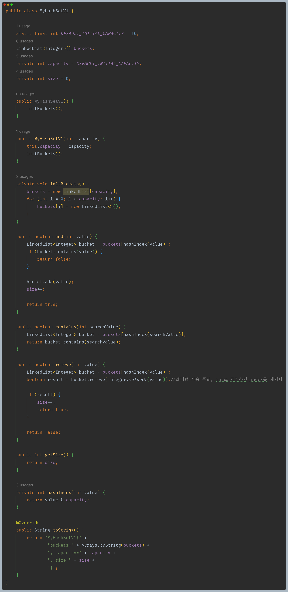
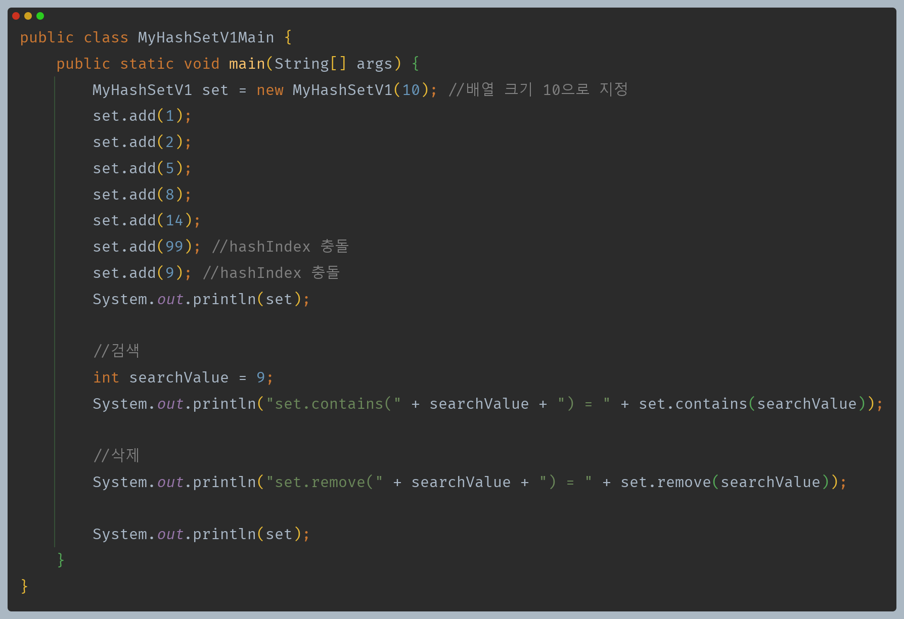
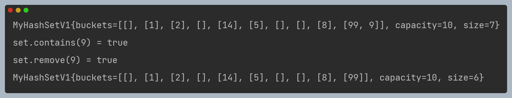

# 자바 - 컬렉션 프레임워크 - HashSet

## 직접 구현하는 Set - MyHashSetV1

- `직접 구현한 SetV0` 에는 큰 단점이 있었다.
- 데이터를 추가할 때마다 중복 데이터가 있는지 체크하는 부분에서 `O(n)`으로 좋지 않다는 점이다. 이때 중복 데이터가 있는지 모든 데이터를 다 찾아봐야 한다.
- 해시 알고리즘을 사용해서 성능을 개선해보자.

- `add()`와 `contains()`, `remove()` 모두 해시 인덱스를 사용하여 데이터를 보관, 확인, 제거를 한다.
- `99`와 `9`의 경우 해시 인덱스가 9로 충돌하여 배열의 같은 9번 인덱스 위치에 저장되었다.
- `9`를 검색하는 경우 배열의 9번 인덱스에 있는 연결 리스트를 먼저 찾고, 해당 연결 리스트에 있는 모든 데이터를 순서대로 비교하면서 `9`를 찾는다.
- 해시 알고리즘을 사용하여 등록, 검색, 삭제 모두 평균 `O(1)`로 연산 속도를 크게 개선했다.

**그런데 숫자가 아닌 문자열 데이터를 저장할 때 해시 인덱스를 사용하려면 어떻게 해야 할까?**

---

[이전 ↩️ - 자바(컬렉션 프레임워크(Hash)) - 해시 알고리즘](https://github.com/genesis12345678/TIL/blob/main/Java/mid_2/jcf/hash/HashAlgo.md)

[메인 ⏫](https://github.com/genesis12345678/TIL/blob/main/Java/mid_2/Main.md)

[다음 ↪️ - 자바(컬렉션 프레임워크(HashSet)) - 문자열 해시 코드]()