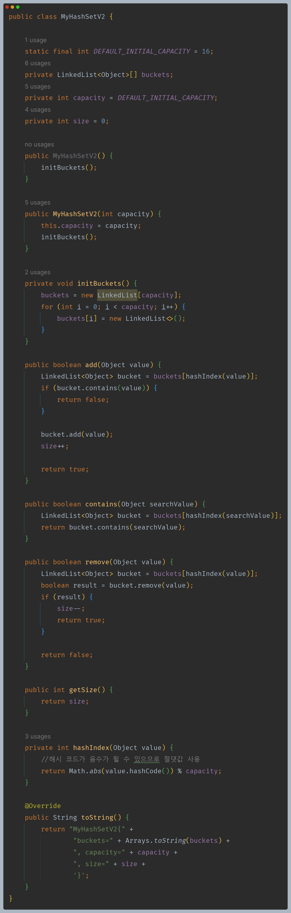
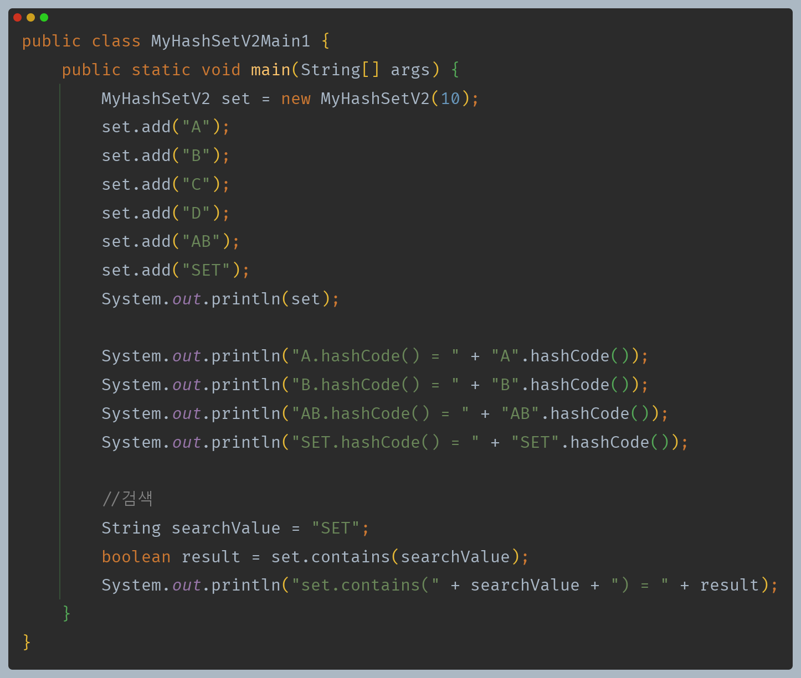
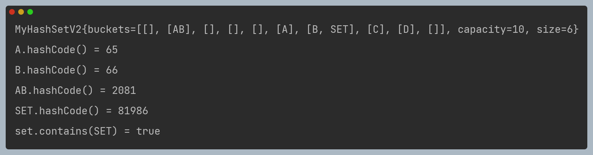
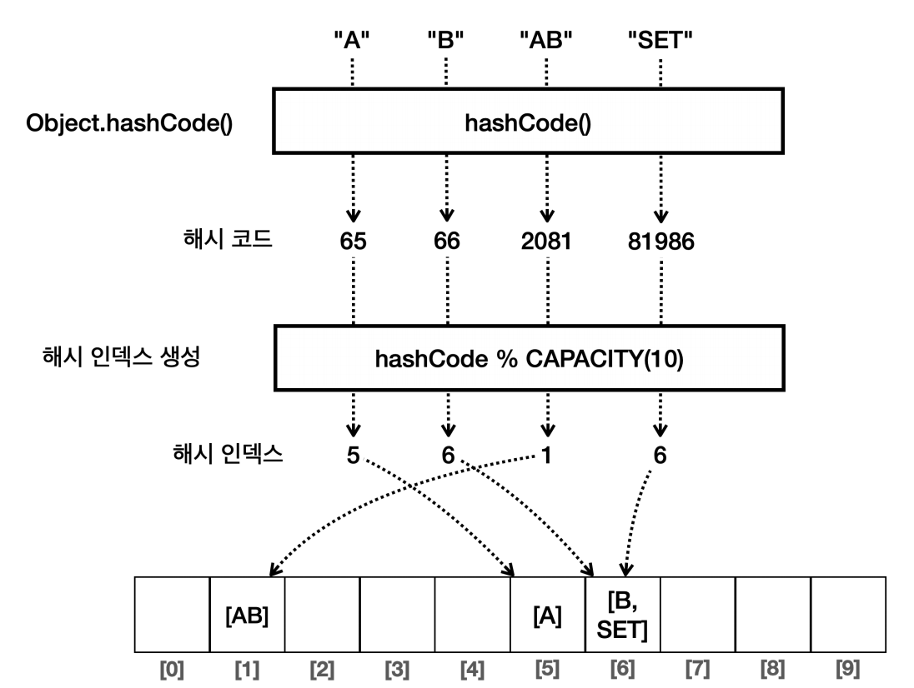
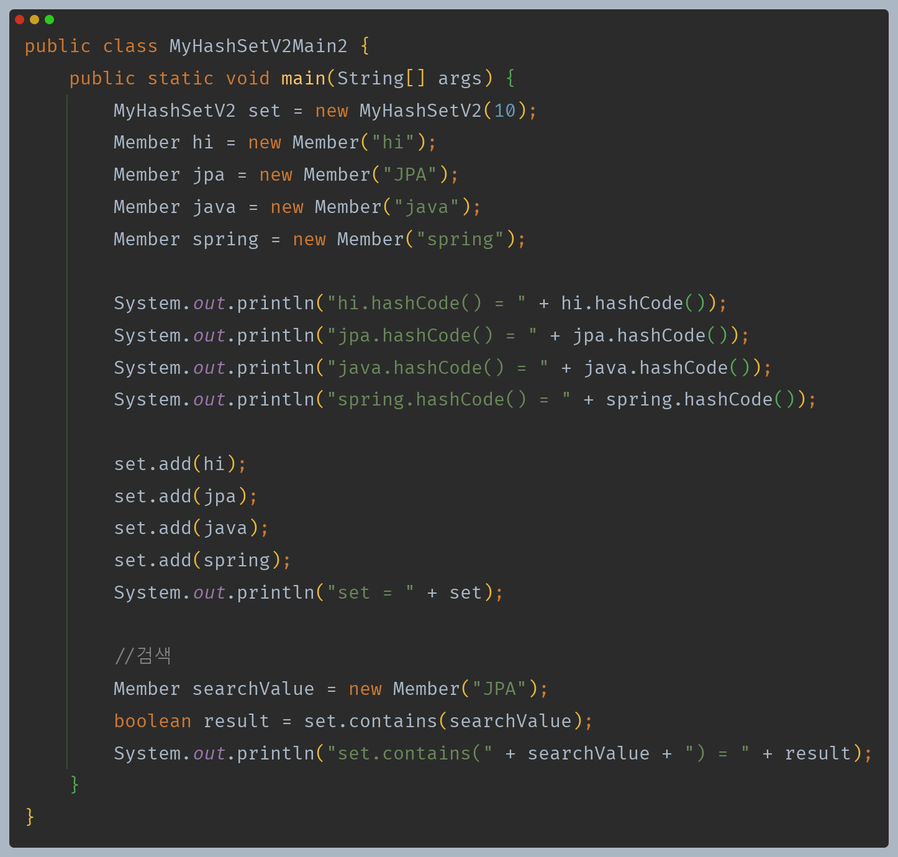
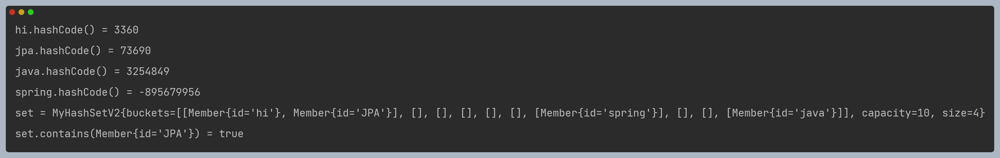
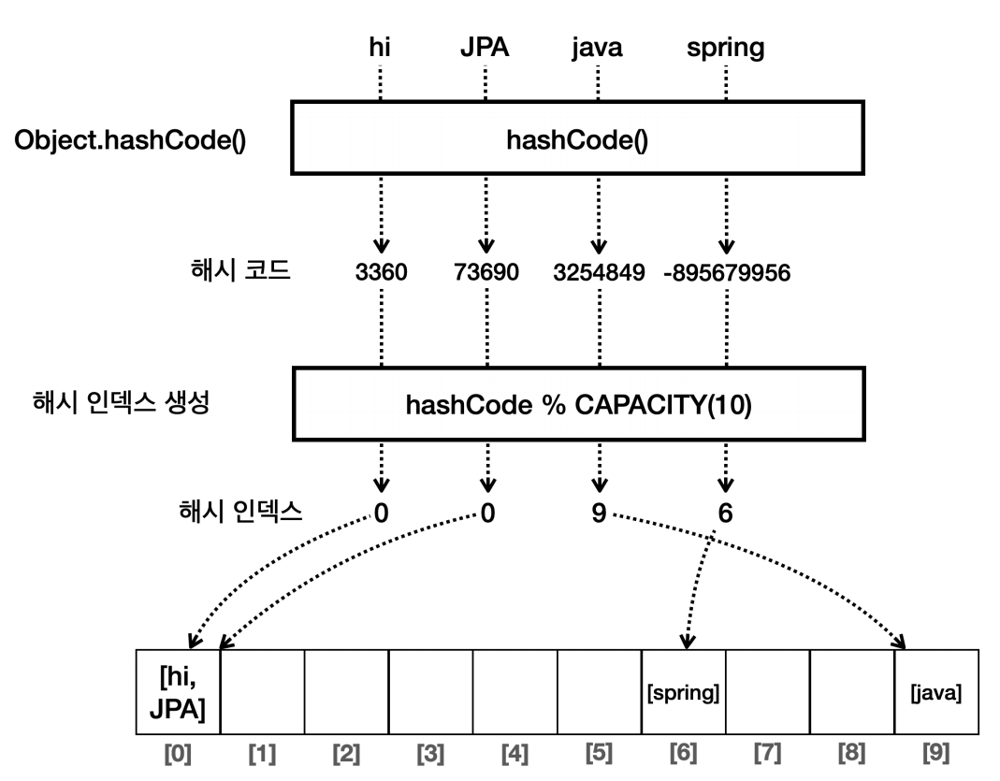

# 자바 - 컬렉션 프레임워크 - HashSet

## 직접 구현하는 Set - HashSetV2

- 이제는 모든 타입을 저장할 수 있는 `Set`을 만들어보자.
- 자바의 `hashCode()`를 사용하면 타입과 관계없이 해시 코드를 편리하게 구할 수 있다.

- 모든 타입을 저장할 수 있도록 `Object`를 사용한다.
- `hashIndex()`
  - 먼저 `Object`의 `hashCode()`를 호출해서 해시 코드를 찾고, 찾은 해시 코드를 배열의 크기로 나머지 연산을 수행한다. 이렇게 해시 코드를 기반으로 해시 인덱스를 계산해서 반환한다.
  - `Object`의 `hashCode()`를 사용한 덕분에 모든 객체의 해시 코드를 구할 수 있다. 물론 다형성에 의해 오버라이딩 된 `hashCode()`가 호출된다.

- `hashIndex()`에서 `value.hashCode()`를 호출하면 `String` 에서 재정의한 `hashCode()`가 호출된다.
- 이렇게 반환된 해시 코드를 기반으로 해시 인덱스를 생성한다.

---

## 직접 만든 객체 보관

- 위에서 만든 `HashSetV2`는 `Object`를 받기 때문에 직접 만든 객체도 보관할 수 있다.
- 여기서 주의할 점은 직접 만든 객체가 `hashCode()`와 `equals()` 두 메서드를 반드시 구현해야 한다는 점이다.

- `hashIndex()`에서 `value.hashCode()`를 호출하면 `Member` 에서 재정의한 `hashCode()`가 호출된다.
- 이렇게 반환된 해시 코드를 기반으로 해시 인덱스를 생성한다.

**그러면 `equals()`는 언제 사용할까?**
- "JPA"를 조회할 때 해시 인덱스는 0이고, 배열의 0번 인덱스에는 `hi`와 `JPA` 두 개가 있다. 이때 `equals()`를 사용해서 비교한다.
- 따라서 해시 자료 구조를 사용할 때는 `hashCode()`는 물론 `eqauls()`도 반드시 재정의 해야 한다.(해시 충돌이 났을 때 객체를 비교하기 위해)
- 참고로 자바가 제공하는 기본 클래스들은 대부분 `hashCode()`와 `equals()`를 함께 재정의 해두었다.

---

[이전 ↩️ - 자바(컬렉션 프레임워크(HashSet)) - 자바 `hashCode()`](https://github.com/genesis12345678/TIL/blob/main/Java/mid_2/jcf/hashSet/JavaHashCode.md)

[메인 ⏫](https://github.com/genesis12345678/TIL/blob/main/Java/mid_2/Main.md)

[다음 ↪️ - 자바(컬렉션 프레임워크(HashSet)) - equals와 hashCode의 중요성](https://github.com/genesis12345678/TIL/blob/main/Java/mid_2/jcf/hashSet/Eq%26HashCode.md)