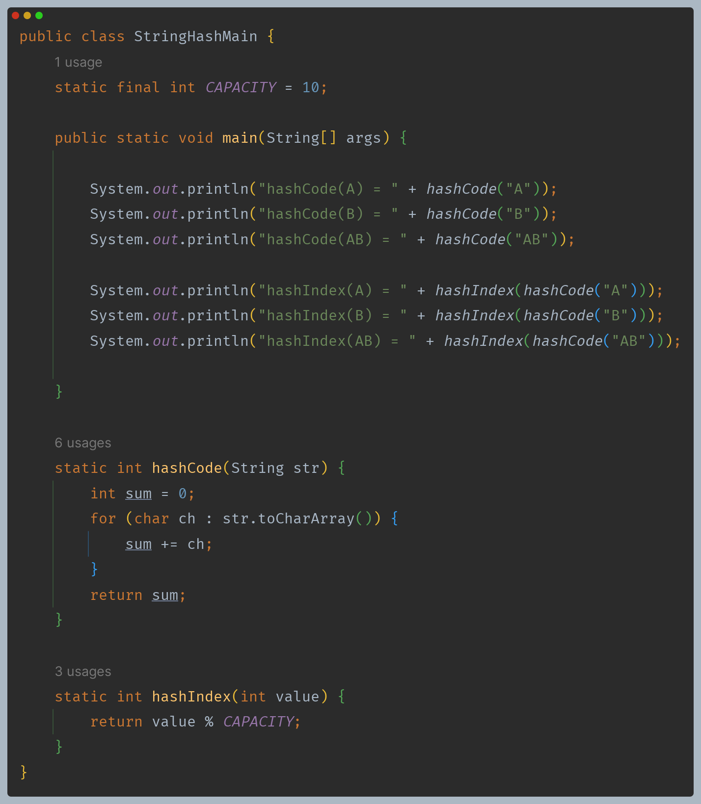
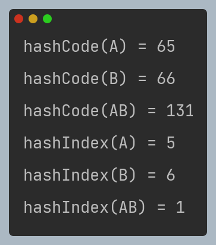
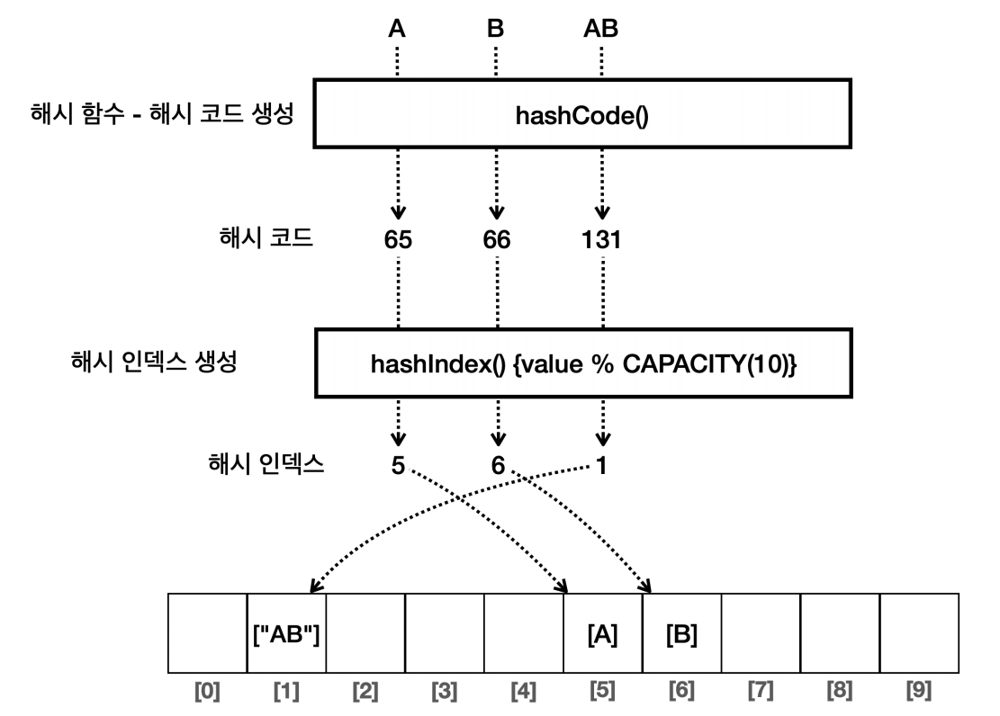

# 자바 - 컬렉션 프레임워크 - HashSet

## 문자열 해시코드

- 해시 인덱스는 배열의 인덱스로 사용해야 하므로 숫자만 사용할 수 있다.
- 문자 데이터를 기반으로 숫자 해시 인덱스를 구하려면 어떻게 해야 할까?

- 모든 문자는 본인만의 고유한 숫자로 표현할 수 있다.
- 컴퓨터는 문자를 직접 이해하지 못하고, 대신에 각 문자에 고유한 숫자를 할당해서 인식한다. ([ASCII 코드표 참고](https://sheepone.tistory.com/47))

### 해시 코드와 해시 인덱스

- `hashCode()` 메서드를 통해서 문자를 기반으로 고유한 숫자를 만들었다. 이렇게 만들어진 숫자를 **해시 코드**라 한다.
- 여기서 만든 해시 코드는 숫자이기 때문에 배열의 인덱스로 사용할 수 있다.

**용어 정리**
- **해시 함수(Hash Function)**
  - 임의의 길이의 데이터를 입력 받아, 고정된 길이의 해시값(해시 코드)을 출력하는 함수
    - 여기서 의미하는 고정된 길이는 저장 공간의 크기를 뜻한다.(예: `int = 4byte`)
  - 같은 데이터를 입력하면 항상 같은 해시 코드가 출력된다.
  - 다른 데이터를 입력해도 같은 해시 코드가 출력될 수 있다. 이것을 해시 충돌이라 한다.
- **해시 코드(Hash Code)**
  - 데이터를 대표하는 값, 보통 해시 함수를 통해 만들어진다.
- **해시 인덱스(Hash Index)**
  - 데이터의 저장 위치를 결정하는데, 주로 해시 코드를 사용해서 만든다.
  - 보통 해시 코드의 결과에 배열의 크기를 나누어 구한다.

**요약** : **해시 코드**는 데이터를 대표하는 값, **해시 함수**는 이러한 해시 코드를 생성하는 함수, **해시 인덱스**는 해시 코드를 사용해서 데이터의 
            저장 위치를 결정하는 값을 뜻한다.

**정리**
- 어떤 객체든지 정수로 만든 해시 코드만 정의할 수 있다면 해시 인덱스를 사용할 수 있다.
- 그렇다면 문자 뿐만 아니라 직접 만든 클래스는 어떻게 해시 코드를 정의할 수 있을까?
- 자바에는 `hashCode()`라는 메서드를 제공한다.

---

[이전 ↩️ - 자바(컬렉션 프레임워크(HashSet)) - 직접 구현하는 HashSetV1]()

[메인 ⏫](https://github.com/genesis12345678/TIL/blob/main/Java/mid_2/Main.md)

[다음 ↪️ - 자바(컬렉션 프레임워크(HashSet)) - 자바의 `hashCode()`]()