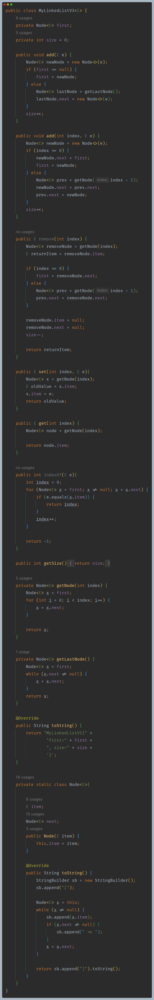
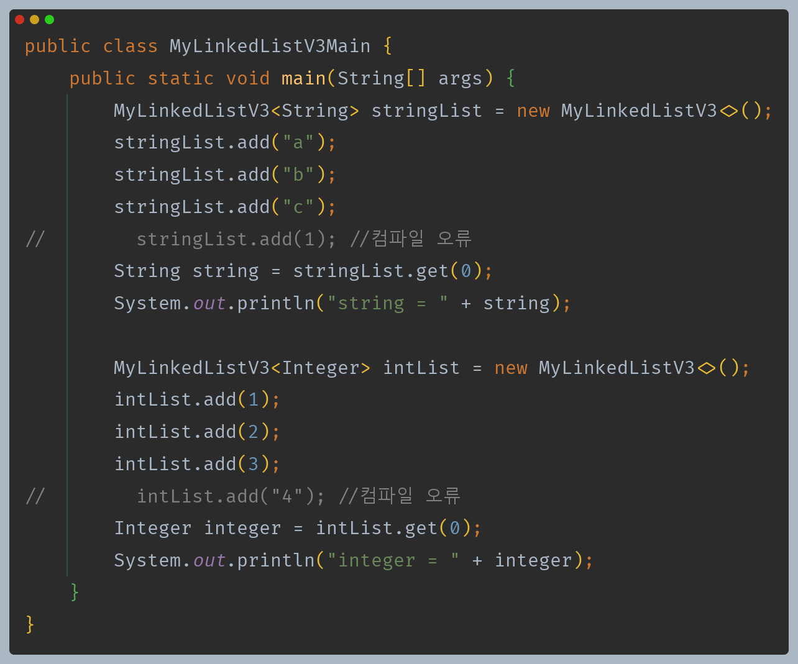

# 자바 - 컬렉션 프레임워크 - LinkedList

## 직접 구현하는 연결 리스트 - 제네릭 적용

- 직접 만든 연결 리스트에 제네릭을 도입해서 타입 안전성을 높일 수 있다.
- `Node` 클래스는 연결 리스트 내부에서만 사용되기 때문에 중첩 클래스로 만들었다.

---

[이전 ↩️ - 자바(컬렉션 프레임워크(LinkedList)) - 직접 구현하는 연결 리스트]()

[메인 ⏫](https://github.com/genesis12345678/TIL/blob/main/Java/mid_2/Main.md)

[다음 ↪️ - 자바(컬렉션 프레임워크(List)) - 리스트 추상화]()