# 자바 - 컬렉션 프레임워크 - LinkedList

## 직접 구현하는 연결 리스트 - 시작

- 연결 리스트는 배열 리스트의 단점인 메모리 낭비, 중간 위치의 데이터에 추가에 대한 성능 문제를 어느 정도 극복할 수 있다.
- **리스트 자료 구조** : 순서가 있고, 중복을 허용하는 자료 구조
  - 배열 리스트와 연결 리스트는 리스트의 내부에서 배열을 사용하는가 아니면 노드와 연결 구조를 사용하는가의 차이가 있을 뿐이다.
  - 배열 리스트를 사용하든 연결 리스트를 사용하든 둘다 리스트 자료 구조 이기 때문에 리스트를 사용하는 개발자 입장에서는 거의 비슷하게 느껴져야 한다.
  - 내부게 어떻게 돌아가는지는 몰라도 순서가 있고, 중복을 허용하는 자료 구조구나 정도 생각하고 사용할 수 있어야 한다.

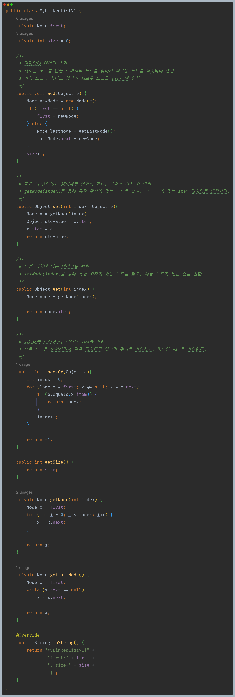

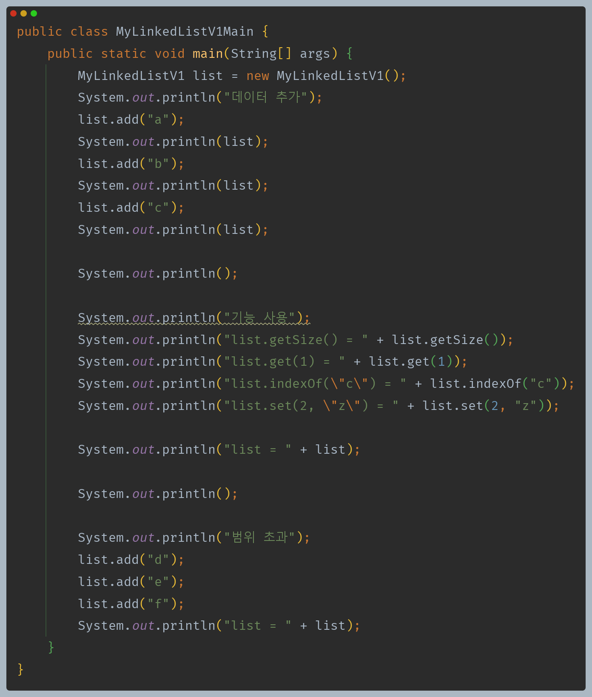

- **직접 만든 배열 리스트에서 사용한 코드를 그대로 사용했다.**
- 연결 리스트는 데이터를 추가할 때마다 동적으로 노드가 늘어나기 때문에 범위를 초과하는 문제는 발생하지 않는다.

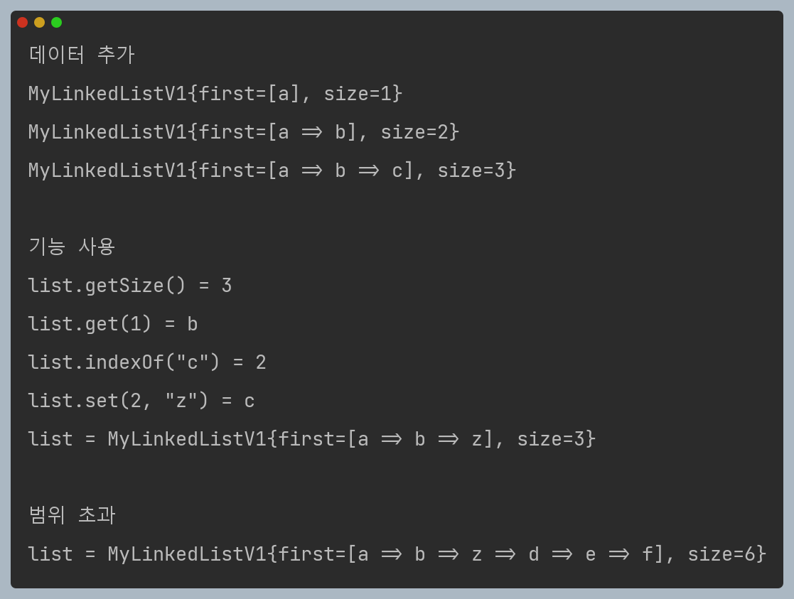

### 연결 리스트와 빅오

- **get(int index)**
  - 특정 위치에 있는 데이터를 반환한다. 
  - `O(n)`
    - 배열을 사용하는 배열 리스트는 인덱스로 원하는 데이터를 즉시 찾을 수 있다.
    - 하지만 연결 리스트에서 사용하는 노드들은 단지 다음 노드에 대한 참조가 있을 뿐이다. 
    - 인덱스로 원하는 위치의 데이터를 찾으려면 인덱스 숫자만큼 다음 노드를 반복해서 찾아야 하므로 인덱스 조회 성능이 나쁘다.
- **add(Object e)**
  - 마지막에 데이터를 추가한다.
  - `O(n)`
    - 마지막 노드를 찾는데 `O(n)`이 걸리고, 마지막 노드에 새로운 노드를 추가하는데 `O(1)`이 걸린다. 따라서 `O(n)`이다.
- **set(int index, Object e)**
  - 특정 위치에 있는 데이터를 찾아서 변경하고, 기존 값을 반환한다.
  - `O(n)`
    - 특정 위치의 노드를 찾는데 `O(n)`이 걸린다.
- **indexOf(Object e)**
  - 데이터를 검색하고, 검색된 위치를 반환한다.
  - `O(n)`
    - 모든 노드를 순회하면서 같은 데이터가 있는지 찾는다.

**배열 리스트는 중간에 데이터를 추가하거나 삭제할 때 기존 데이터를 한 칸씩 이동해야 하는 문제가 있었다. 연결 리스트는 이 문제를 어떻게 해결하는지 알아보자.**

---

## 직접 구현하는 연결 리스트 - 추가와 삭제

### 첫 번째 위치에 데이터  추가

1. **신규 노드 생성 후 신규 노드와 다음 노드 연결**

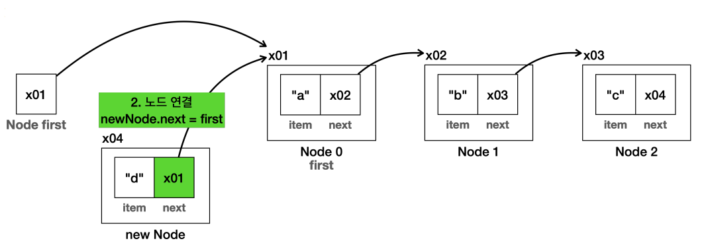

2. **first에 신규 노드 연결**

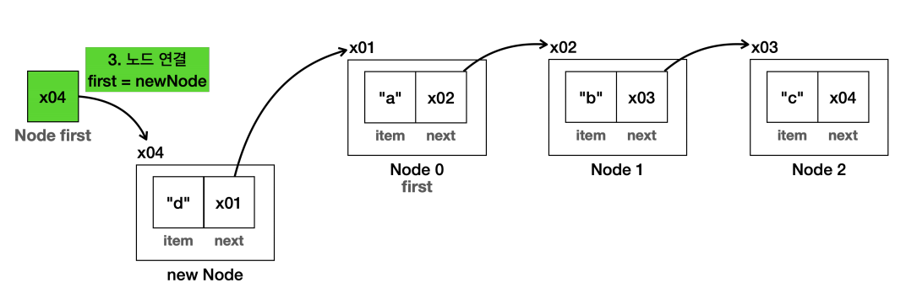

3. **최종 결과**

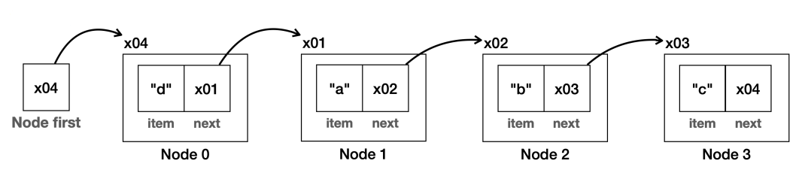

- 배열의 경우 첫 번째 항목에 데이터가 추가되면 모든 데이터를 오른쪽으로 하나씩 밀어야 하지만 연결 리스트는 새로 생성한 노드의 참조만 변경하면 된다. 나머지 노드는 어떤 일이 일어난지도 모른다.
- 연결 리스트의 첫 번째 항목에 값을 추가하는 것은 `O(1)`로 매우 빠르다.

### 첫 번째 위치의 데이터 삭제

1. **first에 삭제 대상의 다음 노드 연결**

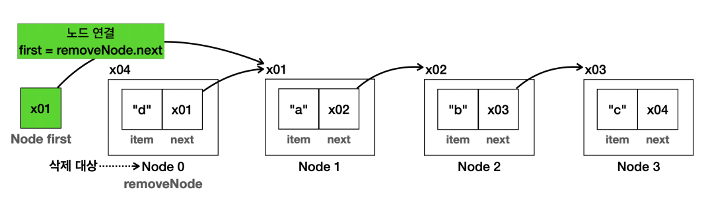

2. **삭제 대상의 데이터 초기화**

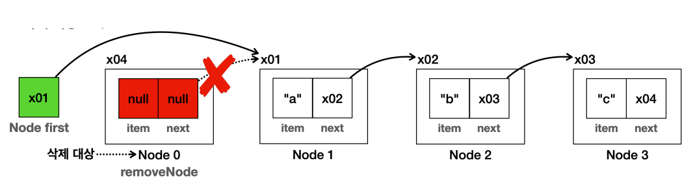

더는 삭제 노드를 참조하는 곳이 없으므로 이후 삭제 노드는 GC의 대상이 되어 제거된다.

3. **최종 결과**

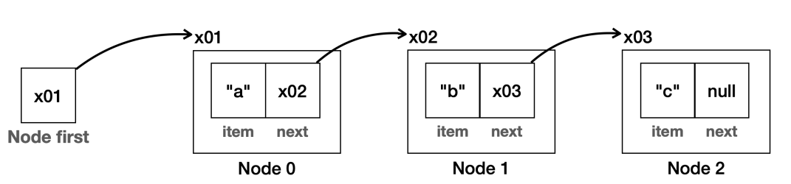

- 배열의 경우 첫 번째 항목이 삭제되면 모든 데이터를 왼쪽으로 하나씩 밀어야 하지만 연결 리스트는 일부 참조만 변경하면 된다. 나머지 노드는 어떤 일이 일어난지도 모른다.
- 연결 리스트의 첫 번째 항목에 값을 삭제하는 것은 `O(1)`로 매우 빠르다.

### 중간 위치의 데이터 추가

1. **새로운 노드를 생성하고, 노드가 입력될 위치의 직전 노드(prev)를 찾아둔다.**

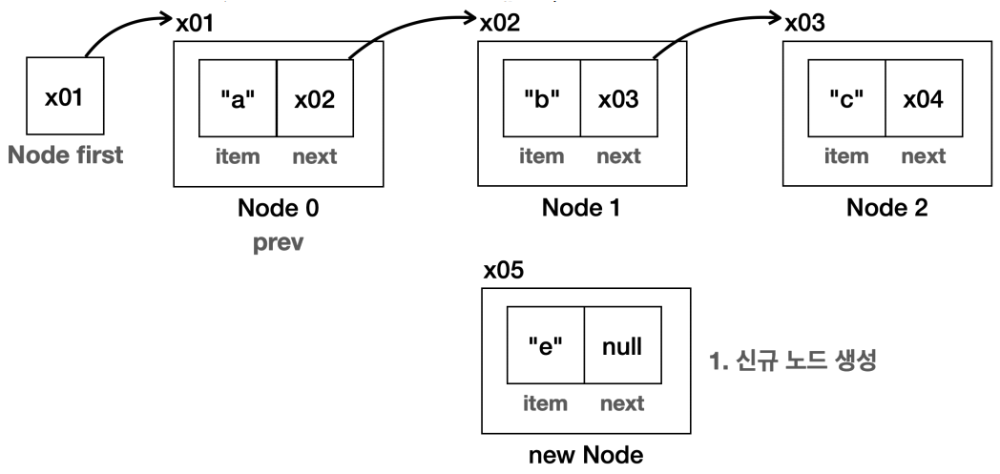

2. **신규 노드와 다음 노드를 연결한다. 직접 노드(prev)의 다음 노드를 연결하면 된다.**

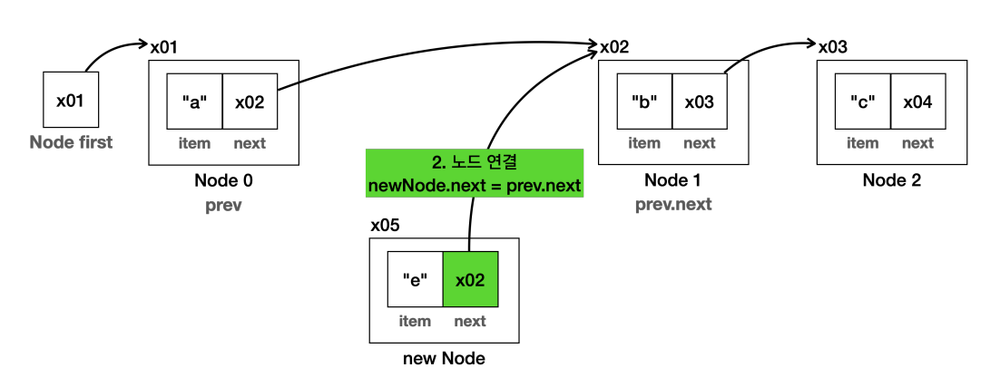

3. **직전 노드에 신규 노드를 연결한다.**

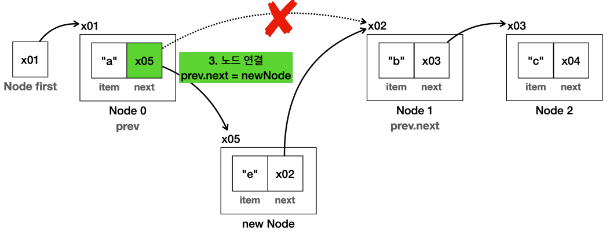

4. **최종 결과**

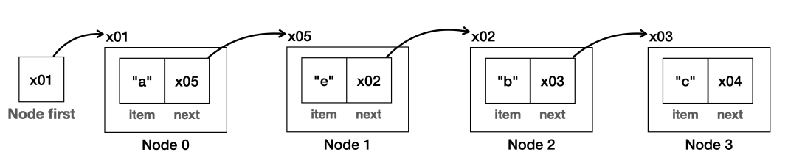

- 노드를 추가했으므로 추가한 노드 오른쪽에 있는 노드들의 `index`가 하나씩 뒤로 밀려난다.(논리적으로)
- 배열의 경우 데이터가 추가되면 인덱스 위치부터 모든 데이터를 오른쪽으로 하나씩 밀어야 하지만 연결 리스트는 새로 생성한 노드의 참조만 변경하면 된다. 나머지 노드는 어떤 일이 일어난지도 모른다.
- `O(n)`의 성능이다.
  - 인덱스를 사용해서 노드를 추가할 위치를 찾는데 `O(n)`
  - 노드를 추가하는데 `O(1)`

### 중간 위치에 데이터 삭제

1. **삭제 대상을 찾고, 삭제 대상의 직전 노드(prev)와 삭제 대상의 다음 노드를 연결한다.**

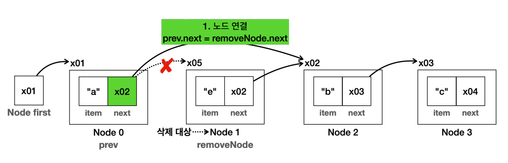

2. **삭제 대상 노드의 데이터를 초기화한다.**

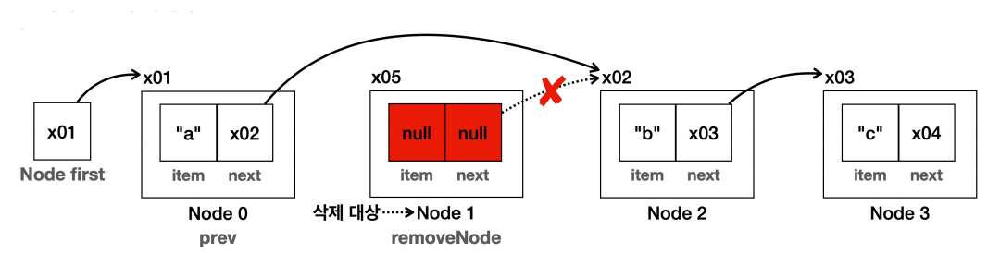

더는 삭제 노드를 참조하는 곳이 없으므로 이후 삭제 노드는 GC의 대상이 되어 제거된다.

3. **최종 결과**

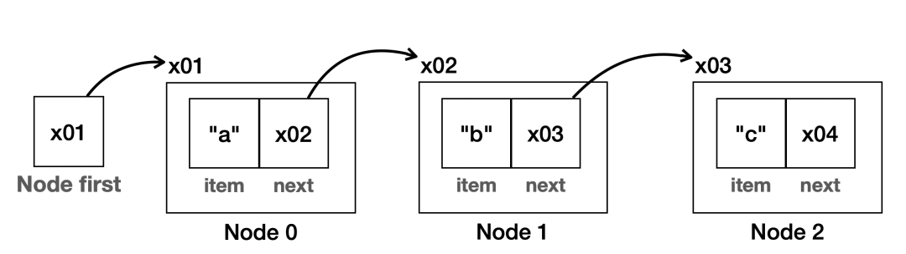

- 노드를 삭제했으므로 삭제한 노드 오른쪽에 있는 노드들의 `index`가 하나씩 당겨진다.(논리적으로)
- `O(n)`의 성능이다.
  - 인덱스를 사용해서 노드를 추가할 위치를 찾는데 `O(n)`
  - 노드를 삭제하는데 `O(1)`

### 코드 구현

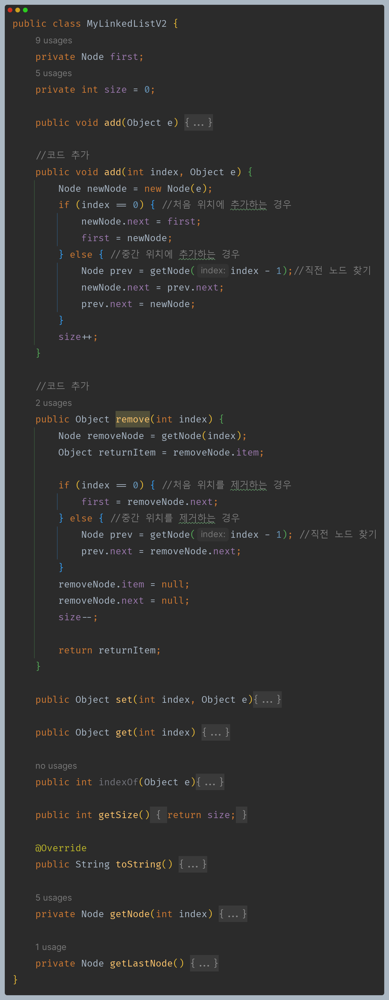

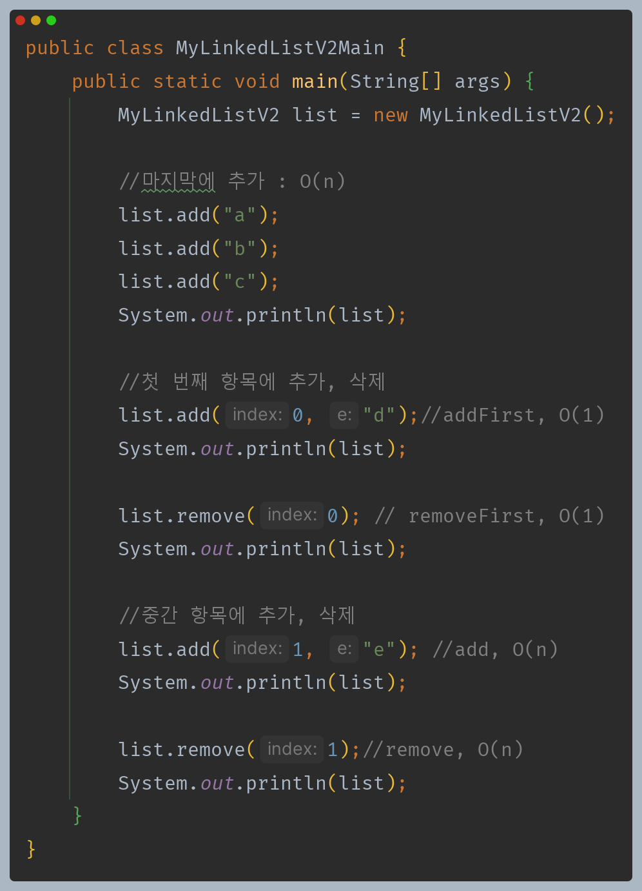

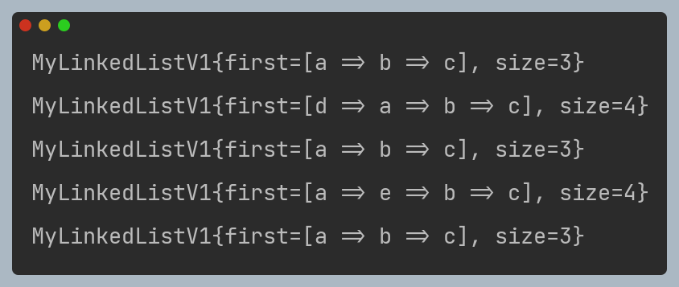

**직접 만든 배열 리스트와 연결 리스트 성능 비교 표**

| 기능         | 배열 리스트 | 연결 리스트 |
|------------|--------|--------|
| 인덱스 조회     | `O(1)` | `O(n)` |
| 검색         | `O(n)` | `O(n)` |
| 앞에 추가 및 삭제 | `O(n)` | `O(1)` |
| 뒤에 추가 및 삭제 | `O(1)` | `O(n)` |
| 평균 추가 및 삭제 | `O(n)` | `O(n)` |

- 배열 리스트는 인덱스를 통해 추가나 삭제할 위치를 찾는데는 `O(1)` 이지만, 추가나 삭제 이후에 데이터를 한 칸씩 밀어야 한다. 이 부분이 `O(n)`이다.
- 반면 연결 리스트는 인덱스를 통해 추가나 삭제할 위치를 찾는데 `O(n)` 이지만, 찾은 이후에는 일부 노드의 참조값만 변경하면 되므로 이 부분이 `O(1)`이다.
- **앞에 추가하는 경우**
  - `배열 리스트` : 모든 데이터를 오른쪽으로 한 칸씩 밀어야 한다.(`O(n)`)
  - `연결 리스트` : 일부 노드의 참조만 변경하면 된다.(`O(1)`)
- **마지막에 추가하는 경우**
  - `배열 리스트` : 인덱스로 마지막 위치를 찾을 수 있고, 데이터를 이동하지 않아도 된다.(`O(1)`)
  - `연결 리스트` : 노드를 마지막까지 순회해야 마지막 노드를 찾을 수 있고, 일부 노드의 참조만 변경하면 된다.(`O(n + 1)` -> `O(n)`)

**배열 리스트 vs 연결 리스트 사용**
- 데이터를 조회할 일이 많고, 뒷 부분에 데이터를 추가한다면 배열 리스트가 보통 더 좋은 성능을 제공한다.
- 앞쪽의 데이터를 추가하거나 삭제할 일이 많다면 연결 리스트가 보통 더 좋은 성능을 제공한다.

> **참고 - 단일 연결 리스트, 이중 연결 리스트**
> 
> - 위에서 직접 구현한 연결 리스트는 한 방향으로만 이동하는 단일 연결 리스트다. 노드를 앞뒤로 모두 연결하는 이중 연결 리스트를 사용하면 성능을 더 개선할 수 있다.
> - 자바가 제공하는 연결 리스트는 이중 연결 리스트이며, 마지막 노드를 참조하는 변수를 가지고 있어 뒤에 추가하거나 삭제하는 경우에도 `O(1)`의 성능을 제공한다.
> 
> ```java
> public class Node { 
>   Object item;
>   Node next; //다음 노드 참조
>   Node prev; //이전 노드 참조
> }
> ```
> ```java
> public class LinkedList {
>   private Node first;
>   private Node last; //마지막 노드 참조
>   private int size = 0;
> }
> ```
 

---

[이전 ↩️ - 자바(컬렉션 프레임워크(LinkedList)) - 노드와 연결](https://github.com/genesis12345678/TIL/blob/main/Java/mid_2/jcf/linkedlist/Node.md)

[메인 ⏫](https://github.com/genesis12345678/TIL/blob/main/Java/mid_2/Main.md)

[다음 ↪️ - 자바(컬렉션 프레임워크(LinkedList)) - 제네릭 적용](https://github.com/genesis12345678/TIL/blob/main/Java/mid_2/jcf/linkedlist/Generic.md)