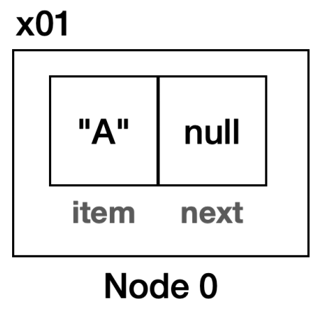
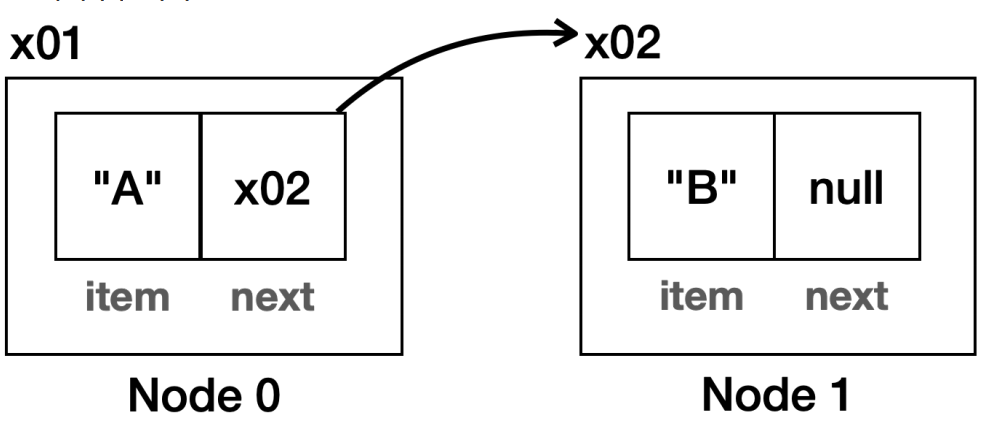
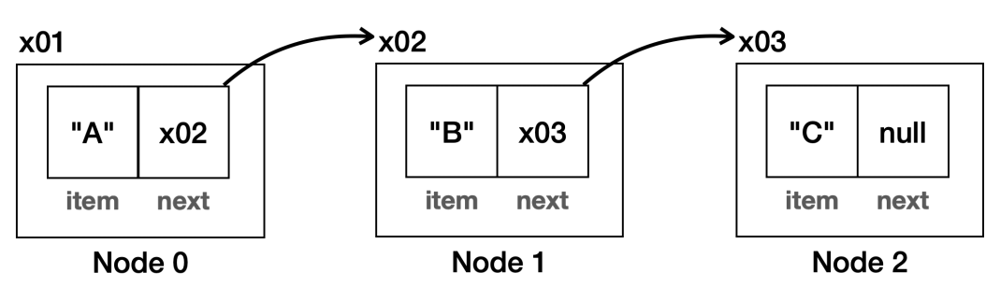
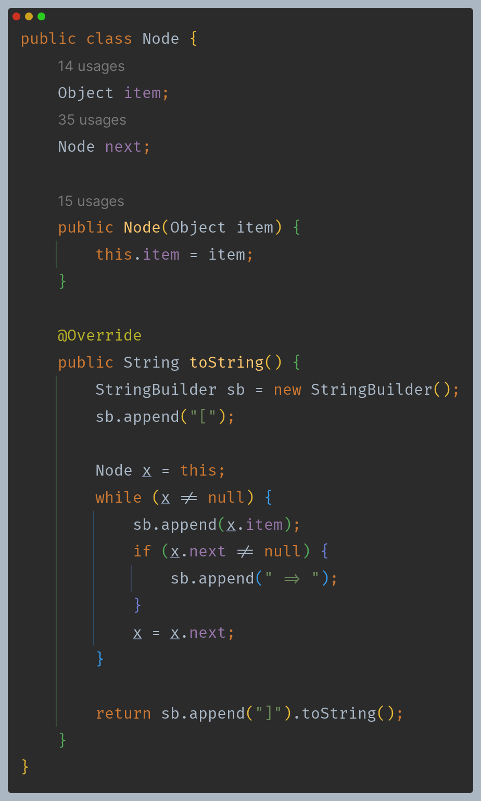
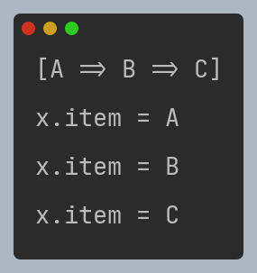
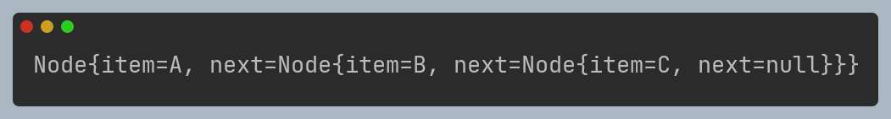
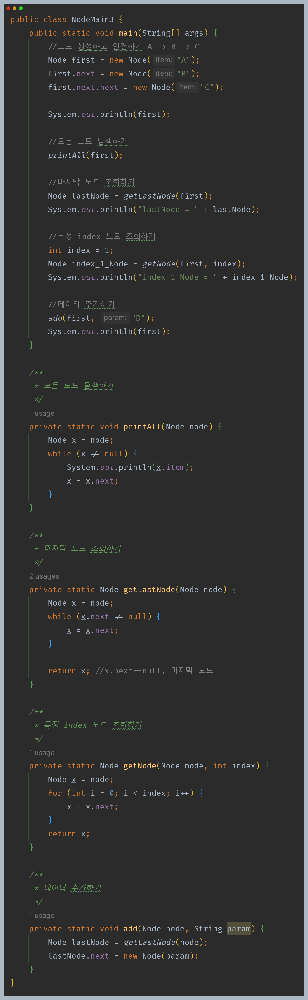
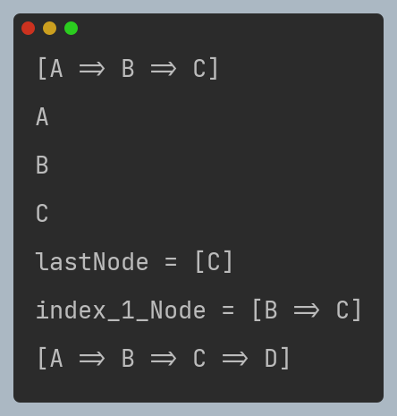

# 자바 - 컬렉션 프레임워크 - LinkedList

## 노드와 연결

- **배열 리스트의 단점**
  - 배열 리스트는 내부에 배열을 사용해서 데이터를 보관하고 관리한다. 이로 인해 다음과 같은 단점을 가진다.
  - **배열의 사용하지 않는 공간 낭비**
    - 배열은 필요한 배열의 크기를 미리 확보해야 한다. 데이터가 얼마나 추가될지 예측할 수 없는 경우 나머지 공간은 사용되지 않고 낭비된다.
  - **배열의 중간에 데이터 추가**
    - 배열의 앞이나 중간에 데이터를 추가하면 추가할 데이터의 공간을 확보하기 위해 기존 데이터들을 오른쪽으로 이동해야 한다. 삭제의 경우에도 빈 공간을 채우기 위해 왼쪽으로 이동해야 한다.
    - 이렇게 앞이나 중간에 데이터를 추가하거나 삭제하는 경우 많은 데이터를 이동해야 하기 때문에 성능이 좋지 않다.

**낭비되는 메모리 없이 딱 필요한 만큼만 메모리를 확보해서 사용하고, 또 앞이나 중간에 데이터를 추가하거나 삭제할 때도 효율적인 자료 구조가 있는데, 
바로 노드를 만들고 각 노드를 서로 연결하는 방식이다.**

```java
public class Node { 
    Object item; 
    Node next;
}
```

- 노드 클래스는 내부에 저장할 데이터인 `item`과, 다음으로 연결할 노드의 참조인 `next`를 가진다.

**노드에 데이터 A 추가**



**노드에 데이터 B 추가**



- 처음 만든 노드의 `next` 필드에 새로 만든 노드의 참조값을 넣어준다.
- 이렇게 하면 첫 번째 노드와 두 번째 노드가 서로 연결된다.

**노드에 데이터 C 추가**



- 첫 번째 노드의 `node.next`를 호출하면 두 번째 노드를 구할 수 있다.
- 두 번째 노드의 `node.next`를 호출하면 세 번째 노드를 구할 수 있다.
- 첫 번째 노드의 `node.next.next`를 호출하면 세 번째 노드를 구할 수 있다.



- 노드의 연결 상태를 좀 더 직관적으로 보기 위해 IDE가 만들어주는 `toString()`대신 직접 `toString()`을 재정의 하였다.




IDE가 생성해주는 `toString()`을 사용하면 다음과 같이 출력된다.



---

노드와 연결을 활용해서 다양한 기능을 만들어보자.





**정리**
- 노드는 내부에 데이터와 다음 노드에 대한 참조를 가지고 있다. 각각의 노드가 참조를 통해 연결(`Link`)되어 있다.
- 데이터를 추가하라 때 동적으로 필요한 만큼의 노드만 만들어서 연결하면 된다. 배열과 다르게 메모리를 낭비하지 않는다.
  - 물론 `next` 필드를 통해 참조값을 보관해야 하기 때문에 배열과 비교해서 추가적인 메모리 낭비도 발생한다.
  - 이렇게 각각의 노드를 연결해서 사용하는 자료 구조로 리스트를 만들 수 있는데, 이것을 **연결 리스트**라 한다.

---

[이전 ↩️ - 자바(컬렉션 프레임워크(ArrayList)) - 제네릭 적용](https://github.com/genesis12345678/TIL/blob/main/Java/mid_2/jcf/arraylist/Generic.md)

[메인 ⏫](https://github.com/genesis12345678/TIL/blob/main/Java/mid_2/Main.md)

[다음 ↪️ - 자바(컬렉션 프레임워크(LinkedList)) - 직접 구현하는 연결 리스트](https://github.com/genesis12345678/TIL/blob/main/Java/mid_2/jcf/linkedlist/LinkedList.md)