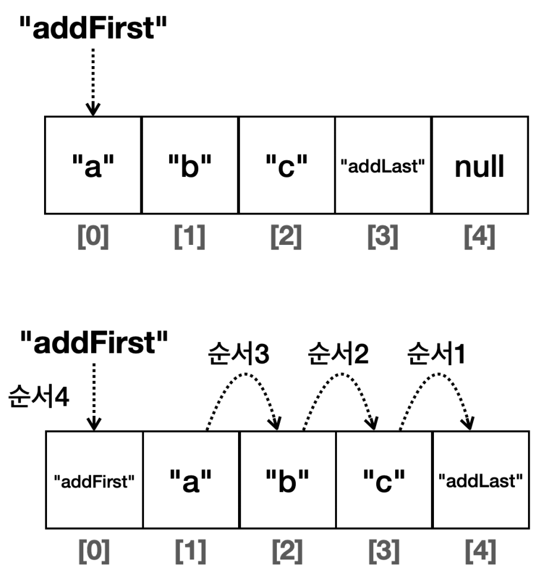
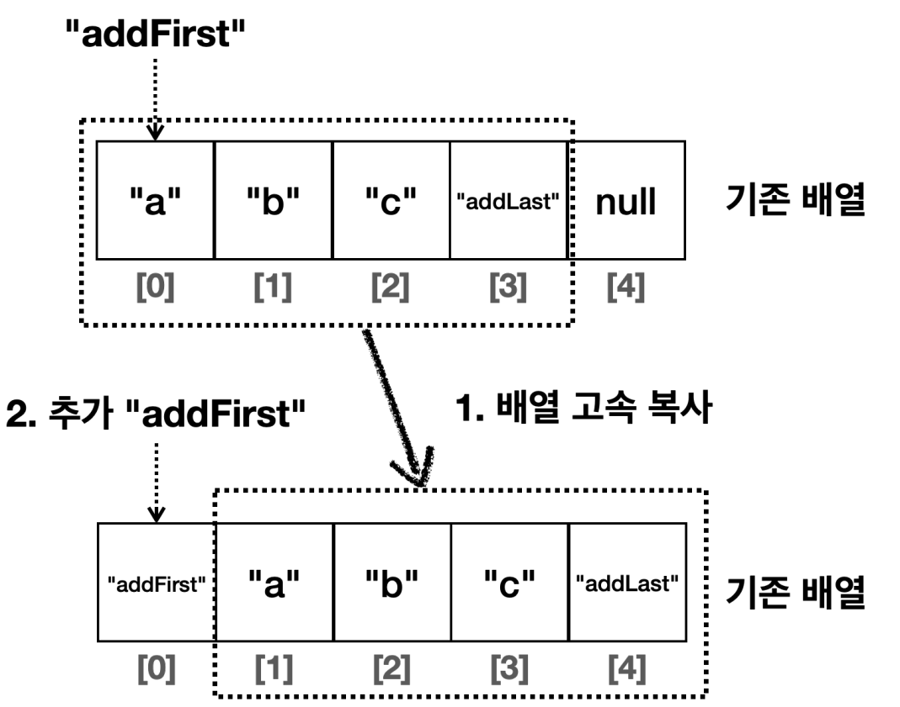
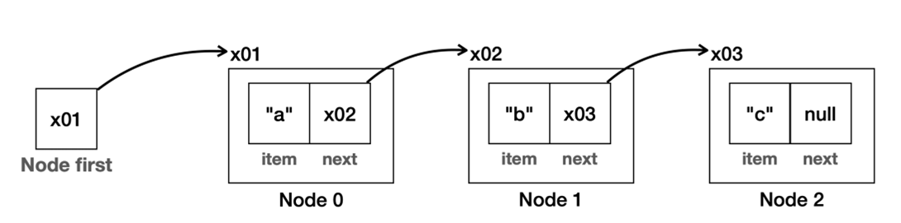
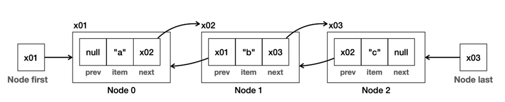

# 자바 - 컬렉션 프레임워크 - List

## 자바 리스트

- **List 자료 구조**
  - 순서가 있고, 중복을 허용하는 자료 구조
  - 자바의 컬렉션 프레임워크가 제공하는 가장 대표적인 자료 구조로, 다음 구조를 가진다.

- **Collection 인터페이스**
  - `Collection` 인터페이스는 `java.util` 패키지의 컬렉션 프레임워크의 핵심 인터페이스 중 하나이다.
  - 이 인터페이스는 자바에서 다양한 컬렉션, 데이터 그룹을 다루기 위한 메서드를 정의한다.
  - 이를 통해 데이터를 리스트, 셋, 큐 등의 형태로 관리할 수 있다.
- **List 인터페이스**
  - `List` 인터페이스는 `java.util` 패키지에 있는 컬렉션 프레임워크의 일부다.
  - `List`는 객체들의 순서가 있는 컬렉션을 나타내며, 같은 객체의 중복 저장을 허용한다.
  - 배열과 비슷하지만, 크기가 동적으로 변화하는 컬렉션을 다룰 때 유연하게 사용할 수 있다.
  - `ArrayList`, `LinkedList` 등 여러 구현 클래스를 가지고 있으며, 각 클래스는 `List` 인터페이스의 메서드를 구현한다.

---

## 자바 ArrayList

- **자바의 ArrayList 특징**
  - 배열을 사용해서 데이터를 관리한다.
  - `DEFAULT_CAPACITY`는 10이다.
    - `CAPACITY`를 넘어가면 배열을 1.5배 증가한다.(10 -> 15 -> 22 -> 33 -> 49 -> ...)
  - **메모리 고속 복사 연산을 사용한다.**
    - 중간 위치에 데이터를 추가하면 추가할 위치 이후의 모든 요소를 한 칸씩 뒤로 이동시켜야 한다.
    - 자바가 제공하는 `ArrayList`는 이 부분을 최적화한다. 배열의 요소 이동을 시스템 레벨에서 최적화된 메모리 고속 복사 연산을 사용해서
    비교적 빠르게 수행한다.(내부에서 `System.arraycopy()` 사용)

**데이터 추가 - 한 칸씩 이동**

- 데이터를 루프를 돌면서 하나씩 이동해야 하기 때문에 매우 느리다.

**데이터 추가 - 메모리 고속 복사 연산 사용**

- 시스템 레벨에서 배열을 한 번에 빠르게 복사한다.
- OS, 하드웨어에 따라 성능은 다를 수 있지만 한 칸씩 이동하는 방식과 비교하면 보통 수 배 이상 빠른 성능을 제공한다.

---

## 자바 LinkedList

- **자바의 LinkedList 특징**
  - 이중 연결 리스트 구조
  - 첫 번째 노드와 마지막 노드 둘다 참조

**단일 연결 리스트**

- 직접 만든 `MyLinkedList`의 노드는 다음 노드로만 이동할 수 있는 단일 연결 구조다. 이전 노드로 이동할 수 없다는 단점이 있다.

**이중 연결 리스트**

- 자바가 제공하는 `LinkedList`는 이중 연결 구조를 사용한다. 이 구조는 다음 노드 뿐만 아니라 이전 노드로도 이동할 수 있다.
- 마지막 노드에 대한 참조를 제공하기 때문에 데이터를 마지막에 추가하는 경우에도 `O(1)`의 성능을 제공한다.
- 이전 노드로 이동할 수 있기 때문에 역방향 조회도 가능하다.
  - 덕분에 인덱스 조회 성능을 최적화할 수 있다.
  - 예를 들어 인덱스가 사이즈의 절반 이하라면 앞에서부터 찾아서 올라가고, 인덱스의 사이즈의 절반 이상이면 마지막 노드부터 역방향으로 조회해서 성능을 최적화할 수 있다.

---

[이전 ↩️ - 자바(컬렉션 프레임워크(List)) - 직접 구현한 리스트 성능 비교](https://github.com/genesis12345678/TIL/blob/main/Java/mid_2/jcf/list/%EC%84%B1%EB%8A%A5%EB%B9%84%EA%B5%90_1.md)

[메인 ⏫](https://github.com/genesis12345678/TIL/blob/main/Java/mid_2/Main.md)

[다음 ↪️ - 자바(컬렉션 프레임워크(List)) - 자바 리스트 성능 비교](https://github.com/genesis12345678/TIL/blob/main/Java/mid_2/jcf/list/%EC%84%B1%EB%8A%A5%EB%B9%84%EA%B5%90_2.md)